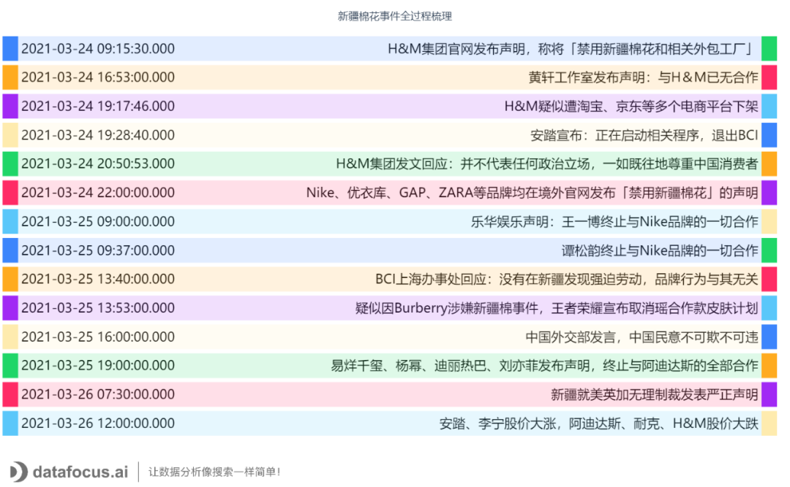

那首先我们要明确为什么要撰写数据分析报告？

数据分析报告实质上是一种沟通与交流的形式，说简单点就是将分析结果、可行性建议以及其他价值的信息传递给管理人员。需要数据分析师对杂乱无章的数据进行包装，让阅读者能对结果做出正确的理解与判断，并可以根据其做出有针对性、操作性、战略性的决策。

因此在这个过程当中，传递信息的方式很重要，如果一份数据分析报告干货满满，但是可读性极差，那其实也不是一份好的数据分析报告。

数据的可视化就是帮助快速理解和掌握数据重点的方式，一份没有图表的数据分析报告是不合格的。

以某份疫情分析报告为例，想要了解各省市接受医学观察和解除医学观察的情况，如果只是用文字进行描述，信息传递的效率远没有图表高，如图是各省市接受医学观察和解除医学观察对比柱状图，可以很直观的获得相关的信息，哪个省接受医学观察人数最多，不同省市解除医学观察人数占接受医学观察人数的多少等。因此我认为具备一个好的数据分析工具对于写好一份数据分析报告必不可少。

注：图表来自于数据分析软件为[Datafocus](https://www.datafocus.ai/" \t "https://www.zhihu.com/question/39373532/answer/_blank)
