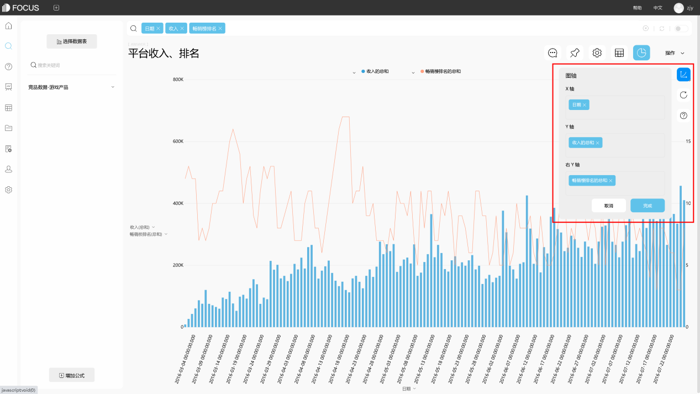

现在的电商越来越发达，各大商家和品牌也都越来越重视数据的分析和洞察。很多数据分析旨在基于大数据环境，使用AI等现代化技术赋能企业管理和决策。那么对于大数据来说，智能或是专业的分析是必不可少的。很多企业已经开始使用DataFocus、Tableau等大数据分析工具对企业大数据进行分析和洞察，以提供最精准的数据结论或可视化视图来辅助决策。我们以前关于新零售企业介绍过三大体系，那么对于很多TO C企业来说，会员体系数据是企业客户数据的重要组成部分，对于会员数据的利用效率关乎整个企业的运营成果。我们以前说过会员体系的三大数据，今天我们重点来看如何分析会员服务数据，以洞察会员服务是否做到位。

首先是专属客服的反馈数据。尤其是高等级会员，或者不同需求的处理（如退货等），一般会配备专属客服，并且一般在询单后会自动弹出评价表单，类似于银行办完业务的评价。这一类数据一般能够反映客服的服务质量，但是还需要重视客户对于专属客服的感知体验数据的采集。因此，很多店铺虽推出专属客服权益，在店铺页面中无相关旺旺引导，客户体验相对薄弱。结合我们某一家美妆品牌的数据，真正合格的专属客服，针对不同的客户问题，都有专门客服服务。这样保障了客服的专业度，也让客户有更好的服务体验。并且会收集客户对于“专属客服”这个概念的反馈数据，收集的过程也是一种强调。

然后是客户关怀的反馈数据。为什么很多数据显示关怀就像是石头砸进了深渊，没有任何的效果呢，举个例子，某食品商家的节日关怀从来没有任何的回应，甚至连评价也不提及，后来经过数据采集发现，节假日时，虽通过短信等渠道对客户进行关怀，但文案内容未做差异化区分，客户收到的关怀内容一致，“一看就是群发”导致客户并不想理睬。还比如催付，某主营组装台式机的商家在16年双十一催付后发现，付款率出奇的低，甚至不如同地区的竞品一半。后来发现竞品非常注重数据分析后的差异化体验，不同等级客户，催付时侧重各有不同，新客侧重取得客户信任，会员侧重感恩和优待。

因此，服务是否做到位，还是要看数据的呈现，以及对于客户反馈数据的即时采集和分析。
