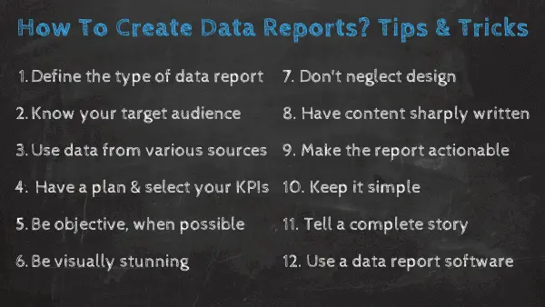
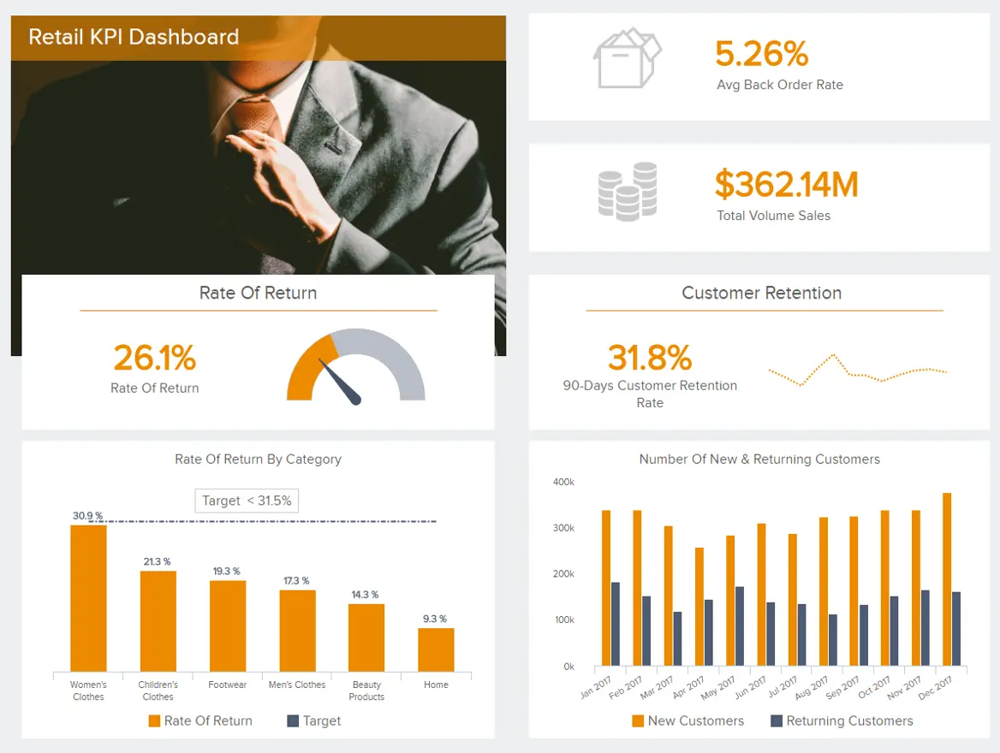
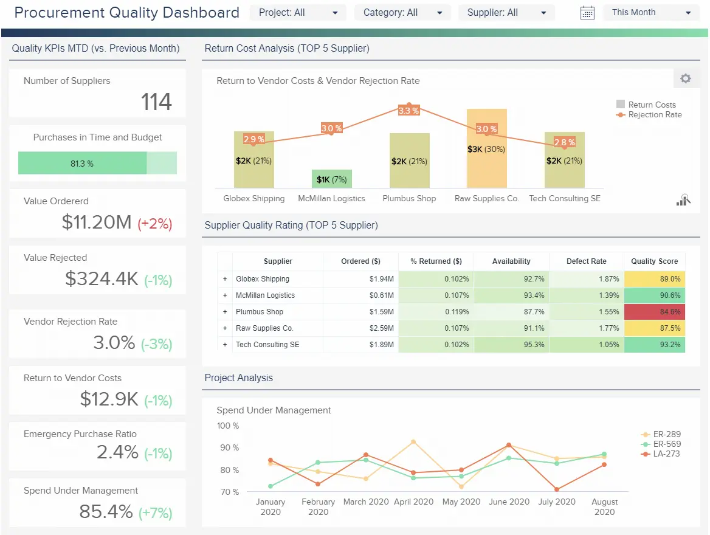

虽然它们在商业成功中一直发挥着关键作用，但术语“数据报告”或“业务报告”并不完全是创造力或创新的代名词。数据报告和分析通常被视为分析师和顾问为提供功能性运营见解而创造的必要邪恶。因此，该术语通常让人联想到静态PDF，老式PowerPoint幻灯片和大桌子的图像。静态数据报告通常使用过去的数据创建，没有任何空间来生成实时或预测性见解，因此被认为是过时的，由大量外部和内部文件组成，手头没有适当的数据管理流程。

但在数字时代，它不一定是这样的。事实上，商业智能行业在过去十年中发生了巨大的变化，数据分析报告正在这一令人难以置信的技术浪潮中达到顶峰。

创新[报告工具](https://www.datafocus.ai/infos/online-reporting)的兴起意味着您可以创建人们被迫阅读的报告数据，这将提供丰富的业务促进价值。如果您正确利用商业智能，您不仅可以连接数据点，还可以控制整个公司的数据并提高您的底线。

在这里，我们将考虑“什么是数据报告？”的问题，探索如何安排数据报告，并提供最好的数据报告示例，所有这些都是用现代软件创建的。事不宜迟，请继续阅读，了解为什么我们的顶级数据报告提示。

您的机会：[想免费测试现代数据报告软件吗？](https://www.datafocus.ai/console/)我们提供 14 天免费试用。立即从出色的数据报告中受益！

## 什么是数据报告？

数据报告是一种分析工具，用于显示过去、现在和未来的数据，以有效地跟踪和优化公司的绩效。它结合了各种信息来源，通常用于决策的操作或战略层面。

如前所述，这些报告具有静态呈现数据的功能，手动编写或计算，但随着[仪表板报告](https://www.datafocus.ai/infos/dashboard-reporting)等现代流程的引入，它们已发展成为成功管理您的销售流程、营销数据、甚至强大的[制造分析](https://www.datafocus.ai/infos/manufacturing-analytics)以及保持领先地位所需的许多其他业务流程的宝贵资源。

但是，让我们更详细地了解基础知识，然后，我们将探讨可用于您自己的内部流程等的数据报告示例。

## 数据报告基础知识

我们已经探讨了数据报告定义 - 现在，是时候看看基本报告和数据基础知识了：商业智能成功的构建块。

- 目的：数据分析是策划和分析原始数据的艺术，目的是将指标转化为可操作的见解。数据分析报告以可访问、易于理解的可视化格式呈现指标、分析、结论和建议，以便组织中的每个人都可以做出明智的数据驱动决策。
- 数据类型：业务数据报告涵盖各种主题和组织功能。因此，所有数据报表类型的长度、内容和格式差异很大。可以将报告数据呈现为年度报告、月度销售报告、会计报告、管理层要求探索特定问题的报告、政府要求的报告显示公司遵守法规的情况、进度[报告](https://www.datafocus.ai/infos/accounting-reports)、可行性研究等。以数据为中心的报告包罗万象，这意味着可以使用历史、预测和实时见解的组合来描绘组织职能、流程和整体进度的全景图景。
- 可访问性：过去，创建业务数据报告需要大量时间和资源。数据拉取请求是 IT 部门的专属职责，需要花费大量时间进行分析、格式化和呈现数据。由于这项任务非常耗费资源，数据分析偶尔是一种奢侈。此外，在提供数据时，它通常已经过时。基于云的[实时BI报告工具](https://www.datafocus.ai/infos/bi-reporting)的出现改变了数据报告游戏规则。现在，更广泛的业务用户可以充当分析师，甚至可以执行高级分析。正确的 BI 平台可以将多个数据源混合到一个报告和分析中：增强业务洞察力和更明智的决策。这些基于云的工具允许组织协作处理报告，将各种主题专家 （SME） 带到同一个桌子上。现代[业务仪表板](https://www.datafocus.ai/infos/dashboard-examples-and-templates)工具允许更广泛的受众理解和传播报告结果。用户还可以轻松地将这些仪表板和数据可视化导出到视觉上令人惊叹的报告中，这些报告可以通过多个选项共享，例如自动化电子邮件或提供安全的查看器区域，甚至可以将报告嵌入到您自己的应用程序中。
- 灵活性：除了数据报告软件提供大量可视访问的[KPI 驱动型见解](https://www.datafocus.ai/infos/kpi-examples-and-templates)外，商业智能仪表板还可以完全定制以满足个人业务目标或需求。此外，数据仪表板针对移动设备进行了优化，这意味着用户可以从中央仪表板 24/7 全天候访问大量业务促进信息，不受限制或限制。您可以在白天或晚上的任何时间从世界任何地方利用商业智能。

现在您已经了解了现代业务数据报告的卓越分析功能，我们将介绍一系列技巧和想法，这些技巧和想法旨在帮助您构建和创建数据报告，从而节省时间和成本，同时推动整个企业的创新。

## 十大数据报告最佳实践和技巧

我们已经了解了基础知识，所以现在是时候从实际角度研究如何创建数据报告了。这就是我们在业务报告中记录数据的技巧发挥作用的地方。

根据报表的类型，每个报表都有自己的一套规则和最佳做法。我们将在下面提到最受欢迎的报告，但我们的主要重点是业务数据报告，最终将为您提供有关如何提高报告效率的路线图。让我们开始吧。

### 1\. 定义数据报告的类型

您需要提供哪些类型的数据报告？提前拥有此定义将有助于设置可以轻松坚持的参数。以下是最常见的数据报告类型：

1）信息性与分析性：首先确定该报告是否仅提供事实信息。信息报告通常较小，写作结构不严格，唯一目的是在不添加任何分析的情况下告知事实。另一方面，如果它提供任何分析、展示关系或建议，它就是一份[分析报告](https://www.datafocus.ai/infos/analytical-report-example-and-template)。

2）建议/理由报告：向管理层或其他重要决策者提出想法并提出建议。顾名思义，它为业务流程的更改提供了建议，并证明了以提高业务绩效为目标的行动方案。

3）调查报告：帮助确定特定行动方案所涉及的风险。在这里，报告数据基于客观地记录特定信息，目的是向利益相关者提供足够的信息。他们最终将决定是否需要采取进一步行动。例如，为法律目的创建的报告。

4） 合规报告：例如向理事机构提供合规信息，以显示问责制。这一点尤其重要，因为准确、呈现良好的合规数据将避免代价高昂的错误或繁文缛节问题。

5）可行性报告：一份探索性报告，以确定一个想法是否可行。数据驱动的见解可以通过帮助企业避免冗余流程或开发来节省数千英镑。

6）研究报告：对特定问题或问题进行深入研究和见解。研究对成长和进化至关重要，拥有支持您决策的视觉数据将使您与众不同。

7）定期报告：通过固定间隔（例如每周，每月，每季度等）进行持续监控来改进策略，产品或流程。这些类型的报告有助于促进增量增长以及全面的一致性。

8） KPI 报告：监控和衡量关键绩效指标 （[KPI），](https://www.datafocus.ai/infos/kpi-examples-and-templates)以评估您的运营是否实现了预期结果。用于对内部和外部多个领域的进度进行基准测试的最佳仪表板。

9）标准报告：权衡给定情况的几种潜在解决方案。一个宝贵的工具，您可以适应您的特定目标、目的、需求和情况。每个现代企业都应该采用的以解决方案为中心的工具。

您的机会：[想免费测试现代数据报告软件吗？](https://www.datafocus.ai/console/)我们提供 14 天免费试用。立即从出色的数据报告中受益！

### 2\. 了解您的目标受众

了解您的受众将有助于确定您呈现哪些数据、您提出的建议以及您如何呈现数据。您的受众可能是高层、中层或直线管理人员、公司其他部门、同事、客户、潜在客户、政府或同一市场中的其他公司。

了解受众有助于确定要在报表中包含哪种类型的信息。如果报表面向内部，则颜色、字体和徽标等品牌就不那么重要了。如果是一次性实时演示，则打印格式不是关键。提前确定您的听众是否需要说服或教育。如果您的受众是最高管理层或董事会，您可能希望主要呈现具有特定标注和行动项的高级数据。

如果报表本质上更具探索性，则可能需要包含更精细的数据以及与数据交互的选项。技术传播者兼Smart HustleMagazine创始人Ramon Ray撰写了关于如何最好地向广大受众展示数据的文章。他专注于保持文本简单，尽可能使用可视化效果，包括适当的视频和动画，并使报表/演示文稿具有交互性。在开始分析之前（更重要的是，在整理报告之前）了解您的受众，这将使您的报告以数据为中心并具有影响力。

### 3\. 使用各种来源的数据

了解了要通过数据报告以及受众回答的问题后，您需要确定将使用哪些数据源来生成报告。随着数据的使用成为企业日常活动的常规部分，公司从中提取数据的内部和外部来源的数量也在增加。在构建报表时，决定使用哪些信息以及如何确保所有内容都干净且经过优化以供使用可能会让人不知所措。这可以在[数据连接器](https://www.datafocus.ai/infos/data-connectors)的帮助下完成。

在当今市场上众多[BI功能](https://www.datafocus.ai/infos/business-intelligence-features)中的一些中，DataFocus提供了专业的数据连接器，只需单击几下即可连接平面文件，社交媒体数据，API，CRM数据和其他几个来源。不仅如此，一旦您的源连接起来，该工具就会自动更新它们。这样，您始终可以准备好最新的数据报告以供分析。

### 4\. 制定详细的计划并选择您的 KPI

我们在这里听起来像是一条破纪录，但在开始分析之前有一个报告计划。管理层需要哪些信息才能做出有效决策？您的股东需要哪些数据和见解？了解所需数据的范围，并考虑如何使用这些数据。

利用尽可能多的数据源。但不要让数据疯狂，陷入不必要的信息中。当然，您必须保持敏捷性，并且可能必须调整计划，但稳健的计划至关重要。保持目标驱动将专注于您的工作，从长远来看节省您的时间并改善您的业务报告结果。

创建计划时，选择正确的关键绩效指标 （KPI） 至关重要。您不需要数十个指标来同时回答所有业务问题，而是选择一些能够讲述全面数据故事的指标（稍后会详细介绍），并使您能够采取适当的行动（稍后也会详细介绍）。

根据您的部门或行业，报告会因 KPI 也不同而有所不同，但请选择有助于您将数据置于适当上下文中并始终牢记您正在处理的受众的报告。如果您深入了解您的受众并设定明确的战略目标，您会发现 KPI 选择过程更容易、更有价值。

选择与您的特定业务目标直接一致的 KPI，您将受益于视觉基准的紧密组合，这些基准将帮助您准确跟踪进度，同时发现趋势，帮助您简化业务以获得成功。请记住远离可能误导您的报告的虚荣指标，只选择能够为您的战略决策带来价值的指标。如果您想了解更多信息，请查看我们关于[KPI 与指标](https://www.datafocus.ai/infos/kpis-vs-metrics-differences)的深刻指南。

### 5\. 尽可能客观

业务报告以客观和中立的方式描述过去、现在或可能的未来情况。客观意味着报告陈述事实，而不是意见。保持意见最少。将它们合并到一个部分中会有所帮助，标题可能为“建议的操作”。此外，在报告中使用被动语态将有助于保持报告的正式性和客观性。例如：

主动：管理者需要改变他们的管理风格。

被动：需要改变管理风格。

如果您对任何数据报告格式过于主观或偏见，那么您基本上就偏离了发现事实见解的目标，这些见解将为您带来竞争优势。从可靠来源收集数据，精确记录您的见解，您将与客观见解建立联系，从而将您的业务提升到一个新的水平。

### 6\. 视觉震撼

事实证明，许多[类型的数据可视化](https://www.datafocus.ai/infos/how-to-choose-the-right-data-visualization-types)功能非常强大。直观呈现的分析使决策者更容易掌握困难的概念或识别新模式。可视化呈现的数据更容易被人类感知和消化。报表应尽可能通过文本包含数据可视化效果。只需确保选择最合适的数据可视化来讲述数据故事，并遵循[BI 仪表板](https://www.datafocus.ai/infos/bi-dashboard-best-practices)最佳实践。使用正确的数据报告工具，任何人都可以创建有意义的视觉效果，并与他们的团队、客户和其他股东分享。所有这些都可以在不涉及数据科学家的情况下完成。

此外，请确保您的报告在视觉上保持令人惊叹，无论它如何共享和传播。您的报表在计算机、平板电脑、PDF 甚至移动屏幕上应该看起来不错。这就是为什么使用仪表板可能是最具成本效益的解决方案，它不仅将为您提供令人惊叹的视觉效果，还为您提供交互性。在下一点中对此进行更多介绍。

### 7\. 不要忽视设计

选择要使用的报表类型以及报表上的数据可视化效果后，考虑生成数据分析[报表](https://www.datafocus.ai/infos/types-of-reports-examples)的设计部分也很重要。数据的组织方式将说明很多关于其感知方式的信息。例如，您需要包含将为数据提供上下文的指标，这样您的报告将讲述一个易于理解的故事。您还需要确保避免报告过度拥挤。如果要向其添加大量数据，可以使用选项卡按主题或主题拆分信息，使用户更容易查找信息。

在谈论设计时，您还需要考虑颜色。首先，您可以遵循公司的调色板，但始终确保不要使用那么多颜色，以免分散观众对真正重要的事情的注意力：数据。最多选择三种颜色，并使用不同的渐变来吸引人们对报告特定区域的注意。

最后，您还需要考虑共享和可视化报表的格式。例如，对于将打印并广泛共享的年度报告等报告，应将额外的注意力花在[仪表板设计原则上](https://www.datafocus.ai/infos/dashboard-design-principles-and-best-practices)。

### 8.内容写得犀利

虽然重点应放在视觉对象上，但某些数据报表类型也需要文本。确保您的报告使用有说服力且语气均匀的商业写作。使用简洁、主动和引人入胜的语言。使用项目符号点而不是长段落。使用标题并为可视化效果提供图例和补充文本。另外，您应该始终校对！

为了优化您的数据分析演示和内容，我们的[数字仪表板](https://www.datafocus.ai/infos/digital-dashboard-definition-and-examples)创建和最佳实践指南提供了实用的见解，可帮助您设置报告的格式以取得成功。

您的机会：[想免费测试现代数据报告软件吗？](https://www.datafocus.ai/console/)我们提供 14 天免费试用。立即从出色的数据报告中受益！

### 9\. 确保报告具有可操作性

近年来[，规范性、描述性和预测性分析](https://www.logianalytics.com/predictive-analytics/comparing-descriptive-predictive-prescriptive-and-diagnostic-analytics)变得越来越流行。每一个都带来了做出更好的业务决策和提高投资回报率所需的新见解——来自过去、未来的见解，并规定了可能的结果。话虽如此，请确保您的报告有结论。必要时，提供建议。

报告应该是客观的，但最好的报告也是可操作的。目标受众应该离开后续步骤或更深入的见解。通过这样做，您将实现数据驱动的业务环境并促进更高效的协作。

为了帮助使以数据为中心的报表更具可操作性，必须确保 KPI 和见解协同工作，以全面描绘特定流程、策略或功能。

例如，如果您希望分析客户服务的成功，添加与员工绩效和消费者满意度相关的指标将为您提供平衡的见解组合，从而帮助您采取果断行动。当然，您的所有 KPI 都将提供宝贵的独立信息，但如果它们相互补充，您将在许多关键领域加速您的业务成功。

### 10.保持简单，不要误导

虽然数据应该是客观的，但格式化、过滤和操作很容易成为[误导性统计数据](https://www.datafocus.ai/infos/misleading-statistics-and-data)的一部分。确保您的报告一致且可靠。另外，保持简单。数据可视化和报告工具的蓬勃发展导致了不讲述数据故事的可视化的创建。

您不需要3D眼镜来阅读报告。有时，您只需要一个简单的图表。您也不需要为颜色和格式而疯狂。通过这种方式，您可以轻松地压倒观众。选择几种对眼睛容易的颜色。保持一种字体。不要对突出显示、粗体或斜体的文本发疯。您不必创建“艺术品”即可使报表在视觉上令人惊叹且具有影响力。

这里的关键要点是：在编写报告时，请密切关注奖品，并始终记住目标或主要目标。忠于您的目标，同时优先考虑使您的仪表板普遍可访问，将确保您始终保持报告的简单、透明和准确。

### 11.不要忘记讲一个完整的故事

若要成功报告数据，必须考虑故事的逻辑。报告应能够提供清晰的叙述，不会使收件人感到困惑，但使他/她能够得出最重要的调查结果。

考虑创建仪表板演示文稿。这样，您将在单个屏幕上显示数据，并可以与众多图表和图形进行交互，同时您的故事将保持专注和有效。通过利用交互式可视化，您不仅可以在如何编写数据报告方面拥有强大的骨干，还可以确保您的受众充分了解情况并轻松快速地消化数据。

人类比其他格式更好地吸收和参与叙事。如果您用数据讲述一个故事，您将飞速发展您的业务成功，提高高管支持的机会，并促进整个组织的创新。

我们的[仪表板演示](https://www.datafocus.ai/infos/misleading-statistics-and-data)和讲故事的权威指南将告诉您入门所需的所有信息。

### 12\. 使用专业数据报告软件

最后但并非最不重要的一点是，利用现代[可视化分析](https://www.datafocus.ai/infos/visual-analytics)软件将确保您根据需要做出的决策设计报告，过滤报告过程中始终存在的噪音，并确保您不会迷失在细节中。通常，报告中堆积着大量的电子表格和演示幻灯片，这些电子表格和演示幻灯片可能会创建所呈现数据的模糊视图，并增加（无意）错误的可能性。该软件可以消除搜索行和列的可怕手动任务，提供必要的实时视图，以及查看过去和未来数据行为的可能性。

无论您是使用数据库的分析师，需要强大的[MySQL](https://www.datafocus.ai/infos/mysql-reporting-tools)报告工具，还是希望将所有渠道整合到同一数据保护伞下的营销专业人员，该软件都将使您能够清除混乱并根据您的特定时间间隔自动执行报告。他们将自动更新数据，您只需要进行小的改进即可确保您呈现的数据是您的受众需要的数据。

我们已经阐述了数据报告的定义，看到了创建自己的十大最佳实践，现在我们将继续关注来自几个行业的数据报告示例，这些示例将在实际中展示这些实践。

## 数据报告示例和模板

为了正确看待我们到目前为止讨论的所有内容，让我们继续讨论数据报告示例。为了能够创建推动行动并为公司业务工作提供附加值的报表，下面是一些示例，这些示例可以正确看待报表的创建和呈现。这些示例是在专业仪表板设计器的帮助下创建的，该[设计器](https://www.datafocus.ai/infos/dashboard-designer)使业务线中的每个人都能够构建自己的报告。让我们从财务部门开始。

### 1\. 财务关键绩效指标仪表板

财务是任何企业跳动的心脏，创建[财务报告](https://www.datafocus.ai/infos/daily-weekly-monthly-financial-report-examples)是可持续发展的基础。公司需要密切关注其货币操作的执行情况，并确保其财务数据100%准确。

我们的示例侧重于精心挑选的 KPI，以描述公司的总体财务状况。显示的信息以逻辑顺序呈现，连接各种财务 KPI，形成完整的数据故事，而无需过度拥挤屏幕或使报告复杂化。

主要关键绩效指标：

- 营运资金
- 速溶比率/酸性测试
- 现金转换周期
- 供应商付款错误率
- 预算差异

在这种情况下，数据报告的作用非常简单。以清晰的财务叙述呈现最重要的信息，以推动行动。我们可以在这个[财务仪表板](https://www.datafocus.ai/infos/dashboard-examples-and-templates-finance)中看到，该公司设法减少了现金周期，但供应商付款率在去年 9 月出现了飙升。采取行动并更详细地查看发生了什么可能是有意义的，以便可以相应地调整流程。

### 2\. 营销 KPI 仪表板

我们的下一个示例是一个直观的[营销报告](https://www.datafocus.ai/infos/daily-weekly-monthly-marketing-report-examples)，由与成本和收入相关的关键指标组成。营销人员需要密切跟踪这些数据，因为它可以帮助他们了解营销工作的成功，并找到改进机会以确保健康的营销投资回报率。

主要关键绩效指标：

- 每次获取费用
- 客户终身价值
- 投资回报率

通过对每次获取收入、每次获取利润、每次获取成本等的宝贵见解，此数据报告模板提供了最重要的营销指标的有用概述，以做出战略决策。例如，通过按渠道和广告系列查看CPA，您可以了解哪些渠道和广告系列以最低的价格获得了最多的客户。在这种情况下，我们看到社交媒体是每次获取成本最低、利润最高的渠道，因此在其中投入更多时间和资源是有意义的。

除了是支持高效决策的绝佳工具外，报告的视觉性质使其成为向您的首席执行官或投资者展示以证明不同营销活动成功的完美概述。

您的机会：[想免费测试现代数据报告软件吗？](https://www.datafocus.ai/console/)我们提供 14 天免费试用。立即从出色的数据报告中受益！

### 3\. 零售 KPI 仪表板

零售商在选择正确的 KPI 并以清晰的顺序呈现数据时必须格外小心，不要弄乱报告或混淆需要阅读报告并采取相应行动的人。

主要关键绩效指标：

- 延期交货率
- 回报率
- 客户保留
- 总销量

上面介绍的[零售仪表板](https://www.datafocus.ai/infos/dashboard-examples-and-templates-retail)侧重于订单的视角，这是这种残酷业务的关键点之一。

获得这些业务接触点将为您提供最好的成分，以保持市场竞争力。利用 KPI 等 KPI，例如退货率（也按类别）、客户保留率以及新客户和回头客的数量，使您能够访问有关订单流程的深入信息，并确保您的行动专注于在可持续水平上发展您的业务。例如，您可以密切关注回报率并确保其保持在尽可能低的水平。这样，您的成本将大大降低，最终使客户更加满意。

您的[零售分析](https://www.datafocus.ai/infos/retail-analytics)流程不需要生成复杂的报表，但通过我们上面介绍的示例，您可以看到具有动态可视化效果的报表使您能够做出更好的业务决策。

### 4\. 客户支持仪表板

我们的下一个数据报告模板是一个[客户服务仪表板](https://www.datafocus.ai/infos/dashboard-examples-and-templates-customer-service)，它提供了与成本和收入以及客户满意度相关的指标组合。有了这些信息，支持团队就可以根据数据寻找改进机会来优化他们的绩效。

主要关键绩效指标：

- 服务水平
- 支持成本与收入
- 客户满意度

尽管这似乎不是最重要的投资领域，但您的客户服务体验可以成就或破坏您的业务。如果客户对您的解决问题的能力不满意，他们很可能不会再回来购买。为此，此报告提供了对收入和成本的见解，因为这有助于您监视一切是否顺利运行。例如，如果您发现收入下降而成本上升，则需要考虑使服务部门盈利的解决方案。

不仅如此，这份富有洞察力的报告还提供了有关客户满意度以及您的支持代理在解决问题上花费的平均时间的见解。这还可以让您深入了解团队的总体绩效。如果您发现解决问题的平均时间正在上升，那么您可以更深入地挖掘原因并找到减少它的解决方案。

### 5\. 人才管理仪表板

我们的下一个数据报告示例是专注于人才管理的[人力资源仪表板](https://www.datafocus.ai/infos/dashboard-examples-and-templates-human-resources)。人才保留和发展是人力资源经理面临的持续挑战。这种以数据为中心的报告工具旨在让您的优秀员工始终如一地参与和积极性。

主要关键绩效指标：

- 人才满意度
- 人才评级
- 人才流失率
- 解雇率

凭借丰富的一目了然的见解，这些见解对于成功的人才管理战略和[人力资源 KPI](https://www.datafocus.ai/infos/kpi-examples-and-templates-human-resources)至关重要，重点关注人才增长以及解雇和离职率等，这一宝贵的工具将证明对您组织的健康和发展至关重要。此外，您的[人力资源分析](https://www.datafocus.ai/infos/workforce-people-hr-analytics)工作将被证明可以增强招聘流程，使您能够吸引最优秀的人才、自动化任务并创造一个令人满意的劳动力环境。

### 6\. 销售机会仪表板

销售是大多数企业成功不可或缺的一部分。我们的[销售仪表板](https://www.datafocus.ai/infos/dashboard-examples-and-templates-sales)将帮助您轻松识别增加收入的来源，同时按预期价值的顺序确定它们的优先级。

主要关键绩效指标：

- 销售机会数量
- 销售机会得分
- 平均购买价值

这将使您能够简化销售策略，以实现最大的收入、效率和可持续性。这个视觉平衡[的性能仪表板](https://www.datafocus.ai/infos/performance-dashboard-examples)易于理解，将帮助您在最重要的时间采取直接行动 - 对于任何具有前瞻性思维的组织来说，这是无价的商业智能工具。

### 7\. IT 问题管理仪表板

[IT 分析](https://www.datafocus.ai/infos/business-intelligence-it)是报告数据有用的另一个相关领域。IT部门每天都要处理大量信息，此报告可帮助他们跟踪与技术问题管理相关的所有内容。

主要关键绩效指标：

- 服务器停机时间
- 同时修复
- 每位员工的未解决工单
- 每个最终用户的 IT 支持员工

这个富有洞察力的[IT 仪表板](https://www.datafocus.ai/infos/dashboard-examples-and-templates-it)概述了确保有效解决技术问题所需的最重要指标。首先，我们大致了解了三个主要服务器的实时状态以及它们上次关闭的信息。这使您可以一目了然地看到一切是否顺利或需要立即注意。

数据报告模板还提供有关最常见停机问题的信息，使您可以找到重复出现的问题的根本原因并防止它们再次发生。与此配对，您可以获得有关不同 IT 员工绩效的数据。如图所示，与未解决的工单相比，3 名员工的已解决工单比例较差，这意味着他们未解决的问题数量远高于他们已解决的工单。这可能意味着他们缺乏培训，或者某个特定问题很难解决。这些数据使您有机会更深入地挖掘原因并提高性能。

### 8\. 采购质量仪表板

我们的[采购仪表板](https://www.datafocus.ai/infos/dashboard-examples-and-templates-procurement)旨在简化和加强您、您的供应商和供应商之间的关系。

主要关键绩效指标：

- 供应商质量评级
- 供应商拒绝率和成本
- 紧急购买比率
- 及时和预算采购
- 管理下的支出

有凝聚力的采购对于任何现代组织的财务和运营成功都至关重要，无论行业或部门如何。这份交互式采购报告将帮助您对供应商进行质量检查，同时更深入地了解紧急[采购](https://www.datafocus.ai/infos/procurement-report-examples-and-templates)、拒绝率、成本、预算限制等指标。一种业务促进工具，将构成您业务的支柱。

### 9\. 医院绩效仪表板

从患者护理到员工管理，这个富有洞察力的医院绩效数据报告模板是确保高效设施管理的完美可视化工具。与任何其他行业相比，医疗机构可以从实时数据中受益，因为它允许他们在出现问题时立即采取行动 - 特别是考虑到任何问题都可能影响患者的健康。

主要关键绩效指标：

- 平均住院时间
- 再入院率
- 按付款人划分的成本

凭借强大的[医疗保健KPI](https://www.datafocus.ai/infos/kpi-examples-and-templates-healthcare)，该数据分析报告涵盖了所有相关领域，以确保医院的有效运作。通过使用目标和期望的结果来实现，管理人员可以在临床、运营和财务层面找到改进机会。例如，再入院率是一个可以直接影响您的声誉的指标，因为它是您的设施中提供的护理质量的象征，应尽可能保持低水平。

此仪表板可以提供的其他相关信息与患者和员工有关。护士与患者的比例表示每位患者有多少护士可用，如果您看到夜班期间患者数量正在增加，那么您需要确保在这些时间有适当数量的员工工作。

### 10\. 脸书页面仪表板

最后但并非最不重要的一点是，我们有一个Facebook的[社交媒体报告](https://www.datafocus.ai/infos/social-media-reports-examples-and-templates)示例。通过对页面浏览量、行为、互动、关注者人口统计数据、喜欢、互动等的洞察，该报告提供了优化 Facebook 页面效果并确保策略成功所需的所有信息。

主要关键绩效指标：

- 风扇数量
- 关注者人口统计
- 按来源划分的页面浏览量
- 页面上的操作

在创建社交媒体活动时，了解目标受众的行为对于成功至关重要。为您的受众提供有针对性的体验不仅可以使他们对您的品牌更加忠诚，还可以节省您定位错误人群的金钱和时间。为此，这个富有洞察力的[Facebook仪表板](https://www.datafocus.ai/infos/dashboard-examples-and-templates-facebook)是一个非常宝贵的工具。

就像其他社交渠道一样，Facebook 也有自己的最佳实践和技术可以遵循，以确保您的自然、付费和病毒式广告系列获得最佳效果。虽然此仪表板中显示的某些指标可能看起来纯粹是信息性的，例如按国家/地区或性别划分的粉丝，但当它们混合在一起时，它们可以提供更深入的结论，这将有助于生成有趣的内容并在此过程中获得忠实的关注者。

您的机会：[想免费测试现代数据报告软件吗？](https://www.datafocus.ai/console/)我们提供 14 天免费试用。立即从出色的数据报告中受益！

## 立即开始构建您的数据报告！

现在，您已经知道如何创建高效的数据分析报告，是时候利用现代[BI 解决方案](https://www.datafocus.ai/infos/business-intelligence-bi-solutions)和数据分析的强大功能了。

如果采用正确的方法，报告、分析和智能信息处理可以对组织产生转型影响。

幸运的是，手动创建每日或每周报告的令人麻木的任务已成为过去。使用正确的计划和适当的业务报告[软件](https://www.datafocus.ai/infos/business-reporting-software)，您可以轻松分析数据并创建引人注目且出色的报告。

我们生活在信息时代——一个一切皆有可能的时代。通过采用以数据为中心的报告并形成正确的基础，您将以从未想过的方式加速组织的成功，从而在此过程中推动您领先。

您需要做的就是遵循这些基本步骤和建议，您将走向更光明、更繁荣的商业未来。如果您想开始创建自己的强大而现代的报告并测试所有这些做法，您可以尝试[DataFocus 进行 14 天试用](https://www.datafocus.ai/console/)，完全免费。现在是罢工的时候了。
