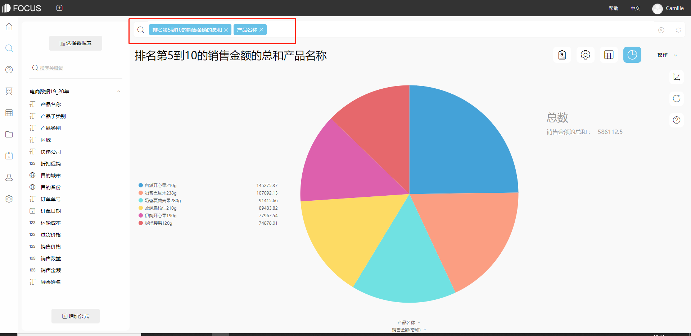

做一张报表既要考虑到功能还有美观度，好心累。Excel太繁琐，有哪些快速进阶的技巧和工具？各位表哥表姐又是如何看待自己的工作价值的？

使用DataFocus数据分析工具。

1. 操作上，零代码，先进的自然语言处理技术

DataFocus是一款零代码BI产品，加入自然语言处理技术，支持中/英文自然语言搜索分析，告别拖拉拽，智能识别数据结构，自适应图形。目前支持40+图形种类，包括位置图、轨迹图、帕累托图、组合图、弦图、玫瑰图、桑基图、箱线图等

1. 自带数仓，打破数据信息孤岛

自带数仓，能够轻松对接各类传统关系型数据库抽取数据或直连数据。独有的雪花模型，支持复杂的数据库结构；通过多数据源整合，支持跨系统分析，彻底打破数据孤岛。

1. 快速实时计算，告警联动钻取跳转功能一应俱全

数据分析实时交互，完全满足管理决策中经常遇到的临时性分析、多变的业务需求和频繁的结果刷新。数据预警实时通知，数据看板联动钻取跳转等多功能交互辅助数据洞察。

1. 多端应用查看报表，行列级权限控制

支持企业微信和钉钉，通过简单的分享操作，即可快速实现手机查看；数据细颗粒控制，轻松满足大型企业集团精细化的数据控制需求。

总结:可以处理大量数据，操作简便，可视化效果佳，各功能齐全，适合企业选型。

工作价值归结就是发现问题，探索原因，支持决策。接触数据，就等于接触企业各方面的业务。信息数据中心是企业信息化数字化运营的核心。
