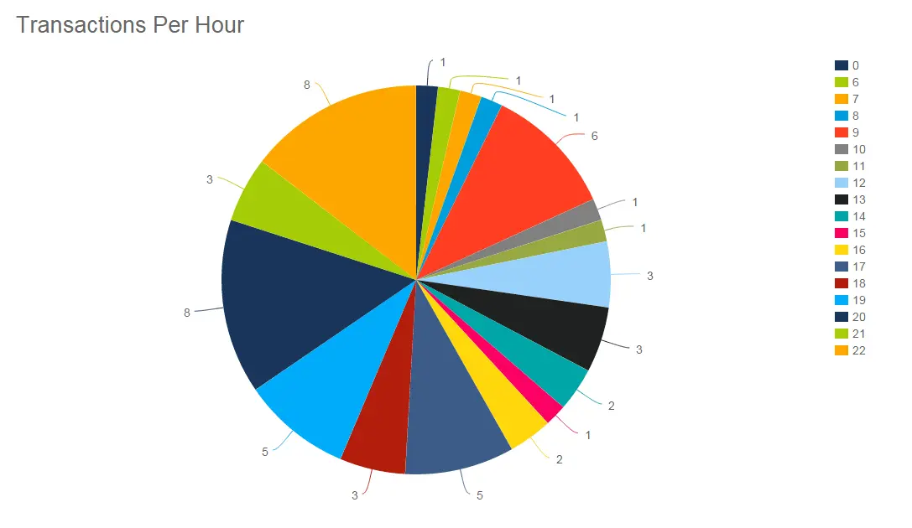
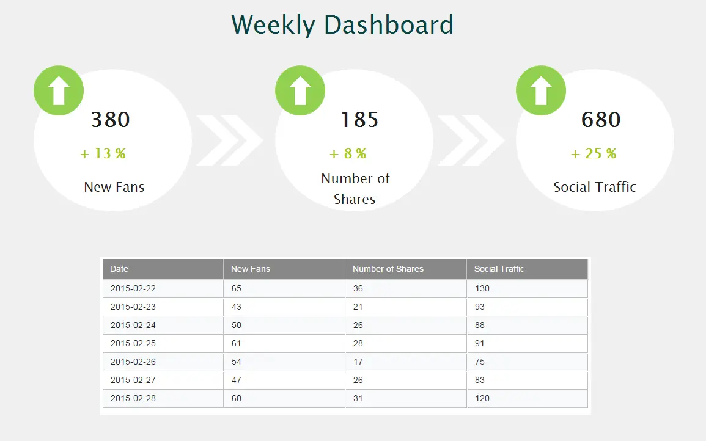
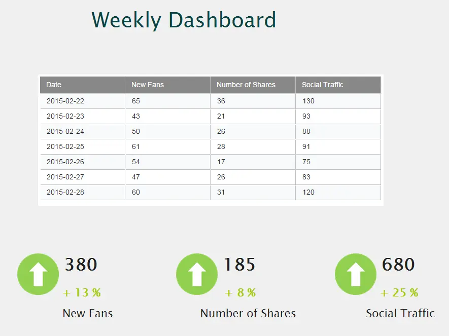
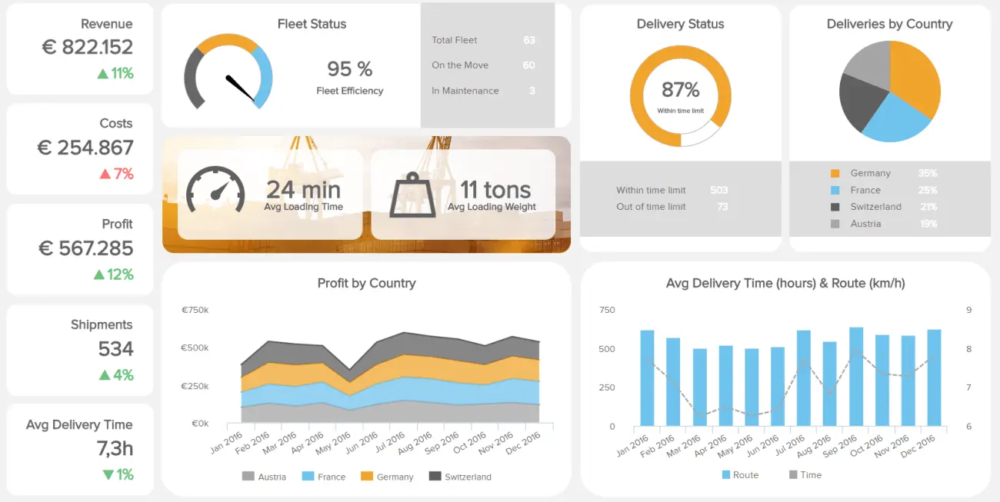
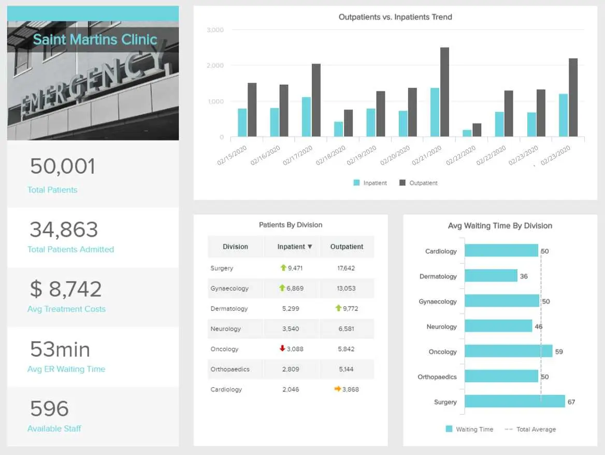

如果您想以最简单、最有效的方式向决策者传达关键信息，您需要利用交互式仪表板的强大功能并学习如何创建仪表板。

[业务仪表板](https://www.datafocus.ai/infos/dashboard-examples-and-templates)提供基于关键绩效指标 （KPI） 的一目了然的见解，是一种直观且视觉上令人愉悦的数据消费方式。与早期的前辈不同，它们使演示者能够使用实时数据吸引观众。与 Powerpoint 的僵化线性性质或 Excel 的无故事数字方法相比，它们还提供了更动态的数据呈现方法。在DataFocus，我们相信您创建的每个[交互式仪表板](https://www.datafocus.ai/infos/interactive-dashboard-features)的目标应该是在讲故事的同时更好，更快，更有力的决策。

换句话说：如何讲述最好的故事以及如何创建一个仪表板来支持您的叙述？

在这里，我们将讨论如何创建一个与目标受众对话的仪表板，同时探索使用仪表板创建工具生成的一些鼓舞人心的示例。

事不宜迟，让我们开始吧。

## 如何创建仪表板 - 14 个最佳实践

只有当您所做的一切都旨在与受众建立联系时，仪表板创建过程才会证明是有效的。

当你讲一个故事时，你必须考虑观众并相应地调整你的叙述。这同样适用于创建仪表板，这意味着在执行任何其他操作之前，您应该概述用户的需求。

因此，在开始之前，您应该考虑：

- 最终用户将根据数据做出哪些决策。
- 他们对数据或 KPI 的熟悉程度。
- 他们已经有多少背景？

例如，想要月度报告的利益相关者的实时仪表板看起来必然与您的销售团队需要即时访问的深入销售绩效[仪表板](https://www.datafocus.ai/infos/live-dashboards)不同。如果您希望制作一个仪表板来概述营销投资回报 （ROMI），您的可视化、设计和指标将与营销渠道参与报告中的可视化、设计和指标大不相同。

现在，我们将重点介绍创建仪表板时要遵循的 14 个基本提示和最佳实践，从定义受众开始。

### 1\. 定义仪表板受众和目标

坐下来，花一些时间完成以下 6 个问题的答案。相信我们 - 您在创作过程中预先投入的任何精力都将在以后获得丰厚的回报。无论谁使用它，都会非常感谢您为使其与他们的生活相关并专注于必需品而投入的时间和精力。即使您只是创建此仪表板供自己使用，回答以下问题也会为您提供使其真正有价值的基础。

a） 你想帮助谁？

请记住，最终的元目标是让您或组织中某人的生活更轻松。考虑到这一点，明智的做法是将所有决定都基于您的受众，这样您就可以真正知道如何创建对他们有用的仪表板。

那么 - 谁是将积极使用它的人或一群人？如果是你自己（而且只有你自己），那么你可以跳过这一步的其余部分。但是，如果不仅仅是您自己之外的更多人要使用它，请立即写下他们在公司中的角色。理想情况下，写下您个人认识的特定人，以便在完成此过程的其余部分时可以在脑海中描绘他们。在写下您将帮助仪表板的人员（姓名、职位或两者兼而有之）之前，不要在创建过程中继续前进。

b） 他们每天做什么？

思考这个问题的另一种方法是：这个人执行的日常任务对他们的工作至关重要吗？

这是定义某人在组织中的角色的更具体方法。您要在这里非常具体 - 必须获得所有自己潜在客户的销售代理的日常生活与将所有潜在客户提供给他们的销售代理的日常工作完全不同。而负责所有销售代理的销售经理的日常生活则更加不同。日常任务中的这些差异将导致不同的目标和 KPI。

在你写下至少 2-3 个（如果不是更多的话）用户为了履行他们的角色而绝对必须完成的日常任务之前，不要在创建过程中更进一步。

c） 他们试图达到什么目标？

他们是否关心更多的销售并获得新的潜在客户？他们是否关心帮助员工获得更多销售和潜在客户？他们是否希望更有效地管理客户支持电话？他们是否想在您的公司发布的博客文章中获得更多的社交影响力？

这些只是仪表板可以帮助您的团队实现的众多目标中的一小部分。如果它更多地面向最高管理层或股东受众，他们可能有这样的目标：

- 能够一目了然地了解公司的现金流情况。
- 检查公司本季度的收入数据与去年同期相比如何。
- 查看数字广告总支出和收入。

在定义用户真正关心的 1-3 个目标之前，不要在创建过程中更进一步。显然，你不能窥视他们的头脑——只要做出最好的猜测。或者，如果您想稍微升级您的方法，请联系您为其创建仪表板的人员，并询问他们的目标是什么。

d） 如果衡量哪些 KPI 将帮助他们实现目标？

现在您已经了解了用户的角色、他们的日常基本任务和他们的目标，我们可以查看一些有助于跟踪他们的 KPI。如果您只是询问用户，或者您对他们的工作有深入的了解，则此步骤会容易得多。如果不这样做，您将面临创建没有人实际使用的仪表板的风险，从而浪费您的时间。如果您没有能力（或愿望）询问最终用户哪些 KPI 对他们有价值，我们的[KPI 示例](https://www.datafocus.ai/infos/kpi-examples-and-templates)和模板将让您很好地了解您可以使用哪些指标。

e） 他们目前如何查看这些 KPI？

现在，最后一个问题：您的用户现在如何查看他的 KPI，以及与这种查看方式相关的痛点是什么？

也许他们正在使用 Excel 文档，但它变得太大和笨拙。也许他们正在使用他们的CRM软件，但它并不是为此目的而设计的。无论如何，您都想知道这一点——因为如果您不知道如何制作比他们现有的 KPI 衡量方法更好的仪表板，那么您将浪费时间。理想情况下，您创建一个比当前方法更易于使用且更集中（更少混乱）的仪表板。在本文的其余部分，您将学习如何做到这一点。

f） 如何使用讲故事来将我的 KPI 置于上下文中？

在创建仪表板时，不仅要与受众交谈，还要使您能够在许多重要领域发展组织，使用数据讲述引人入胜的故事（或为用户提供向他人讲述引人入胜的故事的工具）至关重要。是的，为了获得结果，讲故事应该成为主要焦点。

通过比以往任何时候都更好地访问数据，以及改进的数据挖掘工具，我们能够恢复许多类型的数据。但是，即使我们喜欢数据，我们也不能（也不应该）显示所有这些类型。

目标应该是避免将用户淹没在数据海啸中，同时提供可用的顶级信息，以帮助获得他们需要的可操作见解。而且，您的 KPI 将允许您根据自己的见解制定叙述 - 有助于在简化公司的同时改进决策过程。

如果您有能力，请考虑构建交互式[KPI 仪表板](https://www.datafocus.ai/infos/best-kpi-dashboard-examples)，使用 KPI 来指导您的故事讲述设计工作。通过这样做，您将使您的受众能够自己探索数据，并通过筛选或其他控件，可以通过提供更深入的上下文来增加价值。

当您拥有广泛的目标受众时，交互式可视化尤其重要。该主题的新手仍然可以发现趋势并学习基础知识，而该领域的专家可以更深入地钻取数据以获取更多见解。

### 2\. 确保您的数据干净正确

确定受众和目标后，是时候仔细查看数据本身了。此步骤很重要，因为它是构建仪表板的支柱，仪表板不仅可以讲述故事，还可以确保故事正确并具有适当的构建基块。您需要确定从哪里获得正确的数据以实现您已经定义的目标（请参阅我们的第 1 点）。您需要考虑无数数据源，但它们都取决于您正在处理的方案。

此外，您可能还需要考虑来自部门外部的资源，因为它们都有潜力为您提供宝贵的见解。实际上，这意味着销售和营销协同工作，因此您需要连接来自两个部门的数据，无论是Salesforce，Google Analytics还是Facebook。为了在此过程中为您提供帮助，您可以阅读我们关于[数据分析问题](https://www.datafocus.ai/infos/data-analysis-questions)的广泛指南。

除了数据源之外，另一个需要考虑的关键点是适当的[数据质量管理](https://www.datafocus.ai/infos/data-quality-management-and-metrics) （DQM） 策略。您的数据应该是干净、准确、一致、完整且符合您公司的程序。您还应该考虑如何尽可能自动化此过程，以免浪费额外的时间。如果不考虑 DQM，您的数据质量将较低，您的分析和仪表板将随之而来。

### 3\. 为数据选择正确的图表类型

如何为您的 KPI 构建具有正确[数据可视化类型的](https://www.datafocus.ai/infos/how-to-choose-the-right-data-visualization-types)仪表板？这个问题是另一个无法回避的重要问题。接下来，您可以快速回顾最常用的图表类型，以及何时使用每种图表：

条形图 – 也许关于图表最常见的误解是越多越好。条形图是查看同期群分析、比较和趋势的一种简单有效的方法。

饼图 – 这些图表经常引起争议。数据可视化大师爱德华·塔夫特（Edward Tufte）写道：“饼图很糟糕，唯一比一个饼图更糟糕的就是很多。无论您对饼图的看法如何，您唯一应该使用它们的时候是当您的数字总数为 100% 时，您需要一个表示整体比例的图形。谨慎使用。

折线图 – 折线图是由同名线连接的一系列数据点组成的有效图形。它们通常用于显示一段时间内的发展并确定趋势。

表格 – 表格非常适合使用不同度量单位的详细信息，这些信息可能难以在图形或图表中轻松表示。

仪表 – 这种类型的图形通常使用指示器和适当的指标显示一个或多个值。它们通常用于突出显示需要注意的特定 KPI。

面积图 – 面积图非常适合具有部分到整体关系的多个数据系列，或者表示物理可数集合的单个系列。

 

如果我们想看看实际的图表类型，让我们回顾一下如何制作一个仪表板，其中包含一个图表，该图表查看每小时的交易数量，看看哪些有效，哪些无效。

使用条形图时，数据以可比较的组呈现，这对人眼更有意义，并且仅使用一种颜色不会分散数据的注意力：

现在，让我们通过饼图的镜头看一下每小时相同的交易。使用此图表，我们无法收集任何有用的见解。不仅维度中的值太多，而且这些数字并不构成整体的一部分：

我们可以在上面的这些示例中看到选择正确的图表如何在呈现数据方面产生巨大差异，因此，您应该始终牢记这一点。

### 4\. 避免误导

任何处理数据的人都喜欢创建仪表板。这些分析工具以前所未有的方式使数据民主化。现在，虽然仪表板易于访问且易于理解，但如果它们未正确生成，则其中的数据可能会产生误导。数据可视化的误导是几十年来在媒体和政治中用来操纵群众的做法。当然，这是一种不道德的做法，在仪表板生成过程中需要不惜一切代价避免。为了帮助您做到这一点，您应该注意以下几种情况：

仅包含积极的结果：仅在仪表板中包含积极或表现良好的 KPI 可能会导致非常误导的分析。糟糕的结果是绩效的一部分，包括它们以学习和改进是至关重要的。如果有人只看到良好的性能，那么他或她将被误导，认为一切都很好。重要的是专注于分析的总体目标，并包括使您能够提取最准确和最有用的结论的数据。

提供上下文：与仅包含正面结果相同，不为数据提供上下文是仪表板可能产生误导的另一种方式。发生这种情况的常见情况是，当显示数据趋势上升或下降时，没有提供更长的时间来了解这是正数还是负数。为了避免这种情况发生，请确保始终包含更大的图景，以便可以准确地透视数据。

令人困惑的因果关系：数据可能变得具有误导性的另一种无意或有意的方式是滥用轴。当轴不是从 0 开始，而是从特定值开始时，就会发生这种情况，这使得数据中的微小变化看起来比实际要剧烈得多。我们在[误导性统计](https://www.datafocus.ai/infos/misleading-statistics-and-data)博客文章中更详细地讨论了这个问题，因此我们建议您查看以避免招致这种不良做法。

### 5\. 提供您的数字上下文

在生成仪表板上下文时，扩展上述观点是成功的关键。提供仪表板中显示的数据的更全面图片可以更好地理解和分析结果。例如，假设您正在构建一个[社交媒体仪表板](https://www.datafocus.ai/infos/social-media-dashboard-template)，并且包含一个框，上面写着“过去 30 天内有 58 个新关注者”。如果有人看到这个数字，他们会对追随者的增加和针对新人实施的策略感到高兴。但是，如果您提供一些背景并意识到前一时期有 300 名新关注者，那么这 58 名看起来就不再那么积极了。在这种情况下，为您的数字提供上下文可以改进决策过程并获得更好的结果。通过为关注者指标提供上下文，用户可以了解策略中某些事情进展不顺利，并深入挖掘以找到原因。

### 6\. 不要忘记色彩理论

我们可以写关于色彩理论的书，但幸运的是，这已经完成了。有关哪些颜色协同工作效果更好以及它们传达哪些情感的重要资源，请查看此设计师色彩综合指南。

选择颜色时要考虑的一件事是，大约 8% 的男性和 0.5% 的女性是色盲。属于这一类的绝大多数人都是所谓的色障人士。这意味着它们可以感知颜色，但无法区分该颜色的不同深浅。

在大多数情况下，色盲读者可以感知亮度的变化，就像您可以一样。例如，您可以从深棕色切换到亮绿色，但不能从深棕色切换到深绿色。

避免具有相似亮度值的颜色阴影重叠。有关不该做什么的示例，请看以下示例：红色和粉红色完全冲突，不仅丑陋，而且色盲读者无法使用：

在为仪表板选择颜色时必须小心，但经验法则是选择 2 个，最多 3 个，并全面坚持使用它们。

您的机会：[想要通过几次点击创建自己的仪表板？](https://www.datafocus.ai/console/)探索我们的现代仪表板软件 14 天，完全免费！

### 7\. 建立平衡的观点

当我们说“建立一个平衡的观点”时，我们的意思是：当你创建一个仪表板时，你应该提供过去、预测和实时数据的组合来传达你的信息。

到目前为止，你已经对如何为仪表板选择正确的可视化效果以及如何选择 KPI 来讲述你的故事有了深入的了解。要将所有内容整合在一起并使用仪表板创建全景视图，您应该提供关键数据，以提供过去趋势的清晰快照，提供未来结果预测的见解，以及显示当前正在发生的事情的实时数据。

拥有数据驱动型见解的平衡组合将显着改善您在许多关键领域的决策，使您的用户能够制定推动公司发展的关键计划，同时帮助您在竞争中领先。

向仪表板添加筛选器和功能将使用户能够轻松分析、排列和查看平衡的数据组合，同时保持设计的完整性。正确的数据仪表板软件还允许您在没有任何技术知识的情况下进行这些类型的自定义。

### 8\. 使用预定义模板

由于我们在其他要点中介绍了自定义，因此在这里我们将重点介绍使用预定义的仪表板模板。如果您使用像 DataFocus 这样的专业[在线仪表板软件](https://www.datafocus.ai/infos/online-dashboard)，则可以在构建仪表板时寻找一些好处，模板就是其中之一。

模板旨在帮助用户快速使用预定义的样式、布局和图表。例如，在DataFocus中，您只需选择所需的模板，软件就会自行生成视觉对象。如果您想知道构建公司仪表板的最快和更好的方法，预定义的模板可能值得研究，特别是如果您没有时间从头开始创建一个模板，或者您不想自己设计任何东西。

模板是一种很好的方法，不仅可以节省时间，还可以激发您调整现有布局并实现公司的触摸。使用此类[在线数据可视化工具](https://www.datafocus.ai/infos/data-visualization-tools)时，您将有可能创建令人惊叹的仪表板并将您的数据全部放在一个地方。

### 9\. 利用交互性

如果您想知道如何使数据仪表板更加先进，您可能需要考虑交互性。这些功能不仅可以帮助您深入了解数据，而且每次出现重要的业务问题时，您都可以在几秒钟内完成。

交互式仪表板在仪表板创建过程中至关重要，因为它们为您提供了随时操作数据的宝贵可能性。从强大的向下钻取到图表缩放和小部件，这些功能将使您能够与可视化的每组信息进行交互，同时保持对仪表板的完全控制。

高级仪表板软件具有内置的交互功能，可帮助您摆脱电子表格，同时构建功能强大的仪表板，该[仪表板](https://www.datafocus.ai/infos/best-dashboard-software-features)不会挤满信息，相反，提供可以更深入分析的干净清晰的视觉效果。

交互性的目标是构建仪表板，帮助您简化分析过程，使其更加用户友好，同时立即提供问题的答案。如果您的仪表板是交互式的，那么您有更多的可能性来保持数据简单而强大，因此，如果您想构建最好的仪表板，这一点至关重要。为了获得更多帮助，您可以查看此视频并更详细地查看主题：

 

### 10\. 包括先进技术

有这么多信息，在创建仪表板时，能够以可访问的方式依赖先进技术是一个加分项。DataFocus的[仪表板设计器](https://www.datafocus.ai/infos/dashboard-designer)提供预测分析和人工智能等先进技术，使您的分析更进一步。

一方面，预测分析工具使用户能够分析当前和历史数据，并对未来可能发生的事情进行准确预测。这是一项非常有用的技术，可以包含在您的仪表板中，因为它允许您相应地准备策略和资源。另一方面，在机器学习和 AI 的帮助下，您的仪表板还可以包含智能数据警报。这些警报被编程为在达到预定义目标或发生异常时通知用户。这消除了手动检查数据以查看是否有任何更改的痛苦，从而显著改善了仪表板的使用体验。

### 11\. 确保您的仪表板针对移动设备进行了优化

我们生活在一个高度连接的数字时代，我们可以 24/7 全天候访问信息。移动技术意味着我们可以在世界任何地方自由连接、宣传、分析和生产。如果您创建的仪表板设计未跨设备进行优化，那么您就没有充分利用它们的潜力。

创建仪表板设计时，必须记住优化移动设备的最终结果。[移动](https://www.datafocus.ai/infos/mobile-dashboards-examples-and-designs)仪表板设计与台式机或电视仪表板等较大屏幕有很大区别，因为您的空间要小得多，屏幕尺寸也不同，但专业的[仪表板](https://www.datafocus.ai/infos/tv-dashboard-software-for-office-display-design)工具将帮助您快速无缝地调整桌面设计。

幸运的是，在我们技术驱动的时代，与没有该选项的 Excel 或 PowerPoint 相比，任何专业的仪表板[创建者](https://www.datafocus.ai/infos/dashboard-creator)都允许您轻松地将仪表板扩展到移动屏幕并相应地调整功能。

“一切都是设计好的。很少有东西设计得好“——Brian Reed，前端开发人员和音乐家

### 12\. 遵循这些基本设计基础

接下来，我们将了解如何使仪表板设计为您服务。数字仪表板只有在设计恰到好处的情况下才有效。让我们来看看那些将一次又一次地巩固你的成功的做法。

在了解此过程时，战略性地放置图表至关重要。目标是以适合其使用方式的方式排列数据。最重要的数据，包括要点和主要KPI，应该在顶部突出显示。在安排需要比较的数据时，必须考虑到这种比较。

一个很好的例子是 KPI 突出显示在页面顶部，后跟支持数据。您的眼睛会自动移动到最重要的信息。下面你会看到一个非常基本的仪表板，只是为了演示它：

\*\*点击放大\*\*

现在，让我们看一个不好的例子。下面的这个从数据表开始，最重要的数字隐藏在最底部。KPI 的呈现方式不是显示逻辑流的：

\*\*点击放大\*\*

然而，这些关于设计的信息只是触及了表面。如果您想更深入地了解，请务必查看我们关于[仪表板设计原则的文章。](https://www.datafocus.ai/infos/dashboard-design-principles-and-best-practices)

现在，为了确保您创建适合您的仪表板设计，让我们总结一些一般的经验法则，说明在考虑如何创建仪表板时该做什么和避免什么：

做的事

- 务必构建专注于受众需求的仪表板。
- 请尽可能保持仪表板简单、干净和简约，同时还要包括所有必要的最重要的 KPI。
- 请确保您的最终仪表板比受众以前查看其 KPI 的方法更好。
- 一定要讲一个故事，因为故事很容易被人类的头脑理解。

注意 事项

- 不要用太多数据弄乱您的仪表板。这是要遵循的第一条规则！数据太多=太难使用=浪费时间。
- 不要使用与主要颜色亮度非常相似的颜色 - 色盲的人将无法使用您的仪表板。
- 不要使用“一刀切”的仪表板。考虑到特定的人和需求。
- 不要使用饼图，除非你显示整体的一部分。

这些只是一些一般的经验法则 - 有关最佳实践的更多信息，您应该使用，请查看我们关于[BI 仪表板](https://www.datafocus.ai/infos/bi-dashboard-best-practices)最佳实践的文章。

### 13\. 自定义它们

创建令人惊叹的仪表板的另一个最佳实践是自定义它们。这意味着，根据其所针对的业务、客户或受众的颜色、徽标和字体来抽搐仪表板的外观。虽然这听起来可能不是一件重要的事情，但能够为您的仪表板打上品牌可以使分析过程对企业和员工更具吸引力。请记住遵循我们之前提到的设计最佳实践，避免使用太多颜色或难以阅读的字体。在构建有效的仪表板时，简单性是关键。

### 14\. 寻求反馈并重复

流程的最后一步也很重要，因为您需要知道仪表板是否受到好评，或者是否需要返工。如果您想积极发展您的工作并进一步升级仪表板，寻求反馈是必不可少的。

一些想法可能包括您只需观察用户如何与仪表板交互并自行浏览数据。这样，您将有机会立即识别用户感到困惑或难以理解的点。您还可以要求用户大声思考，以便您了解他们如何与仪表板交互，并可能在需要时帮助他们变得更快。如果您的用户群较大，则不必分别与每个用户会面。与团队代表沟通是有意义的，之后，您可以与整个团队签到，可能是在项目的中途。

在这一点上，与团队的沟通与合作至关重要。您可能还记得，可以推迟不切实际的请求，特别是如果团队只是忘记了它们，则它们与仪表板的目标不符。它发生了，幸运的是，您在那里提醒他们仪表板的最终目标。

现在您知道如何创建[数字仪表板](https://www.datafocus.ai/infos/digital-dashboard-definition-and-examples)，是时候看看根据这 14 个最佳实践构建的真实示例了。

## 如何创建获得结果的仪表板设计 - 查看各个行业的示例

现在我们已经探索了令人眼花缭乱的数据仪表板的基本要素（并检查了我们的 NFL 项目），让我们通过查看 7 个真实世界的示例来考虑如何制作仪表板。

这些数据驱动的示例将提供额外的上下文，同时演示在考虑构建获取结果的仪表板时，根据受众或用户的需求自定义工作的重要性。

### 1\. 物流业

查看此[物流分析](https://www.datafocus.ai/infos/logistics-analytics)仪表板时，两个 KPI 立即脱颖而出：平均装载时间和平均装载重量：

\*\*单击以全屏模式打开仪表板\*\*

虽然还有很多其他信息，但它通过使用大图像和不在页面上塞满一堆统计数据来避免太多混乱。收入、成本和利润数字由于其左上角的位置和较大的尺寸而很容易看到，以及显示趋势的绿色和红色数字。车队状态和交付状态指标也很容易看到。最后，在“按国家/地区划分的利润”、“按国家/地区划分的交货量”和“平均交货时间（小时和路线）”中提供了更详细的信息。这是一个很好的示例，其中包含所有相关[的物流 KPI，](https://www.datafocus.ai/infos/kpi-examples-and-templates-logistics)执行良好的仪表板，但我们下一个仪表板更好。

### 2\. 采购示例

采购是许多公司的重要职能，此仪表板显示采购流程的质量，以降低成本并节省时间。

\*\*单击以全屏模式打开仪表板\*\*

在这个采购[仪表板](https://www.datafocus.ai/infos/dashboard-examples-and-templates-procurement)中，我们可以看到专注于质量的清晰指标流，这是全球采购部门的重要组成部分。这种仪表板的目标是改善与供应商的关系，生成更好的合同，并建立数据驱动的环境。

在左侧，我们可以看到与上个月相比有关质量 KPI 的清晰统计数据。绿色和红色清楚地表明，是负增长还是正增长，最终会影响您的底线。在右侧，有专门用于退货成本分析、供应商质量评级和项目分析的部分。这些部分讲述了有关供应商绩效和管理支出的更详细故事。为了能够在未来做出更好的决策，这种[采购分析](https://www.datafocus.ai/infos/procurement-report-examples-and-templates)对于评估哪个供应商有更积极的结果以及您可以做些什么来谈判未来的合同至关重要。

您的机会：[想要通过几次点击创建自己的仪表板？](https://www.datafocus.ai/console/)探索我们的现代仪表板软件 14 天，完全免费！

### 3\. 人力资源部

作为公司最关键的部门之一，人力资源已经发展成为一种数据驱动的职能，需要像关注人一样关注数字。这就是为什么现代[人力资源仪表板](https://www.datafocus.ai/infos/dashboard-examples-and-templates-human-resources)可以帮助专业人士查看不同的数据接触点，并确保出色的候选人体验和积极的职业发展。

\*\*单击以全屏模式打开仪表板\*\*

该仪表板以人才指标为重点，表示为今年第一季度。左上角清楚地显示了员工数量、月薪和职位空缺等指标的清晰概述，而招聘统计数据、离职率和被解雇人才则在下方。这些视觉对象可以告诉您哪些部门的人员流动率最高，人力资源专业人员可以更深入地挖掘其[人力资源分析](https://www.datafocus.ai/infos/workforce-people-hr-analytics)流程的原因和未来改进。

右侧部分有两个主要领域：以NPS表示的人才满意度和人才评级。这些指标有助于评估公司的氛围，并为人力资源专业人员调查和集思广益提供基础，了解如何提高满意度，同时了解员工的素质和潜在的改进。

如果您想深入了解招聘流程，我们建议您阅读我们的[招聘指标](https://www.datafocus.ai/infos/recruitment-metrics-and-dashboards)指南。

### 4\. 媒体仪表板示例

这个[数字媒体仪表板](https://www.datafocus.ai/infos/dashboard-examples-and-templates-digital-media)干净且设计精良。它经过明显优化，以显示媒体公司网络流量的三个最重要的指标：

- 唯一身份访客
- 访问者浏览量最高的文章
- 电子邮件订阅者总数

\*\*单击以全屏模式打开仪表板\*\*

在空白、干净的布局和提供有用的数据而不会让用户不知所措方面，这是您想要学习的。简单的白色背景和最重要的图表以更强烈的颜色和清晰表达的指标来强调，这些指标讲述了数字媒体数据的故事。有了这样的仪表板，团队中的每个人都可以访问清晰和实时的信息，将电子表格抛在脑后，并自动化报告流程。

### 5\. 财务仪表板创建

如果您正在考虑如何创建仪表板设计来代表您企业的核心财务活动，我们的[财务仪表板](https://www.datafocus.ai/infos/dashboard-examples-and-templates-finance)就是一个很好的例子。

对于任何需要稳定快照其持续财务状况的组织，无论部门或行业如何，这个特定的仪表板都是一个强大的工具。这个动态工具使用营运资金、速动比率和预算变化等财务 KPI 进行操作，是有关如何为您的[财务](https://www.datafocus.ai/infos/kpi-examples-and-templates-finance)部门构建仪表板的大师班。

\*\*单击以全屏模式打开仪表板\*\*

在上面的示例中，您可以快速访问见解，这些见解将帮助您简化财务流程并最终提高您的底线。如您所见，颜色编码的条形图提供了现金转换周期的快速快照，而表格和折线图提供了趋势、数据和见解的完美平衡，鼓励改进决策和改进商业智能。

您也可以在我们的[财务图表](https://www.datafocus.ai/infos/financial-graphs-and-charts-examples)文章中看到更多建立财务健康环境的提示和技巧。

### 6\. 营销 CMO 示例

我们的“如何制作仪表板”指南中的下一个示例以我们的 CMO 模板的形式出现。在当今竞争日益激烈的数字时代，营销情报从未如此重要。如果您是 CMO，您可能会面临巨大的压力，以推动您的业务推广工作。

\*\*单击以全屏模式打开仪表板\*\*

我们上面的[专用营销仪表板](https://www.datafocus.ai/infos/dashboard-examples-and-templates-marketing)具有平衡的 KPI 组合，可帮助您提高营销活动效率，同时成倍地提高您的营销投资回报率 （ROI）。

在这里，您可以深入了解见解，例如每条潜在客户的平均成本、基于目标的销售业绩趋势、流量、MQL 和 SQL 比率等。

我们的 CMO 仪表板的易于理解的设计意味着一目了然地提取[营销 KPI](https://www.datafocus.ai/infos/kpi-examples-and-templates-marketing)和关键见解是可行的。此外，页面右侧的一系列重点折线图加上左侧清晰的数字信息意味着比较指标、发现趋势和与您的团队沟通数字将花费最少的时间。这也将被证明是一种无压力的体验。

### 7\. 零售与订单

电子商务的兴起为零售领域开辟了一个充满可能性的世界，使品牌能够跨渠道和接触点向潜在客户销售其产品。但更多的机会意味着更多的数据需要处理。

对于各种形式和规模的零售商，我们的[零售仪表板](https://www.datafocus.ai/infos/dashboard-examples-and-templates-retail)旨在改进内部流程，同时在可持续的基础上最大限度地提高销售额：

\*\*单击以全屏模式打开仪表板\*\*

零售业是一个令人难以置信的快节奏行业，如果您想知道如何创建获取结果的仪表板，此模板就是答案。在这里，您可以根据不同地区细分[零售分析](https://www.datafocus.ai/infos/retail-analytics)，快速检查订单状态，甚至策划退货原因，以对您的服务和履行策略进行必要的改进。

凭借最佳的配色方案、逻辑布局和完美的组合可视化（包括表示订单退货原因的饼图和传达特定时间段订单趋势的条形图，以及易于吸收的基于图像的信息），这是任何希望在数字时代崭露头角的雄心勃勃的零售商的必备工具包。

### 7\. 网络安全的 IT 仪表板构建

网络安全对各种规模的企业都是一种威胁。随着数据泄露和攻击变得越来越普遍，对深思熟虑的策略以及跟踪相关安全指标的媒介的需求变得至关重要。考虑到这一点，我们的网络安全[IT 仪表板](https://www.datafocus.ai/infos/dashboard-examples-and-templates-it)为企业提供了基本安全 KPI 的完美概述，例如入侵尝试总数以及检测和解决的平均时间等。

\*\*单击以全屏模式打开仪表板\*\*

在这种情况下，仪表板创建过程旨在为用户提供一目了然的信息。顶部的指标与前六个月进行比较，红色和绿色表示发展是积极的还是消极的。同样，图表的深蓝色背景与强橙色的混合使数据易于理解且不累。

该仪表板配备了有用的安全指标，使 IT 部门能够发现常见的入侵尝试及其频率，优化检测和解决它们所需的时间，以及测试员工识别攻击的能力。使他们能够评估组织的整体网络安全战略，并确保其处于最佳状态。

### 8\. 客户服务仪表板创建

可以说是任何组织最重要的领域之一，客户服务部门收集了来自不同来源的大量数据。能够在专业的[客户服务仪表板](https://www.datafocus.ai/infos/dashboard-examples-and-templates-customer-service)中将所有这些信息可视化在一起是一个好处，将使组织与竞争对手区分开来。

\*\*单击以全屏模式打开仪表板\*\*

通过混合相关的财务指标（例如总收入和成本）以及一些运营指标（例如解决问题的平均时间和客户满意度得分），这个富有洞察力的在线仪表板创建提供了完美的摘要，以了解部门的整体绩效。最终的支持目标是以尽可能低的成本让客户满意和满意，因此能够比较这两个领域是非常宝贵的。

如前所述，构建有效仪表板的要求之一是为数据提供上下文。这在上面的示例中应用，我们可以看到过去 5 年跟踪的收入和成本。这是有用的信息，因为它可以透视当前性能。

### 9\. 医院关键绩效指标示例

管理医院与经营企业没有什么不同。需要密切监控财务和运营方面，以确保患者获得他们需要和期望获得的护理质量。我们下面的[医疗保健仪表板](https://www.datafocus.ai/infos/dashboard-examples-and-templates-healthcare)是确保所有部门和区域高效设施管理的完美工具。

\*\*单击以全屏模式打开仪表板\*\*

在这种情况下，仪表板创建过程是根据可用性考虑的。左侧包括快速指标，例如患者总数、平均急诊室等待时间、可用员工等。只需快速查看仪表板的这一部分，用户就可以了解一切是否按预期进行。右侧更详细地提供了其中一些指标，以防需要额外的见解。例如，带有红色、绿色和黄色箭头的按分区划分的患者表使我们能够快速了解分区是否挤满了患者。这些信息可以与各部门的平均等待时间相辅相成，以了解特定部门的绩效。如果平均时间太长而门诊患者少，那么可能存在需要解决的填充问题。

### 10\. 制造业生产仪表板

有关如何创建仪表板的下一个示例适用于制造业。此模板的价值在于其实时性。作为一家制造公司，您需要确保生产按预期运行，以便满足最后期限并避免瓶颈。

\*\*单击以全屏模式打开仪表板\*\*

考虑到这一点，我们的制造仪表板包括诸如产量、按原因分类的退货、订购数量以及按产量排名前 5 的机器等指标。通过实时查看这些指标，制造商可以发现常见的退货问题并对其进行优化以防止它们再次发生，监控机器的性能以确保生产按计划进行，以及快速了解产生的收入。绝对是监控日常运营的有用工具。

### 11\. 客户满意度仪表板

对于任何提供产品或服务的企业来说，客户满意度可能是最重要的领域之一，是跟踪客户对组织及其提供的体验的看法的最佳指标。我们下面的模板由仪表板创建软件生成，旨在提供质量、定价、设计和服务等领域的完整满意度视图。

\*\*单击以全屏模式打开仪表板\*\*

这个仪表板创建过程之所以如此出色，是因为它包含各种图标，使数据易于理解，并且任何人都可以查看数据。向观众提供这种交互式视图使分析过程更具吸引力并促进决策过程。

“数据科学家参与收集数据，将其按摩成易于处理的形式，使其讲述自己的故事，并将这个故事呈现给其他人。”

您的机会：[想要通过几次点击创建自己的仪表板？](https://www.datafocus.ai/console/)探索我们的现代仪表板软件 14 天，完全免费！

## 如何制作令人惊叹的仪表板 - 总结和最终想法

在我们关于如何将仪表板从概念发展为活生生的、会呼吸的、促进业务发展的现实的指南中，我们提到了考虑受众、讲述故事和遵循最佳设计实践的重要性，无论您是需要可视化[供应链指标](https://www.datafocus.ai/infos/supply-chain-metrics-and-kpis)还是向相关利益相关者提供全面的财务数据。

通过遵循这些基本的仪表板设计技巧和元素，同时从我们的实际示例中汲取灵感，您将能够创建仪表板，不仅可以帮助您更全面地访问最重要的数据，还可以促进内部沟通和计划。从现代[在线 BI 工具](https://www.datafocus.ai/infos/online-bi-tools)获得帮助，即使是非技术用户也可以管理大量数据，这将确保生产力的大幅提高，所有这些都显示在漂亮的仪表板中。

在信息时代，将脚趾浸入数据或在黑暗中拍摄是不够的。为了赢得明天的商业战场，您必须从业务数据中榨取最后一滴价值，而有效的数字仪表板就是实现这一目标的方法。现在是时候开始构建您的未来了。

凭借令人惊叹的视觉效果、高级图表选项、交互式功能和实时数据，像 DataFocus 这样的现代[仪表板设计软件](https://www.datafocus.ai/infos/dashboard-designer)彻底改变了您报告数据的方式。

我们的交互式仪表板结合了强大的功能和灵活性，将您的关键指标结合在一起，使您能够运营更好、更数据驱动的业务。不要错过您的机会，免费试用[DataFocus 进行 14 天试用](https://www.datafocus.ai/console/)！
