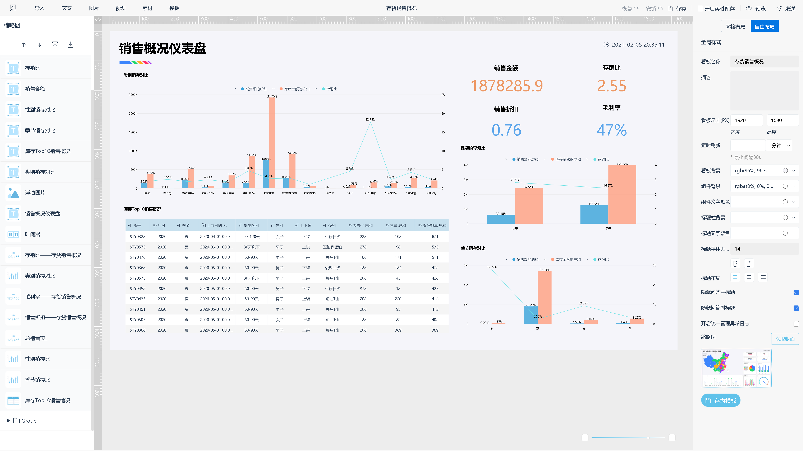
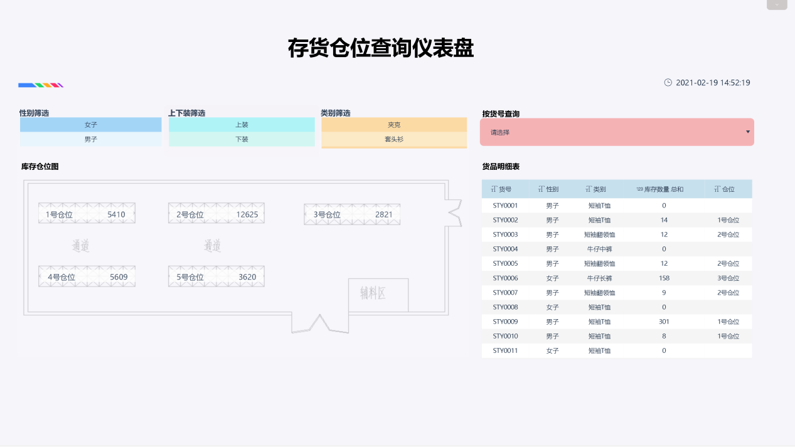
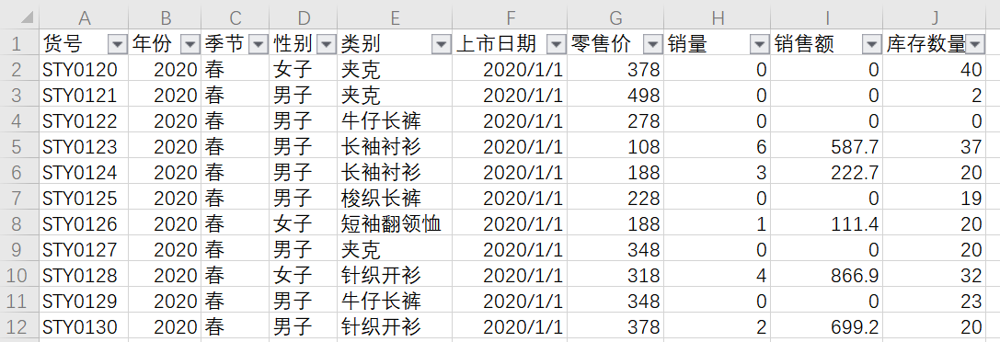

如何将枯燥的大数据呈现为可视化的图和动画，如果你自己并不会像回答中的各位能够自己写代码的话，使用现成的BI分析工具是最省事儿的做法了，那你需要做的就只有三件事：

第一，将你所说的枯燥的数据们导入BI分析工具；

第二，根据数据关系，和想要传达的信息选择合适的图表；

第三，将图表导出。

以你说的航线动画为例，我们来制作一个旅游轨迹图，展示出发地到目的地的行动轨迹。

首先我们需要得到一份相关数据，并把它导入BI分析工具，我用的是[DataFocus](https://www.datafocus.ai/" \t "https://www.zhihu.com/question/_blank)。

因为要制作轨迹图，根据该图的数据要求，必须有经纬度才能定位，因此除了有对应的出发城市和目的城市，我们还需要该点的经纬度，也就是两组经纬度。

接下来，将导入的数据表作为数据源进行数据的可视化。DataFocus是自助式搜索BI工具，这一步就直接双击所需的字段即可，系统将会只能匹配轨迹图。

接下来就是把制作完成的图表进行导出，也是在这个界面，点击导出图片，导出格式是png文件。

导出的效果如图。

如果觉得图表默认的效果没有达到你的预期，可以进行丰富的图表样式设计，也就不需要做出图之后再去用PS加工。除了基本的各种部分的颜色设置，还可以自定义轨迹图中的飞行物。轨迹图本身是有飞行和闪烁动画的，因此可以自定义飞行时间、飞行物尺寸、飞行路径宽度，闪烁效果等。

选对了BI分析工具，将枯燥的大数据呈现为可视化的图和动画不过是一件非常简单的事情罢了。
