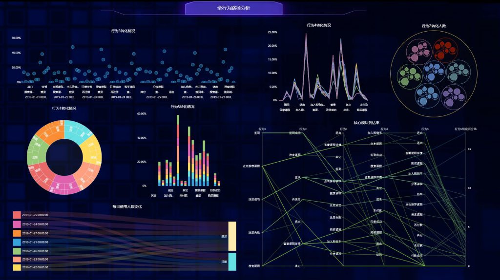
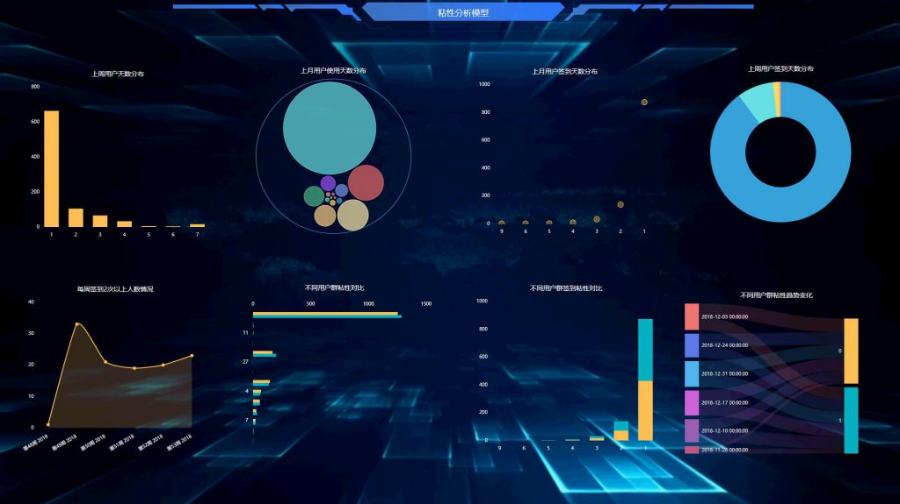

可视化数据分析是利用计算机图形学以及图像处理技术，用datafocus将数据转换成为图形或图像在屏幕上显示出来，并且进行交互处理的理论、方法和技术。可视化数据分析的实质就是借助图形化手的段，来清晰有效的传达与沟通信息，使通过数据分析表达的内容更容易被理解。

那么，我们该怎样来分析大量、复杂和多维的数据呢？答案就是要提供直观的、可交互的和反应灵敏的可视化环境。因此，数据可视化的主要特点是：

1\. 交互性。用户能够方便的用交互的方式管理和开发数据。

2\. 多维性。能够看到表示对象或者是事件的数据的多个属性或变量，而数据分析可以按其每一维的值，可以将其排序、分类、组合和显示。

3\. 可视性。数据分析可以用曲线、二维图形、图像、三维体和动画来显示，并可对其模式和相互关系进行可视化分析。 一个完整的可视化分析流程如下：

把可视化数据转化成有效的可视化数据分析形式（任何种类的图表）就是让数据发挥作用的，因此图表就是可视化数据分析的核心。

最后，多样的图表交互，提升可视化数据分析交互性，能够让数据逻辑更清晰。可视化数据分析可以对以多维形式组织起来的datafocus数据进行钻取、维度切换、联动、链接等各种分析操作，使分析者、决策者能够从多个角度、多个侧面观察数据库中的数据，从而深入了解包含在数据中的信息和内涵。
