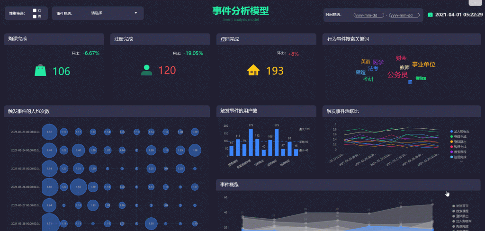
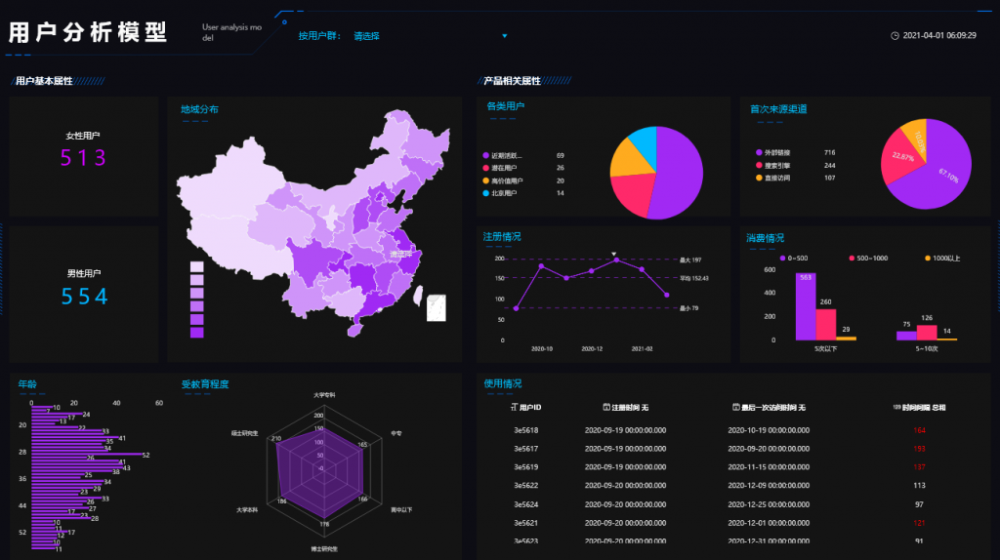

到目前为止，大多数企业已经意识到他们需要转型成数据驱动型企业。在这个过程中，非常关键的一环就是建立企业数据文化。

那么企业需要的到底是什么样的数据文化呢？

企业真正需要的是**解读数据，将数据视为资产的文化**。

那团队成员需要什么样的数据素养呢？

单纯的读写数据能力已经无法满足日益复杂的数据需求了，为了解决问题和获得知识，团队成员还需要拥有**在上下文环境中读写和交流数据的能力**。

为了完成数字化转型，建立企业数据文化，培养团队成员优秀的数据素养，那么到底应该怎么做？

****数据的业务价值****

数据和分析战略很少用可量化的业务指标来衡量成功。这样做很方便，但会导致不良的业务结果。“更好的决策”或是“单一真实的数据源”不再能证明投资数据分析的价值。在对数据的业务需求和基于分析采取行动所产生的业务结果之间存在着明显的沟通缺口。

企业决策者必须确定能从分析洞察力中获得最大价值的业务领域，并跟踪结果和收益。

****数据驱动型方法的文化影响力****

文化是由思维方式驱动的。企业决策者不能简单地告诉团队成员改变他们的文化，突然变成数据驱动型文化。他们必须运用理性和感性的证据，鼓励成员相信文化变革是必要的。

他们需要通过详细解释数据如何影响不同的决策，以及团队成员如何使用数据，来帮助成员培养一种驱动一套新行为的新思维方式。

****数据分析的道德意义****

许多职业（例如医疗保健和法律行业）都有一套传统的道德规范。相比之下，数字道德是新概念，但这个概念也很重要。在没有道德规范的情况下，业务决策可能会产生深远甚至无法意料的影响。首席数据官必须认真考虑数据分析的任何道德考量因素。

将道德准则定义为采用基于原则的信息治理方法的一部分——一种行为准则。道德准则的理念是，让‘做正确的事情’的义务优先于为了满足雇主或客户的需要而‘完成工作’。其中包括数据透明度、数据保护和数据分析师诚信。

**总结**

**企业决策者从分析洞察力中获取某个最大价值的业务领域并跟踪结果，从而引领团队成员。**

**不是简单地告诉团队成员，而是利用理性和感性地证据说服成员进行数据文化变革。**

**将道德准则融入企业数据文化中，它将优先于“完成工作”。**
