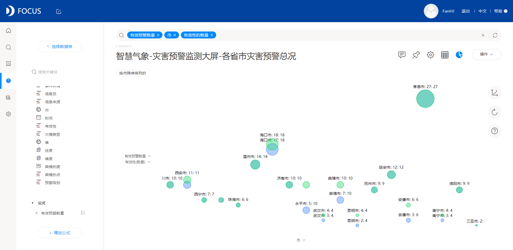
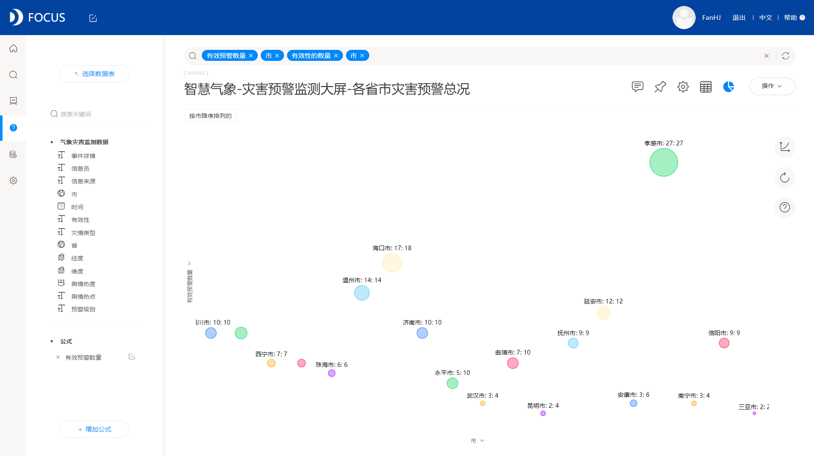

虽然没有投资分析报告的模板，但是可以给你推荐一个在做分析报告必不可少的数据分析工具。

[DataFocus](http://datafocus.ai/" \t "https://www.zhihu.com/question/_blank)

迅速、智能出图，丰富炫酷的图表肯定能给你的分析报告添彩。

举个例子，我想得到各省市灾害预警数量和预警实际有效量的对比关系，但数据表只有有效性这个字段，并没有直接的有效性等于有效的具体数量，因此我们可以添加公式-有效预警数量：

然后可以直接在左侧的数据表中双击需要的字段，有效预警数量、市，要对文本类进行计数也很简单，直接在搜索框输入“有效性的数量”,为了得到预警总数和有效预警数的对比，我们可以选择气泡图：

想要不同的省市更加区分开来，我们可以再加入“市”这个字段，并选择图例为市，调整主题颜色：

除此之外，还可以进行数据标签、坐标轴、目标值等设置，不得不说DataFocus是一款简单强大的分析工具，想必可以为你的分析报告添光加彩。
