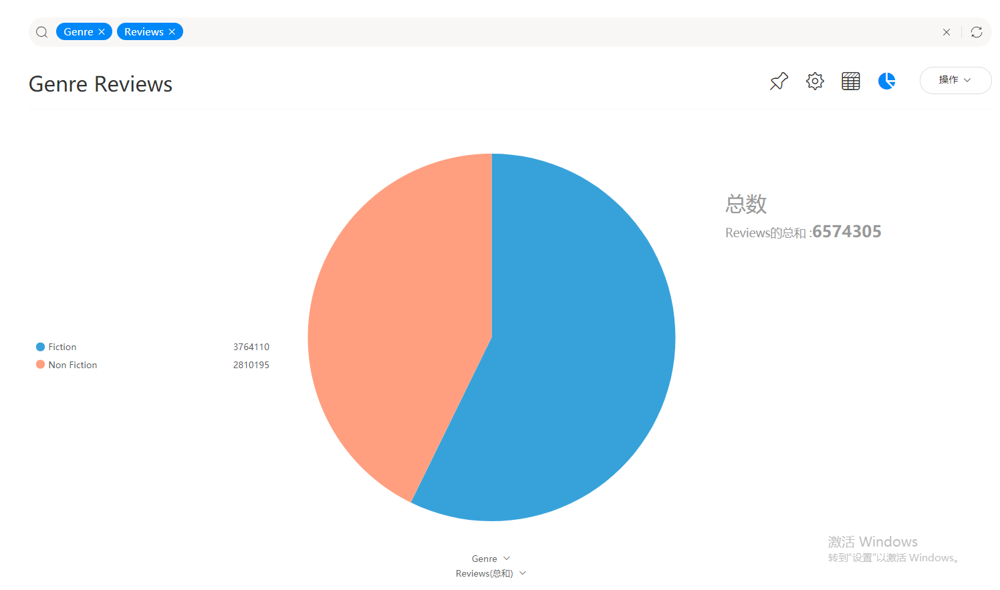
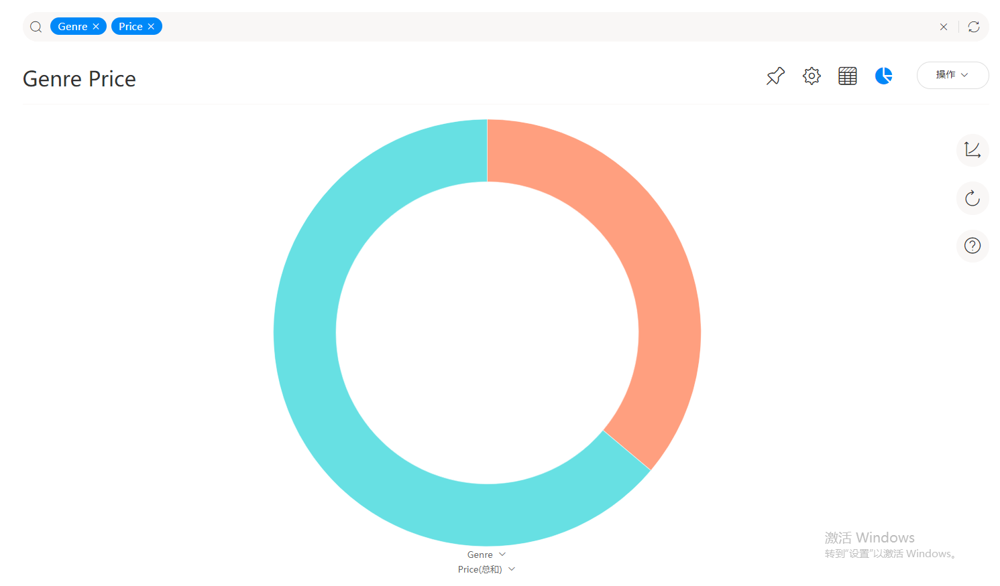
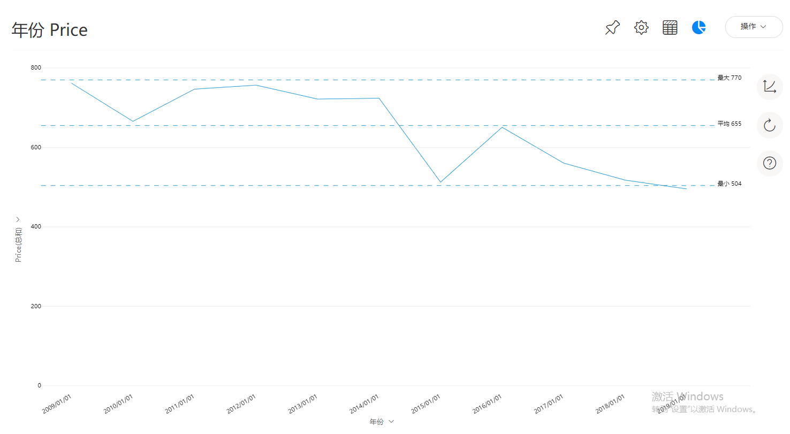

如何用DataFocus分析亚马逊畅销书

什么样的书能被大众认可？出版商出版什么样的书能实现盈利？作者如何在自我和市场之间做好平衡？

无论什么企业都需要先通过市场调研来了解用户需求，今天我们主要以DataFocus为例来分析亚马逊畅销书TOP50。

1. 明确分析目的

从小说类型看，是否是小说更受读者喜爱？小说的评分总体比非小说的评分高吗？小说是否比非小说价格更高？

从出版年份来看，不同年份的小说类型占比是如何？价格整体是偏低还是偏高？

1. 数据获取来源

本数据来自于Kaggle.com，喜欢数据分析的小伙伴可以去这个网站获取数据。

1. 导入数据

1. 数据分析

从小说类型看，是否是小说更受读者喜爱？小说的评分总体比非小说的评分高吗？小说是否比非小说价格更高？

搜索框输入小说类型、评论数，分析可以看到，小说和非小说相比评论数略高，更受读者热情的讨论。

搜索框输入小说类型、读者评分，分析可以看到，小说和非小说相比评分略低，非小说更合读者的胃口。

搜索框输入小说类型和价格，分析可以看到，非小说的价格比小说的市场价格更高。

搜索框输入小说类型，并利用公式计算书本数，得出每一年的小说与非小说占比情况，可知非小说常年数量超过小说，近几年依然是非小说数量偏多。

搜索框输入年份和书本价格，利用折线图可以看到价格有所波动，整体逐年降低的。

我们可以由此大致推测未来趋势，小说价格也许会还会小幅降低，非小说近几年依然数量微超小说数量，而且非小说质量普遍偏高，容易获得读者的高分，小说容易引起读者讨论，热度会相对更高一点。
