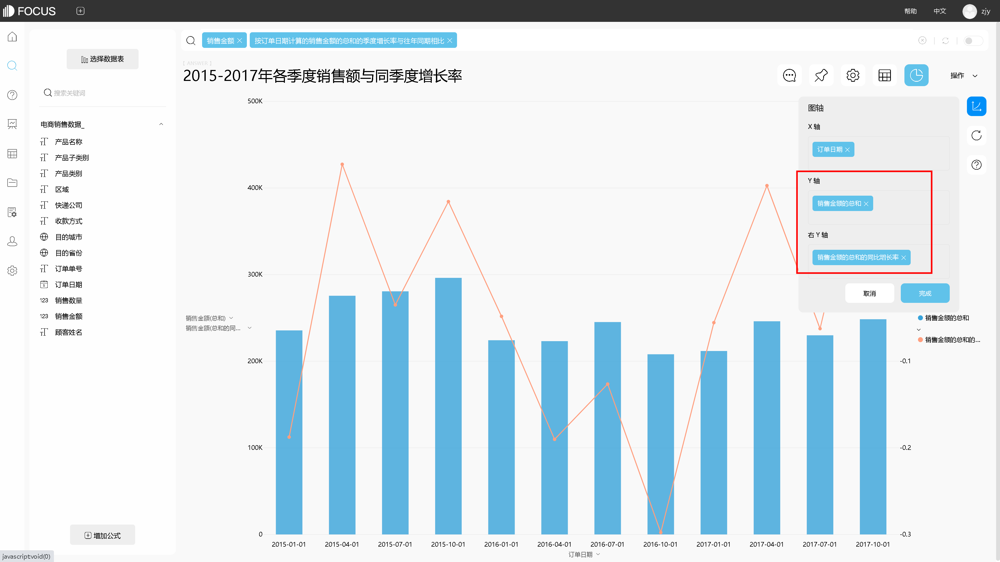

前面，我们了解到，需要根据目的选择图表类型，并介绍了对Excel表中数据进行比较、百分比数据比较和查看相关性时的图表选择。接下来，我们将继续探究其他应用场景下，用DataFocus系统分析Excel数据时图表类型的选择使用。

## 图表的制作

在用DataFocus系统制作图表之前，我们先回顾下，如何将Excel数据表导入到系统中并进行选择，以及图表的制作方式。

### 1.1 数据表的导入

将本地Excel数据表导入到系统中，大致流程如下：

1. 数据表管理模块的“导入表”栏下选择导入本地文件（或资源管理功能模块中点击“创建资源”按钮）。
2. 选定“EXCEL”文件类型，并在选择本地文件后点击“上传“。
3. 上传成功后的 Excel表配置信息界面，可以选择导入的列、重新命名表名及列名、修改列类型等等，配置完成确认无误后点击“确定”完成上传。

### 1.2 数据的选择与图表的制作

将数据表导入到系统后，先在搜索界面选择数据源表，再开始搜索式分析并制作图表。系统会根据搜索出的数据自动匹配一张图表，如需更改图表类型，在“图形转换”中手动选择。制作好的图表，在操作栏下保存并命名。

搜索数据的方式有两种：

A、 双击页面左侧数据表下的列名进行搜索，搜索框内会显示选择的列名，搜索的结果会显示在页面中间空白部分；

B、 直接在搜索框里输入想要搜索的内容，例如输入：按订单日期计算的销售金额的月增长率，DataFocus会根据搜索条件返回结果。

DataFocus搜索基于数据表，所以在搜索框里可以输入任何相关的单词进行搜索，如 列名称、关键词、同义词、列中值。

图表 1. 1 搜索页面

## 图表的应用

了解到图表的制作方式后，我们来继续探究其它应用场景下的图表选择。

### 2.1 体现变化趋势的图表

在进行走势、趋势关系的表达时，一般以时间序列为依据，表示事物在某段时间内的发展趋势。最常用折线图，也可以使用柱状图。

如图，可直观看到2020年各月的产品总销售额趋势。

图表 2. 1 折线图

### 2.2 双图表类型的应用

我们常看到折线图和柱状图混用的列子。当两种不同的图表类型表达的不是同一种数据类型时，双图表类型可以设置将某个数据列沿次坐标轴绘制。

DataFocus中的组合图，包含三种图表类型即 柱状图-折线图；折线图-折线图；柱状图-柱状图。默认为柱状图-折线图形式且两种图表使用同一坐标轴，可以手动更改设置。

例如，想要创建图表用于比较数据表中2015年到2017年各季度的销售额，并同时比较增长率。

图表 2. 2 图轴转换

在搜索框中输入列名以及关键词等数据后，于“图形转换”中选择组合图。在图表右侧的图轴转换中将同比率更换到“右y轴”，即完成简单的组合图的制作。如需转换组合图中某一数值列的图表类型，可以通过点击图例中的向下符号，如下图所示，选择想要显示的图表类型即可。

图表 2. 3 更换图表类型

除了介绍的这五种常见的图表应用场景，在分析Excel数据并制作图表时，还会涉及很多图表的使用，例如 热力图、玫瑰图、雷达图、漏斗图、KPI等等。明确好制图的目的以及可以反映该数据关系的图表类型，再开始制图哦~
