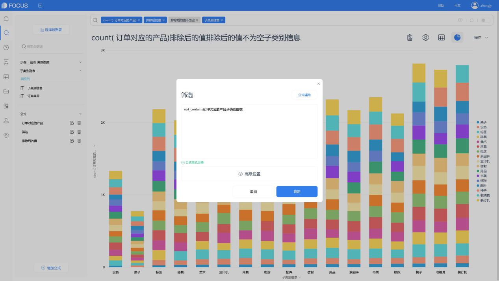

分析一个行业这个问题可以聊很多，所以我只针对你说的其中一点展开来聊聊，就是工具问题。

很多的分析报告里的图表是直接用的二手甚至三手不知道复制过多少次的图表，其实大部分的图表我更推荐你自己去制作，这样才可以完全用图表展示出你所想展现的分析内容，和你独特的分析视角。

图表是为了更好地去传达你的分析内容，而不是让你的分析内容去迎合找到的图表，或者分析内容硬套图表，显得牛头不对马嘴。

我在做行业分析的时候，一个必不可少的BI工具就是[DataFocus](https://www.datafocus.ai/" \t "https://www.zhihu.com/question/_blank)。

操作简单，功能却又很强大，跟着视频自学大体上就能把基本功能掌握。

图表类型非常丰富，完全能满足我的需求。

