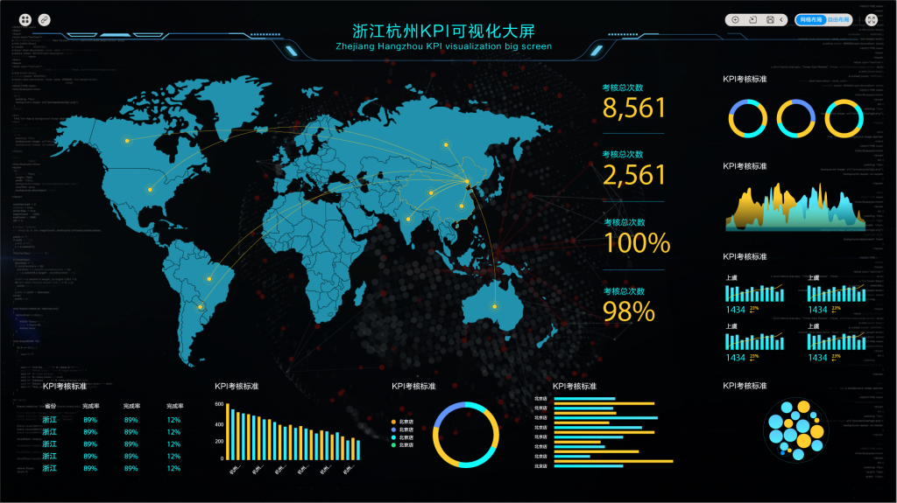

很多设计理念都是为了满足实际业务中不同可视化大屏数据，因此每个成功的可视化大屏都有它独特的设计和显示方式，像datafocus就有自己独特的处理办法，好的大屏都有很多相似的特点。下面就逐一为大家来分析一下制作需要哪些要求。

1、深色背景——让视觉更好的聚焦，设计感更有张力

2、整体显示——大屏不可以进行滚动条等操作，需要在一个完整的面板中显示所有的信息

3、主次分明——每个大屏都需要凸显出鲜明的主题和信息层次

4、图表联动——大屏中的所有图表都是有联系的，一个图表发生变化时关联图表也要相应的跟进

5、信息全面——大屏常用于巨幅显示，根据使用场景不同要考虑到展示需求优化细节的显示，让用户清晰合理地接受信息

当完成以上要素的注意事项后，大家的首要问题是如何梳理出一个有条理、有主次、明确可用的展示信息需求出来。

首先要确认的就是用户看到什么信息，并且选择出我们需要展示的数据维度，其次就是分析需求，并且细拆分维度，确认优先维度，维度再合并。

确认了具体需求，我们对用什么表现方式展示数据也有了一定的思路，比如使用datafocus的方式去展示还是用KPI去直接展示数据等等。

以上，就是datafocus小编为大家总结的可视化大屏制作需求中需要注意的点，不知道大家看完之后是不是都有了一定的收获呢？其实，关于数据可视化大屏的制作要求大同小异，只是不同的企业在不同细节上有所差异。
