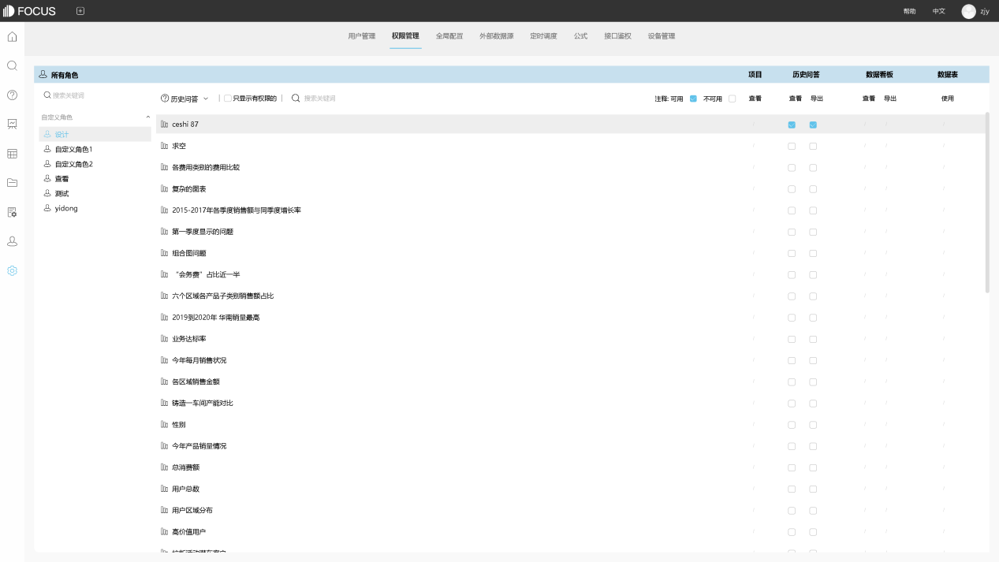
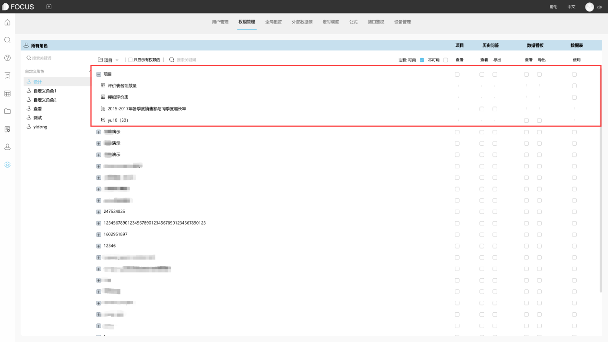

电子商务网站数据分析涉及目标客户的定位和产品的分销利润。因此，如何对电子商务网站进行数据分析是许多电子商务网站管理运营商最关心的问题。一般而言，电子商务网站数据分析包括流量来源分析和流量效率分析，以及内部数据流分析和用户特征分析。让我们仔细看看如何分析电子商务网站上的数据。

首先，如果电子商务网站想要收到一个订单，它必须确保流量。但是，获得流量具有成本效益。如何降低流量成本是电子商务网站运营中最重要的部分。流量来源分析是关键。例如，在分析电子商务网站上的数据时，您必须首先了解用户是从哪里点击，哪些网站可以说我们带来更多订单，哪些流量来源是真的，哪些是假的，等等。在您弄明白这一点之后，您可以稳定您的旧客户，开发新客户并更好地推广您的网站。

其次，流量效率分析也是不可或缺的一部分。在电子商务网站上进行数据分析时，流量效率是指流量是否达到网站的实际流量。那么，在具体分析中，要看其到货率，PV/IP比率是订单转换率等等。订单转换率是最重要的方面，如果没有订单转换则没有意义。

最后，如何对电子商务网站进行数据分析也离不开车站数据流的分析。这里提到的站点数据流分析主要用于分析购物流程的顺畅性和网站产品的合理分布等，然后分析基于这些的页面流量排名和场景转换率分析，网站搜索分析和客户。离开页面分析和其他问题，检查问题，然后找到解决方案，以使网站产品更好地推广。

DataFocus作为新生代的数据分析工具，有着最新的分析方式——基于自然语言分析的搜索式分析，以及严谨细致的行列粒度数据权限管控和安全的私有化部署方式，助力与您的企业构建数据分析系统。

 
