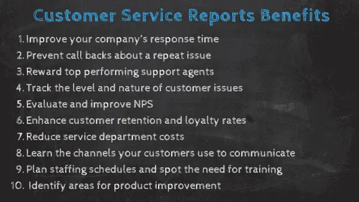
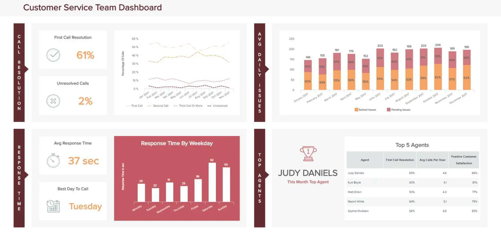
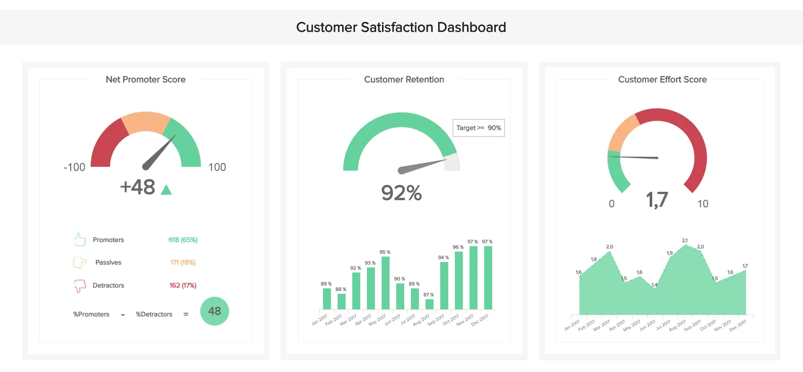
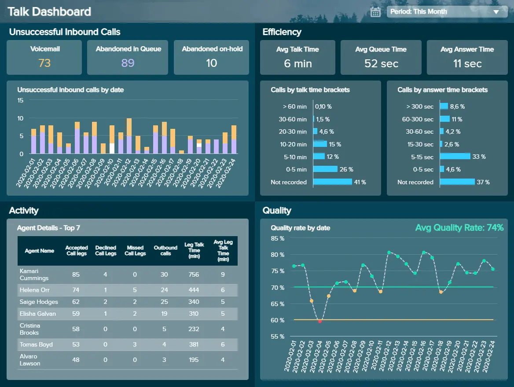
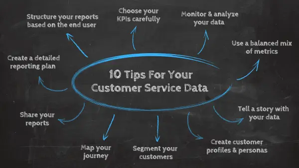

客户服务和体验现在比以往任何时候都重要 - 没有妥协，没有例外。投资于打造完美体验并提供卓越客户服务 （CS） 标准的品牌将在赢得真正消费者忠诚度的同时，从竞争对手中脱颖而出。

特别是在CS方面，今天的数字消费者非常负责。由于现代消费世界的超连接、令人难以置信的便利和即时性，以及提供的接触点数量，通过利用精心挑选的[客户服务 KPI](https://www.datafocus.ai/infos/kpi-examples-and-templates-customer-service)来保持卓越的服务水平是生存的最终关键。

 

也就是说，如果您能够快速有效地回答客户查询，那么您的品牌忠诚度就会提高十倍。要优化您的 CS 产品，您需要访问正确的数据，这就是客户服务报告发挥作用的地方。

这种报告将使您的组织能够更深入地了解其客户，始终如一地满足他们的需求。有了正确的数据和正确的可视化效果，服务报告将使您的组织更智能、更高效，并最终更加面向消费者（这对于数字时代的持续增长至关重要）。

在本文中，我们将解释数据分析如何显着改善您的CS产品，同时解释报告在将您的业务推向新的商业高度方面所起的重要作用。我们还将查看基于不同类型的客户服务报告的鼓舞人心的仪表板和模板示例的组合。

准备？让我们开始吧。

“只有一个老板。“——沃尔玛创始人山姆·沃尔顿

您的机会：[想要测试客户服务报告软件吗？](https://www.datafocus.ai/console/)探索我们的 14 天免费试用并享受客户服务报告！

## 什么是服务报告？什么是服务报告？

服务报告是一种分析工具，由客户服务报告指标的组合组成，可帮助您满足客户期望并提供更好的体验。借助实时数据，企业可以提高服务水平、创造价值并增加利润。

从平均响应时间到[NPS 分数](https://www.datafocus.ai/infos/kpi-examples-and-templates-customer-service#net-promoter-score-nps)，客户服务报告提供了对面向消费者工作的关键领域的深入而有价值的见解。反过来，这将为您提供对要建立的积极领域和改进领域的敏锐理解。

为了始终如一地提供最佳CS标准，了解您的消费者如何与您的业务互动至关重要。拥有正确的[在线报告工具](https://www.datafocus.ai/infos/online-reporting)将确保您的数据保持最新并随着公司的变化而发展。

## 客户服务报告有什么好处？

既然您知道什么是客户服务报告以及它在改进面向消费者的流程方面所起的作用，让我们来看看主要优势。

在数字时代，消费者比以往任何时候都更有能力、更精通技术、要求更高。如果您不能满足客户的需求或几乎立即解决他们的问题，或者以他们认为不可接受的能力解决他们的问题，他们根本不会留下来。除此之外，客户现在更信任同行的意见胜过信任品牌本身，如果您想成功，专注于您的 CS 产品应该是您的首要任务。

追求客户报告似乎有无限的好处。通过访问见解和数据，您可以：

- 缩短公司的最佳响应时间

响应时间是任何 CS 部门或组织的支柱。我们在下面的文章中写了更多关于平均响应时间的文章，但重点是尽可能保持简短。如果您在每周或[每月报告中](https://www.datafocus.ai/infos/monthly-reports-templates)跟踪此指标，则可以通过确定瓶颈（例如，高峰时段班次期间的可用座席数量太少）来显着改善它。

- 防止有关重复问题的回调

让我们面对现实吧，客户不喜欢回电或重复指出一个问题。通过利用全面的报告，您可以在其中包括首次呼叫解决指标 （FCR） 或记录的呼叫，因为它们至关重要，您将可以立即访问数据并有更好的机会迅速采取行动，而不会提供从长远来看可能会花费您的低级服务。在单个屏幕上设置详细报告将使您能够提高支持部门的级别，并确保始终照顾客户。

- 奖励表现最佳的座席并提高内部士气

表现最好的代理商应该得到奖励。如果您在报告中看到有益的结果，请进一步调查，看看是谁的工作带来了这些结果。更好的是，实施一个团队[KPI](https://www.datafocus.ai/infos/best-kpi-dashboard-examples)仪表板，该仪表板将立即向您显示您的团队的表现以及您需要分配更多资源（教育材料或研讨会）的位置，以便整个部门有更多机会改善他们的结果。您还可以要求您的顶级代理商教育其他团队成员，并为他们提供带来成功和可持续发展的策略。

- 随着时间的推移跟踪问题的级别和性质，以做出明智的战略决策

如果在手动将数据插入电子表格时丢失了对客户问题的跟踪和计数，从长远来看可能会导致严重的问题。错过另一位同事的行或评论很简单，非故意的，但绝对有害。例如，如果您[的报告](https://www.datafocus.ai/infos/data-report-examples)设置了智能警报，以便在发生异常时立即向您发送通知，则可以改进对问题的跟踪，并创建一个环境，以改进将来的决策过程。

- 更深入地了解客户如何看待您的公司

另一个好处是衡量满意度。满意的客户比您可能跟踪或评估的任何其他指标都更有价值。众所周知，[一个满意的客户](https://www.getfeedback.com/resources/cx/how-to-make-your-happy-customers)平均会向 3 个朋友推荐你，而不满意的客户有权访问并在互联网上写下他们对你的品牌的体验。通过定期评估客户对您的看法，您有能力预测未来的潜在障碍并采取行动。

- 评估和提高您的净推荐值 （NPS）

净推荐值是[客户满意度指标](https://www.datafocus.ai/infos/customer-satisfaction-metrics-effort-score-nps-csat)之一，简而言之，就是关于推荐的所有内容。目标是获得尽可能多的促销员，这将使您能够扩展业务并提高忠诚度。您拥有的忠实客户越多，您的公司获得的回报就越多。如果您正确利用确保您的报告还包括净推荐值，您将能够快速评估批评者、中立者和发起人如何影响您的底线。在上图中，你会看到一个显示 NPS 的交互式方式示例，将客户划分为发起人、被动者和批评者。

- 提高无价的保留率和忠诚度

与净推荐值密切相关，保留率和忠诚度都集中在获得客户的信任并使他们能够传播有关您的组织的积极言论。留住客户本质上比获得新客户便宜得多，并且在适当的报告的帮助下，您的 CS 部门可以蓬勃发展。通过查看[您的客户保留指标](https://www.datafocus.ai/infos/customer-retention-dashboard-metrics)，您还可以得出结论，例如您的目标受众参与最多的渠道，并相应地分配您的预算和工作量。

- 通过降低成本使您的 CS 部门更有效率

客户服务报告样本还可以帮助提高财务效率。降低支持成本并不是要减少人力或将最少的资金投入到您的支持部门。这主要是关于优化您的流程并以尽可能低的成本达到最高质量的服务。这意味着您的座席效率很高，训练有素，并且座席的时间表与部门的需求相对应。为了一目了然地概述，创建客户支持报告将确保您定期有效地监控您的费用。

很明显，正如我们上面的 8 点所述，有许多切实的好处，其中许多将对业务的其他领域产生积极影响。要了解每个提到的 KPI 的详细信息，您可以在本文的示例部分中阅读有关它的更多信息。

简而言之，它们提供了了解您的公司的能力，以便根据准确的见解做出明智的决策，而不是做出对组织或其客户几乎没有价值的估计和行动。

保留率仅增长 5% 的公司通常会看到利润增长25% 到 95% 不等。像这样，您不仅可以显着提高保留率，还可以提高品牌声誉，从而带来商业增长和利润增加。

我们生活在一个充斥着宝贵数字见解和数据的世界。如果您未能利用这些信息来发挥自己的优势，那么您将错失可以提高组织 CS 部门的效率、产出和凝聚力的重要机会，从长远来看，这可能是灾难性的。

- 了解客户的首选沟通渠道

随着我们迈向一个由数字原生消费者（主要是千禧一代和Z世代）主导的日益高度互联的时代，消费者可以通过滑动屏幕或单击按钮来访问大量信息。因此，今天的消费者喜欢通过越来越广泛的渠道或接触点与品牌互动。

从Instagram，Facebook和Snapchat到TikTok，YouTube，移动应用程序，在线聊天，电子邮件等等，在现代，您可以通过多种方式与客户建立联系。虽然与他们联系的范围几乎是无穷无尽的，但您会发现几乎每个与您的业务互动的人都有一个首选渠道。

通过使用正确的客户服务分析指标，您可以一目了然地发现您的客户出于特定问题或沟通原因更喜欢哪些渠道。通过轻松发现这些信息，您可以使用正确的方法扩展到您的客户，以个性化并满足他们需求的方式解决他们的问题或痛点。这将提高您的满意度，提高您的品牌声誉并发展公司。

- 规划人员配备时间表并发现培训需求

为您的座席提供正确的培训对于您的 CS 部门的持续成长和发展至关重要。如果没有足够的培训和指导，您的座席不仅会在他们的角色中茁壮成长，而且他们会变得更有效率、响应迅速、适应性更强和创新。

通过正确的客户报告，您可以确定您的座席在哪些方面正在努力解决消费者的问题或回答正确的问题。利用这些特定信息，您可以提供量身定制的培训，以直接解决问题的根源，并确保您的团队能够自信地处理遇到的所有问题。

使用这种类型的服务报告，您还可以了解一次需要多少座席工作，清晰地监督整个操作，以便在需要时提供支持或培训。这些[业务仪表板](https://www.datafocus.ai/infos/dashboard-examples-and-templates)还将帮助您了解客户与您联系最多的日期和时间。拥有这些信息很有价值，因为它可以让您计划班次并确保您拥有在任何给定时间覆盖票证数量所需的代理数量，从而提高您的服务水平。

客户支持可能被证明是一个具有挑战性的角色，通过为您的座席提供实际指导，您很可能还会提高士气，激励您的团队不断改进，并全面提高生产力。

- 确定产品改进的领域

这是CS成功中一个经常被忽视的方面，但它非常重要：产品的质量或价值将直接影响服务策略的成功。

通过使用服务报告来监控特定的查询或问题，您将迅速描绘出任何无法满足消费者需求或期望的产品。

例如，如果您是一家健身技术供应商，并且您注意到以最新户外活动手表的界面质量为中心的投诉激增，您可以快速通知您的产品团队有关导致投诉的具体问题。

通过提供这种级别的消费者智能，客户服务报告基本上成为整体组织改进的容器。的确，您的CS部门是您与消费者沟通或解决问题的主要点。但重要的是要了解它也是宝贵的前线信息的容器。

有了动态信息，您的 CS 部门将成为组织智能的宝贵枢纽，帮助您改善沟通、营销消息以及您开发、销售和推广的产品。

“把你做得好的事情做好，这样他们就会想再看一次，并带上他们的朋友。”

您的机会：[想要测试客户服务报告软件吗？](https://www.datafocus.ai/console/)探索我们的 14 天免费试用并享受客户服务报告！

## 客户服务报告的类型：最佳示例

我们已经研究了客户报告的内容和原因，现在我们将探索与组织的各种基于 CS 的活动相关的五个主要客户服务仪表板。

### 1\. 客户服务团队仪表板

在这个时代，要提供卓越的服务标准，您必须超越客户的期望。

\*\*点击放大\*\*

第一个客户服务报告示例通过在一个集中空间中关注响应时间和单个座席绩效，每天和每月磨练您团队的整体绩效。团队的绩效对于整个运营的成功至关重要，此[BI 仪表板](https://www.datafocus.ai/infos/bi-dashboard-best-practices)将帮助您为推动组织向前发展做出有价值的贡献。

主要关键绩效指标：

- 平均响应时间：为了提高客户满意度和生产率，必须将平均响应时间保持在最低限度。此特定 KPI 测量从客户拨打电话到座席响应的时间。这与其他相关的[服务台 KPI](https://www.datafocus.ai/infos/helpdesk-service-desk-kpi-metrics-examples-templates)一起提供了对您的整体 CS 绩效水平的出色洞察。
- 首次呼叫解决：首次呼叫解决率清楚地表明您的团队在第一次联系时解决问题的成功程度。此方面的改进可能会提高呼叫处理速率，但如果首次呼叫解决级别有所提高，则会产生较小的影响。
- 顶级座席： 员工满意度和士气可能是积极的客户支持绩效的最重要驱动因素之一。通过在几个月内跟踪此指标，您将能够确定哪些座席可以从额外的支持和培训中受益，以及您应该奖励和认可哪些座席。
- 问题数量：通过了解进入您业务的电话和查询量以及每个查询的性质，您将能够做出明智的人员配备决策，以应对特定时间的需求，同时改进您的策略以满足客户的需求。

### 2\. 客户满意度仪表板

客户满意度仍然是当今企业的首要任务，因为它可以提高品牌忠诚度，在许多情况下，还可以增加每位客户的支出。

\*\*点击放大\*\*

这个特定示例侧重于客户满意度、体验、感知和保留的所有主要方面，将帮助您保持消费者的满意度、参与度和对业务的忠诚度。

主要关键绩效指标：

- 净推荐值（NPS）：您的NPS对您的整个运营至关重要，因为它显示了公众对您的支持水平的看法。从本质上讲，它决定了某人将您推荐给他们的同龄人的可能性。在 1 到 10 的范围内，根据他们的分数，客户被视为推动者 （9-10）、被动者 （7-8） 或批评者 （0-6）。通过提高您的NPS分数，您最终会看到增长和忠诚度的提高。
- 客户努力得分：这是一个特别关键的 KPI，因为它可以让您一瞥整体客户体验产品的标准。通过了解客户体验中让您的业务失望的元素，您将能够做出重要的改进，从而发展公司。
- 客户保留：如前所述，客户保留对于组织的成功至关重要。通过设定保留率目标并努力实现它，您将随着时间的推移改善您的品牌形象并扩大您的客户群。

### 3\. 客户支持 KPI 仪表板

无论您的 CS 角色或资历水平如何，总有改进的余地。

\*\*点击放大\*\*

最后一个客户服务报告模板大量填充了信息，并跟踪了除客户满意度甚至客户服务仪表板之外，帮助台[仪表板](https://www.datafocus.ai/infos/dashboard-examples-and-templates-customer-service)通用的大量指标。该仪表板在一个易于浏览的平台上提供了大量宝贵的见解，为管理人员提供了他们所需的所有支持信息，一目了然，并可以选择更深入地了解各个绩效指标和见解。

主要关键绩效指标：

- 服务级别：此特定指标计算您完成您提供给客户的服务级别协议 （SLA） 中确认的标准的能力。此 KPI 很重要，因为它展示了您对兑现承诺的承诺，并将帮助您确定提高整体标准的方法。
- 客户支持与收入：这是一个无价的支持指标，此 KPI 可帮助您计算支持成本与总收入的关系。如果您能以降低成本提供令人难以置信的高标准服务，那么商业增长和增加收入是不可避免的。此 KPI 将帮助您获得实现这一目标所需的见解。
- 客户满意度：满意的客户是每个成功组织跳动的核心。通过切实衡量客户目前对您的看法，您将能够在最重要的领域进行改进。

### 4\. 客户保留仪表板

众所周知，留住现有客户比吸引新客户更具成本效益。鉴于忠诚客户的平均支出比新消费者多 67%，因此投资于您的保留策略和活动对您的成功至关重要。

\*\*点击放大\*\*

作为我们最有价值的服务报告之一，这个动态[的客户保留仪表板](https://www.datafocus.ai/infos/customer-retention-dashboard-metrics)旨在持续提高您的消费者保留率。

该报告具有视觉平衡，具有图表、图形和 KPI，可一目了然地了解以保留为中心的绩效和趋势数据，是各行各业公司的首选资源。

在这里，您将找到在以客户保留为中心的特定领域衡量成功所需的一切，同时确定潜在的优势和劣势 - CS成功的视觉载体。

主要关键绩效指标：

- 客户流失：此[销售 KPI](https://www.datafocus.ai/infos/kpi-examples-and-templates-sales)在客户保留方面也起着至关重要的作用，因为它可以帮助您了解在设定的时间范围内哪些部分或百分比的客户停止使用您的业务或服务。在这里，您可以识别客户流失率的高峰或低谷，查明潜在的忠诚度问题，并制定有针对性的策略来减少它们。
- 净留存率：您的净留存率很重要，因为它可以让您更深入地了解新客户与回头客流失率，同时计算一段时间内的新产品或服务取消率。通过持续跟踪净保留率，您将能够对您的服务或客户体验旅程进行有价值的调整或改进。
- 收入流失：这种以收入为中心的 KPI 将帮助您跟踪、监控和衡量您的企业从现有客户那里损失的收入百分比。在这里，您可以跟踪趋势，查明收入损失的来源（例如，产品取消或服务降级），并进行战略改进以始终如一地降低收入流失率。
- MRR增长率：您的MRR（每月经常性收入）是另一个重要指标。它会告诉您在一段时间内您的保留率如何影响您的底线。反过来，您将清楚地了解可能影响您的MRR的因素，并正面解决问题。

“客户并不期望你是完美的。他们确实希望你在出现问题时解决问题，“——唐纳德·波特，英国航空公司副总裁

### 5\. 座席谈话仪表板

尽管当今客户可用的渠道数量不断增加，但许多人仍然喜欢通过电话以“老式”的方式进行交流。

\*\*点击放大\*\*

您的通话质量很重要 - 这份以通话为中心的客户服务分析报告将根据四个关键领域告诉您使基于电话的通信更具影响力和效率所需的一切：不成功的呼入呼叫、一般效率、座席活动和对话质量。

这个富有洞察力的[Zendesk 仪表板](https://www.datafocus.ai/infos/dashboard-examples-and-templates-zendesk)将为您提供所需的数据驱动工具，以便在特定时间范围内接听更多电话并解决更多投诉，而不会影响服务质量。通过使用此客户服务报告示例作为基于谈话的信息北极星，您将成倍地提高 CS 产品的成功率，并在此过程中提高您的品牌声誉。

主要关键绩效指标：

- 接听时间：这个最有说服力的指标将为您提供代理接听电话所需的时间的准确衡量标准。通过持续跟踪此 KPI，您将准确了解呼叫系统的效率，并查明任何潜在的弱点，以便您可以进行有针对性的改进。

- 腿部通话时间：此特定的客户服务分析示例基于您的座席在客户呼叫期间提供解决方案所需的时间。每个环节都是指服务或销售周期的不同阶段，为您提供有针对性的信息，使您能够在需要的地方进行改进或代理支持。

- 不成功的呼入呼叫：此 KPI 以易于理解的条形图形式显示，跟踪在特定时间段内有多少客户呼叫无法连接或接听，以及主要原因。获得这种级别的详细服务信息将使您能够了解您的服务最失败的地方，并更深入地挖掘问题，在此过程中改善您的整体客户体验产品。

- 质量率：质量率KPI衡量呼叫中心的总体绩效。从本质上讲，质量率是根据对话总数获得高质量评论的呼叫的百分比。设定一个切合实际的基准将使您能够持续衡量呼叫中心的结果，使您能够快速响应任何质量下降，从而保留您的服务产品。

您的机会：[想要测试客户服务报告软件吗？](https://www.datafocus.ai/console/)探索我们的 14 天免费试用并享受客户服务报告！

## 客户服务数据分析的 10 个重要提示

虽然 CS 数据对于任何现代组织来说都是无价的，无论其行业或部门如何，但由于每天可用的信息量巨大，有效地创建和管理它可能具有挑战性。

在这里，我们将分享有效客户服务数据分析的十个基本技巧。

### 1\. 创建详细的报告计划

为了生成最佳服务报告，您必须创建一个可靠的面向客户的计划。您需要了解要报告的数据范围以及所涉及的利益干系人的角色（从一线代表到服务开发主管、通信专家等）。创建草稿以确保您事先完成所有步骤将在以后为您节省大量时间。借助[BI 报告工具](https://www.datafocus.ai/infos/bi-reporting)，您可以纵观全局并确定要生成的报告类型（更多内容见下文）、您将针对谁以及您的最终目标是什么。准备和计划是创建稳定且有收益的报告实践的关键因素，您不应跳过此步骤。

### 2\. 根据最终用户构建报告

根据您是为支持团队、部门还是 C 级经理选择了 KPI，构建数据至关重要。谁将使用客户报告是创建报告的基线。这也与选择正确的指标密切相关（更多内容见下文），因为团队负责人不会收集和分析与支持代理相同的数据，而是专注于团队的绩效，例如，能够提供必要的培训并确保稳定的流程。使用全面的[在线仪表板](https://www.datafocus.ai/infos/online-dashboard)，您可以自动监控与顶级座席、问题数量或首次呼叫解决时间相关的绩效指标，从而简化过程中的客户服务数据分析工作。

### 3\. 选择您的关键绩效指标

每个业务都是不同的，可能对一个组织特别有用的见解可能对另一个组织不同。但是，以协作能力为您的业务选择正确的[KPI](https://www.datafocus.ai/infos/kpi-examples-and-templates)对于报告的成功至关重要。例如，平均响应时间将告诉您座席响应客户电话需要多长时间。如果你迅速而勤奋地回应，你的品牌形象将保持正面，客户肯定不会抱怨。另一方面，如果您将它们搁置更长时间（超过一分钟），它们挂断的可能性会显着增加，但也有可能损害您的声誉。

一旦您确定了最能帮助您增强 CS 产品的信息，您就可以根据您的需求、目标和目的设置自定义的可视化[数据仪表板](https://www.datafocus.ai/infos/data-dashboards-definition-examples-templates)。为了确保从某些 KPI 和指标中获得最佳价值，您应该设置测量时间参数，以便为您提供平均值和趋势的全面快照。它还将为您提供最准确的CS数据视图。这就引出了我们的下一点。如果您想获得有关如何为您的业务选择正确指标的完整指南，请查看我们的[KPI 与指标](https://www.datafocus.ai/infos/kpis-vs-metrics-differences)帖子！

### 4\. 定期监控和分析您的数据

为了确保您的CS分析报告提供宝贵的质量和最佳数据，您需要定期监控和分析您的发现。要创建可持续的客户[KPI报告](https://www.datafocus.ai/infos/what-are-kpi-reports-examples)，利用现代软件和[在线数据分析工具](https://www.datafocus.ai/infos/data-analysis-tools)（如DataFocus），将确保您的数据在任何给定情况下都是最新的和有效的。

通过实时监控您的信息并通过一系列图表以图形方式表示数据，您可以轻松操作和向下钻取到原本隐藏的零碎数据。分析部分是您需要执行的最重要步骤之一，以便成功建立和维护有利可图的策略。

通过逻辑分析，您将能够在客户旅程的每个阶段满足客户的需求，并跨每个渠道或接触点提供无缝服务。

客户报告不仅仅是收集大量数据，而是分析数字并回答重要问题。如果您这样做，您将把您的客户服务产品提升到一个新的水平。

### 5\. 使用服务关键绩效指标的平衡组合

一旦您确定了目标，选择了最有价值的 KPI，并在[仪表板生成器](https://www.datafocus.ai/infos/dashboard-creator)的帮助下将所有内容放在一起，您的客户服务分析成功将归结为在正确的时间向下钻取正确的信息。

借助整合CS部门所有最重要数据的仪表板，您将能够定期监控丰富的见解。但是，如果您想从数据中提取最大价值，则必须使用均衡的[指标](https://www.datafocus.ai/infos/operational-metrics-and-kpi-examples)组合。这将清楚地表明您现有的分析报告在实际环境中的价值。

当我们说您应该混合使用 KPI 时，我们的意思是跟踪：

- 史料
- 实时数据
- 预测数据

为了取得平衡和渐进式分析的成功，您的指标和 KPI 必须协同工作，以显示见解，描绘出过去的绩效趋势（用于比较）、实时活动（在挑战发生时适应和响应）和潜在的未来模式（创建将可能的问题扼杀在萌芽状态或利用潜在机会的策略）。

### 6\. 用数据讲述故事

作为人类，当信息以故事或叙述的形式呈现时，我们会更有效地消化信息。

在与客户服务报告数据交互时，请务必以合乎逻辑的方式排列可视化效果、KPI 和指标并讲述故事。

这样做将提供有关您在客户运营关键领域的表现的可访问见解，同时为部门中的每个人提供使用该数据来提高个人绩效的工具，同时更有效地沟通。

我们关于[数据故事讲述](https://www.datafocus.ai/infos/data-storytelling-examples-with-data-visualization)的权威指南将告诉您入门所需的所有信息。

### 7\. 创建客户档案和角色

如前所述，即使您已经收集了客户服务数据、开发了报告并开始使用它们，您也必须定期评估和完善您的分析工作。

为了将数据置于真实环境中并确保您的指标保持相关性，创建（和更新）客户档案或角色是一项有价值的活动。

客户档案或角色是理想目标客户的表示，包括对他们的需求、愿望和痛点的描述，同时概述基本的人口统计信息，包括：

- 名称（使您的客户资料人性化）
- 性
- 年龄
- 职业
- 收入
- 利益
- 家庭情况
- 首选通信方式
- 数字素养水平

通过创建一组客户档案或角色，您将更好地了解您的数据，并确保您跟踪的 KPI 仍然与您的策略直接相关。客户档案还将帮助您使数据人性化，并因此做出更有效的分析决策。

### 8\. 细分您的客户

关于您的企业更面向客户的活动，通过将消费者细分为不同的群体，您将能够更深入地了解他们的需求、偏好或问题，从而提高您的沟通质量。您可以使用您的客户角色或配置文件来执行此操作。

例如，通过使用客户支持和满意度 KPI，您可以根据客户是新客户还是回头客、他们的服务或产品偏好或问题的性质对客户进行细分。

这样做将使您能够更深入地挖掘最相关的数据并制定计划，最终改善您解决服务问题的方式以及您为客户提供的体验标准。

如果您想通过专业的分析方法更深入地挖掘客户细分，请查看我们的完整数据分析[指南。](https://www.datafocus.ai/infos/data-analysis-methods-and-techniques)

### 9\. 规划我们的客户旅程

在信息时代，客户服务与无数活动和职能保持一致，其中许多与营销和销售交叉。

这里的重点是：数字驱动的公司正变得越来越有凝聚力，因此，各部门在活动和计划上的协作比以往任何时候都多。

也就是说，全面改善服务部门的最有效方法之一是使用各种仪表板来开发客户旅程地图。

客户旅程地图概述了客户如何从头到尾与您的品牌互动。通过使用您的客户数据开发地图，您将能够了解哪些渠道或接触点需要关注，以及可能出现瓶颈或问题的位置。

您应该检查每个关键职能（从支持绩效到保留）的 KPI，以创建您的客户旅程并突出您需要集中精力的地方。当您与销售和营销决策者共享这些数据时，您可以共同开发一个丰富、有益且无缝的旅程，从头到尾使用信息丰富、可靠的见解作为您的指导。

### 10\. 分享您的报告并获得可操作的见解

通过预定的自动电子邮件或共享[交互式仪表板](https://www.datafocus.ai/infos/interactive-dashboard-features)提交结果将减少生成、整合和导出您可能拥有的大量数据点所需的时间。共享信息是创建和管理客户支持报告的另一个重要方面。为了能够完全专注于分析过程中的关键内容，您可以从[自动报告](https://www.datafocus.ai/infos/automated-reporting-system-and-tools)中受益，这样您就不需要花费大量时间导出电子表格或准备演示文稿，但您的数据将立即访问，同时您可以专注于最重要的事情：可操作的见解。

这些是有关如何创建成功的客户服务分析报告并提高底线的一些基本技巧。

## 要避免的客户服务绩效错误

此时，您知道哪些元素构成了可靠的客户服务报告结构。现在，是时候看看你应该不惜一切代价避免哪些错误了。

### 1\. 不使用 KPI 衡量绩效

毫无疑问，客户服务是任何现代企业中最注重绩效的部门之一。

当您希望发展自己的努力时，衡量绩效很重要。CS 开发不仅仅是一个快乐或不快乐的客户。有几个因素会影响跨渠道沟通的成功。如果不使用可视化 KPI 来衡量和量化您在这些关键领域的绩效，您就不太可能完全满足客户的需求。

根据您的特定客户服务目标选择 KPI 将确保您拥有将任何潜在服务问题扼杀在萌芽状态所需的信息，同时增强跨渠道的沟通。没有这些信息，您要做的就是在黑暗中拍摄并提供平均服务，在此过程中落后于竞争对手。

例如，如果您希望提高整体通话效率，您将使用我们之前介绍的已讨论指标。而且，如果您的核心目标之一是提高产品质量，您应该专注于在特定时间范围内显示特定客户投诉的 KPI。

### 2\. 没有测量每个通道

例如，如果您只根据电话、在线聊天或电子邮件来磨练客户支持报告指标，您将永远无法实现有凝聚力、全面且全面运营的客户服务策略。

许多企业未能探索所有通信渠道中的每一条相关数据，这意味着他们的整体服务质量或NPS分数受到影响。为了全面满足客户的需求，您必须探索消费者用来与您互动的任何潜在客户服务渠道的指标。

如今，客户通过社交媒体、移动应用、YouTube 评论、电子邮件、第三方反馈平台、在线聊天、电话等扩展到企业。因此，跟踪每个渠道的数据，以确保您的工作继续与客户群一起发展。如果不这样做，你将落后于竞争对手。

### 3\. 没有得到整个企业的认可

设置准确的服务基准对于确保您始终以最佳水平执行至关重要。但是，如果没有高层或其他跨部门的高层的支持（销售和营销与CS密切相关），您的客户服务报告目标将受到严重阻碍。

为避免数据驱动型工作被最高管理层取消，您必须通过就现有服务问题构建令人信服的案例，解释使用尖端报告模板将如何帮助解决这些问题，从而为您的客户服务绩效报告工具和策略构建案例。

尽早获得支持，您将获得客户服务绩效报告的最大回报。

您的机会：[想要测试客户服务报告软件吗？](https://www.datafocus.ai/console/)探索我们的 14 天免费试用并享受客户服务报告！

## 关键要点 客户服务报告

在当今高度互联的数字世界中，客户服务至关重要。事实上，今年及以后，客户体验（CX）和服务将成为第一大品牌差异化因素，在商业价值方面超越价格和产品。

直面客户的需求和痛点不再是奢侈品，而是必不可少的——客户服务报告将帮助您实现这一目标。

通过利用这些报告无与伦比的力量为您带来优势，您将变得更加高效、战略性、洞察力和平易近人。结果呢？客户服务创新的声誉，不仅可以帮助您在利基市场中脱颖而出，还可以加速您的业务增长。

借助尖端[的仪表板软件](https://www.datafocus.ai/infos/best-dashboard-software-features)，您可以开发仪表板，让您深入了解分析和跟踪基本的日常活动以及性能指标，让您与众不同，一次一个计划。

我们探讨了基本类型的服务报告，概述了服务报告的优势，并分享了如何最大化企业最重要见解价值的技巧。现在，轮到你了！

要释放客户服务报告的业务推动力，请立即试用我们的 14 天[免费试用](https://www.datafocus.ai/console/)版。
