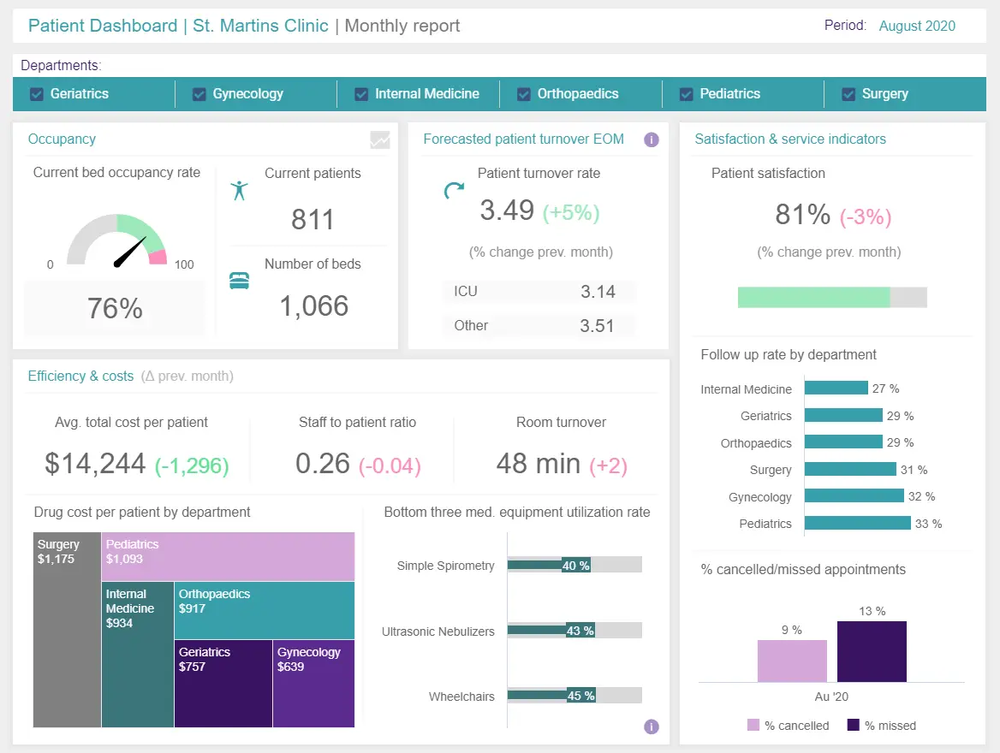

医疗保健是世界上最重要的行业之一。由于某些护理部门的需求不断增加，在提高整体生产力的同时减少不必要的支出至关重要。卫生机构需要全面实现最高效率——在某些情况下，这实际上是一个生死攸关的问题。

尽管有这个不祥的信息，但我们生活在一个数字时代。快速的技术发展意味着现在可以使用可访问且直观的数据驱动工具来发挥我们的优势。

对于希望提高运营效率的医院、临终关怀、家庭护理运营商和姑息治疗专业人员来说，制作和处理医疗保健报告就是答案。

我们深入研究了[大数据对医疗保健的影响](https://www.datafocus.ai/infos/big-data-examples-in-healthcare)。现在，我们将考虑医疗保健报告的重要性。

医疗保健报告可以帮助减少错误，增强重要数据的获取，减少不必要的支出，并以指数方式改进流程。

与当今许多最重要的行业一样，数字数据、指标和 KPI（关键绩效指标）是光明繁荣未来的一部分，而全面的报告有能力在这些关键领域发挥作用。

事不宜迟，让我们详细了解一下报告在医疗保健中的作用。

您的机会：[想免费测试医疗保健报告软件吗？](https://www.datafocus.ai/console/)探索我们的 14 天免费试用版并受益于出色的医疗保健报告！

## 什么是医疗保健报告？

医疗保健报告是一种数据驱动的方法，用于对医疗机构内特定流程或功能的性能进行基准测试，其主要目的是提高效率、减少错误和优化指标。

通过利用交互式数字仪表板，可以利用数据将指标转换为可操作的见解，以发现弱点、确定优势并在事件发生之前预测事件。这场视觉信息的完美风暴最终使机构更安全、更高效、更智能。

总之，医疗保健分析对于在这个广泛而宝贵的行业中运营的任何组织的持续成功至关重要。

将信息带回家：通过利用高级[医疗保健 KPI](https://www.datafocus.ai/infos/kpi-examples-and-templates-healthcare)、见解和[在线报告工具](https://www.datafocus.ai/infos/online-reporting)的组合，不仅可以获得有利于您的组织的准确事实，而且这种级别的数据还可以发现新的见解，从而消除效率低下并实现更好的健康结果。

作为医疗保健行业商业智能的一个分支，报告从该行业内的以下五个主要领域收集：

- 洞察理赔和运营成本
- 与制药和研发相关的指标
- 从持续护理、电子医疗记录 （EHR） 和试验中收集的临床数据
- 关于患者行为的重要统计数据
- 预测性见解和数据，用于创建预防策略或计划，以在不断变化的环境中改善护理和处方流程。

根据世界卫生组织的数据，由于与护理相关的行政错误，一个人受到伤害的几率为 300 分之一。相比之下，在飞机事故中受到伤害的几率是百万分之一。仅这一发现就直接回答了“为什么使用报告在医疗保健中很重要？没有它，医疗机构不太可能在可持续的基础上将这些数字降低到可接受的水平。

## 医疗保健报告的好处

通过跟踪关键医疗保健数据报告见解并设置正确的关键绩效指标，您的组织将受益匪浅。以下是[在医疗保健中使用商业智能](https://www.datafocus.ai/infos/business-intelligence-in-healthcare)的一些值得注意的示例和好处：

### 1\. 改善管理和决策

第一个好处，也可以说是最重要的好处之一，是改进设施管理和决策过程。凭借来自患者相关领域以及运营和财务领域的强大见解，医院管理人员可以做出明智的决策，以确保更好的临床表现和相应的更好的患者结果。

借助现代报告和正确的[BI 工具](https://www.datafocus.ai/infos/best-bi-tools-software-review-list)，管理人员可以降低成本，同时仍然确保高水平的服务，预测对服务和供应的需求，并在出现任何不可预见的情况时做好准备。结果是全面提高了效率。

### 2\. 预防性管理

最引人注目的元素之一是能够利用历史和当前数据的力量，在潜在致命的医疗问题发生之前发现它们。护理部门预测分析的这一分支对于提高护理质量和降低死亡率至关重要。

为了强调医疗保健报告的预防目的，60%的医疗保健领导者确认他们的组织最近采用了预测分析，未来几年还会有更多。这证明了预测分析在该领域的重要作用。

### 3\. 疾病监测

详细阐述我们之前的观点，在与健康相关的报告中发现的预测分析和见解也有助于对潜在的大规模疾病暴发进行监测，同样通过使用过去和现在的指标或见解的混合来确保采取正确的行动方案或预防措施来控制或控制情况。

### 4\. 减少不必要的成本

如前所述，医疗保健报告还可以使运营更加经济高效。通过收集和分析与组织在从餐饮到患者用药的所有主要领域的日常支出相关的[运营指标](https://www.datafocus.ai/infos/operational-metrics-and-kpi-examples)，数据分析师可以帮助医疗机构简化其预算流程，并根据安全、道德和信任进行更改或替换。

### 5\. 诊断和治疗技术

早些时候，我们谈到严重缺乏可访问或及时的数据，以及令人震惊的行政错误率。[医院分析](https://www.datafocus.ai/infos/hospital-analytics-data-guide)使组织能够合并临床、财务和运营数据，这些数据决定了其各种流程的效率、患者的状态和项目的生产力。通过获得这些见解，机构可以衡量哪些流程没有产生预期的结果，显着改善健康计划，并最终减少再入院人数。

例如，健康专家Kaiser Permanente利用医疗保健报告来评估，调查和分析潜在自杀企图风险最大的患者，发现前1%被标记的人自杀的可能性要高出200倍。这些信息被证明在提供量身定制的治疗同时采取所有重要措施来降低自杀率方面非常宝贵。

Kaiser Permanente的高级研究员Gregory E. Simon，医学博士，公共卫生硕士说：

“我们证明，我们可以将电子健康记录数据与其他工具结合使用，以准确识别自杀未遂或自杀死亡的高风险人群。

### 6\. 患者健康

医疗保健报告数据可以帮助医院提供针对个体患者的信息。通过这样做，机构可以根据个人的医疗数据和生物识别生命体征，就如何保持健康的生活方式提供量身定制的建议。这不仅是提供卓越善后护理的无价之宝，而且在帮助降低再入院率方面也是一个巨大的飞跃。

动态、实时数据还可以在有人受到您的照顾并面临潜在有害或致命事件的风险时提供警报。虽然这属于预测分析的职权范围，但这里值得一提的是，因为始终如一地管理一个人的健康对他们的健康至关重要。一旦他们离开您的机构，您就可以利用这些丰富的数据驱动的洞察力来提供一定程度的善后护理，提供最佳的个人、身体和心理健康。

### 7\. 从业者表现

报告可以公正地阐明您的从业者和员工的表现——这是管理报告如何帮助改善医院运营的关键点。

通过医疗保健行业报告，可以在交付时准确评估员工的绩效、效率和有效性。通过可持续的绩效评估，以及报告与患者健康和满意度相关的指标，您可以利用[绩效仪表板](https://www.datafocus.ai/infos/performance-dashboard-examples)和数据分析来提供有关从业者的持续反馈，并在必要时提供培训和支持。

最终，这将提高满意度，减少不必要的错误，甚至可以挽救生命。

### 8\. 人员配置策略

扩展我们之前的观点，除了以透明度评估从业者的表现外，[在线数据分析](https://www.datafocus.ai/infos/data-analysis-tools)还可以帮助识别任何内部瓶颈或效率低下，这些瓶颈或效率低下对机构来说代价高昂，同时阻碍了患者护理。

一支有价值且组织良好的员工队伍很可能在达到甚至超过其目标的同时始终表现良好。

通过设置明确的 KPI 基准和监控趋势，您将能够看到您可能需要重新分配或重组部门的地方，并优化完整的[人力资源分析](https://www.datafocus.ai/infos/workforce-people-hr-analytics)策略。反过来，这将提高您机构的成功率。

### 9\. 提高沟通和运营效率

最后但并非最不重要的一点是，另一个巨大好处是增强了沟通和运营效率。与任何其他组织相比，护理机构雇用了许多涵盖不同职能的人员。从就诊、住院医师、实习生、护士、物理治疗师到快速响应团队等等，他们都需要保持联系，以确保实现最终目标：出色的患者护理。

现代医疗保健报告可以帮助每个人就每个相关领域的绩效达成共识。例如，如果一个案例需要多个专家的参与，他们都可以从一个位置访问数据，并在几秒钟内获得所需的信息。这不仅可以改善内部沟通，还可以及时确保运营效率。

您的机会：[想免费测试医疗保健报告软件吗？](https://www.datafocus.ai/console/)探索我们的 14 天免费试用版并受益于出色的医疗保健报告！

## 医疗保健领域的报告类型

就像任何其他行业一样，卫生设施涉及多个部门和领域。因此，需要为每个区域生成各种报告类型。在这里，我们列出了一些常见的类型。

- 护理床边班次：医院随时都有人跑来跑去。对于需要密切照顾患者并了解其治疗的所有新进展的护士来说尤其如此。为此，他们使用护理报告。这些工具可帮助护士与患者在前几次轮班期间获得的任何新进展或治疗方法保持联系。这里提供的数据包括医疗背景、现状、治疗和通常闭门进行的护理计划。像这样，即将到来的护士可以保持联系，以确保出色的护理。
- 医疗报告：在我们的医院护理报告类型中，我们有一个详细涵盖一个人病史的报告。它包括有关测试结果，图像，治疗，用药史，住院，过敏，家族史等的信息。当一个人来咨询时，它们被证明非常有用，因为它可以让医生全面了解患者的健康状况。事实上，拥有某人的健康史可以帮助专业人士通过发现以前的指标来预防某些疾病。
- 医院管理：医疗保健中最重要的报告类型之一可能是管理报告。该分析工具允许管理人员跟踪与设施绩效相关的每个相关方面。在这里，您可以找到有关财务、成本、时间表、患者流量以及任何其他相关数据的信息，这些数据将使设施有效运行。在现代技术的帮助下，医院管理人员可以提取可操作的见解来提高运营效率。
- 公共卫生：顾名思义，此类型涵盖与公共服务相关的数据。它交流与公共卫生实践和方法相关的研究、评论和评论。像这样，决策者可以评估其国家或城市的现状，制定新政策，并评估当前的公共护理策略。可以从这些陈述中提取的常见信息包括健康差异、烟草使用、疾病监测、传染病和慢性病、职业病等。
- 医疗设备：这种类型是确保高度护理以及符合FDA法规的基础。该组织收到数十万份疑似与设备相关的死亡、严重伤害和故障的医疗器械声明。因此，医院需要密切监控所有设备的性能，以确保出色的护理和合规性。这样，任何问题都可以在问题发生之前发现出来。

## 医疗保健报告示例和模板

在我们旅程的这个阶段，我们已经回答了这个问题，“医疗保健报告的重要性是什么？然而，虽然您知道分析在这个行业中的好处，但在实践层面上理解价值的最佳方法是探索现实世界的例子。

也就是说，当涉及到产生结果的报告时，有许多指标或 KPI 可以帮助提高您机构的整体效率。在这里，我们将探讨主要的价值领域：

### 1\. 医院 KPI 仪表板

\*\*点击放大\*\*

虽然现代卫生提供者和机构可以获得大量数据，但来自多个不同部门的数据如此之多，但具体的关键指标可能会变得支离破碎，导致许多重要的见解仍未使用或未开发。

为了提高透明度、效率并确保数据的每个元素都发挥其最大潜力，集中式医院[KPI 仪表板](https://www.datafocus.ai/infos/best-kpi-dashboard-examples)是您寻求成功的最大盟友。

主要关键绩效指标：

- 治疗成本：一种基于经济管理的 KPI，可帮助提供者计算平均患者成本的金额。
- 急诊室等待时间：急诊室等待时间 KPI 衡量一个人到达急诊室到他们看医生的时间长度。随着时间的推移，需要密切监控此指标，以确定趋势并消除等待时间的任何奇怪峰值。
- 患者等待时间：一个人等待治疗或咨询的时间长度是患者满意度的关键因素。此 KPI 量化并显示某人从注册到治疗的平均等待时间。通过减少等待时间，您可以大大提高满意度。

### 2\. 患者满意度仪表板

\*\*点击放大\*\*

作为您设施的潜在展示，满意度[BI仪表板](https://www.datafocus.ai/infos/bi-dashboard-best-practices)有助于转化您在欢迎和对待个人方面所做的努力，以及您提供服务的安全程度。

这种性质的见解可以帮助显着提高您实践的安全性以及您与进出您门的人的沟通水平。患者满意度至关重要，因此值得衡量。

主要关键绩效指标：

- 患者满意度：满意度 KPI 是任何组织的首要任务，可根据等待时间、营养、护理和流程更深入地了解整体满意度水平。反馈和有价值的基于满意度的指标的组合将帮助您对组织进行所有重要更改，帮助您始终如一地提高满意度水平。
- 患者安全：作为仪表板的关键组成部分，此特定 KPI 可让您更深入地了解您的机构为患者提供优质护理的能力，使他们免受新感染、术后并发症或任何形式的败血症的影响。
- 患者等待时间：这将提供与医院 KPI 仪表板中包含的相同 KPI 指标相同的数据和见解。

### 3\. 医院绩效仪表板

\*\*点击放大\*\*

通过利用明确目标和预定义结果的力量，医院绩效仪表板提供的可视化可以显着增强您机构的所有关键领域。

从患者护理到员工管理，这个集中式数据源提供您所需的信息，以确保您的机构取得可持续的成功。

主要关键绩效指标：

- 平均停留时间：对被贵机构录取的个人平均花费的时间的总体衡量标准。
- 再入院率：再入院率 KPI 可让您深入了解在获释后不久返回您所在机构的人数。此 KPI 特别有效，因为它提供了已提供的护理水平以及如何增强护理水平的衡量标准。
- 按付款人划分的成本：一种评估各种生物体之间成本分布的见解，按付款人划分的成本评估涵盖患者护理的提供者。通过了解此指标，您可以获得有关整体满意度和成本效率的宝贵见解。

### 4\. 患者仪表板

\*\*点击放大\*\*

最后但并非最不重要的一点是，在我们的真实世界医疗保健分析示例的概述中，我们得出了我们的基本患者报告。

这个视觉上凝聚力的数据大熔炉提供了一个洞察患者物流关键领域的窗口，包括床位占用率、成本和随访率。对于老年病学、妇科、内科、儿科等繁忙的科室来说，这是一个宝贵的工具。

有了这个尖端的仪表板，没有任何信息的东西不遗余力。因此，这是快速、准确决策和长期战略规划的重要工具。它可以提高效率，甚至挽救生命。

这份患者报告旨在帮助您全面提供超高标准的护理，同时应对不断变化的情况 - 在医疗保健方面，这是无价的。让我们更深入地挖掘。

主要关键绩效指标：

为了正确看待这个基本仪表板的强大功能，让我们看一下它的主要 KPI：

- 床位占用率：这种基于趋势的 KPI 可以清楚地指示特定时间范围内的床位可用性。通过定期监控，您将能够平衡各部门的可用性，同时减轻机构的压力。
- 设备利用率：此基本可视化将向您展示您最常使用的工具，以帮助您更深入地了解内部供需情况。
- 患者每次入住的药物成本：这一最引人注目的 KPI 对于提高财务效率和长期增长非常宝贵。这是部门资金分配的绝佳工具。

## 如何创建高效的医疗保健报告

现在我们已经介绍了主要好处和有用的示例列表。是时候开始考虑生成自己的医疗保健报告格式了。在这里，我们列出了 5 个重要步骤，这些步骤将使您走上执行成功分析的正确轨道。

### 1\. 定义您工厂的需求

建立任何类型的健康报告的第一步是考虑您的目标和需求。一方面，您的目标可能与提高某些领域的绩效有关，例如 ER 响应时间、再入院率、降低成本或其他方面。另一方面，您的需求可能包括更好的轮班、运营和财务监控系统。这些目标和需求中的每一个在不同的设施中都会有所不同，仔细定义它们是关键一步，因为它将映射您的流程。

### 2\. 选择相关的关键绩效指标和指标

一旦您定义了主要需求和目标，就该选择可以帮助您衡量努力的 KPI 和指标了。可以从患者体验、运营流程、财务、综合管理等方面跟踪各种各样的指标。但是，并非所有这些都可以帮助您跟踪目标，并且使用过多的 KPI 最终可能会误导您的分析。重要的是，您可以将其集中在您的目标和需求上，并且可以借助现代[KPI 工具](https://www.datafocus.ai/infos/kpi-reporting)做到这一点。

### 3\. 确保您合规

患者与提供护理的组织之间的信任至关重要。在寻求医疗帮助时，个人会提供有关他们生活的敏感信息，他们可能希望将其保密。卫生行业中常见的隐私问题包括组织在未经同意的情况下与家庭成员、制药公司或其他提供商共享数据。如果有人确定其信息将保密，他或她很可能会寻求疾病的治疗。

因此，隐私和合规性应该是一个需要考虑的因素。有各种法规管理患者数据的隐私，组织需要遵守这些法规以避免处罚和罚款。其中之一是健康保险流通与责任法案（HIPAA）。HIPAA旨在取得平衡，允许使用重要数据，同时保护寻求护理的个人的权利。其主要目标是“确保个人的健康信息得到适当保护，同时允许提供和促进高质量医疗保健以及保护公众健康和福祉所需的健康信息流动”。

### 4\. 选择高效的报告格式

在医疗保健领域，也许比任何其他行业都更需要高效的报告流程，因为任何错误都可能影响护理过程。要考虑的一点是查看和共享报表的格式。在医院的日常工作环境中，到处都有人跑来跑去，能够随时随地访问关键数据是一项宝贵的优势。

我们已经向您展示了实时显示数据的交互式仪表板示例列表。这些示例是使用现代[仪表板创建器](https://www.datafocus.ai/infos/dashboard-creator)创建的，允许您从任何类型的智能设备访问报表。例如，护士在晨间查房时可能需要从 iPad 访问相关的患者数据。医生在诊所外时可能需要紧急访问他或她的手机中的数据。考虑到这一点，必须提供灵活的报告格式。

### 5\. 投资医疗保健分析软件

医疗保健和数据分析比以往任何时候都更加紧密相连。事实上，医疗保健分析市场预计将从 2021 年的估计 211 亿美元到 2026 年达到751 亿美元。这是因为分析工具已帮助卫生专业人员和组织识别趋势，预测未来结果，并提取见解，以提高其不仅在临床层面，而且在运营和财务层面的表现。

考虑到所有这些，选择合适的软件是该过程的关键步骤。市场上有许多[BI报告工具](https://www.datafocus.ai/infos/bi-reporting)，它们提供各种功能，将您的数据分析提升到一个新的水平。选择投资哪种工具时，重要的提示是牢记您设施的需求。例如，提供多种报告格式、共享选项、易用性、预测分析等先进技术、数据可视化选项等。

您的机会：[想免费测试医疗保健报告软件吗？](https://www.datafocus.ai/console/)探索我们的 14 天免费试用版并受益于出色的医疗保健报告！

## 结论和关键要点

当今数字世界中可用的大量健康数据意味着像您这样的整体机构不再需要在黑暗中射击或做出可能昂贵的估计来改善护理并在最重要的时候做出重要决策。

现在，您可以就组织的运行方式做出明智的选择，同时以透明、自信和勤奋的方式实时响应问题或紧急情况。信息时代已经到来，没有回头路可走。

医疗保健是世界上最宝贵的服务之一 - 您根本无法为健康和福祉定价。通过从正确的位置使用正确的指标并了解如何将洞察力转化为行动，您将改善员工和患者的生活，同时获得应对不断变化的能力。您将使您的机构变得更好，有所作为，并继续提供您可以引以为豪的服务。

要了解有关我们如何帮助您的机构蓬勃发展的更多信息，请浏览我们专门的[医疗保健分析](https://www.datafocus.ai/infos/healthcare-analytics)页面或与我们联系。您也可以尝试我们的[14 天免费试用](https://www.datafocus.ai/console/)！

我们期待帮助您迈出迈向数字启蒙的第一步。
