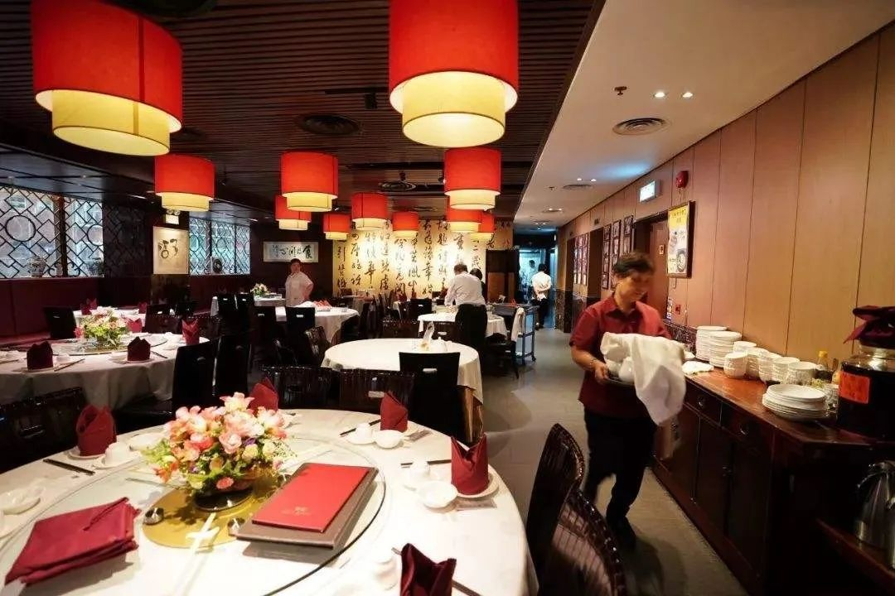
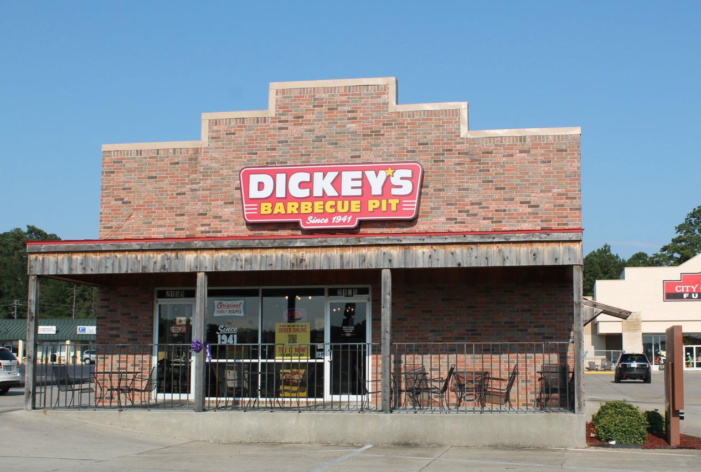

**如何通过数据分析让餐厅业务变得更有价值？**

餐饮业是全球最具竞争力的行业之一。毕竟饮食是人类的刚性需求，没有谁的生活会离得开餐饮。尽管当今外卖横行的时代提供了用户很大便利的服务，让用户对于食物可以触手可得。但外出就餐依然是重要的餐饮休闲方式，因此全国各地的餐馆依然有着巨大的需求。

疫情期间对于餐饮实体店的冲击较大，随着复工复产潮的红利结束，增长动力疲软缓慢速度恢复。这意味着在餐饮行业中茁壮成长甚至只是生存下去，又或是在竞争中脱颖而出至关重要。

投资于数据驱动的解决方案、可视化工具和利用餐厅数据分析的力量将帮助您在这个行业中获得成功。

通过使用数据分析工具管理信息，您可以增强竞争优势，提升盈利能力，提高利润率，并扩大客户群。数据提供了对餐厅日常功能进行客观、全面、准确的展示分析功能。

在这里，我们将研究餐厅数据分析、餐厅预测分析、餐厅分析软件以及大数据帮您提升业务前景的具体方法。

**什么是餐厅分析？**

餐厅分析的核心是分析与餐厅业务相关的所有数据，并且在BI分析工具的帮助下转换为可操作的见解，最终显著提高效率。

在当今超互联的数字环境中，可以收集、组织和呈现每个数据（从等待时间到员工绩效到菜单优化），帮助您的餐厅不断优化和改进。

**为什么餐厅分析很重要？**

餐厅的业务分析是了解业务内部运作不可或缺的一部分。了解如何改进它以培养持续盈利的水平，可以使您在竞争中脱颖而出。

通过使用相关的关键数据指标（KPI）和数据可视化大屏，您能够以清晰、简洁和易于消化的方式跟踪、监控和衡量这些数据，并且从中提取出您最有价值的业务见解。这将实现一套完整、可持续的KPI管理流程，最终提高生产率以及利润。

餐厅数据分析将帮助您了解问题的核心，了解业务的全部真相。接下来让我们来看看餐馆的商业分析将如何帮助您作出积极的改变，获得真正想要的结果。

总之，基于餐厅业务的数据分析对您的餐厅至关重要，因为它们能让你：

·提炼数据并忽略与目标无关的任何指标

·将最有价值的数据转换为可操作的见解

·通过交互式可视化大屏监控和跟踪你的目标情况

·发现新趋势，从而让你在竞争中脱颖而出

·使您的业务比您想象的更高效、更智能、更有价值

**预测分析在餐厅中的作用**

我们已经了解了什么是餐厅分析，以及餐厅的数据分析如何帮助您更深入地了解您的业务。但是，在我们深入探讨餐厅数据分析如何优化您的业务之前，把握预测数据在服务行业的总体作用非常重要。

虽然预测性分析并不是预言必然成功的灵丹妙药，但这一前瞻性数据和强大的洞察力可以帮助您的餐厅根据趋势做出宝贵的改变，这些趋势表明您业务中的关键因素可能会如何发展。

以下是餐厅预测分析的主要作用：

**1\. 预测趋势**

餐厅预测分析使用历史数据和实时数据来预测未来的发展优劣势以及趋势。通过可视化大屏的帮助下访问这些信息，您将能够制定策略并创建有助于提升业务未来成功的举措。

**2\. 全局视角**

通过预测分析，您将能够深入了解过去和现在的见解和可视化，再向未来推演，从而创建一个数据叙述的故事。这样，您将享受从0到1的创业全景，获得您的餐厅所需的全局视角，而这反过来又会为您提供制定创新业务提升战略所需的灵感。

**3\. 运营效率**

从减少食物浪费到菜单优化再到未来员工绩效水平，餐厅预测分析可帮助您开展日常和长期业务运营，快速提升运营效率。

**“我不认为数据会比我更了解”**

也许你可能会说，"嗯，数据的确都很好，但我在餐饮业工作了很长时间。我相信我的直觉和经验——我不认为数据会比我更了解"。

假设你已经在餐饮业工作了几十年。也许你已经从洗碗岗位一直干到店长或经理的位置。又或者，你的家人有一个餐厅，并且年轻的你参与其中。无论哪种方式，你都会有一种已经熟得不能再熟的感觉，餐厅内部如何摆设，如何推出特价饮品，如何举办促销活动，推出的菜单甚至也已到了3.0版。

你觉得你做了这些实验之后，您就会知道您的客户喜欢什么、不喜欢什么，以及他们对未来可能感兴趣的内容。没有人反驳这一点。数据无法为您运行餐厅，数据也无法取代用户体验。数据也无法取代您的创造力、风格和对业务的热情。

数据并不意味着要"替换"任何东西。相反，餐厅分析是对您已经有能力的商业智能的补充。说实话，你的一些直觉可能并不完美。假设你觉得你知道：

- 您的客户最喜欢哪种类型的菜肴
- 哪些平台能带来最大的订单
- 哪些新促销活动可能带来高销量

你知道这些事情基于过去的经验，可问题是我们的现代世界正在加速变化。你的经验和直觉很快就会变得不准确。

数据可以作为一种方式来"检查自己"，并弄清真正让你的业务警报鸣笛的原因。正如数据科学大师Peter Chen所说，"分析不能想出想法，但它可以帮助你改进好的，避免尝试坏的，并发现可以修复的缺陷"。

## 餐饮利润案例研究

让我们在案例研究中说明数据分析中的一些原则。Dickey BBQ是一家总部位于美国的家庭经营的连锁餐厅，拥有超过 500 家分店。一天，CEO罗兰·迪基向他的妻子（CIO）劳拉提出了一个想法：“烧烤和大数据——让我们来做这个工作吧！这对夫妇想要的不仅仅是大数据，还有实时的、可操作的见解。”

在建立餐厅分析系统后，他们开始收集"无价"信息，例如：

- **人口统计数据：**多亏了分析，Dickey现在知道，他们的平均用户画像是一个43岁驾驶SUV上班的男人。他们甚至知道，这个客户的平均通勤时间是30分钟。因此，Dickey现在对于福特车主，他们住在离迪基在广告中的位置15到30分钟的地方。
- **行为数据：**Dickey了解到，有孩子的女人经常在星期三下午晚些时候去同一个地方，吃一顿丰盛的午餐。有了这些数据，Dickey's现在推出"工艺星期三"活动，作为对母亲和孩子的吸引力。
- **共享客户利益：Dickey**发现他们的顾客喜欢足球和狗。因此，他们开始在足球网站和狗爱好者网站，以及T.V.频道，比如动物星球投放广告。

最后，由于餐厅数据分析平台的实时性，Dickey 经理和特许经营商可以执行与日常销售趋势相关的灵活战略行动。将您的知识与各种销售KPI相结合，您可以优化您的运营。

## 回答关键业务问题

基于餐厅的数据分析一个基本好处是，它可以帮助您发现关键的业务问题。通过这样做，您将使您的餐厅更具凝聚力，更具竞争力，当然更有利可图。

作为一家餐馆的老板，你无疑会有很多棘手的问题，你每天都想找到可行的答案。正如我们所说，餐厅分析将帮助您处理这个过程。

通过使用可视化大屏，您可以找到以下基于餐厅的商业问题的切实答案：

- **店内菜单中的哪些菜品最受欢迎？**
- **每周业绩最惨淡的时期是什么时候？**
- **哪个服务器或服务员的表现最好并且始终如一？**
- **我的员工在利润和服务方面做得如何？**
- **随着时间的推移，我的收入是否稳步增长？**

让我们看看这在实践中是如何运作的。

## 餐厅数据分析可以帮助您业务的 6 种方法

是时候采用数据驱动的解决方案帮助您在现实世界中回答问题并提高许多关键领域的效率了。

这里有六种关键方法，基于餐厅的分析可以帮助您的业务。

### 1） 增加饮料的订单量

如果您正在设计新的饮料菜单，您可以查看您的数据分析大屏，看看人们倾向于在菜单上订购哪些饮料。

然后，您可以通过建议这些已经很受欢迎的酒或饮料搭配菜单上的膳食，并通过您的服务员增加这些销售。

### 2）获得更多重复业务的回报

您可以使用数据分析来识别菜单上的哪些热度高，哪些热度低。这与客户忠诚度计划配合使用效果最佳，以便您可以随时间跟踪单个客户的模式。

例如，假设您记录了几个月的购买数据。您可以将数据分为 4 个类别：

**1\. 爆款： 这些菜品购买了很多， 人们倾向于再次购买它们**

如果有可能的话，考虑做更多的广告宣传这些菜肴。此外，如果您希望在菜单中添加新菜品，您的"爆款"应该是您寻找灵感的第一个地方。如果你所有的"爆款"都是牛排菜，那么新的素食菜就可能做得不太好。

**2\. 一击必中：**这些物品订购很多， 但人们不倾向于重新订购它们。

您需要进一步调查这些。人们不是因为菜不好而重新订购吗？还是他们只是想尝试一个 "不同的" 菜， 看看它会是什么样子？如果是第一个原因，你可以想办法做的更好吃或者直接放弃。然而，如果人们只是想尝试"不同的菜"，这也是一个有用的信息。显然，这个项目是诱人的！检查项目的名称和菜单描述，了解有关您可以应用于菜单其余部分的线索。

**3\. 隐藏的爆款：**人们不会经常点那么多菜， 但一旦有人尝试过一次， 他们就迷上了。

这是分析的一个很好的例子，因为你可以利用促销和折扣，让人们尝试这些菜肴。一旦他们尝试，你的工作就完成了。这一类也可能受益于更好的菜单名称和描述，从而使它们更有吸引力。

所以，给你的工作人员一个机会，利用他们的知识将菜品变成真正的爆款。

**4\. 冷板凳：**这些菜不经常点菜。订购时，人们也不再订购。

你要么返工这些菜肴，要么把它们从菜单上剔除，因为它们给你的餐馆带来坏名声。

作为最后说明，您应该培训您的员工，以便在客户提出推荐时，从“爆款”和“隐藏的爆款”类别中提出建议。这些菜肴最有可能给人留下好印象（并得到重复的业务回报）。

### 3） 客观、不带偏见的描述

比方说，在招聘和解雇员工方面，您需要依据经理的意见。但您的经理可能有自己的偏见，可能会带着有色眼镜看待工作人员的表现。

而如果您有与员工平均订单规模相关的餐厅数据分析，您就有更清楚、客观的依据作出决策。

### 4） 未雨绸缪，做好规划

一旦你已经使用你的餐厅分析一段时间，你将能够知道这样的事情：

- 你一天中最忙的时候是什么
- 你最忙的日子是什么
- 假期生意是怎样的

这是数据可视化工具带给你的帮助，以安排您的各种指标和措施到一目了然的可视化大屏。由于这些见解，您可以更好地规划您的人员配置需求，并确保您没有因任何给定班次而过度或人手不足。为了充分利用这些数据，您需要将其可视化以便更好地理解它。

### 5） 您可以改善您的财务流

任何成功的餐厅最关键的组成部分之一是财务效率。

除了通过餐厅预测分析软件更好地管理库存外，您还可以更深入地了解您可以在哪里调整利润率以增加收入，同时保持增量的稳定。通过使用财务部门可视化大屏，您可以在出现业务异常时收到通知。

此外，由整张大屏提供的数据将为您提供对交易、优惠和竞争的全面了解。如果某些优惠比其他优惠效果更好，您可能需要专注于创建促销策略，以覆盖更广泛的目标受众。或者，如果您发现某个交易花费的钱比最初预期的要多，您将能够去除它或进行必要的更改，以确保其盈利。

增加现金流和财务效率得到保证。

### 6） 您可以减少食物浪费

作为一家餐馆，食物就是金钱，所以你最不想做的事情就是浪费它（大量浪费食物也是不道德的）。通过使用正确的可视化大屏和 KPI，您可以增加餐厅运营中的食品管理元素。

餐厅的分析软件可以帮助您了解哪些产品可能需要最多或最少的数量，根据他们的保质期相对于需求在一天，一周，每月或季节的特定时间。

此外，通过分析软件为餐厅提供的见解将为您提供开发食品准备时间表所需的信息，以确保您减少浪费、最大化利润并改善餐厅的基础设施。

"作为一名餐馆老板，我的工作是从根本上控制混乱和戏剧。餐馆生意总是会一片混乱。

## 总结

餐厅数据分析软件对于任何现代、雄心勃勃和有远见的餐厅主来说都是一个无价的工具。

餐厅数据分析将为您提供额外的竞争优势，除了帮助您更详细地了解您的客户，您还能够发现您甚至从未知道存在的关于您的业务的见解。而正是通过这些发现，最大化财富增长才得以实现。
