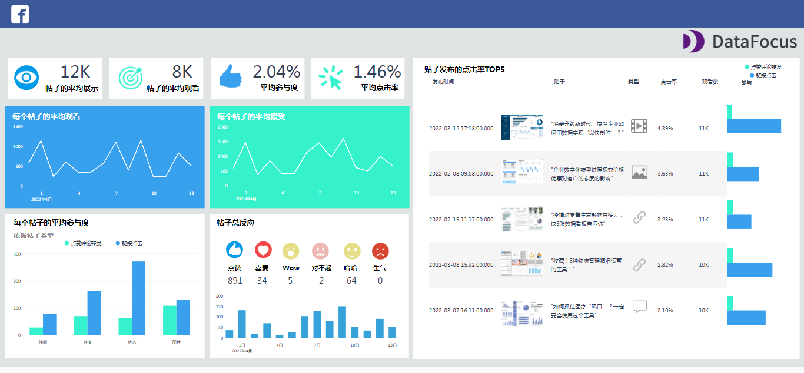

Facebook作为世界上最大的社交媒体网络之一，相对于其他社交媒体平台，最主要的一点就是Facebook目前拥有的用户群体非常庞大。根据 Statista 数据统计，截止到2020年7月份，Facebook用户群体数量占全球26亿+的用户基数，仅次于Google。

用户量级如此之高，对于刚刚出海的用户来说，免费Facebook运营会是一个不错的选择。

F公司是某小有名气的一个跨境电商公司，截至目前，其Facebook主页有4W+的粉丝，品牌建设和网站引流的方式也采用了公司主页帖文、广告投放的形式来促进曝光，希望能有吸引更多用户关注和参与。但F公司感觉最近公司的Facebook运营遇到了瓶颈期，粉丝数增长缓慢不说，用户参与度不高且用户粘性较低，广告投放效果也不佳，公司紧急调整了运营策略，但不知效果如何，希望能通过数据分析和大屏整理，了解策略修改前后的情况变化，同时监控数据变动，实时修正运营策略。

本案例中用到的数据分析工具——**DataFocus**，通过智能搜索式的分析，实时监控、分析有关您的业务概况及绩效的重要 KPI，帮助Facebook的注册用户连接自身的Facebook页面、帖子和广告相关的数据，通过对整体运营逻辑的梳理，制定并完善属于您的Facebook数字化策略。

接下来是Facebook大屏的3个示例：

## **Facebook页面大屏**

**Facebook页面大屏主要是对页面整体粘性的分析。**大屏左侧第一张选项卡是“粉丝数”，用于查看固定时间段内获得或失去的粉丝数量；第二张选项卡的含义就是我们日常生活中经常提到的PV（浏览次数）以及UV（浏览人数）；第三、四张选项卡代表了页面操作和页面喜爱程度。

不仅限于上述的指标，我们继续挖掘，还可以分析网页的受众增长，以及粉丝的国家/地区分布；筛选页面浏览量来源于哪个特定渠道；甚至可以按照年月日或自定义时间段细分原始数据。

例如，大屏右侧专门定制显示了点击进入网页的用户的基本信息数据，可以按照年龄、性别、语言或国家明确区分粉丝，可以通过简单的用户画像帮助定制个性化主页，以满足目标受众的特定需求。

最后，可以在页面右上角找到具体的年月筛选工具，在数据准备充足的情况下，可以筛选显的示时间范围，更加灵活机动，视觉效果更优，可以在内部会议上展示更完整的数据信息。

## **Facebook贴子大屏**

Facebook帖子大屏展示了用于分析帖子详细信息的主要指标，通过对Facebook渠道上的帖子具体细节的了解，可以有效的减少花在制定可执行见解上的时间，并提供一个具有成本效益的解决方案，以实现更好的整体社交媒体策略。

如上图所示，左上方展示的是4个帖子详细信息的主要指标，帖子平均展示、帖子平均观看、参与率和点击率，清楚地说明了Facebook中帖子的整体后期表现。

帖子平均展示定义的是帖子的平均展示次数；帖子平均观看的含义是帖子的唯一查看次数；参与率指的是Facebook上的用户进行的多种交互方式，例如点赞、分享、评论或者点击链接等；点击率（CTR）则是通过累积实际点击广告到达超链接网站的人数百分比来衡量在线广告的成功，点击率的计算方法是将点击广告的用户数除以投放广告的次数。

大屏右侧主体部分展示了按CTR指标排序的前5个帖子，还可以查看帖子的发布日期和时间以及发布的帖子类型。结合不用帖子类型所导致的用户参与程度，可以为用户未来的发布风格提出决策性的建议。举例，如果视频帖子的参与度越高，就可以在该类型的视频帖子中投入更多时间和资源，但同时一定要注意制作成本和分享的视频质量。

## **Facebook广告大屏**

成为Facebook的广告商必定不是一件容易的事，优化平台活动、提供报告、跟上算法和指标变化，既耗时又有很高的要求。但通过将所有准备好的数据借助DataFocus工具分析都一个地方，既可以减少时间，同时达到降低业务运营成本的目的。我们可以通过一个专用于广告的Facebook广告大屏来详细了解。

首先是熟悉的KPI指标。在Facebook广告大屏示例的顶部，可以看到总观看次数、接受人数、频率、平均CTR的指标。添加时间筛选可以分解这些指标，有序显示您的广告系列的发展方向，同时增加大屏的互动性。例如，如果是每周都对数据进行查看，可以更详细地监控绩效，无需耗费时间等待创建月度报告。

CPC和CPM是社媒网络常见的两种广告投放的付费方式。CPC代表每次点击费用，根据广告被点击的次数收费；CPM则代表每千次展示费用，即为广告在网站上发布一千次并被用户看到所需的费用。

因此将CTR（点击率）、CPC（每次点击费用）和广告展示位置的每次转化费用合并进行着重考虑，通过不同的广告位置展示的不同结果，可以帮助找出最适合您的主要业务的广告决策；CPM则是设置和优化广告系列时要考虑的另一个关键因素，它会因受众而异，应用的定位越详细，您将达到的每千次展示费用就越高。与点击率指标一起，它可以扩展到数周或自定义设置的时间范围，因此可以直观地比较结果，帮助更快制定对应的决策。

本次案例的更优解应该是结合时间筛选，通过对比不同时间段内的用户粘性、帖子发布信息、广告投放详情等，对此次F公司的运营策略调整做出评价。我们详细阐述的指标、KPI和相关参数，都可以在DataFocus系统内找到，同时帮助您完善整体Facebook战略。免费试用14天，快来注册属于您的DataFocus帐户并在几分钟内创建您自己的演示大屏！
