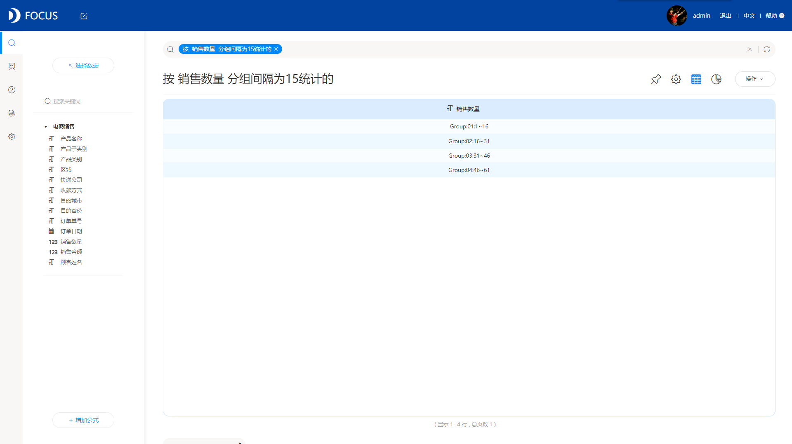

今天，我们主要来讲一讲分组统计的功能，在数据处理中我们常常需要对数据进行分组和相应的汇总计算，在进行统计分组时，有时候是单变量值分组，有时候则需要进行组距分组。例如，我们可能希望对销量进行划分，按不同的销量划分成不同的等级。大家在日常工作中都是如何进行分组统计的呢？是用excel吗？那在这里，我先分享一下我自己在遇到分组统计的时候，是怎么做的。

其实在我看来，分组统计很简单，我能这么说的原因，全依赖于我使用的数据分析工具DataFocus，它可以直接得出分组统计的结果，不管是单变量分组还是设定组距分组，不需要我多花力气设置很多或者配置很多，也不需要我写SQL语句或者代码，真的就像是“傻瓜式操作”，但是别小看它，虽然操作简单，功能却很强大。

我说再多，不如直接实例展示，下面就是我把销量划分成不同的等级。

默认分成5组

自行设定组距

是不是很简单，只需要一句简短的关键句式，DataFocus自动给你分组统计好，这种方式即简单又高效。

看完上面的实例，很多人可能会对这种实现方式充满疑惑。所以在这儿补充说明下，DataFocus是采用的搜索式分析，它是国内第一个采用这种中文自然语言搜索的数据分析工具，非常创新且好用，就如图中看到的一样，直接输入关键句式，系统即时的返回结果，就跟百度搜索一样，这种方式革新了传统的拖拽式。

这就是我分组统计的方法，DataFocus就是我的秘密武器。
