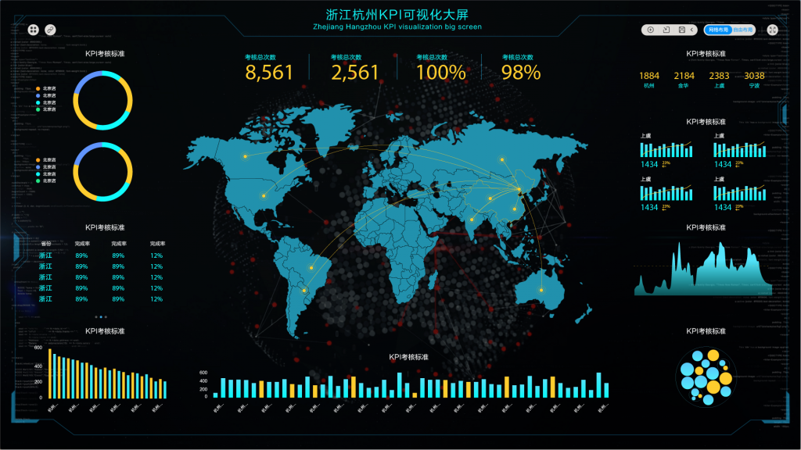

大数据催生出了一些与大数据处理相关的职业，通过对数据的挖掘分析来影响企业的商业决策，这群人在国外被叫做数据科学家。在国内，大数据的应用才刚刚萌芽，人才市场还不那么成熟，很难有一个全才来完成整个链条上的所有环节。更多公司会根据自己已有的资源和短板，招聘能和现有团队互补的人才。于是每家公司对大数据工作的要求不尽相同：有的强调数据库编程、有的突出应用数学和统计学知识、有的则要求有咨询公司或投行相关的经验、有些是希望能找到懂得产品和市场的应用型人才。正因为如此，很多公司会针对自己的业务类型和团队分工，给这群与大数据打交道的人一些新的头衔和定义：数据挖掘工程师、大数据专家、数据研究员、用户分析专家等。这些不同的职业岗位，可以大致分为两类，一类是技术类，一类是业务类。

而想要入门大数据这一领域，一般会有以下要求：

1.****数学及统计学相关的背景****

百度首席数据科学家沈志勇认为，缺乏理论背景的数据工作者，更容易进入一个技能上的危险区域（Danger Zone）—一堆数字，按照不同的数据模型和算法总能捯饬出一些结果来，但如果你不知道那代表什么，就并不是真正有意义的结果，并且那样的结果还容易误导你。“只有具备一定的理论知识，才能理解模型、复用模型甚至创新模型，来解决实际问题。”

2.****计算机编码能力****

实际开发能力和大规模的数据处理能力也被认为是作为大数据工程师的必备技能。“因为许多数据的价值来自于挖掘的过程，你必须亲自动手才能发现金子的价值。”郑立峰说。

举例来说，现在人们在社交网络上所产生的许多记录都是非结构化的数据，如何从这些毫无头绪的文字、语音、图像甚至视频中攫取有意义的信息就需要大数据工程师亲自挖掘。即使在某些团队中，大数据工程师的职责以商业分析为主，但也要熟悉计算机处理大数据的方式。

3.****对特定应用领域或行业的知识****

大数据不能脱离市场，因为大数据只有和特定领域的应用结合起来才能产生价值。所以，在某个或多个垂直行业的经历形成了你对该行业的认知，对于之后成为大数据工程师有很大帮助，因此这也是应聘这个岗位时较有说服力的加分项。你不能只懂数据。还要对某些行业有深入的了解。最好是契合你们公司的业务方向的。

如果是想要从事技术方向的话，上面很多高赞回答的学习路径都很详细了，如果是想要从事业务方向的大数据分析工作的话，对于技术背景的要求就没有那么高了。目前市场上BI产品已经跨入了智能BI的阶段，用户使用层面强调低代码（或零代码）开发、无缝对接、灵活部署，并且，还可以借助AI算法的能力构建基于未来的分析模型，比如销售预测、智能排课等。也推荐你一款BI产品，DataFocus，我认为是国内目前比较容易上手，对想要入门大数据分析的小白非常友好的产品。

1、独创搜索式智能分析。DataFocus是国内第一个采用搜索的方式进行数据分析的工具，使用方式如同谷歌搜索一样，只需要在输入框内输入想要知道的信息，系统实时地返回结果，并且智能地适配图表。

2.高效实用。DataFocus使用过程中无需任何代码，无IT知识的普通业务人员也能快速上手，图表类型丰富，制作简单，满足企业大部分需求。并且可以自定义可视化大屏，图表联动，图表钻取，数据定时更新，整合多源数据，清洗数据等等，操作简单，但是功能不简单。

DataFocus是有一个月免费试用期，并且有详细的用户手册和视频教程，对于数据分析小白来说从DataFocus入门真的很合适，毕竟在实践中才能更快地学习成长。

不同的职业发展目标，对应的学习路径不尽相同，主要是要根据你的具体情况去选择你的学习方式，然后在这个基础上针对你你具体岗位所需不断去弥补相关的知识和能力的空缺，学习是无止境的嘛。
