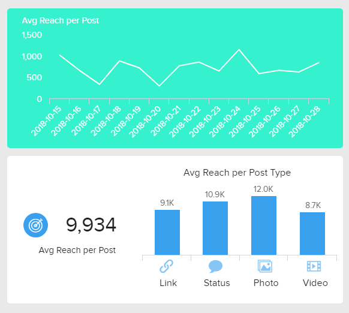
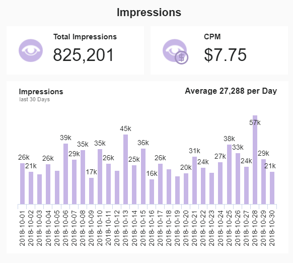
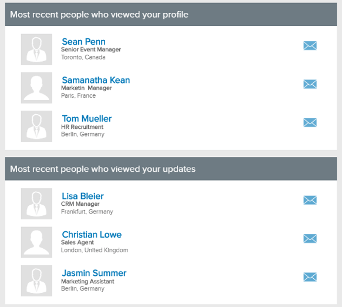
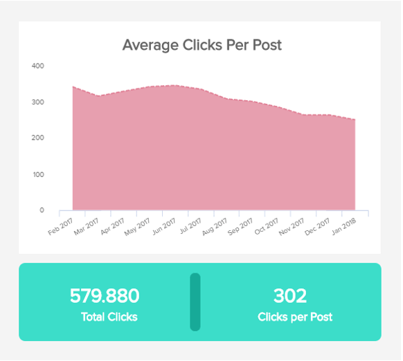
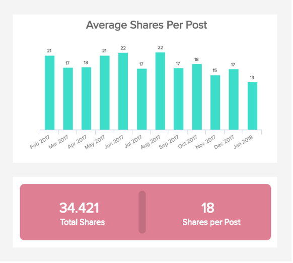
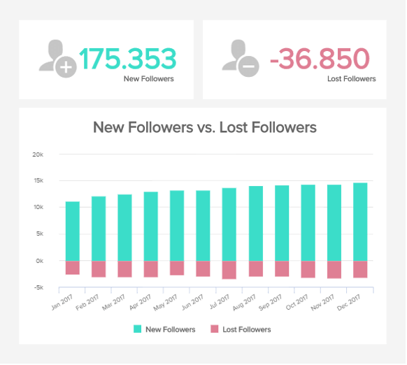
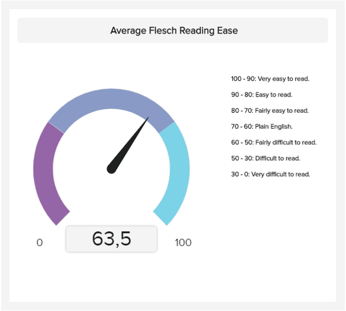

\[caption id="attachment\_43993" align="alignnone" width="600"\] 封面 banner\[/caption\]

在由数据驱动的高度连接的数字世界中，除了衡量商业增长和绩效的持续水平之外，现在正是企业收集有关其目标前景的有意义见解的最佳时机。

现代消费者或数字原生代渴望从他们希望投资的品牌中获得可观的价值——因此，为了获得消费者的忠诚度，企业必须在个人层面上与他们的客户进行接触和交谈。社交平台提供了一些最强大、最可持续的媒介来实现这一目标。

事实上，LinkedIn 迄今为止拥有超过 5.3 亿用户个人资料。根据皮尤研究中心进行的研究，75% 的男性互联网用户和 83% 的女性互联网用户积极使用 Facebook。而这只是社交媒体的冰山一角。

这里的重点是社交平台被广泛使用，并且是与目标受众进行个人、有意义和持久的人类对话的最强大的媒介之一。但是你如何从你的各种努力中榨取最大的价值呢？当然，使用社交媒体 KPI。

在这里，我们将研究社交媒体的 18 个基本 KPI，在[KPI 仪表板软件](https://www.datafocus.ai/infos/kpi-dashboard-software)的帮助下探索动态并展示社交指标在现代商业时代的重要性，最后，总结如何设置 KPI 的技巧并充分利用您的社交平台。

## 什么是社交媒体 KPI？

社交媒体 KPI 是衡量社交媒体营销 (SMM) 活动绩效的值。营销团队利用这些指标来评估他们在社交媒体绩效的所有关键领域的努力，包括参与度和广告。

与大多数数字营销媒体一样，您可以将许多 [KPI 示例](https://www.datafocus.ai/infos/kpi-examples-and-templates)与这些平台相关联——如果能够最大限度地跟踪、衡量和分析，社交 KPI 将帮助您的企业扩大其商业范围，同时增加参与度、增加收入、并显着提高您的投资回报率。

[可以通过使用营销仪表板](https://www.datafocus.ai/infos/dashboard-examples-and-templates-marketing)（或社交媒体 KPI 仪表板）来衡量社交媒体的大量 KPI，从帖子参与（喜欢、分享等）到品牌提及和平台流量。. 最终，社交媒体指标或社交 KPI 应帮助您根据洞察力和事实做出明智的营销决策，从而确保您在正确的时间以正确的方式接触到正确的人。

社交媒体的 KPI 通常侧重于以下 4 个主要营销领域：

- **潜在客户：**您的工作产生了多少有意义的潜在客户？
- **到达：**你的帖子传播了多远？
- **参与度：**有多少人在与您的内容互动。以哪些方式？
- **转化：**有多少人因为你的沟通而转化？

通过跟踪和分析正确的社交媒体指标以及整体促销策略的[营销 KPI](https://www.datafocus.ai/infos/kpi-examples-and-templates-marketing)，您将能够自信地回答这些问题，从而在竞争激烈的数字环境中获得长期成功。

## 您应该跟踪的社交媒体 KPI

很明显，社交媒体指标对现代品牌和企业特别有价值。为了描绘出更好的画面，我们将深入研究您需要跟踪的指标，以确保长期增长和持续的商业成功。

## a) 按平台划分的社交媒体 KPI

随着流行平台的不断增长，确保您的努力在 Facebook、Twitter、YouTube 和 LinkedIn 等平台上保持一致和凝聚力至关重要。

这样做，您将显着提高参与度，同时扩大您的商业范围。反过来，您的受众群体也会显着增长，从而提高转化率并在此过程中增加您的底线。

我们的第一个社交媒体指标侧重于通过 Facebook、Twitter 和 YouTube 帮助您改进 SMM 工作的平台。稍后，我们将专注于参与度和内容 KPI，这将使您能够制定广泛的 SM 战略。

让我们从 Facebook 开始。

### 1) 按帖子类型到达

在 Facebook 上，您的影响力是特定帖子收到的浏览量 - 您的影响力越高越好。“按帖子类型覆盖”是[Facebook KPI](https://www.datafocus.ai/infos/kpi-examples-and-templates-facebook)之一，它通过向您显示有多少独立访问者查看了您的内容，帮助您跟踪这一最有价值的社交媒体指标。

此 KPI 生动地描绘了您的内容在特定时间段内的表现，此外，还提供了有关基于特定内容的观看频率的信息——这些信息将使您能够改进工作以取得持续成功. 从这个角度来看，一个全面的[Facebook 仪表板](https://www.datafocus.ai/infos/dashboard-examples-and-templates-facebook)将提供您需要跟踪的最有价值的社交指标的鸟瞰图。

### 2) 粉丝数

虽然并非所有 Facebook 粉丝或追随者都会积极参与您的内容，但您的粉丝群规模确实为您的内容整体表现提供了有用的基准。

在这里，您可以在查看特定地区或国家/地区的新粉丝或流失粉丝时查看您在设定的时间范围内获得和失去了多少粉丝。通过访问这些信息，您将能够根据您在特定地区失去或获得的粉丝数量来了解您的内容在哪些方面表现最佳或最差，从而使您能够塑造您的活动或内容以提高参与度和最终提升你的观众。了解您的 Facebook 受众增长的方式和原因对于增长至关重要——而这个社交媒体 KPI 将帮助您做到这一点。

### 3) 参与度排名前 5 的推文

Twitter 是一个快速、激烈且（如果你充分利用它的话）令人难以置信的吸引人的平台。在全球范围内，每天发出大约5 亿条推文。作为最有效的[Twitter KPI](https://www.datafocus.ai/infos/kpi-examples-and-templates-twitter)之一，“前 5 条推文”指标为您在特定时间段内最具吸引力的推文提供了清晰、简洁且易于理解的视觉快照。

通过明确了解什么是最有效的，您将能够了解哪些视觉效果、内容、复制和发布时间最能引起您的观众的共鸣，从而使您能够改进策略，逐个推文。

### 4) Twitter 广告的 CPM

全球约 3 亿活跃的 Twitter 用户，还有许多潜在的富有成效的推广选择，付费广告活动当然值得您投资。但是，要获得最佳的投资回报率，准确衡量您的成功至关重要。

这种最精明的社交 KPI，您可以将其合并到一个易于理解的[Twitter 仪表板](https://www.datafocus.ai/infos/dashboard-examples-and-templates-twitter)中，让您清楚地了解您的广告获得了多少印象，同时让您能够计算您的 CPM（每千次成本）。根据您的广告系列和基准数据，您的每千次展示费用是您为每 1,000 次展示支付的最高金额。了解这一点将帮助您节省资金，同时确保您的 Twitter 广告活动达到或超过您的目标。

### 5) 总观看时间

人类是视觉动物，而视频是当今品牌、商业、行业或部门可用的最强大的宣传媒介之一。YouTube 是每个现代企业都可以利用的平台，而这个[YouTube KPI](https://www.datafocus.ai/infos/kpi-examples-and-templates-youtube) 是扩大受众群体的无价资产。

观看时间对您的 YouTube 整体成功至关重要，因为它反映了消费者的满意度以及内容的迷人质量。如果您可以增加观看时间，您将能够提高观众参与度、建立订阅者基础并优化您的 YouTube 视频策略，以确保持续增长和发展。通过实施易于遵循的[YouTube 仪表板](https://www.datafocus.ai/infos/dashboard-examples-and-templates-youtube)可视化和富有洞察力的定量信息，此社交媒体 KPI 是任何可靠营销策略不可或缺的一部分。

### 6) 观众留存率

作为我们最强大的社交媒体 KPI 示例之一，此 YouTube 观众留存率指标提供了一种实用的方法，可以逐个分析您的视频内容，并深入了解您失去或留住观众的地方。

这样做，您将能够进行准确的比较，设置视频内容的参与度基准，并进行各种内容增强，以提升品牌知名度，并让您的受众始终着迷——这是社交媒体的无价KPI。

### 7) 公司更新统计

我们的社交媒体 KPI 示例列表中的下一个重点是强大的业务网络的关键组成部分——LinkedIn——通过您的品牌帖子内容建立关系并产生参与度。类似于“前 5 条推文”社交 KPI，这个呈现良好的[LinkedIn KPI](https://www.datafocus.ai/infos/kpi-examples-and-templates-linkedin)根据您公司更新的表现提供信息。

通过深入研究这些数据，您将能够识别优势和劣势，发现最佳发布时间，并更深入地了解您的受众——这在当今的商业世界中至关重要。

### 8) 观众信息

LinkedIn 增长的另一个重要驱动力是知道在何时与谁接近或目标客户。观众信息社交 KPI 不仅深入研究名称和头衔，还提供详细信息，包括位置、当前工作角色、工作经历等。

有了这些信息，您将能够使用更个性化的方法接触潜在的客户，这将帮助您建立更有价值的长期职业关系，从而发展您的业务。在现代[LinkedIn 仪表板](https://www.datafocus.ai/infos/dashboard-examples-and-templates-linkedin)的帮助下，这些 KPI 可以实施并充分用于这个重要平台的专业业务管理。

## b) 社交媒体参与度和受众指标

这些特定的 KPI 侧重于围绕您的社交活动和活动的黏性指标。

### 9) 每篇文章的平均点击次数

了解您的用户最常参与的内容类型是了解您的哪些工作最有价值的有效方法。

如果将这个特定的社交 KPI 与点击效率、跳出率和页面停留时间结合起来进行分析，将让您更深入地了解您的整体表现，从而使您能够定制您的内容以获得更好、更一致的结果，同时与您的观众建立更深层次的联系。它还可以帮助您创建自己的[分析报告](https://www.datafocus.ai/infos/analytical-report-example-and-template)，从而减少您分析大量数据的时间。

### 10) 每个帖子的平均分享次数

这个社交媒体的 KPI 可以告诉你很多关于你的观众对你的内容的接受程度。

通常，帖子获得的分享越多，被阅读的越多，读者从您的内容中获得的价值就越大。这种参与可以显着提高您的品牌知名度，随着时间的推移增加您的受众并增加您的收入。通过持续跟踪此指标并在您的[KPI 管理](https://www.datafocus.ai/infos/kpi-management-and-best-practices)实践中实施它，您将能够监控特定帖子的绩效并继续创建能够引起观众积极共鸣的内容——这对于 SMM 的成功至关重要。

### 11) 新增粉丝vs流失粉丝

该指标的核心是根据您在特定时期内获得的粉丝数量与您失去的粉丝数量进行比较，来衡量粉丝的增长。

粉丝数量的显着增加并不总能转化为成功。例如，如果您是一家媒体出版物公司，您将希望获得尽可能多的粉丝，但如果您是一家稀有的服装精品店，您将在更精简、更小众的粉丝群中茁壮成长。通过持续监控此 KPI，您将能够在各种活跃的社交平台上发现粉丝的任何高峰或低谷，并及时解决任何潜在问题。

### 12) 按年龄和性别划分的用户

当您在数字时代经营企业时，了解谁在访问您的各种网站和社交平台至关重要。

这一社交指标提供了有关访客和读者人口统计数据的宝贵数据，包括性别、年龄和位置。通过访问此类信息，您将能够更深入地了解您的读者是谁，帮助您定制内容以在个人层面上与他们建立联系，从而建立信任和忠诚度。

## c) 完整 SM 策略的奖励指标

要建立完整的 SM 策略，您需要包含与您的货币支出相呼应的指标，在​​这里我们将提到最重要的指标。

### 13) 目标转化率

从根本上说，转化是访问者所期望的行为——它是一个因企业而异的指标。为网站的各种平台和区域设置不同的转换目标将帮助您实现重要的业务目标，并为您的数字营销工作提供一些结构。

通过为不同平台定义具体目标，您将能够比较您的工作，确定您的优势和劣势，并做出对业务产生积极影响的变革。

### 14) 投资回报率 (ROI)

ROI 被认为是所有数字和社交 KPI 的圣杯，它将为您提供有关您的社会活动、团体活动和工作价值的最高指示。

【】要计算投资回报率，您应该将投资的利润/收益除以其总成本，并将该比率显示为百分比。投资回报率越高越好。通过监控和计算各种 SMM 工作的投资回报率，您将能够了解哪些领域最值得投资，从而简化您的活动以提高业务效率。相比之下，您还将能够了解您的社交媒体策略中哪些领域会花费你不必要的资金。构建您自己的[KPI 报告](https://www.datafocus.ai/infos/what-are-kpi-reports-examples)将确保您的投资回报率以及您需要仔细查看的其他相关指标。

### 15) 每次点击成本(CPC)

付费 SMM 是品牌社交策略的重要组成部分，为了确保您从中获得最大收益，跟踪 CPC 至关重要。

最终，您的目标应该是随着时间的推移稳步降低每次点击费用，这在大多数情况下应该会降低获取成本。这是社交媒体的另一个衡量标准，必须持续跟踪。

## 社交媒体内容 KPI：专注于您写的内容和方式

以下三个 KPI 与您的社交平台帖子中链接的内容本身更相关。这些特定的 KPI 将帮助您确保向读者提供高质量的内容。

### 16) 每篇文章的平均评论数

就像分享和点赞一样，发表评论会转化为参与，一般来说，每篇文章收到的评论越多，您的内容就越能鼓舞人心。

由于撰写评论和参与对话远不如点赞或分享那么被动，因此社交媒体的此 KPI 可以告诉您很多有关您发布的内容的价值和质量的信息。此外，参与评论部分将使您更加“人性化”，并帮助您与观众建立有意义的联系，这反过来又可以成倍地提高参与度。

### 17) 故事周转时间

一个古老的印刷媒体概念，故事周转时间是一个被广泛忽视但非常有用的指标。帖子或文章的发布时间会有很大的不同，这取决于许多因素，如作者、内容风格、项目或活动，以及其他类似的因素。

通过设置从构思到发布的时间表，您将能够设置特定的内容创作目标，并确保您保持各种产品的质量，同时将它们始终如一地交付给你的受众。这样做将为您提供增加受众和提高品牌声誉的最佳机会。

### 18) Flesch 阅读轻松

Flesch 阅读测试是 SEO 内容作者的无价资源，将帮助您评估文案的质量、复杂性和重复性。您的内容越容易阅读或消化，它可能就越容易获得，因此就越成功——Flesch 指标将清楚地表明您的文案的可读性。

为了从这个内容指标中获得最大的价值，您应该对关注类似主题的帖子进行 A/B 测试，并分析较低或较高的 Flesch 分数是否会影响读者对您的内容的参与度。

_“我们终于拥有了人类历史上第一次让人们真正与更多人保持丰富联系的技术。” —— 皮埃尔·奥米迪亚_

## 如何为社交媒体设置 KPI？

既然您已经了解了社交媒体指标和社交媒体参与度指标的动态，并且已经探索了 18 个用于社交主导的基本 KPI 模板，那么是时候了解如何将这些宝贵的见解付诸行动了。

衡量活动的影响和成功至关重要。起初，您可能难以为您的社交媒体活动设置正确的 KPI——你不是一个人。为了帮助您顺利完成旅程，这里简要介绍了如何设置社交媒体 KPI：

- **评估情况：**您的不同社交渠道表现如何？您是否有任何现有的流程来评估其绩效？通过花时间了解您测量的内容、时间和方式，来找到这些问题的答案。
- **定义你的目标：**那里有海量的数据，坦率地说，没有足够的时间来分析你可以获得的每一个洞察力。根据您的战略定义您想要实现的目标，并只关注持续实现这些目标所需的信息和洞察力。
- **选择衡量目标所需的指标**：参与度指标、受众质量、增长或覆盖率、潜在客户、转化率——您可以选择许多不同的指标来衡量社交营销活动的各个方面。在协作环境中与您的团队坐下来 - 并明智地选择。
- **远离虚荣指标**：点赞数或粉丝数量等指标并不能真正告诉您您的社交营销工作是否有效。10 万个赞可能无法转化一千个用户，而目标明确的 1 万个赞可能会转化两千个用户。不要单独使用虚荣指标来衡量您的活动——它们不会为增长、演变和可持续成功提供洞察力。
- **您已准备就绪**：一旦定义了目标并设置了指标，使用它们的最佳方式就是通过集中的交互式平台访问您的社交 KPI。创建和自定义由 BI 驱动的[数字媒体仪表板](https://www.datafocus.ai/infos/dashboard-examples-and-templates-digital-media)既快捷又简单，让您有更多时间分析指标之间的关系、评估您的努力并在竞争中领先。现在您已经知道如何设置社交媒体 KPI，是时候开始了——祝您好运！

_“你可以拥有没有信息的数据，但你不能拥有没有数据的信息。”——__丹尼尔·凯斯·莫兰_

社交平台是当今世界最强大的力量之一，通过在社交媒体KPI仪表板上为您提供合适的数据，您将获得至关重要的竞争优势，从而改善与目标受众的关系并获得更多回报。

我们希望这些社交媒体 KPI 模板能够激发您的灵感，并开始衡量您的指标以实现完全的社交统治。试用我们先进的社交媒体 KPI[仪表板工具，并通过 30天](https://www.datafocus.ai/infos/online-dashboard)[免费试用](https://www.datafocus.ai/console)测试其促进业务发展的潜力。
