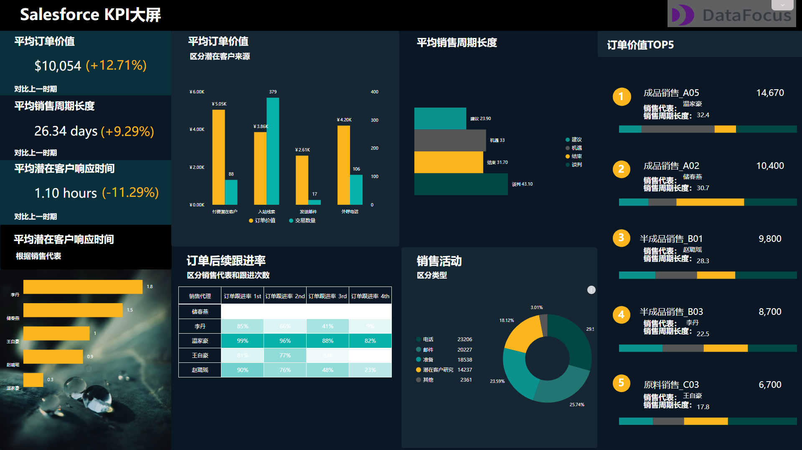

根据我司对DataFocus系统制作可视化大屏的体会来看，我们认为，有效的可视化大屏可以真正改变企业的运营方式！

我们生活的时代，即使是一个很小的公司也拥有数百万的数据。并且，有价值的数据信息往往并不直观，如果不能在正确的时间被正确的人看到正确的数据，那么可能会对公司的决策和后续行动造成重大影响。因此，借助数据可视化大屏可以确保公司最重要的数据、指标始终清晰可见，指导决策和运营。

## **什么是可视化大屏？**

可视化大屏是承载数据分析结果最佳的展现方式，简单来说，可视化大屏将复杂抽象的数据，通过图表的形式直观展示数据之间的信息和规律，可供决策者和团队追踪目标进度，及时发现问题、解决问题。

## **是否需要可视化大屏？**

在我们接触到DataFocus系统之前，制作数据可视化大屏一直在我司的待办事项清单上，但当我们真正引入DataFocus系统制作数据看板后，我们才意识到我们之前错过了什么。作为一家数据驱动型的企业，我们从设置实时数据看板中受益匪浅。

可以想象一下，没有时钟、手表、电话等报时设备的一天，这一天并不是不能工作或生活，但注定会造成很多精力和时间的浪费。可视化大屏与报时设备的作用是相通的，没有可视化大屏，大多数公司也可以正常运营，但当公司处于扩大规模时，可能就无法提前掌握先机，错失机会；或者在公司遇到问题时，不能及时发现并规避、解决问题。

## **可视化大屏的类型**

在大多数情况下，根据可视化大屏之间的功能区别，我们可以将可视化大屏分为监控大屏和绩效大屏。

### **监控大屏**

监控仪表板旨在让用户清楚地看到由于最近发生了变化而立即需要采取行动或进一步关注的领域。

良好的监控仪表板需要定期查看。它们不是用作分析工具，而是旨在将您的注意力吸引到任何不被视为“正常”的事物上——通常是通过使用警报或状态指示器系统来吸引您对不同区域的注意力，例如事物改变。

_截图来源：DataFocus（数据已脱敏）_

例如上图展示的是某月的Zendesk中的工单监测大屏，可以用不同颜色代表增长率的涨跌，同时监测重点指标的波动情况。DataFocus系统还自带一个告警功能的设置，当数据出现高于或低于自主设置的阈值时，系统将会通过将数据标红前置闪烁并推送用户的方式，告警用户，方便用户及时处理异常状况。

### **绩效大屏**

绩效大屏（有时也称为KPI大屏），主要可视化企业当前在实现长期战略目标方面的进展。监控大屏主要帮助提高反应能力，而绩效大屏则帮助用户更主动地处理您希望在未来实现的目标。

下图是一张销售团队使用的绩效仪表板示例。

首先团队确定了对他们来说最重要的KPI（平均订单价值），并赋予了它较大的重要性。其次，我们还可以轻松地实时查看多个重要指标，包括平均销售周期长度和平均潜在客户响应时间等。查看的方式除了KPI指标，还有条形图，环图，堆积图等。这些都是非常有价值的信息，销售经理可以使用这些信息来确定努力方向，以实现总体目标。

_截图来源：DataFocus（数据已脱敏）_

## **如何构建我的第一个可视化大屏？**

如果您正在研究仪表板，那么使用BI工具会是您最好的选择。从根本上说，BI工具旨在从多个来源收集非结构化数据，因此用户可以通过一系列查询深入了解这些数据。大多数还将包括可用于创建可视化大屏的数据可视化功能。

而在BI工具中，DataFocus将会是您最好的起点。DataFocus首创的中文类自然语言搜索式分析帮助用户极大地降低了数据分析的门槛，让数据分析像搜索一样简单。无需学会写代码，零数据分析经验的普通业务人员也可以学会制作炫酷的可视化大屏。

**比Tableau更好用，比PowerBI更智能**

总而言之，如果您真的发现自己需要运行常规数据分析，并且Excel等电子表格软件已受到限制，那么就是时候使用BI工具了。但是，如果您的首要任务是从一个或多个来源提取数据以创建易于理解的可视化大屏，那么使用DataFocus等专业且易于使用的工具则会更好。

快来尝试免费试用，创建属于你的第一个可视化大屏吧！
