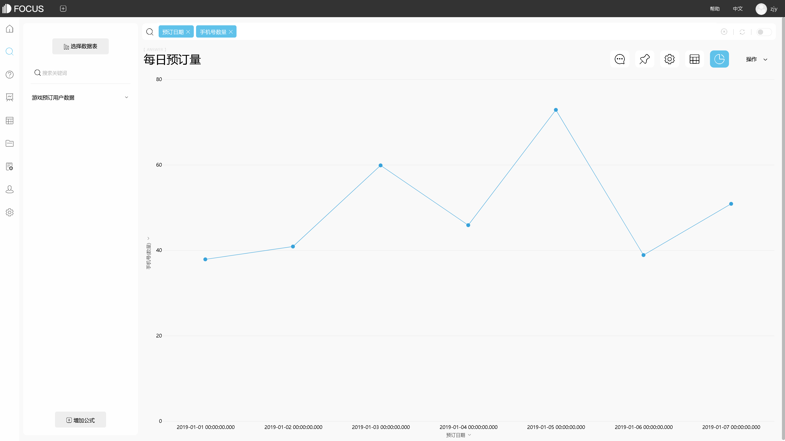

现如今对于电商行业来说，流量成本越来越高，店铺更加重视客户体验，以吸引新客并留住老客。那么互动营销便是很多品牌非常重视的方法，尤其是需要客户重复购买的快消品或时尚品行业。更有质量和更频繁的互动可以“占据”消费者的视线和记忆，让更多消费者与店铺产生强连接。就像交友一样，频繁友好的互动可以让彼此更加的亲近，同样的商品同样的价格，互动能够在此基础上产生更多的竞争力。

在这个大数据时代，因为互动对象—消费者本身的不确定性和决策需要，越来越多企业开始以数据分析结果赋能互动活动规划，无论是聘用专门的数据分析师还是直接购买DataFocus、Tableau等数据分析工具。那么在数据分析的基础下，店铺的互动活动应如何规划呢。这里主要分为7步。

1. 明确店铺整体定位。这个定位不仅仅包含店铺的认知定位或是类目定位，更是通过店铺诊断之后对于流程能力、销售、商品、客户等全数据的结果定位，让店铺在数据端可量化的知道自身的定位。
2. 年度销售额规划和拆解。因为无论如何，互动的究极目标还是为了促进销售，让店铺有更多的利润。所以规划互动需要拆解销售目标，让每个月的互动活动跟随每月的销售目标进行规划。
3. 各月销售目标拆解、营销活动规划。每个月的营销目标也需要进行拆解，每月有什么活动，每个活动应有多少收入等，比如11月的拆解主要在双十一活动上。
4. 按照往年数据推测毛利率。毛利率可以让店铺决策者知晓每月或每个活动的盈利，以此盈利可以赋能到下一个活动当中，增加或减少下一个活动的预算，做到“每一步都是为后面的布局做准备”。
5. 规划活动互动目的及指标。互动活动不是单纯的交友，在商业活动中还是要以利益为重，需要设立相应指标，比如直播活动的观看人数、互动人数、直播中购买人数、直播后购买人数等。
6. 规划活动内容、利益点、优惠券面额等。活动内容做完上述5步后便非常容易进行，利益点需要做好实时的数据对比分析，优惠券面额需参考往年数据。
7. 协调各部门推进活动。
