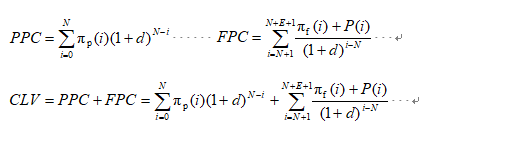
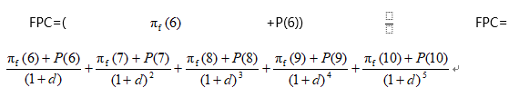

在这个大数据时代，数据分析对于客户的价值衡量有着不可忽视的作用，无论是用DataFocus等数据分析工具还是数云等CRM工具，核心都是数据的分析和挖掘，以衡量客户对企业产生的价值贡献。但是目前很多的方法或工具，只能衡量客户在历史时期产生的历史价值，而无法衡量未来的价值。虽说未来是不确定的，但是预测未来价值也会对企业的决策产生很好的辅助作用。所以很多数据分析模型或软件算法其实是没有考虑到这一点的。

例如一个学生客户，鉴于他目前的经济状况，他无法在你店铺进行高频次高额度的消费，但是他常常浏览关注店铺，仅仅根据他的历史消费情况来简单判断他是一个低价值客户显然是不合理的。另外很多模型是在客户关系终身保持不变情况下对客户价值进行预测的，它没有考虑客户可能有一天不再消费企业的产品或服务，也就是说客户关系维持的长度是未知的，因此在客户流失的情况下模型并不成立，即使一个客户目前对我们的价值很高，如果他流失的可能性很高，那么该客户算不上一个高价值客户。

针对这些的不足，我们这里介绍两个两个计算维度：客户未来价值、客户忠诚度，结合我们以前讲过的CLV（客户终身价值），最后得出优化模型，即

PPC是指到目前为止客户为企业创造的利润总现值，FPC是指客户预期在未来可为企业带来的利润总现值。其中N为已有客户生命周期长度；E为预期客户生命周期长度；为历史贡献函数；为未来贡献函数，它代表客户购买模式保持不变情况下在未来(区间i上)可为企业创造的利润；为潜在贡献函数，它代表客户购买模式改变情况下在未来(区间i上)可望为企业创造的利润。

PPC是指客户在某一时间段的价值，不是从过去到现在的累计价值，计算方法较为简单，简单来说就是收益减去成本再贴现，这根据历史消费数据即可得出，计算过程在第一个公式已经举例，不再赘述。FPC计算如下,假设A客户在店铺以消费5年（即已有客户生命）

FPC=(+P(6))已消费5年（即已有客户生命周期N为5），估计该客户一共会在店铺消费10年（即生命周期长度E为10），则

上述模型就能比较好的预测客户的未来价值，而DataFocus也支持公式的自定义，能让用户更加便捷的根据想要的模型进行数据分析。
