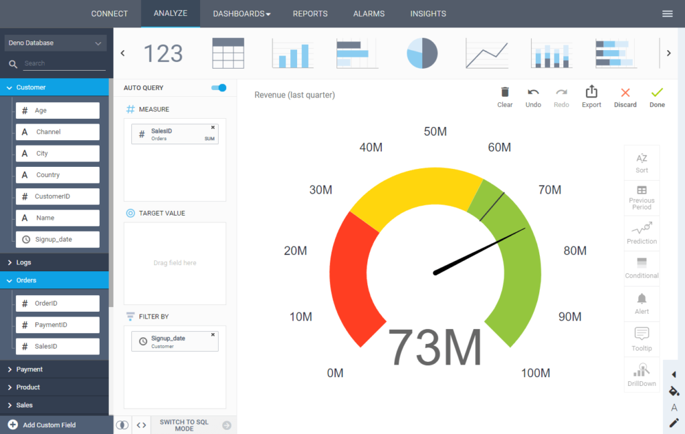
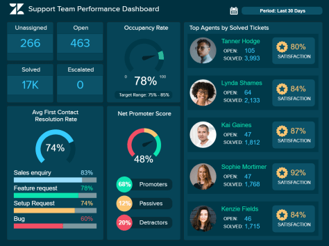

SaaS 商业智能，或 SaaS BI ，是一种基于云的分发模型，其中第三方提供商在安全的在线环境中托管 BI 工具。SaaS BI工具直接向企业提供具有灵活定价的仪表板和报告等分析服务。

在当今的商业活动中，每天都会收集和编译大量数据。它们可以是内部的，以跟踪公司财务健康状况和业绩的关键指标；但它们也可以是外部的——客户的购物行为、用户的首次或重复访问等。但所有这些数据都需要处理，最重要的是，需要分析和理解，以便利用它。[借助 SaaS BI 工具，用户可以使用现代云 BI](https://www.datafocus.ai/infos/cloud-bi)技术进行全面的数据分析。这允许用户从他们的移动设备访问所有数据源并编译[在线仪表板](https://www.datafocus.ai/infos/online-dashboard)，无论他们身在何处。

- **灵活性：**在云上工作的一大好处是它允许的灵活性。您的团队中任何获得授权的人都可以随时随地访问您正在处理的报告及其最新版本。它确实适用于处理最新的实时数据，从而避免了手动更新每份报告的艰巨任务，从而将更多时间专注于最重要的事情：数据分析。
- **敏捷性：**话虽如此，[BI 报告工具](https://www.datafocus.ai/infos/bi-reporting)能够以前所未有的速度轻松访问所有业务信息。这种敏捷性是可能的，这要归功于导航和管理这类工具的简单些，它们不需要特殊设备、维护内部服务器或整个 IT 部门。由于预算友好，这些工具可以确保准确的数据管理和全新的洞察力水平，否则，传统的存储和分析方法会被忽视和搁置。
- **节省成本和时间：**保持敏捷是当今商业环境中的一项关键需求。SaaS BI 工具不仅可以节省时间，还可以节省成本。基于云的工具不需要大量的安装过程、维护成本或预先购买昂贵的软件。您只需要在线访问您的帐户；选择订阅计划，您就能在几分钟内获得 SaaS BI 的所有优势。这类工具无需安装费用或不用手动更新，因为它们会自动更新。此外，您无需为业务中不需要的功能支付额外费用，SaaS 工具允许您根据公司的要求选择最佳交付模式，并且可以根据您的业务变化和增长进行调整。
- **自助服务方法：**如果您没有 IT 知识或人力进行数据收集，您如何从数据收集到数据分析？答案在于功能强大的 SaaS BI 工具。在一个许多[商业智能软件](https://www.datafocus.ai/infos/best-bi-tools-software-review-list)超出普通用户能力范围的世界里，我们经常依赖昂贵的 IT 人员和专家，他们要么必须全职雇佣，要么以合同形式雇用。事实上，组织的所有 IT 资源中有 10% 由数据库查询、数据分析和商业智能报告组成。BI SaaS 是如此强大，以至于任何训练有素的专家都会认识到它的重要性，但它对于实习生来说，也足够容易使用。从小型初创公司到大型跨国公司，组织都将从 SaaS 商业智能软件中获得同样的好处。

### 现代 SAAS BI 工具的优势

尽管BI SaaS 技术进入市场的时间还不长，但它的好处已经被证明是成功的，并且对企业来说是有利可图的。它们不仅具有成本效益，并且可以将您的 IT 部门从手动生成报告的繁重工作中解脱出来，而且它们还将通过交互式可视化和强大的 SaaS 仪表板为您的企业打开一个全新的洞察和协作世界。在这里，我们将告诉您这些工具的一些额外优势和独特功能：

- **在任何地方使用：** SaaS 商业智能解决方案为您提供了极大的灵活性，因为它可以在任何有 Internet 连接的地方使用。它直接在浏览器上加载，因此无需安装任何软件。但是，通过附加功能，它还可以在各种不同的操作系统和应用程序下的多种设备上使用，包括平板电脑、手机、笔记本电脑和台式机等。这种可扩展性和灵活性为公司提供了消除昂贵的内部安装和软件维护的机会。
- **拖放/搜索界面：**使 SaaS BI 工具如此出色和简单的主要特性是其直观的拖放/搜索界面，它允许用户从一系列选项中进行选择，按照他们的意愿排列和组织它们。使用简单是一个很大的优势，因为它可以让任何没有敏锐 IT 知识的人都可以访问它，并让他或她以最专业的方式分析和探索数据。也就是说，您无需成为万能的 IT 专业人员即可生成和分析大量复杂数据。这些工具的简单界面将使每个业务用户只需单击几下鼠标即可管理他们的数据资源。
- **快速集成：**[自助式 BI 工具](https://www.datafocus.ai/infos/self-service-bi-tools)可在 10 分钟内完成设置并准备就绪。此外，借助现代工具，可以连接各种数据库（MySQL、SQLServer、Oracle、Maria DB、PostgreSQL、Heroku、Amazon Aurora 等）以及平面文件、营销分析、社交平台、CRM 或 ERP 系统，并将所有数据集中合并在一个地方。繁琐而枯燥的手动更新工作现已成为过去：您处理的所有数据都是最新的。不再有报告重复的问题，不再有不同的同步，每个人都在处理相同的实时数据。基础架构会定期更新和增强，以提供无缝的用户体验，而[仪表板模板](https://www.datafocus.ai/infos/dashboard-examples-and-templates)则可以在您连接自己的数据源后充分使用。
- **增强协作：**通过授予您的同事访问仪表板和报告的权限，促进团队内部的协作，并共同处理它们。由于每个员工都可以访问相同的数据，您可以为让所有员工获得不再仅掌握在少数“精英群体”手中的内部知识。合作更容易，SaaS BI 允许更具包容性和效率的决策过程，这将导致更好的业务决策。
- **信息一目了然：**使用专业的[KPI 软件](https://www.datafocus.ai/infos/kpi-dashboard-software)，您可以编译交互式图表和仪表板等惊人的分析结果，同时还可以自动将它们发送给选定的接收者。您可以通过选择要发送的格式（PDF、XLS、PNG）来共享您的仪表板报告，并设置一个预定日期，在该日期您的收件人将始终收到一封包含最新版本报告的电子邮件。此外，您可以通过 URL 或在安全的查看器环境中共享仪表板。
- **高级分析：** SaaS 商业智能工具的另一个令人难以置信的好处是，由于先进但用户友好的技术，它们可以让您进一步处理数据。一方面，预测分析可以通过分析大量的历史数据来发现数据中的关系、趋势和模式。像这样，SaaS 商业智能软件设计模型来预测未来的性能，使您能够提前规划策略，避免以后发现意外。此外，由人工智能技术驱动的智能[数据警报](https://www.datafocus.ai/infos/business-intelligence-data-alerts)将在发生意外事件或未达到目标时为您提供即时通知。
- **白标和嵌入功能：**创建一个自己的软件是非常耗时的，更不用说极其昂贵了。SaaS解决方案提供白标和嵌入选项，因此您可以获得 SaaS BI 工具的所有好处，而无需构建自己的工具。通过 iframe 将您的仪表板连接到您自己的系统，并根据您品牌配色方案定制它们，以获得更专业的外观。您甚至可以以自己的品牌提供 SaaS BI 软件，并为您的服务增加额外的价值。
- **不再有瓶颈：**由于每天生成的数据量超过了人类的数据处理能力，近年来报告需求有所增加，导致瓶颈，并造成了专业部门在减少的时间内交付大量报告的压力。另一方面，SaaS BI 旨在使业务用户能够生成自己的报告，而无需技术专家。

### 使用我们专业的 SAAS 商业智能软件，免费试用 30 天

如果您厌倦了简单的业务报告需要数小时甚至数天才能送达，而您需要等待专家和 IT 人员最终交付，那么您需要DataFocus。将您的所有数据连接到我们的 BI SaaS 工具，并探索您的数据从未如此简单。我们的SaaS 商业智能软件可在几秒钟内可视化您的数据库结构，您只需将表格字段双击到搜索框或者直接在搜索框内输入即可立即开始创建自己的图表和图形。

您不必成为 IT 专家就可以完全控制您的数据——只需单击几下，您的所有业务数据和所需信息都可以在一个屏幕上从各种来源生成。结果将实时发送给您，您可以选择超过40种不同的图表类型，每种图表类型都有其特殊性：表格、折线、条形、柱状、地图、仪表图等。然后您可以随心所欲更改字体大小，颜色和样式，拥有最个性化的图表。之后，您可以使用我们最先进的[仪表板设计器创建令人惊叹的自定义仪表板](https://www.datafocus.ai/infos/dashboard-designer)。所有这一切都通过高水平的安全性得到加强——DataFocus 的 SaaS 商业智能软件具有企业级安全层。

借助强大的 SaaS 数据分析工具，在您的组织中建立数据驱动的文化从未如此简单。通过使用交互式在线仪表板，您组织中的每个人都将有权在与其他部门协作以实现其业务目标的同时，依赖数据进行决策过程。DataFocus旨在让企业的生活变得更轻松，并通过最高效的 BI 解决方案帮助他们确保持续增长。所有这些功能都可以根据您的业务需求和参数进行定制。我们可以根据您的业务需求构建仪表板作为概念证明，以便您的经理或投资者可以看到我们在线[仪表板创建者](https://www.datafocus.ai/infos/dashboard-creator)的真正力量。

如果您不确定 DataFocus 是否适合您，我们将提供 30 天的无风险免费试用。随意试用 DataFocus 并体验与其他 SaaS BI 工具的不同之处。我们确信您会喜欢我们的 SaaS BI，并且您将永远不会再使用任何其他商业智能软件或资源。
