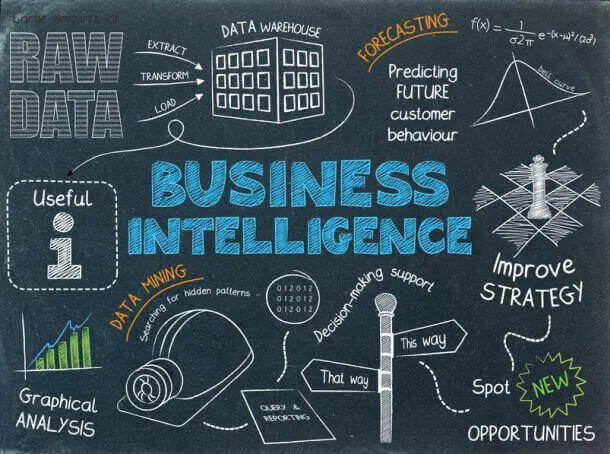
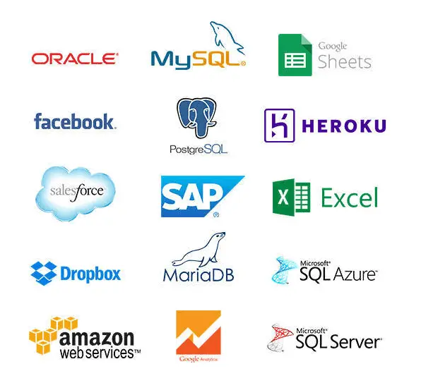
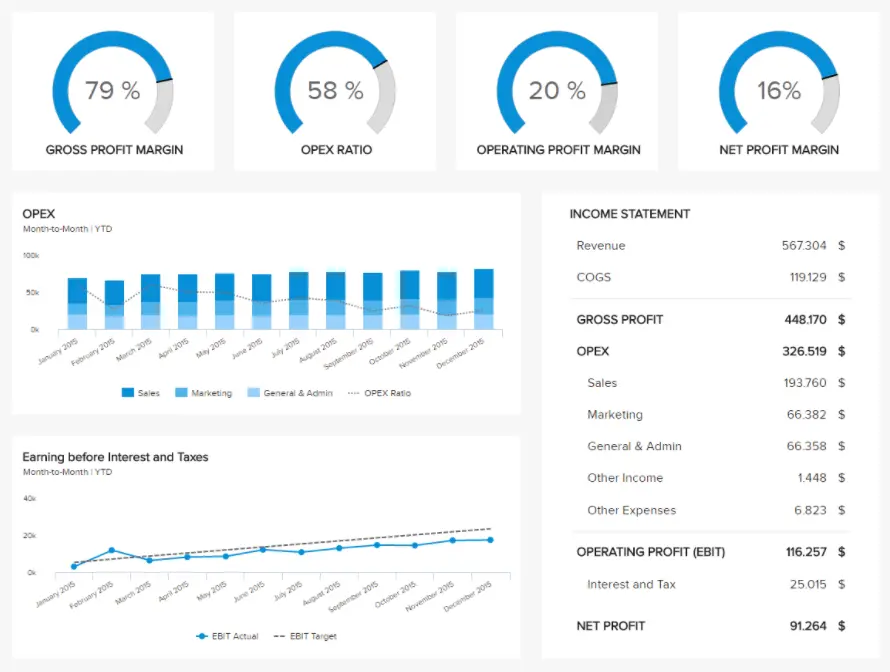

过去，商业智能是大公司的特权，他们有能力维持IT专家和数据科学家团队。但在过去十年中，随着技术的快速发展，该软件不仅变得更加轻量级和强大，而且更易于访问。小型企业可以使用与主要市场参与者相同的工具并面对竞争对手。新的自助服务工具证明，商业智能不是火箭科学，而是帮助将数据转化为明智决策的有用工具。现在，每家公司都可以利用现代 BI 软件的强大功能来提高他们的底线，因为小型企业的商业智能已经变得容易获得且价格合理。但究竟是什么让商业智能变得不可或缺？

要开始这一旅程，必须知道BI可以适应任何商业模式或行业。我们在其他博客文章中看到了如何构建成功的[商业智能战略](https://www.datafocus.ai/infos/roadmap-to-a-successful-business-intelligence-strategy)，或利用[财务报告和分析](https://www.datafocus.ai/infos/financial-reporting-and-analysis)的力量，如何利用现代业务仪表板的力量并充分利用您的小型企业数据分析。需要一个大型部门收集和分析收集的所有数据，将这些数据圈在不同的部门，并向许多利益相关者展示，这是过去的模式。在这个数字时代，如果您想保持市场领先地位，几乎实时访问您的数据至关重要。话虽如此，做出快速、明智、详细和稳健决策所需的大多数报告和分析只需点击几下即可访问，通过简单的链接共享，并通过简单的图表进行分析，这些图表可以使业务决策过程和行动时间更快。

> 您的机会：[想要提高您的小型企业绩效吗？](https://www.datafocus.ai/console)探索我们的 14 天免费试用版并从小型企业分析中受益！

在这篇文章中，我们旨在帮助您从小型企业的业务分析中受益。为此，我们收集了为什么小型企业的商业智能是明智选择的最重要原因，以及如何为小型企业实施大数据战略。作为小企业主，成功的业务运营所需的所有数据都可以收集在一个简单的实时仪表板中。这意味着您将可以访问成功经营业务所需的所有运营分析和关键因素。无论您是拥有一家小型代理机构、商店还是餐厅，都没关系;每一步都需要小型企业分析，以学习如何适应客户并以最佳方式执行，这是市场成功的关键因素。但是，让我们从有关如何开始以及在此过程中应避免的简单解释开始。

## 什么是小型企业分析？

小型企业分析是指衡量小公司特定绩效的技术和实践，无论是在运营层面还是战略层面。它用于评估小型数据集，以获得对特定项目或公司流程的见解。

的确，小数据比大数据更容易访问，但这并不意味着有效利用它不需要任何努力。如果您希望您的企业取得更好的结果，那么获得正确的心态并成为数据驱动型组织非常重要。这要求您调整公司管理日常运营的方式，从高层管理人员到底层。如果您设定明确的目标，定义要使用的[报告工具](https://www.datafocus.ai/infos/online-reporting)，并开始为小型企业运营创建第一个BI，则这不是一个复杂的过程。为了更深入地了解小型企业的分析，让我们看看小数据如何与更广泛的商业词汇 - 大数据的相关联性。

网络上流行的小数据有许多定义——在大多数情况下，它建立在对大数据的反对之上。其他定义强调了小数据更人性化的一面，因为它通常是由人而不是机器生成并输入系统的。此外，这种类型的数据通常包含在操作数据库中——您的CRM或ERP不够大，不能称为大数据。此外，它可以在MySQL数据库中进行管理 - 并且处理能力就足够了。小型数据分析基于这样一种观念，即企业应该有效地利用其已有的资源，并避免在其他技术或外部基础设施上超支。

在他的福布斯文章中，迈克·卡维斯（Mike Kavis）对小数据的看法略有不同，强调它只包含非常具体的属性。它用于确定当前状态和条件，例如可以通过部署在风力涡轮机上的传感器、小包装或连接到无人机上来生成，以提供非常具体的信息——关于位置、温度等。所有这些实时收集的小数据集都以大数据集的形式创造了更大的图景，为我们提供了历史的、多方面的视图。

## 如何利用您的小型企业分析？

小数据可以为您提供见解，这些见解将成为决定决策过程的关键因素。但是，由于组织处理小数据的方式，它们在整体数据管理中往往会被忽视。您应该认真对待非大数据的原因有很多，我们列出了其中的一些：

专注于目标 – 大数据可以看到整体绩效，小数据向下钻取以发现导致改进结果的具体行动。您需要做的就是首先确定您的 KPI 和负责每个状态的人员，并为他们提供跟踪特定指标开发的任务。

可操作 – 大数据报告提供有关每个部门和每个指标的信息，这可能非常有趣。如果你想从数据中获得真正的价值，它必须激励你做出快速的战略和组织变革：它应该是面向问题的，而不是太笼统和压倒性的。

关于现在正在发生的事情 - 小数据提供集中的实时信息，使您能够立即发现趋势并采取相应的行动。但大数据也有一张王牌——历史洞察力。如果你需要过去的数据，或者想把现在和过去并列，你就离不开大数据。

交付时随时可用 – 小数据以易于消化的数据片段的形式交付给您。小型数据集已经具有针对性和战略性，可以发送给负责特定任务的关键决策者或员工。您的同事将更有可能利用报告，这些报告将当场为他们提供清晰而有意义的见解。

虽然小数据是大数据的一部分，但它也可以在不需要深入研究大量信息并且没有大量部门或利益相关者来管理或呈现它的企业中单独使用。但是，每个企业都需要清楚地了解他们在市场上的位置，如何实现预期的结果以及优化哪些内容以充分利用您的资源。话虽如此，我们将讨论如何从小型企业的 BI 开始，以及在使用可操作的提示和技巧分析数据时要考虑的事项。

您的机会：[想要提高您的小型企业绩效吗？](https://www.datafocus.ai/console)探索我们的 14 天免费试用版并从小型企业分析中受益！

## 关于如何开始使用小型企业商业智能的 8 个提示

以下是有关如何开始使用小型企业商业智能的 8 个提示：

1\. 满足不同需求

2\. 提高透明度和与客户的关系

3.在线分析和轻松组合各种数据源

4\. 通过预测分析解读您的未来

5\. 为数据故事使用正确的数据可视化

6\. 促进协作与合作

7\. 保护您的数据

8\. 更快地做出更好的业务决策

让我们更深入地研究这些要点，并解释它们各自的意义。

1\. 满足不同需求

新的商业智能工具旨在满足不同行业客户的多样化需求。由于它们被设计为完全由用户操作，因此它们可以轻松适应多种类型的需求。智能[自助式 BI 工具](https://www.datafocus.ai/infos/self-service-bi-tools)允许您自行分析多个数据源。因此，您的公司可以选择并支付一种工具，该工具可以解决许多部门的问题。每个部门都可以连接自己的数据源，例如，营销 - Facebook或Google Analytics，而销售 - CSV文件或SQL数据库，以提取对他们最重要的业务见解。此外，BI 软件提供商通常提供几种类型的产品包——您可以选择在价格和功能方面符合您小型企业要求的产品包。大数据[示例](https://www.datafocus.ai/infos/big-data-examples-in-real-life)在现实世界（包括酒店业）中的某些有趣潜力不应被忽视，因为它可以证明最终可以增加收入并提供更高客户满意度水平的巨大实施可能性。但本文后面会详细介绍客户。

这些工具对于满足小型企业或初创公司的各种需求特别有益。万事通文化是小企业乐趣的一部分。感觉就像每个人都参与并投资于组织的各个层面。它还倾向于制造一些知识差距。由于每个人都担任多个角色，因此某些专业领域可能缺乏深度。数据和分析就是一个很好的例子。许多小企业负担不起专门从事商业智能的全职员工。他们需要的是多名工作人员担任其部门和角色的兼职分析师。小型企业的商业智能使这成为可能。通过访问您自己的数据集来理解您的后续步骤并做出可操作的有效决策，以有效的方式制定您的业务战略，小型企业分析软件可以充当分析和重要决策过程之间的桥梁。只需单击几下即可使您的数据故事生动起来，使企业主降低了成本，更有效地评估了他们的运营，并提供了对其整体业务管理流程的深入洞察。

易于访问的基于 Web 的仪表板是为小型企业（无论是员工还是所有者）增强数据分析的最简单方法。自助式 BI 解决方案不需要大量的培训、编程知识、数据科学家、专门的 IT 人员或复杂的数据基础架构。配备易于构建/拖放、可操作且有效的[业务仪表板](https://www.datafocus.ai/infos/dashboard-examples-and-templates-)的员工可以成功解决广泛的部门和组织问题。员工无需浪费时间试图弄清楚“谁可能知道这个答案”或“谁可以提取必要的数据”，而是可以主动跟踪自己的[关键绩效指标 （KPI），](https://www.datafocus.ai/infos/kpi-examples-and-templates-)确定成本节约并做出战略决策。这种小型BI软件的另一个好处是，数据还可以跨部门，不同的管理级别共享，或者仅由各种利益相关者查看和访问。不再需要构建复杂的电子表格，也无需调整您的书面报告，以应对您的发现感兴趣的每位经理;一个简单的，交互式的[，实时的仪表板](https://www.datafocus.ai/infos/live-dashboards)将使业务运营和管理免于额外的工作时间，然后可以分配给其他方向。

不要忘记测试您的商业智能 - 始终使用免费试用版，这样您就可以确保您和您的团队能够舒适地使用它。

2\. 提高透明度和与客户的关系

如果您想巩固您在客户心目中的存在并让他们留在您身边，您必须响应甚至预测他们的需求。对于小型企业来说，获得和维护忠实客户群尤为重要——我们都知道留住客户比吸引新客户便宜得多。小型企业的商业智能有助于收集有关客户行为的数据，并以清晰的形式构建数据，以便可以快速轻松地对其进行分析。通过深入了解客户的行为，您可以做出有效的业务决策。我们可以关注的一个很好的例子是客户服务——一般和特定信息请求的第一响应者。虽然您可能有座席或员工接听这些电话，但您可能希望分析特定的[客户服务 KPI，](https://www.datafocus.ai/infos/kpi-examples-and-templates-customer-service)以了解将来如何接近您的客户、客户管理流程中需要改进的地方以及如何获得有关在何处降低业务成本的宝贵见解。

使用数据为客户提供最佳服务只是小型企业分析软件改善客户关系的一部分。您的客户需要数据。透明度是当今游戏的名称。数据改善了谈判并促进了客户关系。例如，BI工具正在为以前不透明的[采购流程](https://www.datafocus.ai/infos/business-intelligence-analytics-procurement)提供透明度。采购和供应生命周期的复杂性通常会在整个生命周期中造成紧张的业务实践。双方现在都可以通过BI[工具](https://www.datafocus.ai/infos/best-bi-tools-software-review-list)轻松访问这些数据点。采购部门可以快速分析供应商绩效，并就如何评估供应商绩效、根据标准执行以及与竞争对手相比的表现提供反馈。也很容易证明，衡量供应商的数据是准确、公正和最新的。采购还可以提前为供应商提供采购和需求模式。

3.在线分析和轻松组合各种数据源

持续访问[在线仪表板](https://www.datafocus.ai/infos/online-dashboard)意味着您和您的同事将始终拥有所需的信息，无论您身在何处。您不必让 IT 团队参与进来，也不必等到他们分析您的数据并生成报告。对于小型企业来说，这是一个在不放弃分析质量的情况下节省一些资金的机会。[您需要自助式 BI 工具的最佳原因](https://www.datafocus.ai/infos/10-reasons-for-self-service-bi-tools)之一是它可以立即为您提供数据，并在您的个人设备上以清晰整洁的格式呈现数据。可以即时访问数据以进行实时分析和即时可操作的见解，从而为您的团队提供竞争优势。小型企业的商业智能意味着在正确的时间拥有正确的数据，以便进行快速而富有成效的分析。

商业智能还为您提供了所有各种数据源的一站式商店，如上图所示。企业的数据可能很小，但仍然可能很复杂。这通常是由各种不同的数据源引起的。小型企业需要各种[数据连接器](https://www.datafocus.ai/infos/data-connectors)，包括Google Analytics，来自CRM的数据，数据库和Excel电子表格。像[datafocus](https://www.datafocus.ai/infos)这样的BI工具可以将所有这些数据集中在一个屋檐下。上图显示了您可以为自己的业务实现的一些连接器。这使您可以在一个地方在线分析所有内容。对于任何企业来说，小型 BI 与大型 BI 同样重要;有效分析数据不会缩小规模，尤其是在一个简单的地方。

4\. 通过预测分析解读您的未来

“客户智能是确定和提供对过去和预测的未来客户行为的数据驱动见解的实践。为了有效，客户智能必须结合原始交易和行为数据来生成衍生措施。

怎么可能？BI不是一个水晶球，而是一个智能工具，它将帮助您揭示过去表现中的一些趋势，否则这些趋势可能会被忽视。您可以识别数据中的关键趋势，并有可能释放新的增长机会。通过分析您过去在上下文中的表现并尝试了解影响最佳或最差结果的因素，您可以发现未来增长的关键。

预测分析在零售业尤其强大。零售公司正在使用销售点、营销、网络数据、社交媒体和忠诚度数据来做出有关定价、促销和分类管理的明智决策。[零售分析](https://www.datafocus.ai/infos/retail-analytics)可以使用这些现有数据预测购买趋势。零售数据也正在彻底改变需求预测和价格优化。所有这些功能对于零售商的成功都至关重要。

5\. 为数据故事使用正确的数据可视化

人脑被连接到视觉处理信息，使可视化成为探索和理解数据的最佳方式之一，尤其是在向客户、投资者或其他利益相关者呈现数据时。告别停滞不前的报告和难以阅读的电子表格！虽然Excel和PowerPoint仍然是许多人的重要业务工具，但它们的交互选项有限。[交互式仪表板以](https://www.datafocus.ai/infos/interactive-dashboard-features)广泛的技术敏锐度快速吸引最终用户，并提供直观的体验和易于消化的见解。这就是为什么要以有说服力的方式呈现数据并且不失去观众的注意力，建议使用[数据可视化软件](https://www.datafocus.ai/infos/data-visualization-tools)——小型企业分析商业智能的最佳选择。借助此智能解决方案，您可以在引人注目的图表上显示业务数据，而无需在图表格式和设计上花费太多时间。该工具为您完成这项工作 - 您的任务是分析和充分利用您的数据。

仪表板通过快速突出显示趋势和发现违规行为来提供投资回报率。使用正确的 BI 工具，小型企业的数据分析无需依赖专家来运行分析。易于使用的仪表板工具允许所有员工成为自己的分析师。更重要的是，员工可以实时与数据交互。只需单击报告中有趣的部分（取决于您要向谁展示数据），您就可以自定义和提取特定点以进一步分析并做出快速决策。

请记住，并非所有仪表板都是平等的。那里没有仪表板玻璃拖鞋。一个仪表板无法实现您的所有梦想。仪表板应解决特定问题、疑问或数据故事。它应该是集中的，视觉上的吸引力和易于消化的。小型企业需要确保在启动商业智能时拥有适当的仪表板组合。让我们通过一个例子来探讨这一点。

\*\*点击放大\*\*

上面的[销售业绩](https://www.datafocus.ai/infos/dashboard-examples-and-templates-sales#sales-performance-dashboard)仪表板是重点仪表板的一个很好的例子。此仪表板为销售团队提供正确的数据和可视化效果。无论他们是在路上还是在办公室，销售经理都能一目了然地看到他们的团队是否实现了他们的个人目标。虽然这是一个漂亮的仪表板，但对您的运营经理来说毫无意义。他们需要自己专注的 BI。使用正确的工具，您可以武装小型企业中的每个部门和混合部门。请记住，正确的数据[可视化类型讲述正确的数据](https://www.datafocus.ai/infos/how-to-choose-the-right-data-visualization-types)故事。讲述正确的数据故事是任何企业成功的关键。

您的机会：[想要提高您的小型企业绩效吗？](https://www.datafocus.ai/console)探索我们的 14 天免费试用版并从小型企业分析中受益！

6\. 促进协作与合作

正如我们已经提到的，商业智能允许您随时随地在线访问数据，甚至可以在没有 IT 支持的情况下运行最复杂的查询。对于一个人身兼数职的小型企业，这意味着您的员工可以提取他们需要的特定信息，即使这些信息超出了他们的直接专业领域。通过这种方式，您的团队成员能够从多个位置查看相同的数据，并共同做出数据驱动的决策。小型企业的商业智能不需要任何编程知识;您也不需要投资 SQL 培训。您需要做的就是[在您的公司中创造一种有益的仪表板文化](https://www.datafocus.ai/infos/create-dashboard-culture)，让每个人，从销售主管到您最新的实习生，都明白定期数据分析是有回报的。收集高质量数据不是一次性的工作，您必须定期重新评估您的目标，以确定您的小型 BI 设置是否有助于您实现这些目标。您越授权个人使用和共享数据，他们就越能更好地访问重要的客户和财务信息，那么他们就越能有效地为实现您的目标做出贡献。需要大量 IT 干预的 BI 解决方案对于小型企业来说是不可行的，但自助式 BI 解决方案触手可及。话虽如此，您公司的每个人都可以访问成功运营和战略流程所需的重要数据。通过使用正确的[业务报告软件](https://www.datafocus.ai/infos/business-reporting-software)与公司内的其他人共享这些数据，也可以提供一个学习曲线，以便人们可以更好地了解其他部门正在发生的事情，并将这些发现实施到他们自己的教育过程中。

正如我们所说，无论员工身在何处，智能 BI 工具都可以通过提供数据访问来增强合作。全球市场在发展，工作场所也在发展。为了降低间接成本并提高员工满意度，特别是公司和小型企业越来越多地转向非传统方法。远程工作的可能性是这种新格局的重要组成部分。事实上，远程工作正在全球迅速流行起来。根据Global Workplace Analytics的最新数据，仅在美国，2005年至2016年间，选择在家工作或远程办公的人数就增长了140%。据最新统计，这相当于大约 370 万远程工作者，占美国员工劳动力的 2.8%。虽然远程工作的好处是实实在在的，但如果没有合适的基础设施，它可能会阻碍协作和生产力。在数据分析方面，基于Web的BI解决方案解决了这个问题。正确的解决方案允许员工随时随地访问他们的绩效和业务仪表板。这使员工无论身在何处都能保持在同一页面上。

7\. 保护您的数据

许多BI工具提供数据仓库解决方案，涉及将全部或部分业务数据移动到安全的数据存储设施。尽管将敏感的企业数据移动到基于云的数据仓库的想法可能会对一些更多的模拟经理产生威慑作用，但云解决方案正变得越来越受欢迎。实施云意味着您将数据交给 IT 专业人员，他们 24/7 全天候处理数据。云存储提供商必须遵守严格的安全标准，并定期接受安全审计。基于云的数据仓库意味着不再需要担心丢失带有机密数据的笔记本电脑。由于数据存储在云中，因此简化了备份和恢复过程，并且不需要大笔费用。

8\. 更快地做出更好的业务决策

毫无疑问，创业是一项艰苦的工作。如果您的企业是一家初创公司，那就更难了。初创公司正在未知领域铺平道路，同时必须不断向市场和投资者证明自己的价值。一旦创业公司起步，工作就不会停止。企业需要不断做出所有正确的决策，才能从初创公司的状态转变为成熟的行业存在。为了做出这些决策并发展业务，他们需要正确的信息。好消息是，BI市场的增长为各种规模的企业提供了前所未有的所需信息。他们只需要正确的工具来访问它并清除噪音。

所有初创公司都是小型企业，但并非所有小型企业都是初创公司。讲述正确的数据故事对初创公司来说尤为重要。创业公司是一个独特的品种。他们不遵守规则，也不遵守他们的 KPI。初创公司需要确保他们朝着正确的方向前进，如果不是，请迅速改变道路。成功的初创公司通过不断监控和分析他们的数据来做到这一点。为了生存，初创公司还必须有效地将这些数据故事转化为投资者、董事会成员和其他利益相关者才能生存。进步的初创公司正在转向小型企业的商业智能，以确保他们拥有正确的工具来分析、可视化和呈现他们的数据。向关键利益相关者提供准确快速的数据已成为商业界的必备条件。无论大小，如果一家公司想在市场上生存，就必须评估和考虑数据。话虽如此，我们将探索利用大数据的技巧，并将其实施到小型企业数据分析领域。

## 小型企业大数据战略的 4 个技巧

小型企业的大数据战略应结合并利用分析来揭示业务趋势并做出决策。它应该在其方法上具有敏捷性，从一个小假设开始，涉及团队并使用智能数据源和工具。

让我们承认——大数据被夸大了。它在科学和商业出版物中被无数次重申，并承诺月球：发现隐藏的客户行为模式，预测KPI，帮助计划预算。然而，从大数据炒作机器中冒出的所有蒸汽似乎都掩盖了事实：只有当我们能够将其用作日常业务运营的辅助工具时，大数据才有用。这意味着大数据是一种工具，而不是解决业务问题或挫折的方法。它可以用来有效地引起人们对一些以前没有看到的运营问题的关注，或者将分散在整个公司中的所有数据集编译到一个地方，以获得一个整洁的概述。

一家公司可能会聘请数据科学家，投资增强型服务器，使用复杂的分析和数据挖掘应用程序来处理许多不同类型的数据，然后将其发送到外部高科技数据仓库，在那里复杂的算法将处理结果并将其显示在详细的报告中。事实上，这种情况只有在资金雄厚的大型企业中才会付诸实践。对于较小的公司来说，这太费力了，使用不太复杂的程序可以实现类似的结果。您不必为您的小型企业外包基于云的解决方案，我们要强调的重点是在大型企业和小型企业中收集所有这些数据的不同方法，以全面了解大数据可以为您的公司做什么。

但小企业的大数据量只是大公司必须处理的裂缝。此外，小型企业积累的数据通常更具结构化，并且更容易处理格式。绝不应避免分析这些数据，因为它提供了有价值的见解并且比您想象的更容易访问。借助新的业务见解，您可以改进战略并利用大数据。这意味着您的所有操作都可以从一个地方访问，您不必额外花时间在不同类型的报告上或将更多钱花在其他业务资源上，以清楚地了解您的业务管理决策过程。

以下是我们关于如何使其在实践中发挥作用的更详细的提示。

1\. 从小处着手

当您将数据视为一个巨大的池，每天都有新信息流入时，这可能确实令人生畏。但是，开始将您的数据视为特定问题的答案集合，而不是压倒性的大量数据。已经带着问题或假设来处理它，并检查收集的数据是否证实了您的假设。在这种情况下，您还可以避免当更多人查看相同的结果但每个人都以不同的方式解释它们时出现的麻烦。当您在没有策略的情况下进行分析时，就会发生这种情况，这可能会花费您大量的金钱、时间和压力。因此，首先从一个单一的问题开始，浏览容易获得的数据，如果你得到一个肯定的答案，你可以把它作为更高级研究的第一步。例如，您可能想知道如何增加收入和净利润。让我们从财务角度来看这一点。

\*\*点击放大\*\*

如果您将所有财务兴趣点收集到一个视图中，则很容易发现每笔运营费用，并查看大部分成本将集中在何处。在此仪表板模板上，公司的业绩以 4 个重要的财务指标为中心：毛利率、运营支出率、营业利润率和净利润率。运营支出比率是指公司因执行正常业务运营而产生的运营成本。我们在图表中看到，盈利趋势正在其增长路径上，这意味着，您可以轻松地得出结论，公司处于健康稳定的财务状况。

当比较不同部门或行业的这些[财务KPI](https://www.datafocus.ai/infos/kpi-examples-and-templates-finance)时（如前所述，每个仪表板都可以根据公司的特定需求进行调整），数字可能会发生重大变化。尽管如此，该模板可以在评估公司的财务状况时对最重要的指标进行简洁的概述。

2\. 敏捷

与您可能认为的相反，在快速行动方面，大公司受到了损害。他们可能拥有更好的资金和更多的数据专家，但即使是最好的IT人员也会陷入繁文缛节。虽然一家大公司可能需要首席执行官的五次批准、官方电子邮件和团队会议才能完成任何变革，但您已经可以开始利用来自小型企业大数据的见解。大数据提供了对实时数据的洞察，当你能够立即做出改变时，就在你看到某种趋势正在出现的时候，那么你就拥有竞争优势了。你会在大公司甚至没有注意到的情况下赶走客户。通过将公司的绩效实施到一个简单的交互式仪表板中，您的小型 BI 操作将改变其速度，这意味着所需的每个信息都将在您的屏幕上，只需单击一下即可获得。

3\. 让所有团队参与进来

如果您的团队规模较小或较大，通常必须在内部进行沟通才能实现共同的业务目标。如前所述，人类被连接到视觉上处理信息，当这些信息被整齐地收集到一个地方时，通信过程也变得简单和高效。

在一家内部沟通良好的小公司里，团队合作可以成为现实，而不是口号。当公司的所有部门、信息技术、营销、销售等部门朝着一个共同的目标共同努力时，他们可以使数据洞察变得有意义和有价值。正如我们之前已经提到的，在您的公司中创建仪表板文化并确保您的团队成员在日常决策中让自己受到数据的指导非常重要。为小型企业实施大数据如此有用的原因是它可以提高团队士气和参与度。员工有机会更好地了解客户、预测市场趋势并监控自己的绩效。这反过来又鼓励他们做出快速而自信的决策，并使整个公司受益。

4\. 使用智能数据源和工具

现在让我们深入了解大数据分析的本质。这里最重要的一点是，你不需要编程、SQL、Hadoop等技能来将你的大数据分解成洞察力。从您可以在线找到的容易获得的资源开始。有关人口统计，职业，客户兴趣的有用信息，您显然可以转到Facebook Insights和Google Analytics。此外，您可以找到在线州和地区数据库或文件，以增加您对客户生活方式的了解。例如，在马萨诸塞州，它可能是先锋谷区域数据门户（PVRDP），它通过专门设计用于支持该地区经济发展的可公开访问的门户整合区域经济，规划和劳动力数据。您可以查找有关您感兴趣的地区所选人口或人口统计数据的更多免费在线资源。

然后，这同样适用于本文前面关于开始使用小型 BI 的第三个技巧。一旦您在数据库中拥有所有这些数据，您将需要一个商业智能软件，该软件可以让您坐下来观看为您处理数据并出现业务洞察力。如何从众多在线可用工具中选择合适的工具？首先，检查该工具是否易于部署，您可以在几分钟内开始使用它。这是您的小型企业相对于大公司的另一个优势 - 您可以立即安装并开始使用业务分析工具，无需等待数月，因为软件和硬件已安装在整个组织中，员工接受培训才能使用它。大多数为小型企业分析大数据的在线工具都遵循自助服务模式——您团队的所有成员都可以自行执行分析，无需 IT 部门参与，也无需您为培训支付额外费用。凭借其简单的拖放功能，[在线数据可视化工具](https://www.datafocus.ai/infos/data-visualization-tools)将原始数据转换为漂亮的视觉效果，只需单击几下即可与之交互，您可以将数据扩展到特定的时间范围，并对整体业务管理流程进行额外分析。

数据分析工具通常允许您执行跨数据库分析，并以不同的格式并列[数据](https://www.datafocus.ai/infos/data-analyst-tools-software)。根据您拥有的数据量，您将能够选择定价方案。您需要为当前所需的功能和容量付费，但由于订阅模式，您可以随着分析需求的增加而扩展并添加更多功能。这种方法非常适合具有巨大增长潜力的小型企业，其中软件投资的成本和功能与运营的增长和扩展速度保持一致至关重要。这就是在线商业软件的魔力所在：您可以根据自己的需求进行调整并执行自己的分析，并根据自己的价值观和业务指标进行调整。

您的机会：[想要提高您的小型企业绩效吗？](https://www.datafocus.ai/console)探索我们的 14 天免费试用版并从小型企业分析中受益！

## 为小型企业提供正确的分析

这是不费吹灰之力的，您不想错过[自助式分析](https://www.datafocus.ai/infos/self-service-analytics)的兴起。小型企业的分析可满足各种需求，增加客户知识和保留率，通过预测客户需求来加强客户联系，并用新知识丰富服务产品。它还允许您在线分析数据，帮助您保持主动性，可视化数据，增强协作并帮助保护您的数据。在与团队更相关的方面，小数据分析还可以提高生产力，最大化员工资源，简化复杂的数据和分析，为您的员工提供自我提升的空间，并显着帮助初创公司。在小型企业运营中，每一分钟和每一小时对于以最佳和具有成本效益的形式执行至关重要。通过实时分析数据，您可以快速做出决策，从而为您提供额外的工作时间，然后您可以在其他地方花费这些时间。

无论您的企业是大是小，商业智能都不必让人不知所措或困难。您只需要使用正确的工具和准备来应对它。信息每时每刻都在涌入您的公司。不要只是存储或忽略它 - 使用这些数据为未来的增长做出更好的决策。

小型数据分析提供了可操作的见解，使谈判桌的双方都能支持他们的案例并更有效。他们还可以帮助您节省资金，帮助您的员工更快地工作、提高效率并跟踪他们的个人绩效。毫无疑问，大数据和小数据都有其特定的用途和好处，但必须记住，任何数据分析都是从小数据集开始的。希望有效和快速地收集和处理指标的公司应该利用各种可用数据。有了合适的人员来分析正确的数据和正确的业务目标，您的公司可以通过小型数据分析创造奇迹。

将这些知识付诸实践，立即开始 14 天[免费试用](https://www.datafocus.ai/console)，深入了解小型企业的商业智能。
