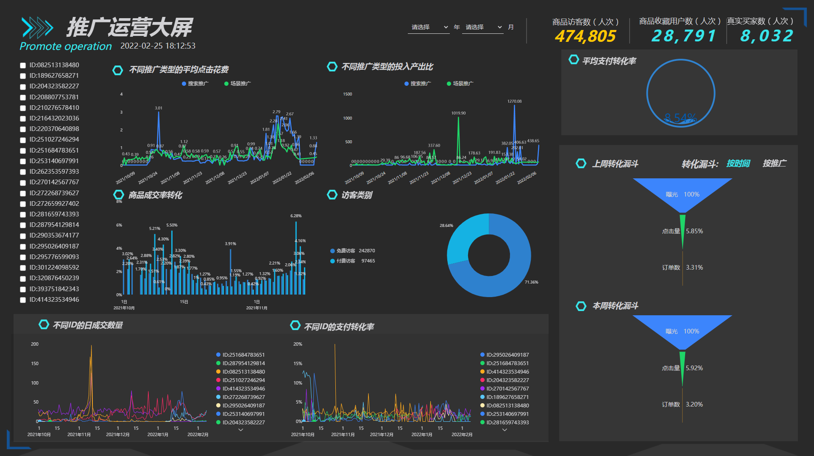

识别和跟踪特定指标的主要目的是衡量用户在实现特定目标方面取得的进展。但并非所有指标都能立即为用户提供所需的信息。

比较具有代表性的两类指标就是领先指标和之后指标。领先指标主要用于衡量帮助用户实现目标的活动，并且可以在持续的基础上进行跟踪；而滞后指标则需要一段时间甚至较长时间，才能显示用户需要的后期结果。

由于领先指标与滞后指标所需的时间范围不同，因此了解何时跟踪滞后指标非常重要，这样才可以识别领先指标以帮助用户随时进行指导。

那么到底什么是领先指标？什么是滞后指标？他们的优缺点分别是什么以及如何正确使用两类指标，才能帮助用户准确监控实现目标的进度，保持团队处于正轨。

## 什么是领先指标？

领先指标提供业绩的早期迹象。这些指标通过显示用户在实现目标方面取得的进展来“引导”结果。通常，领先指标是帮助用户保持正轨以实现战略目标的指标。

例如，假设某公司计划在6个月的销售周期内完成80笔新交易，可以在此基础上设置领先指标，帮助该公司了解是否有望在最初的几个月内提前实现目标，同时目前距离周期结束仍遥遥领先，可以随时做出改变。

销售收入的领先指标可以是销售漏斗或每位销售代表的电话/会议/电子邮件数量。通过跟踪这些指标，可以持续监控销售活动，并了解团队是否需要增加额外工作以实现“已完成交易”的目标。

### 使用领先指标的好处

**更快的反馈：**通过跟踪领先指标，团队可以更快地获得有关其工作的反馈，并确定他们可能需要采取哪些行动来实现总体目标。

**团队参与：**由于广泛的目标通常有很多方面，因此需要跟踪许多领先指标，不同的团队成员和部门可以拥有不同的指标。以此，每个人都为实现公司更大的目标做出贡献。

### 领先指标的弱点

**只是一个代理：**如果使用领先指标作为滞后指标的代理，一定要记住，虽然领先指标应该影响滞后指标，但它可能不会产生预期的影响。

## 什么是滞后指标？

滞后指标是需要很长时间才能影响或衡量的指标。由于所涉及的时间框架，滞后指标不是向团队提供关于他们当前项目是否有效的反馈的最佳选择。但是，滞后指标通常是最准确地衡量尝试实现的实际业务影响的指标。

例如，用户想提高客户保留率，则必须跟踪客户流失率。但是流失率变化缓慢，可能需要很长时间才能显示结果。

### 滞后指标的好处

**明确的指标**：在许多情况下，最能评估用户努力影响的指标一定是一个滞后指标，因为更改需要时间才能生效。

### 滞后指标的弱点

**需要时间衡量：**根据定义，滞后指标衡量的是长期趋势，因此它们需要数周、数月（或者更长时间）才能生效。

**看不出原因：**滞后指标显示结果，但不清楚哪些变量影响了该结果。你可能知道你的流失率很高，但你不知道公司采取的哪些行动影响了这个比率。

**难以衡量：**由于滞后指标通常是收入等高级指标，受公司内不同部门的影响，小项目可能无法产生可衡量的影响。有时很难判断指标的微小变化是由于用户行为还是只是偶然。

## 合作而不是独立

滞后指标可能是衡量工作成果的最佳指标，但不建议单独跟踪滞后指标；而领先指标虽然可以提前反馈，但无法反映具体的工作成果。因此，提出一种解决方案，是将领先指标和滞后指标组合起来，同时跟踪。在利用滞后指标反馈工作结果的同时持续查看领先指标，这样就可以监控正在进行的进度以及更改的实际结果，有助于提高更改的成功几率。

下面举一个在不同情况下将领先指标和滞后指标很好地结合在一起的示例：

### 示例：销售漏斗（领先）+销售收入（落后）

假设公司本季度的销售收入目标为10万美元。销售收入是滞后指标，因为它需要时间来增长，它衡量已经发生的事情——收入。为了持续衡量公司销售的进步，需专注于提高整体销售漏斗。

销售漏斗衡量的是拥有的销售合格潜在客户的数量。如果已经根据目标额度设置了潜在客户配额，则销售漏斗应该有助于表明是否在实现该收入目标方面取得了令人满意的进展，或者是否需要加强潜在客户开发工作。

## 结语

虽然定期监控领先指标和滞后指标很重要，但不需要以相同的速度跟踪它们。滞后指标需要很长时间才能改变，因此没有理由每天或有时甚至每周跟踪它们。相反，根据指标减少检查频率，可能每月或每季度检查一次。

另一方面，领先指标变化更快，应经常检查。可以像上图一样，借助DataFocus等工具制作将其添加到数据看板，将有关的指标可视化，以便每天或每周实时跟踪它们。
