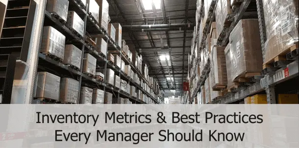
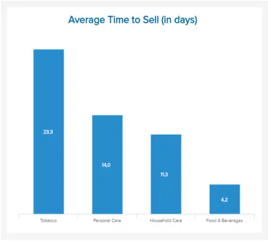
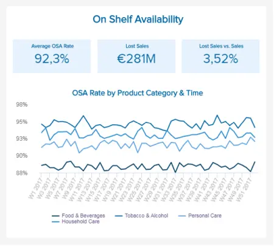

目录

[1） 什么是库存指标？](https://www.datafocus.ai/infos/a-beginners-guide-to-inventory-metrics-and-best-practices#definition)

[2） 如何选择合适的库存 KPI？](https://www.datafocus.ai/infos/a-beginners-guide-to-inventory-metrics-and-best-practices#how-to)

[3） 库存指标示例](https://www.datafocus.ai/infos/a-beginners-guide-to-inventory-metrics-and-best-practices#examples)

[4） 动态仪表板上的库存指标示例](https://www.datafocus.ai/infos/a-beginners-guide-to-inventory-metrics-and-best-practices#dashboards)

[5） 库存管理最佳实践](https://www.datafocus.ai/infos/a-beginners-guide-to-inventory-metrics-and-best-practices#best-practices)

在我们残酷的数字经济中，每天每分钟都会收集、存储、分析和优化大量数据。

这些见解究竟有什么作用？他们在每个渠道或接触点为客户和合作伙伴在旅程的每个阶段提供最佳体验。作为商业智能 （BI） 不可或缺的一部分，库存指标 KPI 用于帮助经理和专业人员达到（甚至超越）他们的核心目标，优化流程并提高流程中的业务价值。

 

也就是说，为您的业务设置和跟踪库存 KPI 以评估和提高您的整体绩效非常重要。收集大量数据并不是这里唯一要考虑的事情：知道如何处理、分析和可视化企业最重要的见解是关键。要做出对业务底线产生积极影响的明智决策，您需要拥有完整的数据范围。在这件事上，数据分析和[仪表板设计器](https://www.datafocus.ai/infos/dashboard-designer)软件是一个宝贵的盟友。

在本文中，我们将仔细研究库存管理，提出问题，“哪些绩效指标可以提供帮助？”，了解如何选择正确的库存指标，并概述实际库存指标示例的组合。我们还将研究一些基本的库存 KPI 最佳实践。

在我们的数据驱动之旅即将结束时，我们将探索一个真正的[业务仪表板](https://www.datafocus.ai/infos/dashboard-examples-and-templates-)，向您展示在开发库存数据故事时这些指标如何协同工作。

让我们开始吧。

您的机会：[想要轻松可视化和跟踪库存 KPI？](https://www.datafocus.ai/console/)探索我们的现代报告软件 14 天，完全免费！

## 什么是库存指标？

库存指标是帮助您监控、衡量和评估绩效的指标，因此，为您提供了一些优化和改进流程的关键。他们专注于特定的领域和目标，以发现趋势并确定弱点。

库存指标对于不同的行业可能是通用的，因此您可以将库存指标标识为[物流 KPI，](https://www.datafocus.ai/infos/kpi-examples-and-templates-logistics)但也将其列为[零售 KPI](https://www.datafocus.ai/infos/kpi-examples-and-templates-retail)也就不足为奇了。

通过为您提供每周、每月、每季度或每年要达到的明确里程碑，它们极大地有助于消除猜测。有了它们，您可以获得所需的数据，以做出战略性和更明智的决策，从而对您的业务产生积极影响。事实上，它们可以帮助您推动最有效的行为、策略和决策。除此之外，它们还有助于提高准时交货率、降低运营成本、提高客户满意度或优化运输。

## 如何选择合适的库存 KPI？

要选择最可靠和最有效的库存管理指标，您需要考虑以下一些提示：

- 避免虚荣指标：当涉及到使用专业的[KPI 工具](https://www.datafocus.ai/infos/kpi-reporting)获取指标时，每个人都可能会试图使用最简单、最“令人放心”的指标来捕捉效率——但选择那些反映有效性改进的指标要困难得多。而这些更有价值。同样的话也适用于“虚荣指标”，这些指标使部门的流程看起来不错，但没有提供有关如何提高库存管理有效性的见解。
- 专注于回答业务问题：同样，您应该抵制采用范围过于广泛的指标的冲动：它们将提供的见解不会带来快速而有价值的行动或反应。选择正确指标的关键是始终牢记您的业务战略目标并相应地选择它们。
- 不要忘记您的客户：在库存管理中，复杂且不容忽视的是涉及运营、供应链相关指标和[客户满意度指标](https://www.datafocus.ai/infos/customer-satisfaction-metrics-effort-score-nps-csat/)。事实上，您的客户是将收到您的库存的人：如果他们收到错误的物品，或延迟，或者缺货时间过长，库存看起来完全不受管理，会让他们感到沮丧（他们可能不会经常回来）。
- 监视趋势：将信息与过去的绩效进行比较，或设置可转换为有关库存度量和指标的多个业务方案的[KPI 记分卡模板](https://www.datafocus.ai/infos/kpi-scorecard-examples-templates-to-track-performance/)，将帮助您发现流程中的趋势或效率低下。如果您的缺货率在过去几周或几个月内出现问题，您可以深入挖掘并找出原因。这将帮助您在正确的时间采取正确的行动。
- 不要只依赖数字：数字很棒，但您的增长应该集中在质量、最终用户、客户或合作伙伴上。如果您只关注监控数字，而不关注人方面，从长远来看，您可能会面临业务瓶颈的风险。

选择最适合您的业务和需求的库存指标后，让我们回顾一些示例来说明它们，以及一些要遵守的最佳实践。

## 用于更好管理的库存指标示例

由于成本因素和客户体验对于任何希望在我们残酷的数字时代产生影响的现代企业的库存管理中都是必不可少的，因此我们将研究迎合这两个最重要领域的前 17 个库存 KPI。

### 1\. 库存准确性

简单明了：您需要知道库存中有什么以及通过仓库的库存。通过执行定期周期盘点，为自己配备电子标签将使工作更轻松，并为您提供将您的实物库存与其电子记录进行比较所需的数据。

这是一个可以成就或破坏您的业务的库存 KPI：例如，如果您没有库存，您在电子商务平台上在线销售的产品可能会严重损害您的业务。该指标还有助于发现与运输、接收或会计相关的问题。尽量将此比例保持在 92% 以上。

### 2\. 存货周转率

我们的下一个[KPI 模板](https://www.datafocus.ai/infos/kpi-examples-and-templates-)是库存周转率，查看在一定时期内您的整个库存售出多少次。您可以通过将销售商品的成本除以平均库存来计算它。在高效的生产计划、流程、营销和销售管理方面，这是一个很好的指标。作为一般经验法则：越高越好。

如果您的营业额较低，这可能会指出将库存转化为实际收入的困难——然后您需要在供应链流程的任何时候调查瓶颈在哪里。

### 3\. 缺货率库存 KPI

满足客户的需求对于成功管理公司的库存至关重要，尤其是在快速消费品行业。应不惜一切代价避免导致库存耗尽的事件，尽管某些产品可能由于多种原因而不可用。在这种情况下，重点是监控此速率并确定何时以及缺少什么。

在上面说明的库存 KPI 示例中，您可以看到工作周结束时的缺货率百分比最高。如果您深入研究左侧的数据，您可以立即发现一天中库存率最高的确切时间。具体来说，你可以看到下午有一个特定的峰值，这将使您能够解决这些问题并为未来做好准备。

### 4\. 客户保留和忠诚度

一些研究表明，即使客户保留率仅增加 5%，也会为各行各业带来25% 到 100% 的利润。这是您当然不想错过的某个百分比，是的，客户忠诚度与您的仓库管理和效率直接相关。高效的拣选、包装、准时发货准确的订单将保持客户回头。

此外，满意的客户通常会将您推荐给朋友和亲戚，这种行为比您可以制作的任何诙谐广告都要强大得多。您可以使用[客户服务 KPI](https://www.datafocus.ai/infos/kpi-examples-and-templates-customer-service#net-promoter-score-nps)（例如净推荐值或 NPS）来衡量这一点，以评估您的推荐能力。

您的机会：[想要轻松可视化和跟踪库存 KPI？](https://www.datafocus.ai/console/)探索我们的现代报告软件 14 天，完全免费！

### 5\. 存货的持有成本

最关键的库存KPI指标之一，即库存的持有成本，将显示存储未售出货物时发生的所有费用的总和。这些成本可能包括仓储成本、保险、员工成本以及货物损坏、租金、水电费等。通常，持有成本占公司库存价值的[20%至30%，](https://capital.com/carrying-cost-definition)这一重要百分比使其成为考虑和密切监控的重要因素。

此库存管理 KPI 对于始终准确监控至关重要，因为它将显示您的产量是否应该增加或减少以保持收入和支出之间的平衡。但不仅如此，在[在线商业智能软件](https://www.datafocus.ai/infos/online-bi-tools)的帮助下分析此指标将使您能够快速检查可以进行更改以降低成本的地方（因为如前所述，持有成本是总成本的很大一部分）。

这里要考虑的另一个关键点是，如果你在一个利润率很低的行业，即使是最小的成本也可以发挥极其重要的作用。简而言之，请注意您的持有成本。

### 6\. 仓储成本

此仓库 KPI 评估仓库管理所涉及的费用。订购，存储，装载库存中的货物 - 所有这些都需要资金才能正确执行。还有人力成本，如劳动力、运输和交付，也不应该被遗忘。

衡量仓储成本不是小菜一碟——这就是为什么你应该一丝不苟地做这件事，不要遗漏或忘记任何成本。一旦完成，它就会使整体管理变得顺畅并增加价值，这通常受到高级管理层和投资者的赞赏。

### 7\. 平均销售时间

如果没有平均销售时间，库存 KPI 示例就不完整。特别是在快速消费品行业，需要仔细遵守与食品安全和管理相关的法律，以避免潜在的法律瓶颈。因此，跟踪这一国际知名和美国库存指标对于任何需要尊重国际和当地法律框架的行业都至关重要。

在上面的例子中，我们可以立即发现烟草的平均销售时间最长，其次是个人护理、家庭护理，最后是食品和饮料。这是有道理的，因为食品和饮料的保鲜寿命较短，并且需要比电器更频繁地更换。这是库存控制的 KPI 之一，它将为您提供有关存储流程的有用信息，并为您提供有关如何制定采购策略的更多信息。此外，您可以将此指标与[采购 KPI](https://www.datafocus.ai/infos/kpi-examples-and-templates-procurement)（如成本降低）联系起来，以查看如何分配节省以及平均销售时间如何影响它。在理想情况下，销售时间应尽可能短。

### 8\. 库存与销售比率

此库存 KPI 也面向财务。这是一个有助于评估积压的指标，这也将告诉您您的公司是否能够面对意外情况。它是通过将待售库存除以实际销售的数量来衡量的。

结合库存周转率或库存的持有成本，它将使您更好地了解业务的财务稳定性，但也有助于确定您想要采取的方向（例如尽快出售整个库存）。

为了更详细地分析您收集的信息的财务角度，我们建议您查看我们专注于[金融商业智能](https://www.datafocus.ai/infos/business-intelligence-finance)的页面。

### 9\. 货架可用性

任何想要增加收入和利润的严肃公司都需要评估需求并采取相应的行动，这意味着将产品放在货架上，明显可访问且易于触及。它通常连接到其他库存绩效指标，例如缺货率和销售损失，并涵盖 3 个不同的关键点：货架可用性、商店和仓库可用性。

通过利用高级分析解决方案来衡量此类[操作指标](https://www.datafocus.ai/infos/operational-metrics-and-kpi-examples/)，可以最大限度地减少大部分手动工作。例如，现代软件可以实时跟踪数据并提供高级图表，这些图表将立即触发可操作的见解，因为用户不必手动滚动或在大量论文或电子表格中搜索信息。但是，让我们回到我们的视觉示例。

我们可以看到分析在几周内扩展，并考虑前面提到的产品：烟草、个人护理、家庭护理、食品和饮料。这样，您就可以看到每个产品的开发情况，并检查是否存在某些会导致客户流失的峰值。货架可用性的增加会直接影响销售，并且会认真对待。如果您因此指标而开始损失大量销售额，您的整个业务可能会受到影响，因此将货架可用性放在要定期衡量的关键库存指标列表中至关重要。

### 10\. 订单状态库存指标

实时关注您的订单状态将使您的团队能够迅速应对任何潜在的负面事件。这是将您的业务与客户联系起来的库存管理的 KPI。为了有效地评估您的[供应链指标](https://www.datafocus.ai/infos/supply-chain-metrics-and-kpis/)策略，您需要实时访问订单状态：产品是发货、接收、包装过程中还是取消。这样，您将能够减少补货并努力实现更多的新订单，以保持您的业务发展。如果您发现供应链效率低下，它将影响您的库存，从而影响整体业务。

例如，如果您的订单被取消的百分比较高，则检查原因将是有意义的。零售库存指标的其他调整应侧重于处理速度慢、新订单数量减少或不准确性增加的原因。将此关键KPI库存与您的收入进行比较，因为它也应该增加。

您的机会：[想要轻松可视化和跟踪库存 KPI？](https://www.datafocus.ai/console/)探索我们的现代报告软件 14 天，完全免费！

### 11\. 保鲜期内售出产品的百分比

快速消费品是为减少浪费和提高运营效率而构建的库存管理 KPI 之一，它直观地表示您的库存比例已从货架或商店移出并在其正式保鲜期内完成。

通过提供与到期日期相关的特定时间范围内售出的商品数量的全面细分，您将获得进行战略调整所需的洞察力，以在库存效率、减少浪费和货架空间之间取得完美平衡。使用快速消费品库存指标，您可以查明可能需要更好的数量管理或销售的产品或商品，同时制定促销活动以在合适的时间范围内周转您的库存。提高利润的可靠方法。

### 12\. 售出率

作为零售[KPI 仪表板](https://www.datafocus.ai/infos/dashboard-examples-and-templates-retail)的重要组成部分，此库存指标对于推动最佳零售绩效特别强大。通过售出率，您可以可视化特定时间段内接收和销售的库存之间的相关性。

通过访问这些宝贵的信息，您可以使用这些最有价值的库存 KPI 指标来监控您的销售绩效，并最终对销售和销售流程的关键方面进行有针对性的改进。反过来，您将保持库存流动的一致性，保持生产力和收入增长。

这是您可以使用的最重要的零售库存指标之一。经常跟踪此 KPI，您将为您的库存管理策略奠定坚实、流畅的基础，同时充满信心地扩展业务。

### 13\. 平均库存水平

您的平均库存水平正是您所期望的：一个清晰的可视化效果，概述了您在特定时间段内的平均库存水平。

对于任何希望简化运营的现代企业来说，平均库存水平是最有用的库存健康指标之一，它将为您提供企业全年库存量的准确概述。

通过从等式中删除季节性波动和其他变量，您可以使用此指标来磨练由于损坏、盗窃、收缩或浪费等原因而可能发生的任何库存损失。如果您能够查明这些问题，您就可以正面解决这些问题，防止供应或履行链中的任何进一步损失或效率低下。

### 14\. 缺货率

缺货率是监控在客户确认或下订单时无法履行多少商品或商品的有效方法。

通过使用这些最有见地的库存准确性指标来发挥您的优势，您可以设定明确的履行目标并跟踪每周、每月或每年的进度。通过这样做，您将有能力查明在特定时期内增加或减少缺货率的确切原因，并进行战略调整以改进或更新您的供应链流程以取得成功。

较大的缺货率有时意味着更多的销售额（当然，这是积极的）。了解这一点将为您提供所需的工具，以确保您可以有效地完成所有这些额外订单。

### 15\. 周现有

我们针对制造业以及许多其他库存密集型行业的库存指标中，最重要的一个指标是KPI，它根据时间而不是项目或货币单位来量化投资。

现有周数提供了库存在给定周内实际销售的平均时间的明确概述。这个特定指标如此有效的原因是它能够清除任何障碍，从而减慢商品进入您的系统、销售和前往最终目的地所需的时间。

如果您手头的周数缓慢，很明显您的库存或库存移动缓慢，需要注意。通过快速查明这些问题，您和您的团队可以持续减少手头的周数，让您的库存运转起来，并年复一年地提高您的底线。

### 16\. 毛利率投资回报率

毛利率回报投资 （GMROI） 是那些揭示收入与投资的库存管理指标之一。

您的GMROI将准确告诉您，与在特定时期内您在库存或库存上花费的金额相比，您的企业赚了多少钱。

有了这些信息，您就可以采取措施，通过投资提供始终如一的稳定回报的库存来提高您的 GMROI，同时减少持续使您的业务陷入困境或耗尽预算的项目的支出。对于电子商务企业、零售商甚至制造商来说，它是一款出色的效率驱动工具。

### 17\. 接收时间

作为任何库存管理仪表板的重要组成部分，接收时间是一个 KPI，可深入了解库存流畅度和移动性。

直观地跟踪此指标将使您能够了解您的团队或员工带来库存并将其添加到货架的速度，以及他们准备出售所述库存的速度或效率。

始终如一地对该指标进行基准测试很有用，因为您将能够在趋势出现时发现它们。如果您注意到接收费率的时间变慢，您就会知道您的仓库中潜伏着效率低下的问题。

无论障碍是糟糕的流程还是员工培训或发展问题，您都可以利用您的时间来接收 KPI 以迅速发现它，在问题对您的履行策略产生负面影响之前解决问题。

您的机会：[想要轻松可视化和跟踪库存 KPI？](https://www.datafocus.ai/console/)探索我们的现代报告软件 14 天，完全免费！

## 动态控制面板上的库存指标示例

现在我们已经了解了一些指标，让我们来看看它在实际示例和仪表板上的外观。

### a） 供应链的库存分析仪表板

\*\*点击放大\*\*

以下是在商业智能和数据可视化的帮助下执行的库存管理的一个很好的例证：对供应链经理重要的绩效指标被跟踪并显示在专业仪表板上。在这种情况下，我们可以在动态[的在线数据可视化](https://www.datafocus.ai/infos/data-visualization-tools)概览中看到库存测量指标，例如库存与销售、营业额、持有成本、准确性和库存项目的百分比。此视觉对象将使您能够创建有效的数据故事，该故事将转化为积极的业务成果，因为您将节省分析过程的时间并提高生产力。

要查找更多示例和模板，请查看我们的其他[物流仪表板](https://www.datafocus.ai/infos/dashboard-examples-and-templates-logistics)。

### b） 零售库存分析仪表板

\*\*点击放大\*\*

零售业是另一个严重依赖库存可用性指标和优化管理以增加收入和利润的行业。特别是在在线零售中，消费者只需点击几下即可访问大量产品。这就是为什么拥有涵盖多个接触点并使零售商能够清楚地了解其库存管理的[在线仪表板软件](https://www.datafocus.ai/infos/online-dashboard)在我们面向消费者的世界中至关重要。

退货原因是管理库存策略的最佳指标，它将帮助您确定库存中的哪些产品不适合买家、已损坏或只是交付错误。这样，您将能够更有效地管理库存，并避免将来出现潜在问题，甚至在它们出现之前。

订单最多的卖家将清楚地显示您需要在库存中拥有哪些商品，这样您的业务和潜在收入就不会受到负面影响，[零售分析软件](https://www.datafocus.ai/infos/retail-analytics)将帮助您自动化流程并跟踪大量信息，这在这个竞争激烈的行业中至关重要。

### c） 现代行业组合的快速消费品 KPI 仪表板

之前，我们讨论了在其新鲜度数据 （FMCG） KPI 中销售的商品的平均百分比。现在，我们将查看专门用于该概念的整个[快速消费品仪表板](https://www.datafocus.ai/infos/dashboard-examples-and-templates-fmcg)。

\*\*点击放大\*\*

这个动态库存仪表板具有库存管理 KPI 的凝聚力组合，是一个强大的门户，可以准确、自信地管理供应链中的每个主要齿轮。

每个 KPI 和可视化都旨在提高库存管理流程的可操作性，深入到包括平均销售时间、缺货率、按时全额交付的商品，当然还有在官方新鲜期内售出的商品比例。

由于库存管理的每个 KPI 在仪表板上占用专用空间，因此可以在检查模式或趋势并进行明确比较的同时一目了然地做出快速的实时决策。

例如，在这里，您可以在出现“缺货”问题时进行处理，采取适当的库存补货措施，同时跟踪过去几个月的库存周转率，以纳入您的履行效率计划。

填充这个强大仪表板的每个库存指标示例都有助于消除库存管理策略的“如何”和“为什么”的猜测。通过将其用作您的物流神经中枢，您可以生动地描绘您的供应链，并确保所有相关人员在正确的时间朝着正确的目标努力。

因此，您将降低不必要的成本，显着挽救浪费或损坏，让您的库存或库存以前所未有的方式流动，并最终扩大您的底线 - 商业增长和发展的关键要素。

## 库存管理最佳实践

正如我们在本文中看到的那样，库存管理不仅限于仓库;制造公司需要有关趋势的数据（季节性信息、价格点、购买行为和模式等），以确保他们始终有足够的数据供零售商使用。零售商需要数据来有效管理他们的补货，而快速消费品来每天带来新鲜产品和优化流程。要掌握库存管理的艺术，这里有一些提示。

### a） ABC分析进行分类

首先，库存管理的一个好技巧是按美元价值实现最有价值到最不有价值的物品的层次结构。一般来说，并非所有库存都具有相同的价值，这将有助于专注于带来最多钱的物品。按如下方式对它们进行分类：

- A-items：具有最高优先级的畅销产品。需要永久的质量审查和定期重新订购
- B项：有价值但优先级中等。每月重新订购通常就足够了。
- C类商品：低优先级库存，通常大量运输，需要最少的重新订购。

由于这样的组织，您可以根据库存的销售方式以及该物品为您的业务带来的价值来组织仓库。优化空间以及简化订单履行是件好事。

### b） JIT – 准时制

准时制是另一种库存管理技术，可帮助零售商进行现金流管理。JIT 意味着您仅在从客户那里获得订单时从供应商处购买所需的东西。对于制造商来说，这种技术可能有点棘手，因为正如我们之前所说，您需要趋势数据才能为零售商提供足够的库存。

如果您是一家电子商务公司，或者如果您构建珠宝、家具、豪华车等定制产品，您的企业将从 JIT 中受益最大;但也作为基于服务的业务（活动、食品、车库等）。

### c） 数据驱动

借助我们上面写的内容，您可以选择最适合您业务需求的 KPI，并随着时间的推移对其进行跟踪。您可能会开始识别模式和趋势，但也认识到瓶颈和不一致之处。所有这些都将帮助您弄清楚如何改进流程并提高效率。

受益于[数据分析工具](https://www.datafocus.ai/infos/data-analyst-tools-software)提供的众多优势，将使您脱颖而出，并最终进一步提高效率。得益于直观的拖放界面，数据整合和分析非常简单。它们还将帮助您轻松可视化您的见解，并通过库存仪表板以有意义的方式传达它们。

### d） 实施质量控制

最后但并非最不重要的一点是，质量控制对任何企业都至关重要，应尽早实施。为了确保客户满意度和稳定的业务增长，必须有质量控制流程。

从接收物品时要遵循的程序清单，到损坏监控和产品合规性，确保您的所有员工都了解应遵守的整个质量控制过程。当物品不符合公司的质量标准时，他们会将其退还给供应商，并降低库存水平。

您的机会：[想要轻松可视化和跟踪库存 KPI？](https://www.datafocus.ai/console/)探索我们的现代报告软件 14 天，完全免费！

## 关键要点库存指标

我们已经解释了库存管理绩效，提供了示例、最佳实践，并通过仪表板完成了最后的框架，所有这些部分可以组合在一起讲述一个有效的故事，使您能够优化库存管理流程并年复一年地提供宝贵的结果。

当我们查看一些事实和数据时，我们发现对于零售业来说，库存平均[只有 63% 的时间](https://www.conveyco.com/inventory-statistics/)准确，或者如果公司使用集成订单处理进行库存管理，他们的生产力可以提高[25%，](https://financesonline.com/supply-chain-statistics/)库存效率提高 30%。这些数字勾勒出了一个令人不安的场景：大多数库存管理专业人员都意识到这种情况和他们的工作可以得到改善，软件可以提供帮助——但他们还不确定如何实现这一目标。

库存经理有很多职责，基本上充当企业的空中交通管制员。为了取得成功，库存经理需要采取协作方法开展工作，同时利用每个相关的数据链来发挥自己的优势。

库存效率指标和KPI库存数据是黑暗中的明灯 - 在最重要的时候是您的顾问和指南。从库存仪表板见解中榨取最后一滴价值，您将获得丰厚的回报。

广泛的供应链原理知识和强大的分析能力将带来持续的成功、进步和成长。使用[在线 BI 工具来](https://www.datafocus.ai/infos/online-bi-tools)设置和跟踪正确的库存指标将确保您能够在出现任何机会时发现它们，同时识别出现的潜在问题。

多亏了这个库存管理最佳实践和指标的小指南，您掌握了一些更好地控制业务的关键 - 现在，唯一的方法是纯粹如何实现它。

要了解如何从 BI 软件中受益，只需试用我们的 14 天[免费试用](https://www.datafocus.ai/console/)版！
