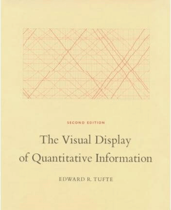
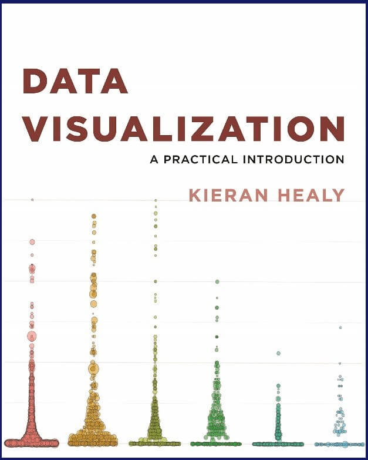
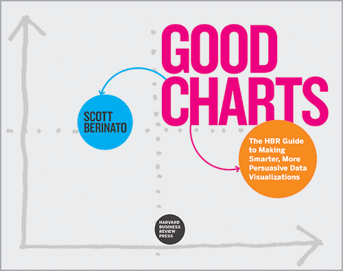
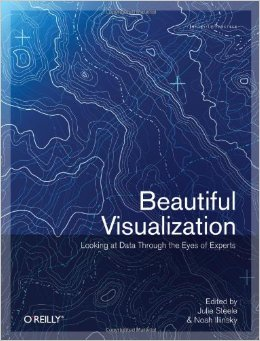
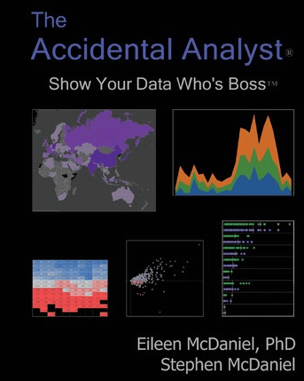
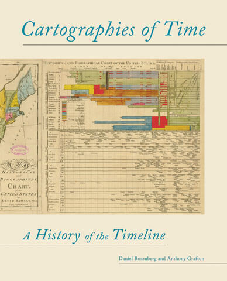
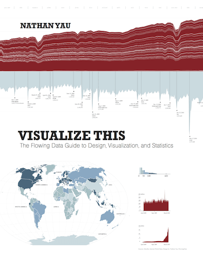
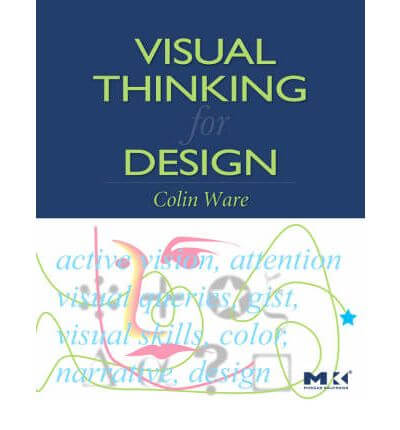

“我们大多数人都需要听音乐来理解它的美妙之处。但通常这就是我们呈现统计数据的方式：我们只显示音符，不播放音乐。” - Hans Rosling，瑞典统计学家

DataFocus正在快速填满你的书架。之前，我们讨论了您需要阅读的 15本[大数据书籍](https://www.datafocus.ai/infos/best-big-data-and-data-analytics-books) ，然后是我们对世界顶级[商业智能书籍](https://www.datafocus.ai/infos/best-business-intelligence-books)的简要介绍，以及我们为初学者和中级用户提供的[最佳 SQL 书籍指南。](https://www.datafocus.ai/infos/best-sql-books)既然您已经了解了数据分析以及数据驱动的商业智能的力量，现在是时候进一步探索如何利用可视化的力量，以简洁、鼓舞人心和可访问的格式有效地传达重要指标和见解。

数据可视化，是数据的图形化表示。这些引人注目的美学描绘是将大量数据和复杂信息简洁地传达给广大受众的最有效方式。成功的可视化具有美感，提供的层次丰富的细节，从而产生更深层次的洞察力和全新的理解。它们也可以是很有趣的和互动性的。

[在线数据可视化](https://www.datafocus.ai/infos/data-visualization-tools)领域正在发展，无论您是数据可视化专家还是刚刚入门，都有大量书籍可以帮助您学习新技能，保持领先地位。

不知道从哪里开始？仅仅在亚马逊上搜索数据可视化这个主题，就会返回超过1.5万个条目。这是大量的数据可视化书籍。其中一些我们认为是关于数据可视化的最佳书籍，有些则不是。

但不要担心，因为我们已经为您进行了研究和阅读，改进了我们的发现，创建了我们认为的世界上最好的 18 本数据可视化书籍的清单。实际上，我们有19本最爱的书，但我们先将 Bernard Marr 的《数据策略：如何从大数据、分析和物联网的世界中获利》列为我们关于商业智能的最佳书籍的榜首，从而为您提供了一个良好的开端。

这个列表没有特别的顺序，但我们向您保证，这些是当今可用的18本关于数据可视化的最佳书籍，您会发现每个人都能找到适合自己的书。

在这里，我们包含了基于可视化历史、理论、心理学、实际执行的散文，以及复杂的图形演示技巧和一本视觉上令人惊叹的咖啡桌书籍，以获取灵感。

但在我们深入研究数据可视化书籍列表之前，这里有一些事实和数据供您参考。

### 数据可视化：你需要知道的

- 传输到大脑的信息中有90%是视觉信息——这证明了数据可视化的力量和潜力。
- 人们吸收高质量信息图表的可能性是纯文本的30 倍。
- 研究表明，如果仅以文字或数字形式提出科学主张，则 68% 的人会认为该信息是准确和真实的。但是，如果在一个简单的图表中呈现相同的见解或指标，这个数字就会上升到97%。
- 利用数据可视化的商业智能策略将为每花费1 美元提供 13.01美元的投资回报率。

现在我们已经确定了可视化在数字时代的重要性和效力，让我们来看看我们最好的数据可视化书籍的纲要。

## 1) Edward R. Tufte 的《定量信息的可视化展示》

如果不包括Edward Tufte，将无法列出数据可视化书籍清单。Tufte被认为是该领域最重要的先驱之一，这确实是现有的关于数据可视化的最佳书籍之一。《定量信息的可视化展示》是他最著名的数据可视化书籍之一。这本书涵盖了数据图形的理论和设计，并提供了 250 个最佳和最差示例的插图。虽然该书在 1983 年出版，但它仍然是亚马逊上的经典和畅销书。Tufte 对核心可视化理论进行了精辟的介绍，贯穿整本书的这些概念上，坦率地说，这本书应该出现在每个数据可视化书架上。

## 2) Cole Nussbaumer Knaflic 的《用数据讲故事：商业专业人士的数据可视化指南》

谷歌前人力运营高级副总裁 Laszlo Bock 以一种无人能及的方式介绍了这本最精美的数据可视化书籍之一：

_“在《用数据讲故事》一书中，Cole 为 Edward Tufte 等数据可视化先驱的工作进行了一个当下的补充。她曾在地球上最受数据驱动的组织工作过，也曾与一些最受任务驱动、无数据的机构共事过。在这两种情况下，她都帮助他们强化了信息和思维。”_

您可能能够创建复杂的、技术性的、色彩丰富的可视化，并为它们加载大量数据。但是，如果您的目标受众无法理解它们，那又有什么意义呢？最后，可视化旨在传达或突出您的数据正在发生的事情——它们应该讲述一个故事。这就是为什么“用数据讲故事”会出现在我们的清单上。

Cole Knaflic的使命是教导读者。“不要简单地展示你的数据——用它来讲述一个故事”，她的作品，我们认为是世界上最好的数据可视化书籍之一，展示了如何超越传统工具，在使用[仪表板讲故事](https://www.datafocus.ai/infos/dashboard-storytelling-with-kpis-presentation-examples)的过程的同时触及数据的根源，以一种每个人都可以访问的方式创建一个引人入胜且内容丰富的演示。

## 3) Kieran Healy 的《数据可视化 - 实用介绍》

如果您正在寻找一本将理论与实践相结合的综合性和实践性可视化方法的书，那么您需要将这本书放在您的书架上。这本书由杜克大学的一位社会学教授撰写，为研究人员和学生提供了有关以创新和连贯的方式使用_R_和_ggplot2_的指导_。_

无论您是数据、统计和可视化的初学者还是高级用户，这本由Kieran Healy撰写的有趣且易读的书都将向您展示可视化的独特世界，它可以有效地用可视化的方式传达信息。

## 4) Scott Berinato 撰写的《优秀图表：制作更智能、更有说服力的数据可视化的 HBR 指南》

2016 年 5 月出版，这是市场上最相关的可视化数据书籍之一。我们喜欢《优秀图表》的原因在于，它可供数据可视化初学者访问，但对更高级的[仪表板设计](https://www.datafocus.ai/infos/great-dashboard-design-examples-for-inspiration)用户同样有用。

Berinato强调了重要的一点，即数据可视化不再只留给专家：数据科学家和专业设计师。新一代的数据可视化工具（如DataFocus）和海量数据使外行可以轻松创建可视化，比电子表格和 PowerPoint 图表更有效地传达想法。在《优秀图表》一书中，Berinato提供了关于可视化如何工作以及如何使用数据来影响和说服他人的宝贵指南。这本书是必读的。

这位作者的另一个亮点是他的第二本书和最近的一本书： Good Charts Workbook: Tips, Tools, and Exercises for Making Better Data Visualizations。这本书的美妙之处在于它的实用部分。这是一本实用的指南，使您能够创建自己的可视化，同时教您如何开发自己的可视化和思维过程。对于任何对数据可视化的实际部分感兴趣的人来说，这本书都是必读的。

## 5) Steven Heller 和 Rick Landers 的《信息图表设计师速写本》

较少关注数据分析，而更多地关注引人注目的演示，《信息图表设计师速写本》是一本数据可视化书籍，它将从头到尾激发您的创造力。

这本数据可视化书特别令人印象深刻的地方在于，它通过世界上最多产的 50 位平面设计师个人速写本，让我们得以一窥他们的想法。通过研究地球上最优秀的可视化专家的创作过程，您将能够发现数据和绘图之间的联系。因此，您将获得创建大量令人惊叹的信息图表所需的工具和灵感，这些信息图表将帮助您展示能够启发和创造价值的关键信息，而不是排除和造成混乱。

## 6) Stephen Few 的《信息仪表板设计：数据一览式监控显示》

不要让平淡无奇的封面欺骗你，或者正如他们所说的：不要以封面来判断一本书，因为这本可视化数据书在可视化方面提供了很多东西。很少有指南能够提供如此广泛的好的和坏的[仪表板示例](https://www.datafocus.ai/infos/dashboard-examples-and-templates)。此外，作者 Stephen Few 对数据可视化和设计理论的原理进行了很好的介绍。如果您想知道[哪个图表以自上而下的方式显示数据](https://www.datafocus.ai/infos/how-to-choose-the-right-data-visualization-types)，那么这本书就是为您准备的。哦，如果你成为 Stephen Few 的粉丝，他有很多可视化和分析书籍可供查阅。

## 7）David McCandless的《知识是美丽的》

这本关于数据可视化的图形化书籍在亚马逊上拥有近乎完美的读者评论，是在数字时代蓬勃发展的绝佳伴侣。

《知识是美丽的》是著名的数据记者大卫·麦坎德利斯 (David McCandless ) 的畅销书，其概念很简单：使用耸人听闻的视觉效果揭示世界真实运作方式的惊人见解，并将这些知识用于自己的创新。

如果您希望转变引人注目、令人瞠目结舌的美学概念，在有意义的层面上与他人联系，同时产生真实的结果，那么这将是您拥有的最好的数据可视化书籍之一。

## 8) Manuel Lima 的《圆之书：知识领域的可视化》

作为广受好评的“树木之书与视觉复杂性”的后续，这本关于另类且极具价值的数据可视化的书籍深入研究了数千年来的循环信息创新和设计。

作者Manuel Lima将各个时代一系列千变万化的鼓舞人心的视觉设计与令人惊叹的现代可视化实例相结合，以一种令人兴奋、引人入胜和同等实用的方式将人类关系的持久概念与可视化联系起来，并将其应用于数据。是当今可用的可视化数据最佳书籍之一。

## 9) Julie Steele、Noah Iliinsky 的《美丽的可视化，专家眼中的数据》

这本书是 O'Reilly 的“美丽”系列的一部分，每本书都是该领域工作人员的随笔合集。由Julie Steele和 Noah Iliinsky撰写的《美丽的可视化》，通过考察 24 位可视化专家的方法，描述了一些著名可视化的设计和开发。

这本数据可视化书的一大优点是作者从不同的角度处理他们的项目：艺术家、设计师、评论员、科学家、分析师、统计学家等等。主题包括：

- 通过简单的可视化练习讲故事的重要性。
- 颜色以及它如何传达我们的大脑在我们意识到它之前识别的信息。
- 通过精美描绘的民用空中交通可视化揭示航空旅行的疯狂。

## 10) Eileen 和 Stephen McDaniel 的《意外分析师：向您的数据展示谁是老板》

在我们的可视化数据最佳书籍纲要中，下一本是《意外分析师》。“数据分析师”这个词突然成为你工作描述的一部分了吗？随着[可视化分析工具](https://www.datafocus.ai/infos/visual-analytics)已成为商业世界中越来越重要的一部分，我们中的许多人都急于加快速度，并以最佳容量使用重要的数字指标。如果您突然可以访问大量数据，但不确定如何处理这些数据，那么您应该打开这本书。

McDaniel 使用图解示例提供了一个清晰、循序渐进的分步框架，以帮助您理解和应用分析过程来找到现实世界问题的答案，并提供一个有效且视觉上令人印象深刻的分析。

## 11) Alberto Cairo 的《功能性艺术》

数据记者Alberto Cairo是数据可视化书籍不必枯燥的一个很好的例子。在《功能性艺术》 中，Cairo展示了如何在坚持数据即最佳实践的同时创作出精美且引人入胜的作品。

完成《功能性艺术》的阅读后，您可以继续阅读Cairo最近发布的《真实艺术》：用于交流的数据、图表和地图”。他关于可视化、信息图表和数据新闻的博客也是一个宝贵的资源。

## 12) Daniel Rosenberg 的《时间制图：时间线的历史》

这本书不会帮助您在下周的董事会会议上启动并运行您的https://www.datafocus.ai/infos/bi-dashboard-best-practices">商业智能仪表板，但历史爱好者将会被从 1450 年至今的欧洲和美国时间图形表示的综合历史所吸引。随附的图形证明可视化不仅仅是一门现代科学。早在仪表板概念出现之前，我们就一直在努力争取时间！

## 13) 《可视化：设计、可视化和统计的流动数据指南》，Nathan Yau

作为近期最有价值的可视化数据书籍之一，数据专家Nathan Yau在他的杰作《可视化》中提供了另一本关于可视化和如何处理现实世界数据的实用指南。我们推荐这本彩色的书，以充分利用关于如何用数据可视化和讲述故事的分步教程。

对于开发人员来说，有 R、Python 和 JavaScript 中的代码示例。Yau 的网站flowingdata.com是各种层次的可视化的另一个重要来源，它还展示了有趣的数据可视化实验。

## 14) Sandra Rendgen、Julius Wiedemann 的《信息图形》

寻找灵感？或者只是热爱数据，将其视为一门艺术？最漂亮的数据可视化书籍之一，是一本很棒的茶几书，或者当您陷入数据困境时，可以放在办公桌旁边。

这本书真的是应有尽有，提供来自世界各地的 400 多个信息图形示例，涵盖新闻艺术、政府、教育、商业等。关于数据可视化历史和理论以及数据新闻的介绍性文章也很值得一读，随附的图片值得一看。

## 15) Colin Ware 的《设计的视觉思维》

这本书不是关于可视化的教程。它甚至不是专门关于数据的。事实上，这是对人类视觉感知和设计发展科学的敏锐研究——它是一本必读的书。包括可视化设计师在内的各类设计师很快就会发现，这本书提供了他们可以利用的视觉和认知科学的实用指导。更好地掌握设计和认知心理学将帮助您了解最终用户如何看待您的工作。这种理解将使您成为更好的可视化设计师。

## 16) Jacques Bertin 的《图形符号学：图表、网络、地图》

我们有幸请到了另一位可视化先驱 Jacques Bertin 来完成了这份清单。Bertin 的《图形符号学》最初于 1967 年以法语出版，在信息设计理论中占有重要地位。

第一部分以 Jacques Bertin 作为一名制图师的实践经验为基础，试图将图形沟通的原则与应用于书写和地形的标准规则的逻辑相结合。第二部分将 Bertin 的理论带到现实，对图形技术进行了深入研究，包括 1,000 多张地图和图表中的形状、方向、颜色、纹理、体积和大小。

## 17) 《数据可视化：数据驱动设计手册》，作者 Andy Kirk

《数据可视化：数据驱动设计手册》被《金融时报》评为_“数据极客六本最佳书籍”之一，由_Andy Kirk撰写，提供了对该领域的清晰、简洁和易懂的介绍。

凭借大量精心挑选的[数据可视化示例](https://www.datafocus.ai/infos/best-data-visualizations)以及丰富的现实世界的技巧、方式、方法和见解，这确实是入门数据可视化方面最好的书籍之一。

语言通俗易懂，建议实用，除了一本实体书外，您还可以获得全面的[在线数据分析工具](https://www.datafocus.ai/infos/data-analysis-tools)和支持，其中包括一些练习，以便您练习技能。

## 18) Stephen Few 的《给我看看数字：设计启发性的表格和图表，第二版》

虽然这绝不是一本最近的可视化数据最佳书籍（也是我们清单中的第6本书的作者 Stephen Few 的书），但如果您想完善您的数据可视化书籍列表，这确实是必不可少的阅读。

这本开创性的书籍深入挖掘了可视化的基础，为设计表格和图表提供了宝贵的现实世界指南，以使用您的数据创建叙述，并以一种能够产生积极响应的格式呈现给您的受众。

如果您想从那些有助于您的可视化效果的构建模块开始，这是一本您应该从头到尾阅读的书。

总而言之，这是我们列相出的关于数据可视化的最佳书籍清单：

1. Edward R. Tufte 的《定量信息的可视化显示》
2. Cole Nussbaumer Knaflic 的《用数据讲故事：商业专业人士的数据可视化指南》
3. Kieran Healy 的《数据可视化——实用介绍》
4. 《优秀图表：制作更智能、更有说服力的数据可视化的 HBR 指南》，作者：Scott Berinato
5. Steven Heller 和 Rick Landers 的《信息图表设计师速写本》
6. Stephen Few的《信息仪表板设计：数据一览式监控显示》
7. David McCandless的《知识是美丽的》
8. 曼努埃尔·利马（Manuel Lima）的《圆之书：知识领域的可视化》
9. Julie Steele、Noah Iliinsky 的《美丽的可视化，专家眼中的数据》
10. Eileen 和 Stephen McDaniel的《意外分析师：向您的数据展示谁是老板》
11. Alberto Cairo 的《功能性艺术》
12. Daniel Rosenberg的《时间制图：时间线的历史》
13. Nathan Yau的《可视化：设计、可视化和统计的流动数据指南》
14. Sandra Rendgen、Julius Wiedemann的《信息图形》
15. Colin Ware 的《设计的视觉思维》
16. Jacques Bertin 的《图形符号学：图表、网络、地图》
17. Andy Kirk 的《数据可视化：数据驱动设计手册》
18. 《给我看看数字：设计启发性的表格和图表，第二版》，Stephen Few

现在，是时候摆脱那些 Excel 电子表格，忘记那些静态表格，开始用您的数据讲述一个真实的故事了。正如您已经收集到的那样，数据可视化是从触手可及的指标和见解中榨取每一滴价值的最佳方式，现在您已经拥有成功所需的工具，是时候开始了.

在等待书籍到达的时候，您是否想要提前决定应该开始构建什么样的数据可视化？查看我们的30天 [试用版](https://www.datafocus.ai/console/)，完全免费！
