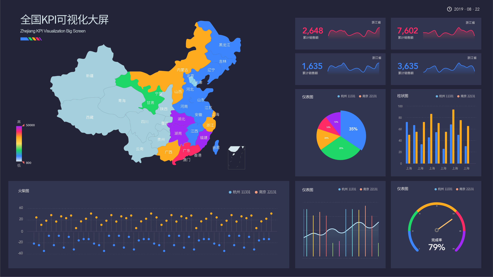

近年来，由于大数据等新兴技术和理念普及，电子商务等大量依托于数字化运营的行业迅猛发展。以此为依托，以数据分析为中心的各类应用和管理也层出不穷，以最大化的服务于企业的决策和运营。为此，很多企业聘请了专门的团队，或干脆购买了类似于DataFocus、Power BI等BI工具。而对于TO C企业来说，比如电商行业，数据分析很多时候应用到的不仅仅是关于企业的临时需求或是会议需要，更是日常做决策的基准，因为数据分析所反映的内容往往是比较客观的。那么对于店铺来说，日常的数据分析就显得尤为重要，无论是专人整理还是使用智能报表，甚至是可视化大屏，都需要包含一定的数据维度。本篇就为大家整理一些常见的日常店铺数据分析维度。

首先自然是大指标数据，突出在屏幕中间或是显眼位置。如会员基数、店铺总业绩以及近三个月的复购率。强调一下最后一个指标，因电商行业每隔一小段时间都有可能发生大的变化，比如客户的购买心态，店铺的运营情况，市场的变化等等。因此近三个月能够较为科学的反映客户的复购率情况，基于品牌不同的类目性质，如耐用品可向后推延。

然后是新老客数据。如新老客销售额占比、昨日成交人数、UV、客单价和客件数。其中新老客销售额占比可以和客单价客件数进行交叉分析，整理为组合报表，以反映新老客的客单价和客件数，更好的洞察新老客的购买和转化情况。

第三是微信数据。比如新增粉丝数、净增粉丝数、发送消息数以及浏览UV和评论数。新增粉丝数一般反映的是某一个活动或是某一篇文章所带来的短期效益，而净增粉丝数反映的是一段时间内较为长期的结果，因为掉粉的原因并不是偶然因素。

第四是热销类目数据。比如行业访客数、行业客单价、行业支付宝金额占比、行业交易指数等。这类数据主要来源于各个平台，可以下载为EXCEL后进行上传布局，也可直接使用BI工具对接聚石塔等数据中台的接口抽取数据。

最后是对于某些企业来说有效的特殊数据。比如催付回款率和生日登记人数。比如在大促前的预售，就有必要加入“催付回款率”一栏，以让定金有一个后续效益。而生日登记人数适用于客户体验相对重要的品牌，比如一些服装、电器等类目。能够让客户有宾至如归之感，更好的传播口碑和引起复购。
