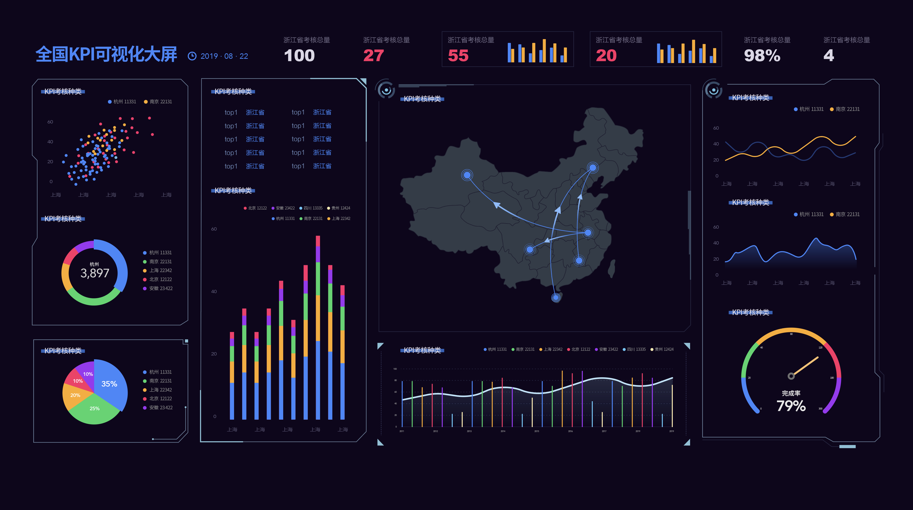

近年来，由于大数据等新兴技术和理念普及，电子商务等大量依托于数字化运营的行业迅猛发展。以此为依托，以数据分析为中心的各类应用和管理也层出不穷，以最大化的服务于企业的决策和运营。为此，很多企业聘请了专门的团队，或干脆购买了类似于DataFocus、Power BI等BI工具。而对于TO C企业来说，比如电商行业，每个阶段的数据复盘是很多老运营和企业决策者非常看重的一环，决定着店铺未来的决策走向。我们交流过的很多店铺每月或每周都会开展数据复盘会议，或是让数据分析师出一个每周或每月的报表。以前我们分享过企业每日的数据大屏维度，同样的，今天我们来分享企业每周或每月数据应包含的维度。

首先是基础数据。应包含DSR走势、客服能力、仓库能力以及负面评价数据。DSR走势之所以被重视的原因是很多客户看店铺印象的第一眼就是DSR，如果是全线飘绿，很大程度上就会影响潜在消费者的购买欲望和店铺形象，甚至还有可能因为口碑的原因恶化。还有仓库的能力数据，可以防止爆仓超货等灾难的发生。

第二是交易数据。包含类目销售占比、退款率/缺货退款率、包邮卡人群回购等。尤其是退货率和退款率，若是店铺每月的退款率居高不下，就需要进一步钻取商品、客服、页面反馈等详细的数据，以排查原因。

第三是竞品数据。这一块我们以前分享过专门的一篇文章。这里主要包含流量指数、交易指数、加购/收藏/搜索、售后率/速度、中差评以及微淘指数，这些数据都是比较容易获得的，也有很多我们合作的品牌有专人每天专门负责收集此类数据。

第四是流量数据。比如行业大盘流量、渠道流量及转化、新老客人数占比、新老客转化率。重点说一下渠道流量及转化，现今流量成本越来越高，好的渠道是获得流量的重要来源，比如很多企业都开始搭建自己的私域流量池子，像是社群运营等。

第五是粉丝数据。比如会员占比、微淘互动行为、粉丝流量分布、粉丝付款率、粉丝爱好（前十）。粉丝是最重要的潜客之一，其已经对店铺或是店铺产出的内容有好感，属于高质量潜客，大型活动后可以交叉流量数据中的新老客数据进行综合分析。

最后是商品数据。主要包含商品流量同期对比、退款商品TOP5、收藏/加购/付款数据。这一块相信还是比较好理解的，退款商品TOP5是一个动态的分析，比如选取5个区间或是连续分析5次后，若是有“常驻”的TOP5，就可以针对性的进行改进。
