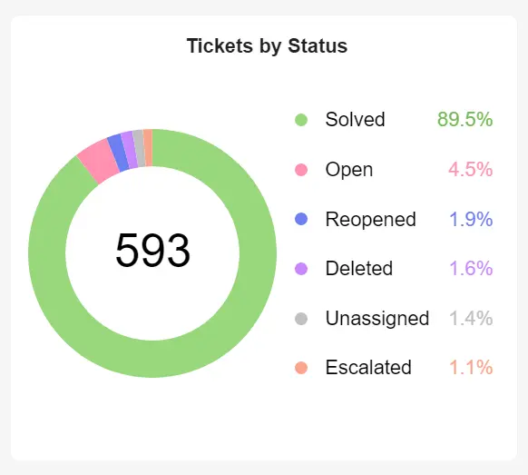
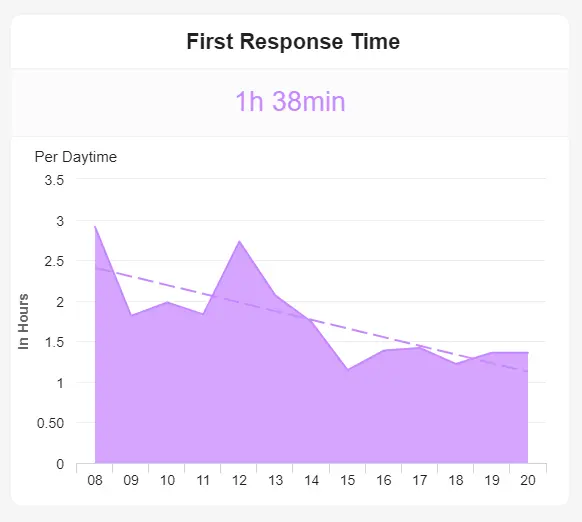
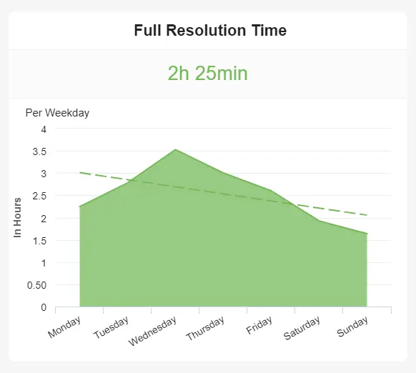

在当今的商业世界中，竞争非常激烈。撇开行业、利基或行业不谈，要在不断发展的数字环境中生存和发展，使用可衡量的[在线数据分析](https://www.datafocus.ai/infos/data-analysis-tools)和绩效指标至关重要。

为了在信息时代取得成功，您必须让您的内部人才和客户满意。事实上，客户体验 （CX） 是各行各业的主要品牌差异化因素之一，在对当今数字原生消费者的重要性方面超过了价格和产品等因素。

通过选择[KPI 示例](https://www.datafocus.ai/infos/kpi-examples-and-templates)的动态组合来跟踪、衡量和预测公司面向客户的活动的成功，您将在竞争中脱颖而出。

使用适当的帮助和服务台指标以及[KPI 报告](https://www.datafocus.ai/infos/what-are-kpi-reports-examples)将使您能够进行持续增长和成功所需的改进。

为了正确看待这一概念，我们将探索帮助台指标的价值，并考虑实际服务 KPI 报告的组合。

让我们开始吧。

您的机会：[想要轻松可视化和跟踪帮助台 KPI？](https://www.datafocus.ai/console/)探索我们的帮助台分析软件 14 天，完全免费！

## 什么是帮助台 KPI？

帮助台 KPI（或服务台 KPI）是以企业的客户服务和支持活动为中心的绩效指标。这些 KPI 包括首次响应时间、问题解决率、满意度和其他面向消费者的重要指标。

俗话说：被衡量的东西可以改进。您的客户服务运营也不例外。

通过获得这种级别的洞察力，可以发现趋势，利用优势，识别劣势，并作为一个组织变得更加有凝聚力、一致、成功和智能。

如前所述，客户体验对于数字时代的商业成功和发展至关重要，通过使用帮助台指标和[在线数据可视化](https://www.datafocus.ai/infos/data-visualization-tools)，您可以一次一个地推动自己领先。

服务台 KPI 深入到与客户的问题和来自各种形式的媒体（包括电话、网络聊天或电子邮件）的请求相关的区域。这些[运营指标](https://www.datafocus.ai/infos/operational-metrics-and-kpi-examples)衡量运营的成功与否。为了使服务台保持成功，沟通是关键。

帮助台的主要作用是确保最终用户（客户、消费者和业务合作伙伴）顺利、及时地获得有关其问题、请求和疑问的适当帮助。

服务台报告指标和关键绩效指标旨在帮助您的业务面向消费者的工作持续增长、成功和改进。帮助台指标将使您能够使每个客户服务接触点都做到最好。

## 为什么帮助台和服务台KPI很重要？

服务台指标和关键绩效指标非常强大，可让您改善业务，鼓励客户忠诚度并在此过程中提高您的底线。

如果在设定目标和提供数据指导的同时有效地对绩效进行基准测试，您将只能达到企业客户支持潜力的一半。

除了使用服务台 KPI 的这些明显好处之外，以下是跟踪这些指标对业务持续成功至关重要的其他一些原因：

- 清晰：您将清楚地了解需要集中精力提高服务性能的位置。例如，如果您的一些座席表现不佳，您将能够更深入地了解原因，并准备好通过提供培训、支持和激励来采取正确的方法。反过来，这将提高您的[客户满意度指标](https://www.datafocus.ai/infos/customer-satisfaction-metrics-effort-score-nps-csat)。
- 问责制：服务台的 KPI 将有助于让人们在几个面向客户的关键领域对自己的绩效、职责和职责更加负责。如果数据以清晰易懂的格式呈现，例如[客户服务报告](https://www.datafocus.ai/infos/customer-service-reports)，则证据确实会在布丁中。这意味着您企业中的每个人都需要为自己的行为承担责任，从而使您的组织更强大、更高效。对自己的行为负责通常会提高参与度。如果您使用数据来帮助您的员工变得更加负责，您可以为他们提供更多的自主权，这将进一步推动他们的绩效。
- 参与度：通过访问企业整个支持流程的全景快照，您将能够对服务级别、消费者接触点、内容和通信进行重大改进。通过这样做，您将显着提高您的参与度，这将对您的品牌权威和面向消费者的整体绩效水平产生积极影响。
- 忠诚度：在这种情况下，KPI 驱动的忠诚度在两个层面上起作用：客户忠诚度和员工忠诚度。简而言之，如果您的支持人员快乐、积极主动且敬业，他们会更忠诚，表现更好;如果您的客户对您为他们提供的帮助感到满意，那么您获得回头客的机会将成倍增加。
- 创新：服务台 KPI 报告提供了一定程度的愿景和数据驱动的洞察力，使您能够可持续地简化所有消费者支持流程。通过使用[在线报告工具](https://www.datafocus.ai/infos/online-reporting)，您将确保最大的效率并更好地适应变化，同时赢得时间专注于创意计划。反过来，帮助台 KPI 指标将提高您的品牌声誉，同时推动您领先。

“一个公司的品牌就像一个人的声誉。你通过努力把困难的事情做好来赢得声誉。

## 前 15 个帮助台 KPI 示例

现在我们已经确定了这些指标的强大功能和业务增强潜力，是时候探索一些现实生活中的例子了。这些是您需要跟踪的帮助台 KPI，以实现最佳的[客户数据管理和](https://www.datafocus.ai/infos/customer-data-management-best-practices)服务驱动的业务绩效。

在这里，我们来看看 15 个顶级指标，这些指标将帮助您始终如一地满足买家的需求、超越预期并飙升您的品牌声誉。

### 1\. 按状态划分的机票

我们的服务台 KPI 示例中的第一个示例（按状态划分的工单）是一个必须跟踪的指标，因为它可以清楚地了解您的企业收到的支持工单数量以及相应的工单状态。

通过定期监控您的客户查询工单状态（新的、未结的、待处理的、暂停的、已解决的、已关闭的），您将能够跟踪客户服务运营的整体绩效和响应能力，让您有机会做出重要的改进，同时提供内部帮助，从而显着提高您的消费者满意度水平。

### 2\. 第一反应时间

您的第一响应时间 （FRT） 至关重要，因为它衡量从收到消费者询问到代理商进行初始通信之间的平均时间。

此帮助台模板对满意度和忠诚度有重大影响，因此保持尽可能低的 FRT 应该是您企业面向消费者的主要优先事项之一。该指标将帮助您随着时间的推移保持FRT的可视化日志，为持续增强您的支持策略提供了绝佳的机会。

### 3\. 顶级服务代理

仅不敬业的团队成员每年就使美国公司损失高达5500亿美元。如前所述，支持、吸引和激励员工是组织持续服务成功不可或缺的一部分。

表现最佳的座席指标以排行榜格式呈现，提供客户支持团队各个成员绩效的快速快照，让您庆祝积极的成就，帮助那些需要额外培训的人，并因此 - 使您的服务部门尽可能做到最好。

### 4\. 净推荐值

您的净推荐值 （NPS） 是您最宝贵的客户服务指标之一，因为它深入分析了您的消费者向他人推荐您的服务的可能性。您可能知道，今天的消费者最看重同龄人的意见。

使用此必须跟踪的服务台 KPI，您可以检查您的“发起人”、“被动者”和“批评者”的数量，查看您的整体 NPS 分数，并根据改进此指标制定策略，从而优化客户服务部门的整体绩效。

NPS 是一个重要的以客户为中心的绩效指标，可帮助您保持品牌声誉并确保您的业务继续适应以满足消费者不断变化的需求——帮助台指标行业标准。

### 5\. 利用率

高效、有凝聚力和周到的客户支持的基石之一是确保团队的每个成员都能充分发挥其潜力。除了保持座席的参与度和积极性外，利用他们的优势或发挥他们的生产力潜力将使您的服务产品从平均水平转变为卓越。

也称为占用率，此指标将帮助您以极高的准确性监控整个支持团队的工作量，同时深入了解单个员工的输出。

我们的利用率指标以可访问的条形图格式呈现，可让您清楚地了解您的团队在真正以支持为中心的任务上花费的时间百分比。如果您发现利用率或支持输出滞后，您将能够迅速找到问题的根源，在必要时提供培训或更新您的策略。

您的机会：[想要轻松可视化和跟踪帮助台 KPI？](https://www.datafocus.ai/console/)探索我们的帮助台分析软件 14 天，完全免费！

### 6\. 客户满意度

在消费者支持方面，底线是：如果您的客户对您的服务不满意，那么您做错了什么，您需要修复它。

我们的客户满意度指标特别有效，因为它可以一目了然地概述客户在特定时间范围内的整体满意度。

根据客户满意度得分 （CSAT） 指标（通常以 1-5 的等级衡量），您可以使用这个最基本的服务台性能指标来衡量客户如何看待您的方法。该指标与净推荐值 （NPS） 见解最有效。

### 7\. 首次接触解决率

作为任何技术支持指标仪表板的关键组成部分，首次联系解决率 （FCR） 显示团队在初始联系点解决的工单百分比。

在数字时代，有如此多的渠道和接触点需要管理，通过尽可能少的步骤或跟进来解决客户的问题将显着提高您的效率和满意度。

通过能够根据不同的查询或问题轻松分析您的首次联系解决方案，您可以发现新兴趋势并制定明智的策略，以持续提高您的首次联系成功率。

### 8\. 按类型划分的门票

了解工单类型和客户请求的性质对于企业支持服务的持续成功和发展至关重要。

作为我们最有用的服务台绩效指标之一，按类型划分的工单提供了您的座席在设定的时间段内处理的主要请求的可理解的可视化快照。

请求类型和查询的性质因企业而异，具体取决于规模、模型和部门。尽管如此，通过定期跟踪这些支持台指标，您将获得最突出的查询类型的准确概述，从而使您能够相应地准备资源或策略。反过来，这将增加产量，提高您的服务级别，并最终提高忠诚度。

### 9\. 按渠道划分的门票

在数字时代，似乎有无数的渠道和接触点需要管理。通过牢牢掌握您的每一个主要支持渠道，您将确保您提供的支持是风度翩翩、广泛且适合现代的。

作为我们最重要的帮助台指标之一，按渠道开票是了解支持查询主要来源的一种快速有效的方法。它为您提供了如何分配工作的全面概述。

使用这个易于理解的条形图样式指标作为工作指南，您可以立即看到大部分票证的来源。然后，您可以使用上述指标的组合（特别是首次响应时间和满意度）进一步[深入了解](https://www.datafocus.ai/infos/drill-down-drill-through-reports)每个渠道（根据参与度分配时间和精力）。

通过分析每个渠道，您可以解决任何潜在的问题或效率低下的问题，并确保始终如一的高水平服务。这将加速您的业务增长和成功。

### 10\. 平均解决时间

在我们的顶级帮助台指标和 KPI 概述中，接下来是平均解决时间，也称为完整解决时间。

使用专业的[KPI 工具](https://www.datafocus.ai/infos/kpi-reporting)生成，此重要的可视化效果将为您提供准确的衡量标准，即请求或查询从提出时起平均需要多长时间才能解决问题，不包括非工作时间或非工作时间。代理成功完成请求的速度越快越好。因此，如果您发现平均解决时间滞后，您可以抓住问题的核心并改进流程（或在需要时提供培训）。

### 11\. 每张机票的费用

每张票的成本是一个基本的服务台仪表板指标，它将向您显示解决请求平均需要多少预算。

通过定期对该指标进行基准测试，您将生动地了解您的支持代理和流程的效率，同时了解您最常使用哪些资源来完成工作。有了这些信息，您可以将任何问题扼杀在萌芽状态，同时全面创建更具成本效益但更流畅的流程。

### 12\. 重复访问

重复访问如此重要的原因很简单：如果客户或客户不断找到通往您的服务台的路，很明显他们的查询没有得到解决或他们的问题没有得到解答。

如果您发现重复访问正在增加，您可以立即采取行动并采取措施来提高您的支持解决成功率。例如，您可能会发现您需要为座席提供更个性化的培训，或者需要使您的沟通更加简洁。无论您发现什么，您的重复访问量指标都将帮助您更一致地满足客户请求。

### 13\. 客户流失

在我们高度互联的数字时代，客户可以通过滑动屏幕或单击按钮来与竞争对手联系或取消订阅。

也就是说，为了降低流失率并提高保留率，跟踪客户流失等帮助台仪表板指标至关重要。当您定期跟踪此关键绩效指标时，您的支持代理和决策者将获得他们需要的信息，以了解在共享内容或通信以提高客户忠诚度的内容或通信时，将服务工作放在哪里。这在当今残酷的商业环境中至关重要（尤其是当您认为留住现有客户比吸引新客户在财务上更有效时）。

### 14\. 质量率

要达到或超过您的绩效目标，质量是关键，而这正是最动态的服务台 KPI 的全部意义所在。

根据支持中心服务的整体成功和感知，此动态指标将根据客户反馈呈现趋势、模式或数字。通过要求他们对与您的座席的沟通质量进行评分，您将很快发现您是否始终如一地满足客户的需求，同时保持积极的品牌声誉。

如果您确实发现质量率存在任何差异，您将能够在问题滚雪球之前快速准确地采取行动。

### 15\. 平均回答时间

平均应答时间量化了支持代理从呼叫在系统中激活开始应答呼叫的速度。

这个有用的指标根据秒数分解为可消化的参数，将清楚地描绘出呼叫系统的整体效率。如果您发现许多退回的呼叫或应答或转接时间较长的趋势，您将获得调整人员配备策略或提供随叫随到培训所需的信息，以帮助您的座席更高效地解决查询，并确保您的呼叫处理策略流畅，从而减少应答时间并提高客户满意度。

以下是我们详细讨论的前 15 个帮助台 KPI 和指标的摘要：

- 按状态分类的门票
- 第一响应时间
- 顶级支持代理
- 净推荐值
- 利用率
- 客户满意度
- 首次联系解决率
- 按类型分类的门票
- 按频道划分的门票
- 平均解决时间
- 每张票的费用
- 重复访问
- 客户流失
- 质量率
- 平均回答时间

您的机会：[想要轻松可视化和跟踪帮助台 KPI？](https://www.datafocus.ai/console/)探索我们的帮助台分析软件 14 天，完全免费！

## 通过帮助台仪表板将所有内容整合在一起

我们已经确定了使用正确的帮助台指标仪表板是多么宝贵。现在，我们将探索两个将它们结合在一起的[Zendesk 仪表板](https://www.datafocus.ai/infos/dashboard-examples-and-templates-zendesk)示例。

### 1\. 日常运营仪表板

主要关键绩效指标：

- 门票和门票状态
- 第一响应时间
- 平均解决时间

为了简化您的日常客户支持流程，使用交互式和可定制的可视化[数字仪表板](https://www.datafocus.ai/infos/digital-dashboard-definition-and-examples)是前进的方向——而这个特定的平台只是门票！

我们的日常运营平台包含一系列服务台 KPI 示例，旨在提供完整的物流透明度，同时使客户服务主管能够根据您业务的所有关键支持领域做出自信的数据驱动决策。

在这个例子中，“工单和工单状态”、“第一响应时间”和“平均解决时间”在视觉上和谐地协同工作，以创建一个集中的客户支持神经中枢。

当涉及到客户服务部门的日常运营时，很容易不知所措。客户拥有比以往更多的接触点。如果您想很好地管理这些接触点，在一个中心位置拥有正确的[Zendesk KPI](https://www.datafocus.ai/infos/kpi-examples-and-templates-zendesk)是确保成功的方法。

凭借有关首次联系解决率和平均解决时间的宝贵数据，以及有关工单状态和座席绩效的关键见解，功能强大的[BI 仪表板软件](https://www.datafocus.ai/infos/bi-dashboard-tools)将使您能够创建一个现代仪表板，该仪表板提供所有工具，以最大限度地提高您的部门效率，同时更快、更有效地解决消费者的问题。

### 2\. 谈话仪表板

我们下一个重要的日常帮助台仪表板示例以基于谈话的[在线仪表板](https://www.datafocus.ai/infos/online-dashboard)的形式出现，分为四个关键区域。

主要关键绩效指标：

- 回答时间
- 腿部通话时间
- 呼入呼叫失败
- 质量率

这个高度集中的信息中心根据相关因素（如座席活动、入站呼叫成功（包括不成功的呼叫）和效率以及整体质量）的组合，深入分析与支持座席呼叫性能相关的指标。

这个精心安排[的业务仪表板](https://www.datafocus.ai/infos/dashboard-examples-and-templates)是运营和基于绩效的信息的大熔炉，提供动态实时见解、一目了然的数据和指标，以构建未来支持策略或绩效的概况。

此示例采用现代[BI 仪表板软件](https://www.datafocus.ai/infos/bi-dashboard-tools)构建，可快速、明智地做出决策并持续改进呼叫质量和效率，允许您连接所需的所有信息，不仅可以使您的呼叫或联络中心具有财务效率，还可以提高工作效率、响应速度，并更好地满足客户不断变化的查询， 需求和要求。

如果您想提高品牌声誉并可持续地提高客户满意度，这是您需要的日常运营支持台仪表板。

如果您扎实掌握日常运营，您将看到满意度和服务水平的显着提高。这将对您的业务增长产生深远的积极影响。

## 帮助台 KPI 指标最佳实践

现在，您已经了解了我们最好的服务台仪表板示例，并了解了帮助台 KPI 指标的业务提升能力，让我们看一下最佳实践 — 使您能够充分利用数据的概念和注意事项。

### 1\. 专注于您现有的流程

在使用帮助台关键绩效指标时，许多业务决策者会立即查看基于创建全新流程或策略的指标。

虽然服务台指标确实可以帮助您制定新策略，但要考虑的最重要的最佳实践之一是：首先从现有流程开始。通过查看您现有的职能或流程，您将专注于需要衡量或改进的内容，然后再继续实施新计划。

例如，与其使用帮助台 KPI 来设置完全重新设计的在线客户查询旅程，不如首先使用指标来关注首次响应时间和按渠道的支持票证，以提高每个接触点的呼叫处理效率和客户解决率。

一旦您解决了现有的障碍和流程，您将为处理新的流程或策略奠定坚实的基础，从而最大限度地提高数据在流程中的价值。

### 2\. 以稳定的速度推出帮助台指标仪表板

无论您是想使用一个还是多个服务台指标模板，您的最终成功都将取决于您推出所有内容的方式。

通过采取一致但渐进的方法，您将有时间对所有支持代理进行软件和指标培训，这些软件和指标将改善他们的日常职责，同时谨慎集成来自其他来源的任何当前平台数据。

在客户支持、体验和服务方面，数据很重要。如果您可以从一个中央仪表板访问所有相关数据，并且您的所有支持代理都了解如何使用您的服务台报告指标，您将全面优化您的服务计划，而不会发生任何代价高昂的错误或打嗝。

### 3\. 为您的客户提供真正的价值

归根结底，这些指标的存在是为了确保您可以正面满足客户的需求，并为他们提供深层次的个人价值 - 不仅仅是一次性的，而是一致的。

也就是说，为了确保您的帮助台 KPI 仪表板始终针对成功进行优化，您应该定期与客户联系。通过询问您的客户群如何改进您的支持交互和服务，您将对服务台指标和关键绩效指标有深入的了解，这些指标将帮助您使沟通和策略达到最佳状态。

开始对话还将帮助您与客户建立融洽的关系，并为您未来的沟通提供明确的方向。例如，通过激励您的客户通过电子邮件留下反馈，您可以收集情报，帮助您优化支持 KPI 选择，同时提供发送有价值的内容、交易优惠或产品推荐的机会，从而巩固客户忠诚度。

您的机会：[想要轻松可视化和跟踪帮助台 KPI？](https://www.datafocus.ai/console/)探索我们的帮助台分析软件 14 天，完全免费！

## 立即开始您的帮助台分析之旅！

“创新需要成为你文化的一部分。客户的转型速度比我们快，如果我们不赶上，我们就会遇到麻烦。

您永远不应该低估或低估现代卓越客户支持的力量。您能够有效地解决客户的问题，同时在所有渠道和接触点保持同理心和风度翩翩，这将决定您的业务的持续成功。

您的客户服务部门是您业务跳动的心脏——这是您不容忽视的事实。通过在服务台活动中使用正确的 KPI 示例组合，并采用现代支持台指标仪表板和[在线商业智能软件](https://www.datafocus.ai/infos/online-bi-tools)的强大功能，您将以从未想过的方式发展业务。

采用数据驱动的方法制定客户支持策略，您将提高品牌权威，提高消费者保留率和忠诚度，并看到您的底线逐年增长。

立即跟踪这些服务台 KPI 示例，您将全面提高业务绩效。现在是罢工的时候了。

您准备好将客户支持策略提升到一个新的水平了吗？要更深入地了解我们强大的帮助台指标如何改善您的业务并帮助您完成旅程，请立即开始 DataFocus[14 天免费试用](https://www.datafocus.ai/console/)。
