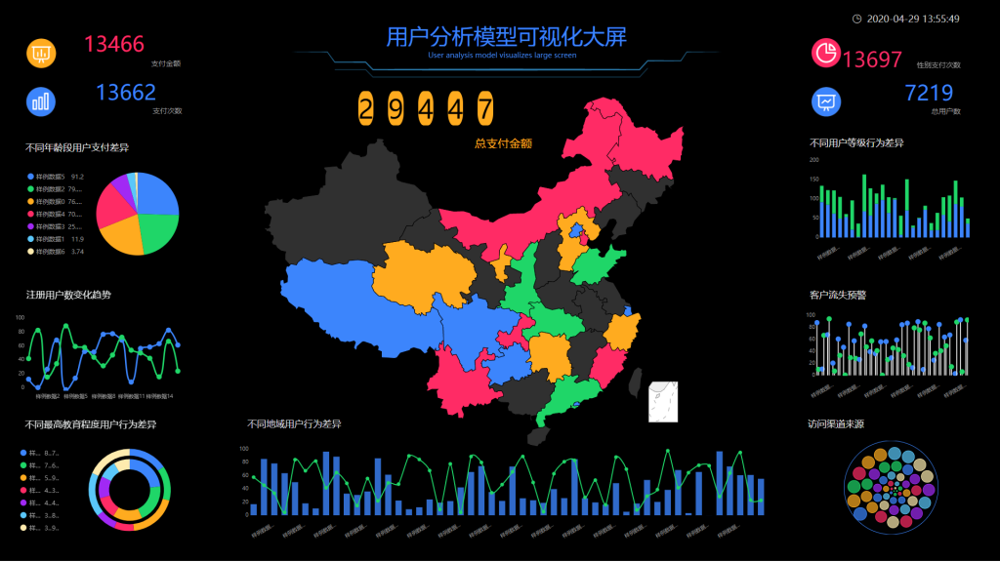

数据分析时第一步也是最重要的一步便是数据的集成。

然而对于很多大型企业和政府而言，每个部门都会有海量业务数据的产生，有对数据保存和使用的需要。另外，不同部门对数据的定义和使用可能存在比较大的差异，所以各部门之间的数据很难互通。这就导致了“数据孤岛”的存在。

如何将这些来自不同类型数据源的海量数据集成，便成为了一大难题。

此外，数据有变动需要更新是否需要繁琐的步骤？

这么多数据该如何整理以理清思绪？

这些依然是让不少数据分析师头疼的问题。

不过没关系，能不能帮助您更快更便捷地数据分析，一直是DataFocus Cloud致力于解决的问题。

DataFocus Cloud让您感受到强大的第一步，从数据的集成开始。

**1.PB级云数据仓库**

面对海量数据，一个强大的数据仓库就足够了。

数据仓库是在数据库已大量存在的情况下，为了进一步挖掘数据资源和决策而产生的，它能**有效地把操作型数据集成到统一的环境中以提供决策型数据访问**。

然而传统的数据仓库需要本地IT资源，例如服务器和软件来传递数据仓库功能。企业运行自己的本地数据仓库时，还必须有效地管理基础架构。

云数据仓库则是基于云计算的数据仓库方法运用公开的云提供商提供的数据仓库服务。通过云数仓可帮助公司避开构建传统本地数据仓库所需的初始设置成本。此外，云数据仓库是帮助企业完全托管的，因此企业无需承担例如系统补丁和更新等数据仓库功能的责任。

DataFocus Cloud就自带**基于云计算、支持大规模并行处理的数据仓库**，给予您无限扩展的计算和存储资源支持。

使用云数据仓库，您能够快速在云端搭建TB级-PB级数据仓库，无需关注集群的管理以及繁重的运维工作。通过在控制台的操作，即可实现集群管理、监控维护等工作。

**2.支持数据源范围广**

一般企业都会建立自己业务系统的数据库，DataFocus Cloud自带大数据仓库，可以整合各业务系统的数据导入，解决数据孤岛问题。

同时，DataFocus Cloud支持的数据源类型范围广泛，能基本满足大多数企业的需求。它不仅支持市场上各类主流数据库，传统关系型数据库，多维数据库，同时也支持本地数据文件，数据文件支持txt、csv、xls、xlsx、json格式，确保您能正常稳定地使用数据。

**3.数据导入方便快捷**

DataFocus Cloud支持直连数据库以及导入数据库。

直连数据库是直接连接数据源，数据没有导入到DataFocus中，一般用以满足时效性要求较高的分析操作。依赖于直连数据库做的历史问答，其内容随数据库中数据变化而实时更新。

除此之外，你还可将多个业务数据库中的数据导入DataFocus中，以解决数据孤岛的问题。导入数据的步骤也极其简单方便，还支持导入字段筛选，更加灵活。

**4.数据时效性极强**

企业数据瞬息万变，手动更新的效率不仅跟不上数据分析的思绪，甚至还会让你无端承受因时间差而造成的损失。

DataFocus Cloud从数据源导入数据时还可以配置定时导入时间，支持定时更新数据，时间维度可以是每天、每小时，甚至还可以精细到每分钟，您可以随时查看最新的数据情况。

**5.标签轻松分类，思路更清晰**

大量数据表在导入过后往往堆积在一起而显得杂乱无章，无形之中增加了数据分析的困难，也极大地降低了数据分析的效率。然而大多数BI工具都没有分类功能，完全影响数据分析的体验。

DataFocus支持标签应用，工作表、历史问答、数据看板都可以灵活运用，通过标签来灵活的对数据进行分类，助您在数据分析之路上思路更清晰。

**6.轻松覆盖数据**

数据源或者数据表有时需要覆盖更新，以便更快地替换数据完成数据分析。

DataFocus Cloud不仅支持导入新数据表覆盖已导入的数据表，实现数据更新，还支持数据源的更新，表结构一致的情况下可以更改数据库的源信息，这样就可以将原有数据库的数据表替换成新数据库的数据表，而依赖原数据库制作的历史问答、数据看板、数据表就会更新为新数据源中的数据信息。

**总结**

DataFocus Cloud强大的数据分析功能在数据集成上体现在，PB级云数据仓库能存储海量数据、支持数据源范围广、数据导入方便快捷、数据时效性极强、标签轻松分类让思路更清晰、轻松覆盖数据。
