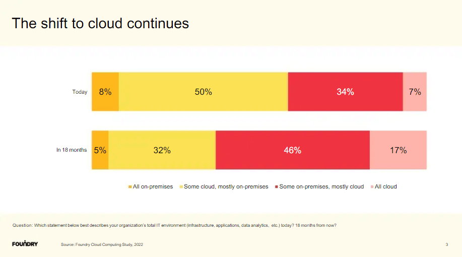
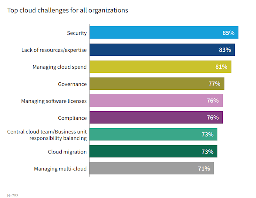
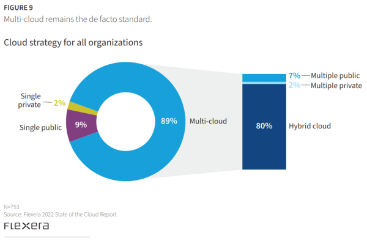

无论你走到哪里，是否都在谈论“云”。这是一个热门话题，随着技术的快速发展，云的范围不断扩大。

是的，这个模棱两可的术语似乎几乎涵盖了我们的一切。虽然“云”只是互联网的一个隐喻，但云计算才是当今人们真正谈论的话题。它提供更好的数据存储、数据安全性、灵活性、更好的组织可见性、更顺畅的流程、额外的数据智能、增强员工之间的协作，并改变小型企业和大型企业的工作流程，以帮助他们在降低成本的同时做出更好的决策。

很明显，利用云是一个持续增长的趋势 ，并在未来将长期存在。我们已经在我们的 BI 趋势文章中预测了云在阿里巴巴、亚马逊、谷歌和微软等公司中的重要性和实施。现在，我们将深入挖掘。

在这一点上，值得注意的是，云的重要性呈指数级增长。事实上，Grand View Research 表示，该行业的当前价值超过3689.7 亿美元，预计从现在到 2030 年将以 15.7% (CAGR) 的速度增长。

考虑到近年来云计算的潜力和发展，企业也面临着许多障碍。在本文中，我们收集了 12 个最突出的云计算挑战，这些挑战将提供与市场相关的全新视角。

云计算的这些挑战不仅仅是需要克服的障碍。_通过了解它们及其与现代商业世界的关系，它们为组织的成长和发展提供了巨大的机会。_

在我们解决云计算挑战之前，让我们先简单解释一下一般特征和基本定义。

## 什么是云计算？

云计算是通过远程服务器在互联网上提供各种硬件和软件服务。这些服务器忙于存储、管理和处理数据，使用户能够扩展或升级其基础架构并按需检索文件。

云的功能和广度是巨大的。IT 行业将其分为三类，以帮助更好地定义用例。

**a) 软件即服务**( SaaS )——软件由一个或多个提供商远程拥有、交付和管理。首先，软件即服务析（SaaS ）是一种流行的软件访问和付费方式。SaaS 公司不是在您自己的服务器上安装软件，而是让您租用托管的软件，通常是按月或按年订阅。越来越多的 CRM、营销和财务相关工具使用[SaaS 商业智能](https://www.datafocus.ai/infos/saas-bi)和技术，甚至 Adob​​e 的 Creative Suite 也采用了这种模式。

**b) 基础设施即服务**( IaaS ) – 计算资源，辅以存储和网络功能，由提供商拥有和托管，并可供客户按需使用。

**c) 平台即服务**( PaaS )——应用程序基础设施（中间件）服务的广泛集合。这些服务包括应用平台、集成、业务流程管理和数据库服务。

所有这些都偏离了通过本地服务器或个人计算机完成的传统本地计算。传统方法正日益被抛在后面。事实上，Foundry 最近发布的云计算研究 (2022) 发现，84% 的组织至少有一个应用程序，或者他们的一部分计算基础设施已经在云端。预计在未来 18 个月内，转向完全云环境的企业比例将增长 10%。

很明显，云正在扩展。由于我们生活在一个数字时代，[数据发现](https://www.datafocus.ai/infos/what-are-data-discovery-tools)和大数据完全超越了传统的存储以及手动实施和操作业务信息，因此公司正在寻找处理数据的最佳解决方案。传统的电子表格已不再适用，需要存储、管理和分析的数据太多。无论是[在线 BI 工具](https://www.datafocus.ai/infos/business-intelligence-software)，还是[在线数据可视化](https://www.datafocus.ai/infos/data-visualization-tools)系统，公司都必须解决存储数据的位置和方式。即使是最传统的行业也必须调整：

“从提供更好的店内客户服务到充分利用制造业的进步，为了尽一切努力，来自大多数传统和抗变革行业的公司都看到了写在墙上的文字：云技术战略降低了成本和风险。” – Lalit Bhatt，Maruti Techlabs 项目负责人。

尽管机会很大，但这种爆炸式增长并非没有云计算方面的问题。[在比较云与本地](https://www.datafocus.ai/infos/cloud-vs-on-premises-bi-strategy)BI 策略时，我们已经讨论了其中一些云计算挑战。现在让我们回顾一下组织面临的更多挑战，以及如何解决这些挑战。

## 云计算的挑战是什么？

最近，Flexera 针对最新的云趋势进行了年度云调查。他们就云基础设施的采用问题，询问了来自各行各业的 997 名技术专业人士。他们的发现很有见地，尤其是在当前的云计算挑战方面。

为了回答云计算面临的主要挑战的问题，下面，我们对他们的一些发现进行了扩展，并提供了企业可能需要解决的其他问题。让我们从日益紧迫的网络安全问题开始。

### 1\. 安全问题

我们在最终的[商业智能趋势](https://www.datafocus.ai/infos/business-intelligence-trends)指南中提到了围绕数据保护的激烈辩论。与许多其他技术分支一样，安全性是基于云的计算领域的一个紧迫问题，因为您无法查看数据存储或处理的确切位置。这增加了在实施或管理过程中可能出现的风险。

目前，各行业93% 的领先公司高度关注其以云为中心的生态系统中发生的重大数据泄露事件。

**围绕各种网络问题的主要担忧是：**

- 泄露的凭据
- 身份验证损坏
- 人为失误
- 大规模敏感数据泄露
- 被黑的接口和 API
- 账户劫持

预计到2025 年，网络安全的总成本将耗资 10.5 万亿美元，在这样一个时代，这些担忧是紧迫的，当然不是牵强的谬论。

所有这些都让一些人难以接受将敏感和专有数据托付给第三方，事实上，这也凸显了云计算的挑战。幸运的是，作为供应商和用户，成熟的防御能力正在不断提高。为确保组织的隐私和网络安全完整，请验证 SaaS 提供商是否具备安全的用户身份管理、身份验证和访问控制机制。此外，检查他们遵守哪些[数据库隐私和安全法律。](https://www.datafocus.ai/infos/data-security)

在审核提供商的保护和隐私法时，请务必确认第三大问题已得到解决：合规性。无论您的数据存储在何处，您的组织都需要能够遵守法规和标准。说到存储，还要确保提供商有严格的数据恢复政策。

通过掌握新兴趋势的脉搏，了解生态系统中每个实体的网络安全能力，您将显着降低漏洞或攻击的威胁。

云计算的风险已经成为每个组织的现实，无论大小。这就是为什么实现可以利用适当安全措施的[安全BI云工具很重要的原因。](https://www.datafocus.ai/infos/cloud-bi)

### 2\. 成本管理和控制

我们的云计算风险清单的下一部分，涉及到成本。在大多数情况下，现代计算可以为企业节省资金。在云中，组织可以轻松提升其处理能力，而无需对新硬件进行大量投资。相反，企业可以通过公共提供商的现收现付模式获得额外的处理。然而，云计算服务的按需性和可扩展性使得有时难以定义和预测数量和成本。

幸运的是，有几种方法可以控制云计算成本，例如，通过进行更好的[财务分析](https://www.datafocus.ai/infos/finance-analytics)和报告来优化成本、自动化裁决政策或保持[管理报告](https://www.datafocus.ai/infos/management-reporting-best-practices-and-examples)实践正常进行，从而减少计算中的这些问题。

另一项有助于降低成本并解决云计算中最紧迫问题的创新是多云计算工具。目前，32% 的企业使用多云网络安全工具来降低数据泄露造成的财务灾难性风险，而 31% 的领先企业使用多云成本管理工具来降低整个组织的财务效率。在这两种情况下，投资回报率 (ROI) 都是健康的。因此，我们预计在不久的将来会看到采用率增加。

### 3\. 缺乏资源/专业知识

公司和企业今天面临的云挑战之一是缺乏资源和（或）专业知识。随着云技术继续快速发展，组织越来越多地在系统中放置更多的工作负载。由于这些因素，组织很难跟上这些工具的步伐。此外，对专业知识的需求也在不断增长。通过对 IT 和开发人员进行额外培训，可以最大限度地减少这些挑战。大力支持云采用的首席信息官也会有所帮助。正如云工程师Drew Firment所说：

“采用和迁移的成功取决于您的员工，以及您在人才转型计划中所做的投资。除非您专注于云采用流程的第一大瓶颈，否则在其他任何地方所做的改进都是幻想。”

SME（中小型）组织可能会发现在其 IT 团队中增加专家的成本过高。幸运的是，这些专家执行的许多常见任务都可以自动化。为此，一些公司开始使用 DevOps 工具，例如 Chef 和 Puppet，以执行诸如监控资源使用模式、在预定义时间段进行自动备份等任务。这些工具还有助于优化云的成本、治理和安全性。

### 4\. 管理/控制

云计算面临许多挑战，控制措施排在第4位。适当的 IT 治理应确保 IT 资产按照商定的政策和程序得到实施和使用；确保这些资产得到适当的控制和维护，并确保这些资产支持您组织的战略和目标。

在当今基于云的世界中，IT 并不总是能够完全控制基础设施的配置、解除配置和运作。这增加了 IT 提供所需的治理、合规性、风险和[数据质量管理](https://www.datafocus.ai/infos/data-quality-management-and-metrics)的难度。为了缓解向云过渡过程中的各种风险和不确定性，IT 必须调整其传统的 IT 控制流程以将云包括在内。为此，在过去几年中，中央IT 团队在系统中的角色一直在演变。与业务部门一起，中央 IT 在选择、代理和管理云服务方面发挥着越来越大的作用。除此之外，第三方云计算/管理提供商正在逐步提供支持和最佳实践。

### 5\. 合规

云计算今天面临的风险之一是合规性。对于任何使用备份服务或存储的人来说，这都是一个问题。每当一家公司将数据从内部存储移动到云端时，它都面临着遵守官方法规和法律的问题。例如，美国的医疗保健组织必须遵守 HIPAA（1996 年健康保险流通和责任法案），公共零售公司必须遵守 SOX（2002 年萨班斯-奥克斯利法案）和 PCI DSS（支付卡行业数据安全）标准）。

根据行业和要求，每个组织都必须确保这些标准得到尊重和执行。

这是云计算面临的众多挑战之一，尽管该过程可能需要一定的时间，但必须正确存储数据。

客户需要寻找能够提供合规性的供应商，并检查他们是否受所需标准的监管。一些供应商提供经过认证的合规性，但在某些情况下，双方都需要额外的投入，以确保适当的遵守法规。

### 6\. 管理多个云

云计算面临的挑战不仅仅集中在一个单一的云中。

近年来，多云的状态呈指数级增长。公司正在转移或合并公共云和私有云，如前所述，阿里巴巴和亚马逊等科技巨头正在引领潮流。

上述 Flexera 的调查显示，89% 的企业拥有多云战略。采用混合战略（结合公有云和私有云）的企业达到 80%，而采用多公有云或多私有云战略的企业略有增长，但仍保持在 10% 以下。

虽然组织平均利用近五个云，但很明显，云的使用将继续增长。这就是为什么知道组织今天面临的主要问题很重要：云计算面临哪些挑战以及如何克服这些挑战？

为了实现多重管理的成功，并克服与系统复杂性相关的持续困难，以下是一些需要考虑的最佳实践方法：

- 与多管理专家或合作伙伴合作，根据您的特定需求，帮助您集成系统的每个关键组件
- 尽可能使用混合运营模式，因为这些创新将帮助您安全无缝地管理公共和私人信息
- 对生态系统的每个组成部分采用不同的协议和管理方式，而不是采取一刀切的方法

### 7\. 性能

当一个组织迁移到云时，它变得依赖于服务提供商。转移到云计算的下一个突出挑战是扩大这种合作关系。尽管如此，这种合作关系通常会为企业提供他们原本无法获得的创新技术。另一方面，组织的BI和其他基于云的系统的性能也与供应商的性能挂钩。当你的服务提供者崩溃时，你也会崩溃。

这并不罕见，在过去的几年里，全球很多大公司都经历过停电。确保您的提供商有正确的流程，并且如果出现问题，他们会提醒您。

对于[数据驱动的决策](https://www.datafocus.ai/infos/data-driven-decision-making-in-businesses)过程，组织的实时数据是必不可少的。能够实时访问存储在云上的数据，是一个组织在选择合适的合作伙伴时必须考虑的必要解决方案之一。

由于云计算固有的控制缺失，公司可能会遇到实时监控问题。确保您的 SaaS 提供商制定了实时监控策略，以帮助缓解这些潜在困难。

### 8\. 构建私有云

尽管构建私有生态系统并不是许多组织的首要任务，但对于那些可能实施此类解决方案的组织来说，它很快成为云计算面临的主要挑战之一——私有解决方案应该得到认真解决。

创建内部或私有云将带来显着的好处：将所有数据都放在内部。但 IT 经理和部门将需要自己构建和粘合它们，这可能会导致迁移到云计算的挑战变得极其困难。

重要的是要记住确保云顺利运行所需的步骤：

- [在现代BI 软件](https://www.datafocus.ai/infos/best-bi-tools-software-review-list)（需要库存管理系统）的帮助下，尽可能多地自动化手动任务
- 任务的编排，必须确保每个任务都以正确的顺序执行。

如本文所述：_软件层必须获取一个IP地址，建立一个虚拟局域网（VLAN），将服务器放入负载均衡队列，将服务器放入IP地址的防火墙规则集，加载正确版本的 RHEL，在需要时修补服务器软件并将服务器放入夜间备份队列。_

也就是说，开发私有云显然不是一件容易的事，但尽管如此，一些组织仍然在管理并计划在未来几年这样做。

### 9\. 分段使用和采用

大多数组织在开始迁移到云的时候都没有制定稳健的云采用策略。取而代之的是，在几个组件的推动下，临时战略应运而生。其中之一是采用速度。另一个问题是数据中心合同/设备的交错到期，这导致了间歇性的云迁移。最后，还有个别开发团队使用公共云来开发特定的应用程序或项目。这些引导环境促进了全面集成和成熟问题，包括：

- 缺乏共享标准的孤立项目
- 临时安全配置
- 缺乏跨团队共享资源和学习

事实上，IDC 最近对 6,159 名高管进行的一项调查发现，只有 3% 的受访者将他们的云战略定义为“优化”。幸运的是，集中化的 IT、强大的治理和控制策略以及一些繁重的工作，可以让使用、采用和云计算策略保持一致。

近一半的决策者认为，他们的 IT 员工尚未完全准备好应对未来 5 年的云计算行业挑战和管理云资源。由于企业比以往任何时候都更频繁地采用该策略，因此劳动力应该跟上并仔细解决潜在的困难。

### 10\. 迁移

近年来，云计算领域的主要问题之一集中在迁移上。这是将应用程序迁移到云端的过程。尽管迁移新应用程序是一个简单的过程，但在将现有应用程序迁移到新环境时，会出现许多云难题。

许多领先的公司目前正在将他们的应用程序迁移到云端，其中超过一半的公司发现这比预期的要困难 - 项目超出预算和期限。

在以云为中心的生态系统中存储数据时面临哪些问题？最常被提及的是：

- 广泛的故障排除
- 网络安全挑战
- 数据迁移缓慢
- 迁移代理
- 切换复杂度
- 应用程序停机时间
- 依赖关系映射
- 评估技术可行性
- 理解应用程序依赖关系
- 迁移后的成本优化

在 Flexera 最近的一份行业报告中，51% 的企业认为了解应用程序的依赖关系是成功迁移的一个重要障碍，而 49% 的企业表示评估技术可行性是他们的主要问题。

但尽管如此，通过对迁移概念和框架的更深入理解，以及行业内工具或平台的演变，从 2021 年起降低了这些困难，与这些云计算问题作斗争的组织略有减少。

### 11\. 可移植性和互操作性

我们的下一个云计算风险无疑是运营障碍。当组织扩展其无形的 IT 生态系统时，从后勤的角度来看，云计算的最大问题之一就是从一个提供商或平台转移到另一个提供商或平台。

通常，当企业切换到新平台时，会出现一个锁定期，这会使网络出现故障，从而降低过程中的生产率。这种灵活性的严重缺乏会导致一系列问题：

- 安全流畅的数据迁移和管理
- 基本上从零开始建立安全和兼容的网络
- 受限用户或客户访问

近年来，由于工具、平台和系统的复杂性日益增加，这些明显的障碍变得越来越普通。

应对云计算这些棘手风险的最有效方法之一，是通过您所在地区的相关数据和服务法律来了解您的便捷性权利，同时与潜在提供商制定具体条款，以提前防止锁定期或服务限制。

### 12\. 可靠性和可用性

在我们对云计算挑战的明确总结中，最后但同样重要的是可靠性和可用性问题。

随着我们进入 一个94% 的企业以某种方式、情况或形式使用基于云的服务提供商 (CSP) 或平台的时代，能够确保在任何给定时间点提供正确的数据，同时保留系统功能已成为现代云计算最重要的问题之一。

由于现代平台和以计算为中心的生态系统的不断扩大，越来越多的公司依赖第三方管理平台。这样做的问题是，许多服务提供商提供全天候服务，这会导致系统中断，从而导致短暂的破坏性损失或金钱损失。

为了确保您的系统在任何给定时间点都是可用且可靠的，必须制定严格的计划来监控关键性能和运营方面，包括系统稳健性、核心功能、SLA、数据质量和整体性能。凭借坚实的战略框架，您可以确保您的供应商承担全部责任，同时防止任何中断或可用性问题。

## 最后——云还是赢了

这不是秘密；云计算正在彻底改变 IT 行业。它也在改变[商业智能](https://www.datafocus.ai/infos/bi-skills-for-business-intelligence-career)(BI) 领域，以及它所涉及一切领域。随着采用率呈指数增长，各种规模的企业都在意识到这些好处。对于无法负担昂贵的服务器维护费用但又可能不得不在一夜之间进行扩展的初创公司和中小型企业 (SMB)，利用云的好处尤其巨大。

虽然云计算挑战确实存在，但如果得到妥善解决，这 12 个问题并不意味着您的 IT 路线图必须固定在本地。商业智能 (BI) 和云是理想的搭配，因为前者为正确的人提供正确的信息，而后者是访问[BI 解决方案](https://www.datafocus.ai/infos/business-intelligence-bi-solutions)和应用程序的敏捷方式。

为了充分利用这个 IT 便利的新时代并克服任何潜在的障碍，您应该在实施系统时采取战略性的迭代方法。探索混合云解决方案，让业务和 IT 团队参与进来，投资 CIO，并选择合适的 BI SaaS 合作伙伴。所有这些战略措施都将确保云商业智能的好处远大于 问题。

谈到迁移到以 IT 为中心的新灵活系统的先天优势，以下是将激发您的企业技术努力的关键优势：

谈到迁移到一个新的、灵活的、以IT为中心的系统所带来的固有好处，这里有一些关键的优点可以激励您的企业的技术努力：

- **节省成本：**通过采用现代 CSP 和方法，您将降低与业务运营、 IT 基础设施相关的成本。虽然设置所有内容可能需要花费大量成本，但由于安全、流畅、效率和运营远见，您的投资回报率将在几年里获得十倍的回报。
- **安全：**正如我们之前提到的，网络安全正在上升。但是，如果您能够克服与数据泄露相关的任何障碍，您将创建一个网络来强化您业务的每个敏感区域，保护自己免受毁灭性网络攻击的威胁。
- **系统移动性：**使用现代 CSP 功能的另一个主要好处是能够从多个设备访问关键数据和系统功能，无论您身在何处，24/7。获得这种更高的流动性将提高生产力，使您的组织更具响应能力，并通过为员工提供更好工作的工具来提高员工满意度。
- **提高洞察力：**在现代，_知识等于权力，_数据_等于金钱。_通过使用基于CSP的技术，您可以以集中、高效和易于消化的方式更好地访问数据驱动的见解。因此，借助 CSP 和基于 IT 的现代功能，可以通过实现更强的商业智能 (BI) 来推动创新。

## 云计算的未来

_“云是关于你如何进行计算，而不是你在哪里进行计算。” –_ **_Paul Maritz_****_，VMware 首席执行官_**

不可否认，_我们已经进入了一个新的、更具创新性的时代，企业正在掌控自己的技术命运。_

但是，尽管这个新 IT 时代的潜在优势和可能性确实存在，但随着采用率的提高，挑战也随之增加。随着技术在企业 IT 中的发展，高级决策者必须采取措施详细了解这些风险，以便在风险出现时减轻它们。

专家预测，到 2023 年，领先的 CSP 将以几乎 ATM 式的能力运营，以提供其服务的各种子集。这种灵活的方法确实会使组织更容易在需要时“自助服务”，而无需谨慎地采用这些服务（同时了解风险）。

CSP格局的另一个显著变化将表现为对专业技能的需求增加，以支持大规模系统升级和迁移。为了保持稳健和无缝扩展，企业将需要内部人才以精确和完全自信的方式改进或扩展其 CSP 基础设施。考虑到这一点，为了在未来的世界中茁壮成长，在以云为中心的管理和迁移方面提高相关技术人员的技能的同时，采用数据驱动的组织文化非常重要。。

显然，企业面临着一些艰巨的工作，特别是因为云技术现在已经成为一种业务标准。CSP 基础设施不是一眨眼就能推出的，对未来问题的关注、谨慎和理解对于长期创新和成功至关重要。

包含管理细节和专业人员参与的战略方法，有助于减少实施过程中的潜在风险、成本和缺陷。云的未来在于引入有助于解决监管、管理和技术问题的行业标准。

总而言之，云计算的主要障碍如下:

1. 网络安全问题
2. 成本管理和控制
3. 缺乏资源/专业知识
4. 治理/控制
5. 合规
6. 管理多个云
7. 性能
8. 构建私有云
9. 分段使用和采用
10. 迁移
11. 可移植性和互操作性
12. 可靠性和可用性

开始您自己的云研究，并利用它可以为您的业务提供的潜力，请试用我们的软件进行[30天试用](https://www.datafocus.ai/console/)！它是完全免费的！
