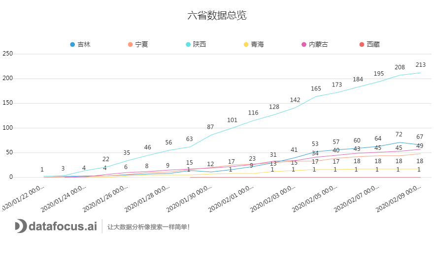
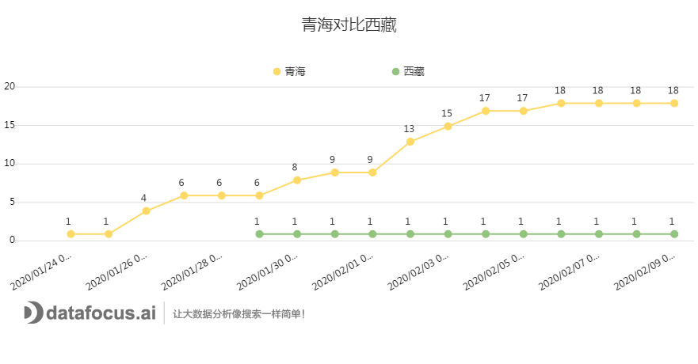

截至2月10日晚上24点，从全国的疫情数据上看，除了港澳台地区以及海外的疫情数据，全国疫情排名最末的两个省份或自治区就是西藏和青海。这两个地区之间的主要共同点就是地处中国的西北部地区，海拔偏高且人口相对东部地区较为分散。那么对比湖北武汉、浙江温州、广州深圳，加上现阶段所知的疫情蔓延的特点，我想这就是西藏自治区和青海省疫情较为不易蔓延，没有进一步扩大的优势。

接下来，小编将利用摘自青海卫健委的官方数据，详细介绍一下，疫情发展至今青海省和西藏自治区的患病人数变动情况。看看青海省和西藏自治区的新型冠状病毒感染的肺炎是不是没有进一步扩大的态势。

按照惯例介绍摘自卫健委的数据，截至2月9日24时，青海省累计报告冠状病毒肺炎确诊病例18例，其中重症病例1例，死亡病例0例，出院病历3例，尚有15例确诊患者住院治疗，2月9日当天新增确诊病例0例，新增疑似病例0例。

西藏自治区则是从1月29日在拉萨地区发现第一例新型冠状病毒感染的肺炎病例后就没有确诊病例数的增长，截至2月9日24点，西藏自治区累计报告冠状病毒感染的肺炎1例。

1\. 确诊病例对比：连续四天无新增

图1的数据是由小编负责收集的几个省份及自治区的一些基础数据，包括确诊病例数、疑似病例数、密切观察人数、死亡病例数、重症病例数等等。现将所有省份的汇总数据按照日期绘制成一张时序图，得到图1。从图中可以看到，对比这6个省份，青海省和西藏自治区的确诊病例数排在倒数两位。

图1：六省疫情数据总览

去除多余的省份，单独将青海省和西藏自治区拎出来进行对比，从图2中可以看到，青海省的确诊病例数在2月2日当天有一个较为明显的上升，其余时候则基本处于缓慢平稳上升的趋势，最近更是连续四天没有出现新增病例。西藏自治区的数据则是在1月29日有了一例的上升后就没有增加的趋势了，一直保持在1例的数据上。疫情蔓延发展至今，这应该是一个非常不错的好消息了。

图2：青海和西藏确诊情况

2.青海数据总览

光查看确诊人数的变动仍是不够准确，看不出青海省确诊病例增长的高峰期。因此，在确诊病例的基础上，添加确诊病例的每日新增情况，对比两者一起进行查看。从图3中我们可以看到，青海省确诊病例在达到连续没有新增之前，大致出现了四次小高潮，分别是1月26日，1月30日，2月2日，2月4日。

图3：确诊人数及日增长

将具体的数据下分到青海省的各地区，从图4中，我们可以看到，青海省从疫情出现至今，只有两个地区受到感染，分别是西宁市和海北藏族自治州，其他地区都没有出现疫情感染的病例。图4中的西宁市折线的走势基本与图3 的日增长量一致，海北自治州则是在2月3日出现较大的增长后，就没有更多的病例出现了。

图4：各市日均增长率

最后观察青海省的每日密切观察人数变动，其中有几列空白是因为青海省卫健委没有提及相应的数据。图5中每一个柱体代表了青海省当日的密切观察人数，其中黄色代表正在接受医学观察的人数，绿色则为接触医学观察的人数。从图5中可以看到，2月7日的医学观察人数对比前一天有所下跌，最近几日的密切观察人数也是个别缓慢上升，整体形势正在往好的方向发展。

图5：密切观察人数变动

虽然现在国内整体疫情的形势看上起都在往好的方向发展，我们还是不能放松警惕。昨日，钟南山院士有发表了一则消息，病毒潜伏期最长可以达到24天，也就是将近一个月的时间。因此，在现今形势一片走好的情况下，大家更加要注意少出门，出门一定要戴口罩，勤洗手，多加防范，不要心存侥幸。将这个良好的态势维持住，避免疫情的二次感染。
