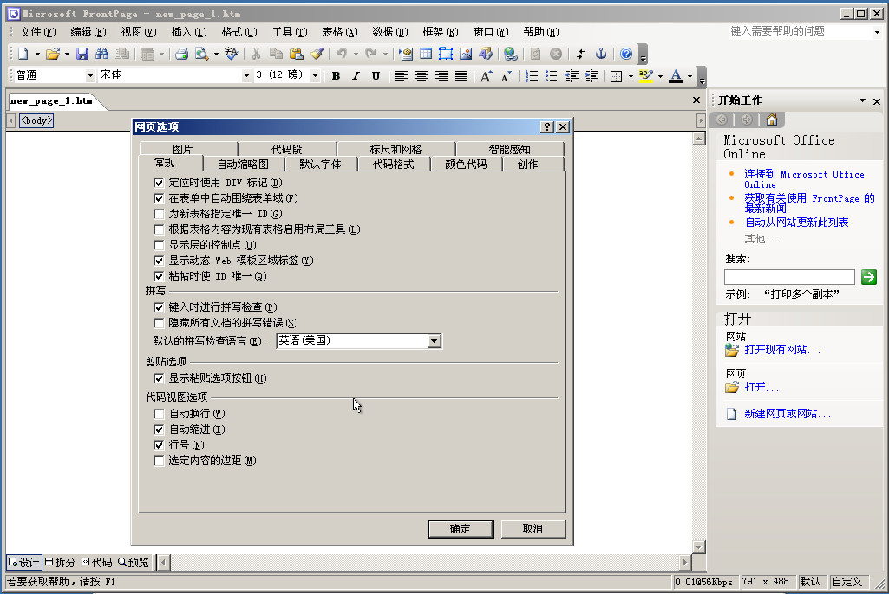

如果说到未来软件的模样，一定会谈论到一个词，「无代码」。

**微软曾称无代码是它的“Next Big Thing”，谷歌曾说无代码是下一代的变革和提升。**

所谓无代码，就像字面意思理解一样，不用代码就能进行编程。

你输入简单的信息，后端就会变成复杂的代码。

而要说起无代码工具的鼻祖，那非微软的Excel莫属。

### 1.无代码工具的鼻祖

1985年，微软发布了第一个版本的Excel，而这可以被认为是最早一代的无代码工具。**Excel的高级用户都不用使用代码，轻松完成复杂的数据处理、分析和可视化。**

随着微软系统的不断升级，后续又推出PPT、Word等，最终和Excel一起成为大多数职场人强大的生产力。

时至今日，微软的这几样工具依然有很多人在使用。

到了90年代，**微软又推出了程序设计语言Visual Basic**，这算是最早被大规模使用的可视化程序设计工具。直到现在，工程师用VB编写的Windows软件仍有广泛的使用场景。

但随着时代的进步和技术的提升，已经很少有单纯是本地环境的软件了，所以VB就逐渐被市场淘汰了。

当然，后续市面上还出现了可视化网页制作工具，较为知名的有微软Office中的Frontpage、Macromedia的Dreamweaver等。后来也慢慢被淘汰了，毕竟无法满足更多的需求。

### 2.国产无代码可视化工具风头正起

虽然有很多无代码可视化工具被历史淘汰，但无代码可视化技术仍在飞速发展。

而目前，Windows的Excel的确还活得很好，但对于数据处理、分析和可视化已经出现了一大批优质国产无代码可视化工具，完全能满足市场需求，甚至还超过市场需求。

这款以搜索式分析为特点的数据可视化工具DataFocus便是国产的骄傲。

不用任何代码，只需要像谷歌搜索一样在搜索框输入关键词，系统就会在几秒内以数据可视化图表来回应。

你能想到的很多业务场景，这款软件都能满足，比如数据监控、实时更新、数据权限管控、大屏联动、多人协作等等。

DataFocus是非常适合中小型企业的选择，经济成本和学习成本都很低，简单上手。像国内知名组织和企业如清华大学、万象集团等都在使用，也已成为国内知名5G供应商。

### 小结

要说未来的无代码趋势，一定是更智能化。业务人员不必学习复杂的知识，完全是所见即所得。

希望在无代码时代，国产软件也更优秀，为国人提供更强大的技术水平。对此，你怎么看呢？欢迎评论区评论、分享。
