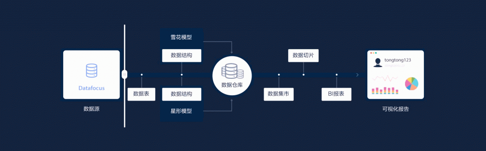

基本面是指对宏观经济、行业和公司基本情况的分析。它包括宏观经济运行态势和上市公司基本情况。投资中我们经常所说的基本面是一家公司的质地情况，上市公司的基本面包括财务状况、盈利状况、市场占有率、经营管理体制、人才构成等各个方面。

 

一般投资者对上市公司的基本面分析，要研究分析的项目和内容包括：

公司财务报表的分析

公司所在行业的分析

公司产品和市场的分析

公司文化和管理层素质的分析

公司的实地考察

1. 对上市公司财务报表分析

主要有比率分析、水平分析（即趋势分析）、共同比报表分析三种分析的方法。

财务分析的对象是财务报表，财务报表主要包括资产负债表、财务状况变动表和利润及利润分配表。从这三种表中应着重分析：公司盈利能力、偿还能力、营运能力、扩展经营的能力。一般需重视的重要技术指标和项目包括：

A、市盈率

市盈率= 每股市价/每股收益

代表市场上投资者对公司每股盈利付出的价格。如：公司的市盈率高于股市的平均市盈率，代表投资者看好这家公司的未来成长性，反之是并不看好该公司的成长性。公司的市盈率也是一个评价该股票投机和泡沫成份的指标。如果市盈率高并超出该股票的成长性，这是庄家和跟庄者的投机操作，这时投资者要离开该股票，防止掉入庄家和跟庄者的多头陷阱。

B、每股收益

每股收益 = 净利润 /总股本

评价上市公司财务和盈利能力最重要的指标。它体现了公司的经营能力、管理能力和对股东的回报能力。该指标可以用逐年进行对比的方法来评价一个公司的成长性，也可以和其他公司进行对比，找出公司之间的经营差距。

上市公司利润包括主营业利润、投资收益、营业外收入、其他业务利润。只有主营业利润收入才是决定公司长期和稳定发展的重要因素。如果一个公司的主营业收入利润长期处在总利润的50%以下，那么这个公司的获利能力和长期投资价值就值得怀疑。

C、每股股息的分配

是评价一个上市公司对股东回报的一个重要指标。股息的分配包括现金分红、送红股和配股。每年回报递增的公司股票是长线投资的首选股票。

D、每股净资产

每股净资产 = 年末股东权益/总股本

每股净资产体现上市公司的资本扩张能力。每股净资产逐年增加说明上市公司不断扩张壮大，反之不断缩小。

E、市净率

市净率 = 每股市价 /每股净资产

市净率把股价和每股净资产联系起来，市净率越高，资产越优良。

F、净资产收益率

净资产收益率= 净利润 /平均股东权益

是评价上市公司盈利能力的一个重要指标。净资产收益率越高，说明资产的盈利能力越强，给投资带来的收益就越高。

G、成本费用率

成本费用率 = 利润总额 /成本费用总额

成本费用率反映每花掉1元费用给公司带来的利润。对于投资者来说，该指标越高，给投资者带来的利润越高。

H、销售净利润

销售净利润 = 净利润 /销售收入

销售净利润反映每1元销售收入给公司带来的净利润量，评价销售收入的收益水平。该指标越高，公司的销售能力越强。

I、流动比率

流动比率 = 流动资产 / 流动负债

流动比率表示每1元流动负债有多少流动资产作为偿付担保。这一比例越高，债权人的安全性越高。但这个比例过高，则表明上市公司的资产利用率较低，流动资金闲置严重。一般流动比率为2左右较为合适。上市公司所属行业不同，流动比率也不同。

J、应收账款周转率

应收账款周转率=销售收入/平均应收账款

应收账款周转率越高，平均应收账款周期越短，资金回收越快。资金过多地滞留在应收账上，会影响资金正常的周转。

K、负债比率

负债比率 = 负债总额 /资产总额

反映偿还债务的保险程度。从债权人来说，这一比率越高，偿还债务能力越差。但对于投资者来说，负债比率高，表明当上市公司资本利润率大于借款支付的利率时，股东所得利润将增加。

L、现金比率

现金比率 = 现金余额 / 现金负债

现金比率直接反映企业的短期偿付能力，也是盈利的资本。过高的现金比率将会降低企业的获利能力。

1. 上市公司所在行业的分析

公司所在行业的分析包括:公司所在行业的整体分析、公司所在行业的地位分析。

A、行业的划分

上市公司所在行业的分析对长线投资相当重要。行业的当前状况和未来的发展趋势对该行业上市公司的影响巨大。

我国行业划分是按第一、第二和第三产业划分的。

第一产业主要是农、林、牧、副、渔和农业人口发展的产业，统称农业。

第二产业主要是制造业、电力、纺织、石化、采矿、钢铁、建筑、造纸、印刷等，统称工业。

第三产业主要是金融保险、交通运输、通信邮政、商业、教育文化、广播电视、餐饮旅馆等，统称服务业。

股票市场上对行业的划分是：农业、工业品制造业、商业、交通运输、旅游、网络电信、高科技、家用电器、金融、化工、石油、建材、医药、纺织、外贸、生物工程、地产、汽车、综合类、食品加工、钢铁冶金、电力行业、造纸印刷、软件、电脑等。

B、行业的成长分类

每一个行业都有四个发展时期：形成时期、成长时期、稳定时期和衰退时期。

处在下降衰退时期的行业称为夕阳行业；处在形成和成长时期的行业称为朝阳行业。朝阳行业和夕阳行业的划分是相对的，并有时间和地域的限制。每一个行业内部也有处在上升朝阳时期企业和下降夕阳时期企业之分。

三、公司产品和市场分析

1、产品的市场占有分析

产品的市场占有包括产品的市场占有率、产品的市场覆盖率。产品的市场占有率指该公司的产品在同类产品市场中所占有的份额。产品的市场覆盖率，也指产品在各个地区的覆盖和分布。两者的组合分析可得到以下四种情况：

市场占有率和市场覆盖率都比较高。这说明该公司的产品销售和分布在同行业中占有优势地位，产品的竞争能力强。

市场占有率高而市场覆盖率低。这说明公司的产品在某个地区受欢迎，有竞争能力，但大面积推广缺乏销售网络。

市场占有率低而市场覆盖率高。这说明公司的销售网络强，但产品的竞争能力较弱。

市场占有率和市场覆盖率都低。这说明公司的产品缺乏竞争力，产品的前途有问题。

2、公司产品的品种分析

指公司的产品种类是否齐全、在同行业生产的品种中持有的品种数、这些品种在市场的生命周期和各品种的市场占有分析。

3、产品价格分析

指公司生产的产品和其他公司生产的同类产品的价格比较。同时还应分析产品的价位和消费者的承受能力，产品价位变化所引起的供需变化和市场变化等。

4、产品的销售能力

主要考察上市公司的销售渠道、销售网络、销售人员、销售策略、销售成本和销售业绩。销售环节的成本极大地影响公司的利润。销售方法各有利弊，要进行综合比较分析。

5、公司原材料和关键部件的供应分析

存在两种情况：一种是产品的上游原材料和关键部件全部由自己供应和生产。另一种情况是原材料和关键部件由专门的原材料公司供应和生产，公司让出一部分应得的利润。两种模式各有利弊。

6、公司产品知识产权的研究和分析

一个上市公司的产品是否拥有自主知识产权是相当重要的一项指标，它可以衡量该产品的技术含金量。自主知识产权是一个上市公司发展和壮大的基础，是稳定利润来源的保证。没有自主知识产权的上市公司是不适合长线投资的。

四、公司文化和管理层素质的分析

公司文化是指公司全体职工在长期的生产和经营活动中逐渐形成的共同遵循的规则、价值观、人生观和自身的行为规范准则。对公司文化的分析应着重了解公司文化对全体员工的指导作用、凝聚作用、激励功能和约束作用。

管理层素质的分析应包括对公司管理层的文化素质和专业水平，内部协调和沟通能力，公司管理层第一把手的个人经历、工作经历及文化水平，公司管理层的开拓精神等的分析。一个好的管理层在管理公司时，每一年公司都应有很大的变化，最终的结果应从公司的成长性、主营收入、主营利润和每股收益的变化中体现出来。

五、公司的实地考察

对公司的实地考察对于长线投资尤为重要。长线投资者在投资前必须亲自地考察公司的现状，公司的生产和销售情况，公司文化、公司管理层的能力，公司的规章制度、生产规模、生产效益、生产秩序，投资资金的实际执行情况，公司信息披露的准确情况和财务报表的真实性。

在公司的基本面分析中，对财务报表等信息进行数据分析时，可以借助一款专业的数据分析工具，以提高分析效率。例如商业BI——DataFocus，这个系统不需要代码或SQL语言基础，所以也适合普通的业务人员使用。它有独特的中文搜索式数据分析系统，分析结构化数据，如对财务报表进行比率、趋势、同比环比等分析，使用它的公式和关键词，搜索式分析还是很便捷的。
