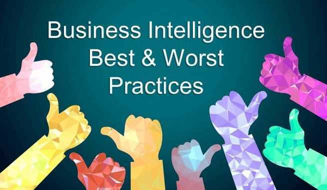

[商业智能软件](https://www.datafocus.ai/infos/best-bi-tools-software-review-list)正迅速成为各种规模组织的支柱，由此产生的成功案例层出不穷。借助 BI，这些公司正在提高成本效率、优化库存水平、减少浪费、改进业务流程，并且从总体来看，通过[交互式仪表板为整个组织的部门提供成功所需的数据](https://www.datafocus.ai/infos/interactive-dashboard-features/). 许多组织都听说过这些成功案例，并正在跳上 BI 的列车。然而，认识到数据和分析的重要性是一回事，以最有效和最适当的方式满足业务决策者的需求是另一回事。为此，您需要适当的流程和工具，并且遵循最佳实践。我们已经为您提供了顶级[BI 仪表板](https://www.datafocus.ai/infos/bi-dashboard-best-practices)最佳实践。为确保您从 BI 投资中获得预期价值，并让您走上成功之路，我们列出了前 5 个商业智能最佳实践和您必须知道的前 5 个商业智能最差实践。

## 前 5 名商业智能最佳实践

### 1\. 获得组织范围内的支持

脱节或失败的商业智能实践的普遍采用是导致商业智能失败的快速途径。为了最大限度地提高商业智能的成功率，必须获得组织内的广泛认可。这符合每个人的最大利益；最后，每个部门，尤其是销售、市场营销、财务和管理部门都将从 BI 中受益。为此，应该从一开始就让各方参与进来。这种最佳实践包括让 CIO 和 CMO 从一开始就进行协作！

IT 是您应该从一开始就参与的另一个关键利益相关者。的确，正确的[SaaS BI 工具](https://www.datafocus.ai/infos/saas-bi)不需要 IT 繁重的工作，但这并不意味着 IT 不应包含在分析、采购、实施和管理流程中。IT 和开发团队提供了有价值的知识库，应该加以利用。他们可以确保遵守适当的安全和治理措施。IT 是知识保留和知识转移的重要资源。最后，IT 不一定要管理 BI，但它们应该保持在循环中。

### 2\. 从一开始就有计划

在没有策略的情况下进行分析可能会花费您大量的金钱、时间和压力。在选择 BI 工具之前，您需要确定最重要的业务需求并制定一组业务需求和目标，不要在真空中或仅在管理层开发这些。由于您已经获得了组织范围内的支持，那么可以咨询所有关键利益相关者，包括财务、市场营销、销售和运营。最后，设定明确的目标并预先确定[关键绩效指标](https://www.datafocus.ai/infos/kpi-examples-and-templates/)(KPI) 将有助于指导成功地采用 BI。

### 3.从小处着手

很可能有很多您需要回答的商业问题和需要获得的见解。当您开始编译这些需求并开始考虑数据的整体大小时，很容易感到不知所措。当每个员工都开始要求立即获得数据时，这种情况就变得更加复杂了。这将我们引向下一个商业智能最佳实践：[从小处着手](https://www.datafocus.ai/infos/business-intelligence-for-small-business/)。先列出一些关键问题，试着用容易获得的数据来回答它们。如果你最终得到答案，那很好。这个过程可能会引出更多问题，可以将这些问题添加到您的路线图中。这个过程还将帮助您发现需要编译哪些数据源，或者通常缺少哪些数据。在 BI 推出方面，我们是[敏捷方法最佳实践的拥护者](https://www.datafocus.ai/infos/introduction-to-agile-business-intelligence/)，这促进了不断涉及利益相关者的迭代方法。收集需求和输入、构建、测试，然后重复！

### 4\. 确定必要的数据源

您的组织，无论规模大小，都可能收集与大多数业务运营相关的数据。问题是这些数据通常分布在各种不同的系统和软件中。数据可以存储在各种 ERP 系统、CRM、数据库和 Excel 电子表格中。由于数据分布在多个系统中，因此获取所需信息可能是一项艰巨的任务。在这里，您需要再次从小处着手，并确定必要的数据源。不要将您的数据视为大规模的混乱数据，而是将其视为特定问题的答案的集合。带着一个问题或假设去做，然后检查收集到的数据是否证实了你的假设。最后，您可能会利用[数据仓库](https://www.datafocus.ai/infos/data-storage)来提高性能。使用正确的工具，您可以轻松编译和混合各种数据源。

### 5\. 培养数据文化

为了让您的组织参与新的 BI 计划，您将不得不宣传数据的重要性。为使您的 BI 取得成功，您的组织需要培养[数据文化](https://www.datafocus.ai/infos/create-dashboard-culture/)。当公司的所有部门为了一个共同的目标而共同努力时，由此产生的数据洞察和后续行动将更有意义和价值。

可能会有阻力。部门可能会因缺乏时间、数据敏锐度和资源而气馁，并且回避鼓励企业采用 BI。他们可能不会看到采用成本超过收益。他们需要看到，正确的工具将使所有团队受益。

一些用户可能只是被新技术和数据所淹没。这可能导致改变阻力。工作表明，虽然可能需要进行一些培训，但正确的工具将很容易使每个人都成为自己的分析师。寻找一种工具，让广大用户轻松连接、探索、可视化和交流他们的数据。简的搜索无需事先培训，也不需要提前了解数据分析或 SQL 技能。为员工提供可以立即使用的[业务仪表板](https://www.datafocus.ai/infos/dashboard-examples-and-templates/)，可以鼓励他们快速而自信做出决策，并使整个公司受益。

## 前 5 名商业智能最差实践

### 1\. 在第 1 天构建所有内容

新技术令人兴奋，访问以前孤立的数据更令人兴奋。很容易想要开始为所有内容构建仪表板，记住，千万不要这样做。正如我们之前所说：从小处着手。否则，您将得到一堆干扰和未使用的报告/仪表板。更糟糕的是：如果不控制数据分析泛滥，您最终可能会共享误导性的仪表板。您要处理的最后一件事是[数据误解](https://www.datafocus.ai/infos/data-interpretation-methods-benefits-problems/)的陷阱。糟糕的数据管理也是对 BI 系统失去信心并扼杀数据文化的最快方式。

### 2\. 让每个人都立即访问 BI

同样，不要创造大量新的 BI 用户。如果他们不使用系统，或者不需要系统：不要提供访问权限。确保用户得到适当的培训，并且系统已经管理到位。通常，适当的管理应确保根据商定的政策和程序实施和使用资产；它还应确保这些资产得到适当的控制和维护；最后确保这些资产支持您组织的战略和业务目标。在当今基于云的世界中，很难完全控制基础设施的配置、解除配置和操作保持。这是让 IT 参与选择、代理和管理 BI 工具的另一个原因。还要寻找提供管理​​支持和最佳实践的合作伙伴。

### 3\. 一开始就做到完美，然后离开

您的 BI 不会是完美的。大数据提供对实时数据的洞察，使您能够在看到某个趋势出现时立即做出改变。这句话中最重要的词：改变。您的市场、竞争、商业环境和组织都在不断变化，您的 BI 也必须如此。通过定期返回到绘图板来保持敏捷。最后，您可能不得不报废整个仪表板。这都是商业智能成功过程的一部分。

### 4\. 仅在绝对必要时使用 Excel

Excel 不应该是您的默认 BI 平台。我们知道这可能很难。我们大多数人都对 Excel 很熟悉。这么长时间以来它一直是主食！但 Excel 并不是为商业智能而设计的。对于使用 Excel 的初学者来说，很容易遇到数据完整性问题，数据不是实时的，电子表格维护很快变成了一项全职工作，而且协作很困难，并引发了各种治理问题。

另一方面，[交互式实时仪表板可快速吸引具有广泛技术敏锐度的最终用户，并提供直观的体验和易于消化的见解。](https://www.datafocus.ai/infos/live-dashboards)他们还通过快速突出趋势和挖掘违规行为来提供投资回报率。将您的 BI 文化从 Excel 中移出可能需要一段时间，但这是值得的。如果用户将仪表板下载到 Excel 以更好地理解数据，他们需要更多的培训，或者仪表板可能需要构建得更好。

### 5\. 审查 BI 系统时，不要谈论安全性

从云计算技术开始，安全性就一直是人们关注的一个问题，这是有充理由的，因为您无法看到数据存储或处理的确切位置。强调数据泄露和国家赞助的黑客活动的头条新闻并没有帮助缓解这些担忧。不表达意见，也不适当地审查 BI 选项是商业智能最糟糕的做法。

幸运的是，安全能力正在不断提高。为确保组织的隐私和安全不受影响，您只需验证 SaaS 提供商是否具备安全的用户身份管理、身份验证和访问控制机制。此外，请检查他们遵守哪些[数据安全和隐私法。](https://www.datafocus.ai/infos/data-security)在审核提供商的安全和隐私法时，请务必遵守合规性。无论您的数据存储在何处，您的组织都需要能够遵守法规和标准。说到存储，还要确保提供商有严格的数据恢复政策。

## 使用此列表最大化您的 BI 投资

组织正在通过利用新兴的创新 BI 解决方案达到新的水平。最有效的组织通过遵循商业智能最佳实践和避免 BI 最差实践来最大化他们的 BI 投资。他们还确保为他们的组织投资正确的工具。首先要确定[本地 BI 与云 BI 策略](https://www.datafocus.ai/infos/cloud-vs-on-premises-bi-strategy/)是否适合您的组织。

之后，请确保您拥有一个[商业智能软件](https://www.datafocus.ai/infos/best-bi-tools-software-review-list) ，该软件允许您连接到各种数据源并与这些数据进行交互、可视化和通信。确保它还利用基于 Web 的、参数驱动的表单、针对常规电子邮件传递的个人最终用户调度以及可选的输出选项（例如 HTML、Excel、PDF），从而为最终用户提供灵活性。然后获得令人兴奋和可操作的见解！有了正确的工具和商业智能最佳实践，您的 BI 将势不可挡。
