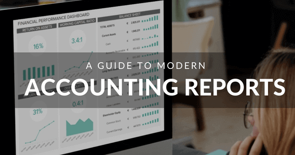
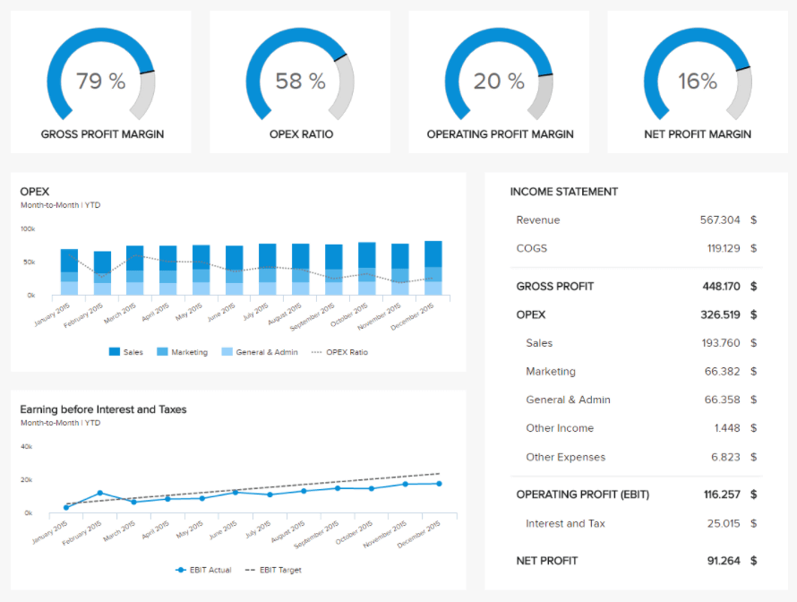

在每家公司称职的管理层的基础上，我们都可以找到会计报告。跟踪企业的财务状况及其随时间的演变至关重要：组织重要的业务交易，跟踪发票，但也出于法律目的。

几个世纪前随着贸易和商业的发展而创建的会计现在是任何企业金融世界的支柱。一家公司需要他们成长和繁荣，当它不能保持正确的标准时，它会立即取消自己的资格。它有助于比较，消除歧义，并且是向利益相关者披露企业财务状况的唯一方式。

在本文中，我们将讨论不同类型的基本会计报告，为什么需要它们以及如何呈现它们——最后一点对于你的财务故事的交流至关重要，尤其是当我们考虑到所有与会计。

## 什么是会计报告？

会计报告是定期报表，显示公司在某个时间点或指定时间段内的财务状况。它详细说明了业务交易和操作。

它们是从企业会计记录中推断出来的财务信息的汇编。它们的性质各不相同，因为它们可以是简短的或具有特定目的的定制：详细说明每个地区的销售额、产品的盈利能力等。通常，这些报告被视为财务报表，其中包括：

资产负债表：是企业在特定时间的快照，显示截至资产负债表日的期末资产、负债和权益余额。衡量企业的财务储备和流动性很有用。

损益表：也称为损益表。它详细说明了一段时间内获得的收入。

现金流量表：顾名思义，它是现金_流入_和流出的报表。它详细说明了与企业运营、投资和融资相关的现金来源和用途。当涉及到公司的现金产生能力时，它通常被认为是最可靠的信息来源。

这些只是企业用于日常财务运营的主要会计报表类型中的 3 种。我们将在后面的文章中通过一些[财务仪表板](https://www.datafocus.ai/infos/dashboard-examples-and-templates-finance)示例更详细地介绍这一点，但首先，让我们看看这些分析工具带来的主要好处。

## 为什么需要会计报告？

这些报告是企业的重要组成部分，无论其规模如何。正如我们所说，它们在维护交易记录、现金流量、收入等方面非常有用。但它们也降低了向投资者、财务经理或更糟糕的税务机关报告不一致的风险。您可能会因会计不准确而受到制裁，这就是为什么您要不惜一切代价避免它们。您可以从这些分析工具中获得的其他一些好处包括：

- **了解企业的​​财务状况：**生成会计报告对于企业的正确管理和运作至关重要。它们提供了准确描绘公司财务状况所需的所有关键信息，并帮助决策者做出重要的财务和非财务决策，以确保公司以盈利的方式发展。对财务状况有一个客观的看法，使高层管理人员能够就投资、销售和采购做出更明智的决策。
- **维持预算**：为了确保不同战略和活动的正确运作，管理人员需要制定一个预算，以涵盖所有方面，同时仍确保盈利能力。这是一个基本方面，特别是考虑到令人震惊的82%的小企业因现金流管理不善而倒闭。智能会计报告通过为企业提供做出最佳决策和建立可持续预算所需的所有信息来防止这种情况发生。
- **组织交易和发票**：透明度是高效[财务报告](https://www.datafocus.ai/infos/daily-weekly-monthly-financial-report-examples/)的关键。会计报告通过提供所有交易和发票的有效簿记系统来帮助您做到这一点，以密切跟踪每一个动作。拥有一个具有交易时间、日期和性质的集中交易地点有助于组织了解金钱和货物的分配。
- **遵守法律和税收法规**：贪婪、盗窃和不诚实的风险无处不在——每个月我们都会在世界某个地方发现公司滥用行为。公司必须对其经营业务的方法和方式负责，因此强制执行特定的会计领域以消除欺诈（审计、所得税等）。为此，月度会计报告可作为企业向当局证明他们遵守任何法律和税收法规的一种手段，它们可以帮助组织计算正确的税款，以牢记监管准则。
- **改善与投资者的关系**：正如我们已经说过的，专业的会计师报告提供了公司财务状况的全貌。这也被证明是一个非常有用的文件，它可以吸引新投资者并让您已经拥有的投资者满意。
- **尽量减少错误**：您可能完全信任会计师的报告能力，但是，由于可能出现人为错误，手动管理数据和敏感信息既费时又危险。使用专业的[在线报告软件](https://www.datafocus.ai)生成的现代会计报表，计算和报告生成过程是自动完成的。这意味着有更多时间做出明智的决定，并显着减少可能在整个组织中引起共鸣的错误。

会计报表可以让您跟踪业务交易，但它们也可以帮助您维持预算、预测现金流和预测收入。它们还允许与之前的情况和/或与预测进行比较来评估当前情况。记录越准确，财务分析或预测就越好。

一般来说，实施良好的会计报告系统可以让您在需要时更轻松地访问所需的财务报表。良好的会计有助于财务分析师理解和解释数据，从而有效地进行沟通。但是，要做到这一点，您需要几个工具：一个好的会计软件，还有一个可靠的在线数据可视化工具。我们将更深入地探讨视觉效果在有效财务分析中的作用，但首先，让我们更深入地了解财务报告的常见类型。

## 会计报告的类型

既然我们已经定义了会计报告和分析，以及组织可以从中获得的有见地的好处列表，现在是时候通过查看会计报告的主要类型及其主要目的来深入探讨该主题了。

### 1.总账

从总账开始，它是您业务簿记的基础，用于组织和汇总您的所有财务交易。该报告通常用于准备审计、申请贷款和平衡您的账目。它由各种帐户组成，这些帐户代表显示您的资金去向和来源的类别。常见的账户类型包括您的资产、负债、权益、收入和费用。

总账报告中的另一个重要元素是借方和贷方。这些代表您的业务的金额是增加还是减少。这两个变化的含义取决于被观察的帐户类型。例如，当我们谈论资产、销售成本、库存和其他相关科目时，借方会增加金额，贷方会减少金额。另一方面，当我们谈论诸如负债、收入、权益和资本等账户时，仅举几例，贷方增加账户中的资金，借方减少账户中的资金。

### 2\. 损益

损益表描述了企业在一个会计期间（通常是一个季度或一年）的收入、成本和费用的详细信息。它是最受欢迎或最常见的报告之一，因为它基本上告诉组织他们是否能够通过增加收入或降低成本或两者兼而有之来产生利润。这些信息使管理人员能够做出重要的决策，例如预算计划、调整费用和评估利润产生，仅举几例。

[这种类型的报告](https://www.datafocus.ai/infos/blog/types-of-reports-examples/)也被广泛称为损益表，由 4 个关键指标组成：收入、费用、销售成本和净收入。可以将其与其他时期进行比较，以了解随着时间的推移情况如何变化，并突出显示可能更有利可图的业务领域。

### 3\. 资产负债表

资产负债表是会计中另一个最重要的报告。它总结了公司在观察期间的资产、负债和股东权益。简而言之，它通过列出组织拥有和欠款以及股东投资的资产来提供组织流动性的完整图景。

也就是说，资产负债表有3个主要组成部分：资产是您公司拥有的可以转化为现金的一切，负债是您公司欠他人的一切，以及股权是您公司所有权的价值。通过同时查看这三个要素，您可以全面了解公司的财务状况，并可以得出更深层次的结论，例如定价策略的有效性或您是否花费过多。最后，资产负债表也是向潜在投资者展示或申请贷款的绝佳文件，因为它显示了您的财务状况如何。

### 4、现金流量表

现金流量表是第三个最重要的财务会计报告，与损益表和资产负债表一起。它提供了对公司在特定时间段内现金流入和流出的洞察，可以得出正或负现金流。正数表示您的收入超过了支出，并且您有能力支付债权人和投资者，而负数表示您的支出超过了收入。

有两种方法可以使用现金流量表。一方面，我们采用直接法来考虑来自核心经营活动的所有现金流动。另一方面，我们有考虑来自运营、投资和融资活动的现金流动的间接方法。这三个核心要素的总和称为净现金流，投资者经常使用它来确定企业股票的价值。

### 5\. 留存收益表

顾名思义，本报告描述了观察时间段内的期初和期末留存收益。简而言之，留存收益是公司利润的一部分，它从会计期末的净收入中保留下来，以供将来用作股东权益、支付负债或投资。

该会计报告也称为所有者权益表或股东权益表，分析师使用此会计报告来了解如何利用利润。它可以用作资产负债表或损益表的补充，也可以用作单独的文件。其主要三个组成部分包括期初留存收益、净收入和支付给股东的股息。这种类型的报告在每个会计期间完成一次，它可以让企业了解他们是否有能力为运营和偿还债务提供资金，或者是否存在赤字。

### 6、应收账款账龄

接下来在我们的会计报告格式类型列表中，我们有应收账款账龄报告。此报告类型按公司的应收账款未清或尚未支付的时间对它们进行分类。当公司以信用方式向客户提供服务或商品时，就会产生应收账款。例如，一家能源公司向其客户提供电力，并在当月结束后根据他们的消耗量兑现他们。

通常，应收账款分为 1 到 30 天到 90 多天的时间间隔。提供免费信息，例如客户姓名、资金余额和过去天数等。企业使用此报告来记录客户的债务，并随时了解收款和任何坏账。

### 7\. 应付账款账龄

与上一个报告类型在同一行之后，应付账款账龄显示您的企业欠他人的钱，而不是其他人欠您的钱。应付账款的例子包括运输和物流、生产材料、能源/电力和建筑租赁等。

应付账款账龄报告旨在让企业快速了解近期到期的所有付款。通常，付款分为不同的时间间隔，例如 30 天。管理人员使用从这些报表中提取的信息来管理现金流、建立预算和计算未来费用等。

**您的机会：**[想免费测试会计报告软件吗？](https://www.datafocus.ai/infos/registration/reporting/)

探索我们的 14 天免费试用并从出色的会计报告中受益！

## 会计报告示例和样本

借助[财务分析](https://www.datafocus.ai/infos/finance-analytics)软件，您可以连接各种数据源并共同处理它们。这消除了潜在的数据孤岛并创建了单一的信息源。直观的拖放界面将使构建专业的财务会计报告变得更加容易。

我们刚刚浏览了主要类型的会计报告。如前所述，组织经常使用 3 种大型报告类型来评估其各个方面的财务绩效。这些是资产负债表，损益表和现金流量表。在这里，我们将看到如何借助交互式数据可视化和[仪表板生成器](https://www.datafocus.ai/infos/dashboard-creator)来提升这些报告。也就是说，让我们深入研究我们的管理会计报告示例！

### 资产负债表

资产负债表是您企业财务状况的快照，显示资产和负债。这很好地证明了您在花费资本方面的效率。

_\*\*点击放大\*\*_

在了解如何管理您的资产时，此仪表板提供了四个重要指标：ROA（资产回报率）、ROE（股本回报率）、营运资本比率和债务权益比率。由于随着时间的推移而演变，它们中的每一个都很详细。另一方面，资产负债表汇总显示流动资产（存货、应收账款和现金）和长期资产以及负债。

以这种方式可视化您的资产负债表对于密切关注公司进步的基本方面并确保长期的可行性和成功是一个很大的优势。

### 现金流量表

此会计报告样本将监控进出您的金库的内容。它很好地概述了您的流动性和现金流情况，同时很好地表明了您可以如何改进它：跟踪和优化应付账款和应收账款。然后详细说明速动比率和流动比率以及现金余额。

_\*\*点击放大\*\*_

可视化您的现金流量表至关重要，因为您可以立即知道自己是否仍处于正轨。这是一项必不可少的资产，因为您的主要目标是保持生存和发展所需的财务流动性。

### 损益表

我们的最后一个示例通过详细说明损益表的所有组成部分（从毛利润到净利润以及所有其他绩效比率），提供了易于理解的损益表视图。

_\*\*点击放大\*\*_

如上所述，损益表可以帮助您评估损益。它给出了 OPEX 比率及其每个组成部分的月度趋势，以及 EBIT（税前利润）在一年中的演变，最后将这四个类别汇总到整体损益表中。

这种可视化比 Excel 中的任何表格都更加高效和交流。如果您想根据市场波动、投资和其他运营考虑来评估您的业绩，这将有很大帮助。

## 为什么数据可视化对您的会计报告很重要？

与当今任何业务领域一样，管理人员面临着越来越多的数据需要吸收，他们必须从中做出合理的决策。通过创建管理会计报告来可视化所有这些信息是应对这种数据过载和提高决策质量的一种方法。

然而，将数据可视化引入会计界并不像我们最初想象的那么容易。在一个痴迷于将每一美元都计算到精确美分的领域中，很容易最终陷入详细的数字和表格的迷宫中。然而，不仅有表格可以可视化会计报告的结果。

让我们举一个现实生活中的例子。例如，如果您是一家食品公司，在全国拥有多家子公司：您需要准确且易于掌握每家商店的进出现金及其演变情况。为此，[仪表板软件](https://www.datafocus.ai/infos/best-dashboard-software-features)派上用场，因为它可以让您看到哪个单位的现金用完了，以及情况与其他商店的利润或亏损关系的严重程度。如果您有多个供应商要付款，而您的客户推迟了他们的责任，情况也是如此：通过实时可视化进出什么，您可以更好地避免长时间处于亏损状态。实际上，您无需等待生成下一个报告：每次您在源中执行更改时，仪表板都会自动更新。[此外，添加数据警报](https://www.datafocus.ai/infos/business-intelligence-data-alerts)的可能性将始终确保您的安全，因为一旦您的数据发生变化，您就会收到通知。

正如我们所见，DataViz 不仅是取悦经理的养眼佳品，它还是一种超越您的报告流程并以一种易于理解且易于访问的方式将您的所有工作传达给任何人的强大方式。它将帮助您分析您的潜在问题或痛点，并更好地解释它们。尝试以最不详细的方式呈现这些报告，您最终会创建一个比您首先尝试替换的表格更难以理解的可视化。

所以，让我们退后一步，看看能做些什么。Excel 表格对于任何会计师来说都非常强大且必不可少，Lexware 和 Infor 也是如此。然而，他们缺乏真正有意义的数据可视化，并有助于全面了解他们持有的资产负债表和损益表。从我们的示例列表中可以看出，现代[在线数据分析工具](https://www.datafocus.ai/infos/data-analysis-tools)为您提供了多种高级分析功能以及直观的可视化选项，这些选项可以轻松访问和共享，以实现协作数据驱动的方法。

## 关键要点

总体而言，会计，尤其是会计报告不仅仅是对您获得的收入和费用的清算。控制企业支出并在某个时间点获取其财务状况的快照是现金流管理的过程，但不仅限于此。如果您使用正确的工具，它们是披露您业务中潜在问题并进行沟通的重要信息来源。

实施[仪表板报告软件](https://www.datafocus.ai/infos/dashboard-reporting)以理解您处理的所有信息将极大地帮助您传达您的见解。Dataviz 帮助会计师以易于理解的方式向所有人讲述更好的数据故事。

总结一下我们所说的，以下是会计报告的主要类型：

1. 总帐
2. 利润损失
3. 资产负债表
4. 现金流量表
5. 留存收益表
6. 应收账款账龄
7. 应付账款账龄

现在就开始您的财务可视化之旅，看看您的报告能从中受益多少，何不开始我们的[14 天免费试用](https://www.datafocus.ai/console/)呢？
