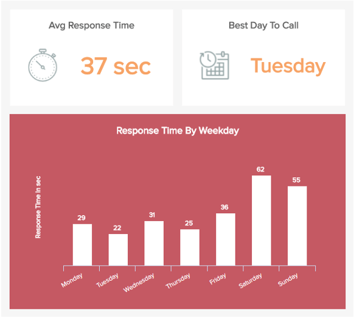
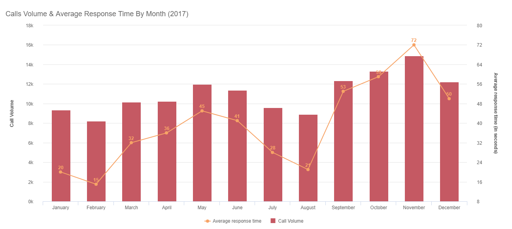
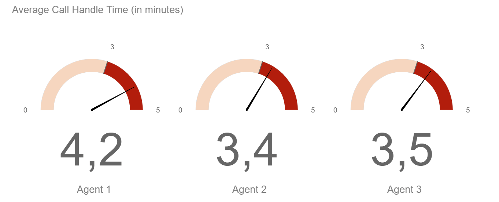
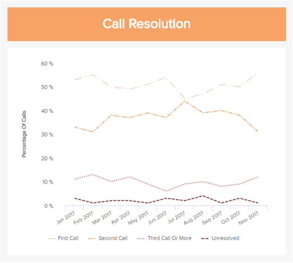
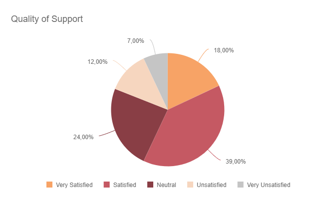
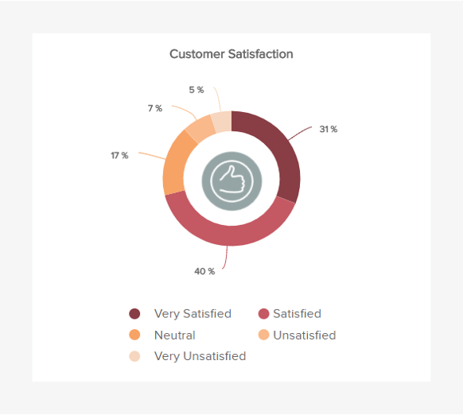

数据对于成功运行呼入呼叫中心至关重要。每天都有如此多的电话打来，如果没有有意义的指标，很难知道发生了什么。这使得选择正确的指标非常重要，因为当您选择关注给定的呼叫中心 KPI 时，您就暗示了这个指标代表了您业务中的一个重要现实。如果您要花费所有精力来量化和跟踪该指标，你就想在你的投资上获得正回报。要整合您的所有数据并充分利用它，请考虑使用 可帮助您制定各种 [业务仪表板的](https://www.datafocus.ai/infos/dashboard-examples-and-templates)[KPI 软件](https://www.datafocus.ai/infos/kpi-dashboard-software)。

## 为什么需要跟踪呼叫中心指标

_“客户并不期望你是完美的。他们确实希望你在他们出错时来解决问题。” ——唐纳德·波特_

曾几何时，品牌、企业和组织基于有根据的猜测和模糊的见解做出战略呼叫中心决策。但是，情况已不再如此。数字技术的发展意味着，为了评估绩效、设定有价值的目标、提高效率和提升服务水平，呼叫中心经理可以通过分析全面的呼叫中心指标和 KPI 做出明智的战略选择。

根据哈佛商业评论， 消费者忠诚度的首要因素是客户努力的减少。此外，77% 的人表示，珍惜时间是企业为客户提供可靠服务所能做的最重要的事情。 Call Center Helper最近的一项调查发现，根据 380 名呼叫中心经理的调查，95.7%的人认为客户满意度是他们最重要的指标。

考虑到这一切，很明显，要使呼叫中心发挥最佳能力，采取措施提高客户满意度并减少呼叫等待时间至关重要。不仅如此，通过使用综合指标，您还可以降低运营成本、提高员工士气、提高 NPS 分数等等。

在这篇文章中，您将了解需要了解的 9 个呼叫中心 KPI。您不一定需要跟踪所有这些指标。只需选择最适合您的。例如，如果您有一个非常小的代理机构，它更专注于少量的高接触支持电话，那么您的问题解决时间和呼叫量趋势可能并不那么重要。一个更有用的呼叫中心 KPI 将是您的客户如何评价他们与客户支持代理的互动。另一方面，如果您为消费产品提供客户支持，那么您的首次响应时间和呼叫量趋势可能正是您需要更加关注的。您可以获得的最佳实践不仅是跟踪这些指标，而且还可以在[客户服务仪表板上对其比较和可视化它们](https://www.datafocus.ai/infos/dashboard-examples-and-templates/customer-service)。

请记住，知识就是力量，在呼叫中心的绩效方面尤其如此。现在让我们进入这些指标！

## 最突出的 9 个呼叫中心指标和关键绩效指标

### 1) 首次响应时间

这是我们的第一个也是最重要的呼叫中心 KPI，因为它是您在客户致电您的客服时，您给客户的第一个（也是最重要的）印象。

没有人喜欢被搁置。尽管您等待的音乐可能多么令人愉快和乐观，但客户不太可能很快将其下载到他们的手机上。当人们打电话给您的中心时，这是因为他们有一个足够重要的问题，以至于他们愿意（或被迫）花时间解决它。通过让您的客户相对较快地与支持代表联系，您可以尊重他们的时间并让客户对您的品牌产生积极的印象。在上图中，响应时间显示为一天中的每小时和一周中的每一天。在本文后面，您还会发现该指标以年度为单位显示。

等待多长时间才算太久？嗯，这有点主观，所以让我们转向一些硬数据来帮助我们做出这个决定。OrdelrlyQ根据呼叫中心助手的一项研究创建了这张有用的图表，显示了随着时间的推移，有多少客户在等待与客户支持代表通话时挂断了电话。

**如您所见，大约 35% 的呼叫者会在等待的 1 分钟内挂断。等待 3 分钟后，大约 ⅔ 的呼叫者将挂断电话。**

虽然很难计算这些未接电话的直接成本，但不难想象。如果有人遇到问题给您打电话，并且被迫等待比他们预想的更长的时间，导致挂断电话……他们可能不会向您推荐新客户。

他们也更有可能：

- 在社交媒体上抱怨你糟糕的客户服务
- 停止使用您的产品或服务
- 向他们的朋友和家人抱怨您糟糕的客户服务

解决方案很简单：确保在任何给定的时间和日期有足够的代表来处理预期的调用，然后投入一些缓冲。显然，这说起来容易，执行起来要困难得多。为什么需要缓冲区？因为在预测有多少人会打电话时，你不可避免地会犯错误，而你对此无能为力。所以你必须做出选择：你的错误是过度优化还是覆盖你的基础方面犯了错?让我们来看看这两个选择。

**过度优化 VS, 创建缓冲区**

_过度优化：_有足够的客服人员来满足您的预测需求，这在短期内可以节省资金，但如果客服人员生病或呼叫者多于预期，则可能导致等待时间很长。最坏的情况：您有很多非常不满意的客户，导致推荐、好评和收入减少。

_创造缓冲：_ 拥有足够多的客服来满足您的预测需求，这在短期内会花费更多的钱，但会导致客户的等待时间一直很短，如果客服生病或呼叫者多于预期，则平均等待时间会缩短. 最坏的情况：您支付给客户支持代表的钱比您预期的要多。

我们认为，战略性的、长期的观点是接受更多客户支持代表所增加的成本，这可以对冲您在最坏情况的赌注。畅销书作家纳西姆·尼古拉斯·塔勒布 (Nassim Nicholas Taleb) 的著作支持了这一观点，他撰写了关于现代世界不确定性下的决策的文章。塔勒布 在他的著作《Antifragile》中警告过度优化的危险，他在其中给出了一个示例，在一个道路上，交通流量增加10%导致等待时间增加50%。

我们不会在这里过多地介绍减少您的首次响应时间的策略——只要知道这是您绝对应该跟踪的 KPI，并积极努力使其尽可能短。

### 2) 通话量趋势

了解您的呼叫量趋势是保持整体客户满意度得分和减少呼叫等待时间的好方法。您所要做的就是在呼叫中心开放时跟踪您有多少电话。然后，随着时间的推移，您可以看到如下内容：

- 你一天中最忙的时候
- 你一周中最忙碌的日子
- 你一年中最忙碌的月份

使用此信息，您可以相应地调整呼叫中心的人员配备需求。您还可以在绝对意义上使用这些数字：您的客户支持电话总数是随时间增加还是减少？为了在此处获得有意义的数字，您需要将呼叫量与客户数量进行比较，因为在其他条件相同的情况下，更多的客户 = 更多的支持电话。

话虽如此，如果您在过去 4-6 周内看到大量电话，则可能表明存在更深层次的问题。您可能需要检查这些电话的内容，以确定您实施的新补丁或产品功能是否会导致客户的所有这些额外电话。

### 3) 通话处理时间

这个呼叫中心 KPI 本质上是问：您的平均通话时间是多久？

然而，这个指标可能有点棘手。虽然您希望尽快为客户提供解决方案以尊重他们的时间，但您也需要确保为他们提供有效的服务，而不仅仅是“催促他们挂断电话”。正如客户体验公司 Impact Learning 在一篇关于问题解决时间（关于呼叫处理时间的不同思考方式）的文章中所说：“尽可能缩短 TTR （解决时间）是每个技术支持团队领导者的目标，需要谨慎对待，以免目标的解决时间变得越来越短。如果为了快速解决问题而放弃了根本原因分析，或者如果过度劳累或训练不足的客服破坏了融洽关系，那么不管问题多快解决，客户满意度都会下降。”

例如，您可以设置每次呼叫的最佳时间（在下面的示例中为3分钟），并查看您的客服如何在该目标时间周围安排自己。然后，你应该检查他们，并试图了解他们的电话更长或相反更短的原因，如果他们在这件事上不是太快。

通常，目标不应该是尽可能缩短问题解决时间。但是，如果您看到呼叫处理时间比正常情况长得多的趋势，这可能表明您的解决过程中存在需要解决的低效率问题。

### 4) 首次通话解决率 (FCR)

呼叫中心指标中的另一个重要指标。现在想象一下您的客户的生活。现在是下午 6 点。他们刚刚在办公室度过了漫长的一天回到家，他们正在挨饿。但是，您的客户支持中心在 6:30 关闭，所以他们打电话来，因为他们需要现在解决他们的问题。

打电话后，他们被告知做一些动作，然后回电。座席迅速挂断电话，感觉很好，因为通话完成得如此之快。但是，您的代表最好与您的客户保持电话联系，直到问题得到确定解决。因为如果您的客户采取的措施不起作用，现在他们必须再次致电……这是一个很大的麻烦。

他们可能会选择不打电话并停止成为您的客户。正如 ICMI 在他们关于 呼叫中心成功的文章中所写：“SQM 研究表明，如果客户的问题在第一次通话中得到解决，那么只有 3% 的客户有转投竞争对手的风险，相比之下，如果他们的问题在第一次接触中没有得到解决，有高达38%的客户有投靠竞争对手的风险。”

这一点我们再怎么强调都不为过：您对客户的时间和精力越尊重，您的品牌在客户眼中的形象就越好。在呼叫中心支持方面，许多现代公司都放弃了。如果您能在第一时间解决客户的大部分问题，你就有机会脱颖而出，赢得更多忠诚的品牌推广人员。

你如何衡量这个指标？嗯，这有时有点困难，但 呼叫中心助手 提供了以下测量方法：

- 来电者是否在第一次通话时就得到了足够有用的答案，这样他们就不必回电了？
- 7 天内有多少来电者回电？
- 在电话调查中，来电者如何评价他们的支持？
- 让第三方检查支持人员提供的答案的质量。

### 5) 近期支持的质量

最近支持的质量是一个非常有说服力的客户支持指标。在呼叫中心，现代趋势是在呼叫结束时使用自动化系统询问客户：

_“您如何评价您今天获得的支持的质量？”_

该指标比整体客户满意度更明确，因为它专门针对电话上的最新互动。这是呼叫中心 KPI，对于确定您员工中的哪些客服是注定要称为经理的明星，以及哪些需要更多培训非常有用。但是，请确保您不会太仓促地做出决定：任何测量都存在差异和随机性。

我们都知道，一些拨打支持热线的客户只是对与您的公司完全无关的事情感到不安。这些呼叫者往往会给出较低的支持评级，而不是相关客服的过错。如果一位客服不走运，他们可能会在这些愤怒的呼叫者中得到更多。

因此，在根据这些数据做出决定之前，至少在几周内（如果不是几个月的话）跟踪这个评级。几天时间太短，无法使用此指标获得有意义的样本量。

### 6) 客户满意度和建议

基于我们之前的观点，无论规模大小，总体客户满意度对于任何现代呼叫中心的成功都至关重要。它是您整个运营的跳动心脏，因此监控和响应此类呼叫中心指标至关重要。

客户满意度不可避免地与支持质量相关联，它将让您清楚地了解客户对您的看法以及您满足他们需求的能力。尽管您的日常运营可能足够高效，但可能有一些问题没有引起您的注意 -重复的问题可能会对您的组织的认知和未来造成不利影响。

如果您的客户一遍又一遍地面临同样的问题，这将影响您的服务水平。而且，基于一个满意的客户会将您推荐给平均三个朋友的事实，消除任何永久的问题必须是您的首要任务。

您的客户满意度得分越高，您最终就会越成功。如果您的服务水平下降，您将能够通过推出数字客户反馈调查，并在您的客户服务旅程中集成一个书写框来采取适当的行动，以便客户可以留下详细的反馈。

在当今世界，净推荐值非常重要。通过监控您的满意度，您将能够采取措施以指数方式提高您的 NPS 分数。此外，可以将您的 NPS 分数作为呼叫中心 KPI 本身来衡量。通过定期跟踪和量化您的 NPS 水平，您可以获得评估推荐力量的能力。

在 1 到 10 的范围内，您推荐我们的可能性有多大？这是您迫切需要向客户提出的问题。如果分数介于 0-6 之间，则您的客户是批评者。如果它位于 7-8 区域，则您的客户是被动的。如果它落在 9 或 10，你就很幸运；你的客户是一个十足的推广者。将批评者推断为推广者，你就得到了你的净推广者得分。

与满意度一样，NPS 分数是一个无价的忠诚度指标。如果衡量正确，它们可以通过将客户服务工作作为关键驱动力来帮助您扩大和发展业务。您可以在我们专门针对[客户满意度指标](https://www.datafocus.ai/infos/customer-satisfaction-metrics-effort-score-nps-csat)的文章中找到更多信息，包括努力得分和 NPS。

### 7)最高支持代理

一个快乐、积极、敬业的呼叫中心员工不仅会保持高效率，而且还会始终如一地为您的客户机和客户提供模范支持。也就是说，最高代理支持是您可以跟踪的最有价值的呼叫中心指标之一。

事实上，高度参与的企业受益于客户评分提高 10% 。

通过分析大量客户服务指标，例如首次呼叫解决率和每小时处理的呼叫数量，您将能够创建一个最高评级的代理仪表板来监控每个代理的成功。

使用像这样的[工作效率指标](https://www.datafocus.ai/infos/productivity-metrics-examples)还可以帮助您了解哪些代理可能需要培训或支持，以及哪一个可能更适合更高级的角色。除此之外，在激励、奖励和认可您的团队时，最高评价代理指标还将帮助您，从而提高员工的士气和敬业度。

虽然这个特定的呼叫中心指标对于任何面向客户的组织来说都是无价的，但为了获得最佳结果，您应该在采取任何重要行动之前在几个月内跟踪您的客户服务仪表板。这样，您将能够解释您可能遇到的任何细微的不一致之处 - 毕竟我们都是人。

### 8) 客户留存

任何成功企业最有重要的要素之一就是客户忠诚度。留住消费者至关重要，因为与留住现有客户相比，企业获得新客户的成本更高。

这是可用于呼叫中心的一个典型[客户 KPI 。](https://www.datafocus.ai/infos/top-7-customer-kpis-and-metrics)该指标是通过将重复业务或购买的客户数量除以活跃客户总数来衡量的。保持一个满意的客户的成本比激发一个新的潜在客户要低，并且通过查看您的客户留存水平，您可以确保您的呼叫中心帮助企业变得尽可能高效、经济和盈利。

确切的具体价值取决于您的业务性质。例如，尽管汽车经销商的客户留存率低，但仍有增长潜力。另一方面，在线零售商需要保持较高的留存率，以确保可持续的商业成功。

保持良好的留存率是大多数企业的主要目标，因此，它应该是您的呼叫中心的主要指标之一。 卓越的品牌形象加上卓越的满意度得分将有助于提高您的客户留存率，进而促进您业务的整体成功。

### 9) 支持成本与收益

深入了解您的客户支持成本与总收入比例（以百分比计算），将帮助您简化呼叫中心的运行，使其更加经济。

企业的一个共同目标是以尽可能低的成本提供高标准的客户服务。牢记这一点，此呼叫中心 KPI 绝对是您清单上的必备品。

借助支持成本与收入指标，还可以将总支持成本除以发生的问题数量，并了解单个支持行为的业务成本。呼叫中心支持也需要投资，但通过全面了解成本，您将能够保持较低的成本，同时为您的消费者提供卓越的服务水平。

管理支持成本的两种有效方法是统一培训您的员工，并确保员工的时间表满足呼叫中心的需求，精心设计它以便您的员工能够处理不可预见的问题和繁忙时期。

最好随着时间的推移衡量这样的呼叫中心指标，密切关注您的趋势线。如果它达到一个异常高的比例，你将能够调查原因并采取必要的措施来解决问题，而不会浪费大量时间或金钱。

_“客户可能会忘记你说的话，但他们永远不会忘记你给他们带来的感受。” - 匿名_

运营呼叫中心绝非易事。 即使随着社交媒体、实时消息和聊天机器人的兴起，人们仍然喜欢使用手机来提问、请求支持、购物和解决问题。在如此多的活动和如此少的时间下，密切关注支持水平和运行效率似乎是不可能的。通过跟踪正确的呼叫中心KPI和指标，您将能够持续增长、发展和加强您的呼叫中心，帮助您在竞争中获得最重要的优势。

要开始衡量您的呼叫中心是否成功，请查看我们的[在线报告软件](https://www.datafocus.ai/infos/online-reporting) ，如果您有任何问题，请随时与我们联系。我们还提供 30 天 [免费试用](https://www.datafocus.ai/console/)！
