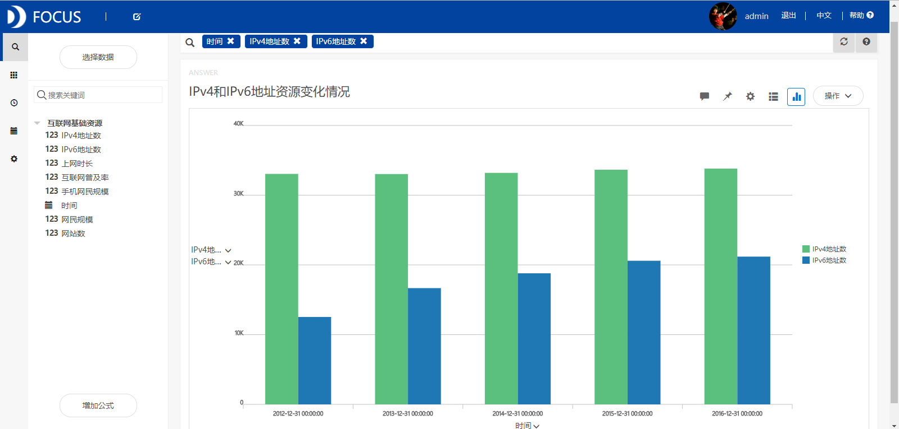
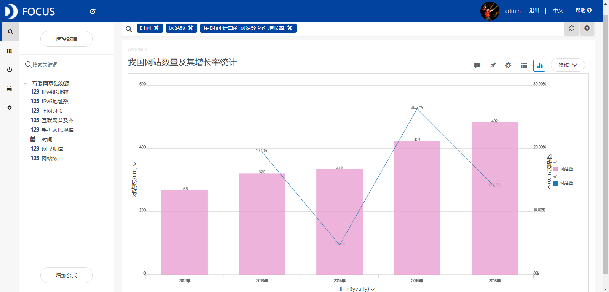
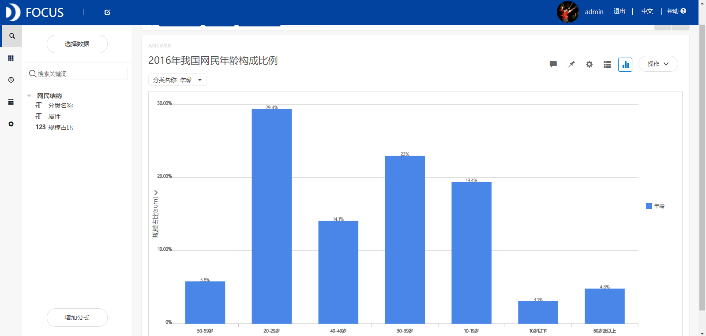
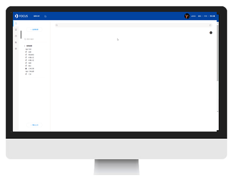
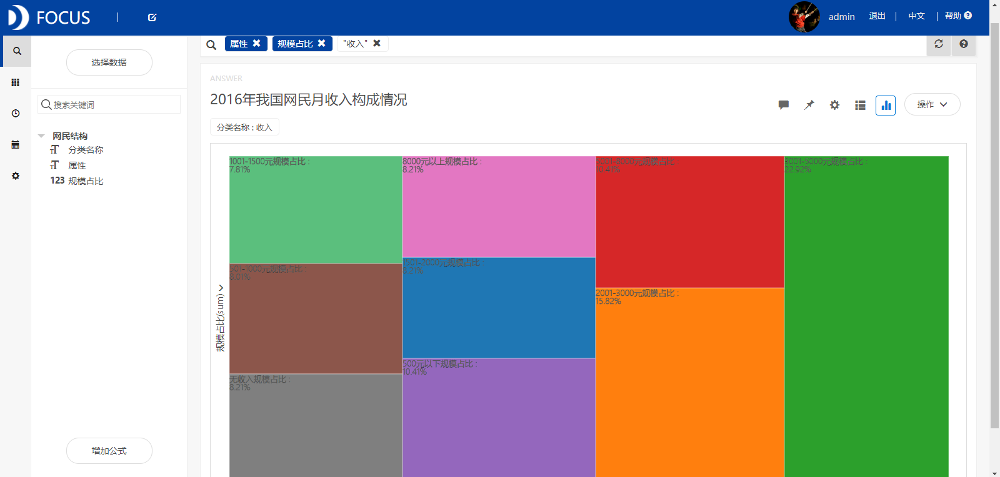

**目的：**统计分析2012-2016年我国互联网基础资源发展情况，研究2016年我国网民规模和结构状况。

**摘要：**随着互联网的普及和科技的发展，各种形式的网络应用不断涌现，互联网应用的领域不断拓宽。本文通过对我国互联网发展状况的统计分析得出了以下结论： 2012-2016年间我国IPv6地址数逐年增加，IPv4地址数基本维持不变。网站数量也逐年增长，2015年增长得最快。2016年我国网民规模达到7.31亿人，互联网普及率为53.2%。我国网民以10-39岁群体为主，占整体的71.8%。初中学历的网民占比最高，为37.9%。学生群体占比最大，为24.8%，其次是个体户/自由职业者，比例为20.9%。月收入在3001-5000元的群体占比最高，达到22.92%。

**关键词：**Datafocus,互联网基础资源,网民规模和结构

**一、案例背景**

我国互联网起步于二十世纪八十年代后期，发展历程大致可分为四个阶段：初期探索阶段、基础网络建设阶段、内容活跃网络普及阶段和当今的网络繁荣阶段。随着互联网的普及和科技的发展，各种形式的网络应用不断涌现，互联网应用的领域不断拓宽，网民生活全面“网络化”，互联网在整体环境、互联网应用普及和热点行业发展方面取得了长足进步。

**二、案例问题**

本文首先统计分析2012-2016年我国互联网基础资源发展情况，包括IPv4和IPv6地址数、网站数量等。然后研究我国网民规模和互联网普及率的变化趋势，分析网民的年龄、学历、职业和月收入构成情况。

**三、案例分析**

将分析的“互联网基础资源”、“网民结构”和“2016年各省互联网主要指标发展情况”CSV文件导入到Focus系统中。

**（一）互联网基础资源发展情况**

**1．IPv4和IPv6地址资源变化情况**

从图1中我们可以看出2012-2016年间我国IPv6地址数逐年增加，截至2016年12月，我国IPv6地址数量为21188块/32。而全球IPv4地址数已于2011年分配完毕，自2012年开始我国IPv4地址总数基本维持不变。 

图1 IPv4和IPv6地址资源变化情况

**2.我国网站数量及其增长率统计**

从图2中我们看到我国网站数量也是逐年增长的，2015年增长得最快。截至2016年底，我国网站数量增至482万个。 

图2 我国网站数量及其增长率统计

**（二）网民规模和网民结构情况**

**1.网民规模和互联网普及率**

从图3中可以看到我国网民规模逐年扩大，互联网普及率也逐年提高。2016年我国网民规模达到7.31亿人，互联网普及率为53.2%，较2016年提升1.5个百分点。 

图3 网民规模和互联网普及率

**2.网民年龄构成比例**

我国网民以10-39岁群体为主，占整体的71.8%：其中20-29岁年龄段的网民占比最高，达29.4%，10-19岁、30-39岁群体的占比分别为19.4%、23.0%。****

图4 我国网民年龄构成比例

**3.网民学历构成比例**

我国网民以中等学历群体为主。初中学历的网民占比最高，为37.9%，其次是高中/中专/技校学历，其网民占比为25.5%。 

图5 我国网民学历构成比例

**4.网民职业构成比例**

我国网民中学生群体占比最大，为24.8%，其次是个体户/自由职业者，比例为20.9%，企业/公司的管理人员和一般职员占比合计达到15.1%。

****

图6 我国网民职业构成比例

**5.网民收入构成比例**

随着社会经济的不断发展，网民的收入水平也在逐年增加。截至2016年底，我国网民中月收入在3001-5000元的群体占比最高，达到22.92%，其次是收入为2001-3000元的群体，占比15.82%。  图7 我国网民收入构成比例

**（三）2016年我国各省网民规模**

从图8中可以看到2016年广东省的互联网上网人数最多，为8024万人，其次是山东、江苏、河南等省。西藏、青海、宁夏等省的互联网上网人数最少。 

图8 2016年我国各省网民规模情况

**（三）数据看板**

最后将这8个结果图导入“我国互联网络发展状况分析”数据看板中，操作结果如下： 

图9 数据看板

**四、结论**

2012-2016年间我国IPv6地址数逐年增加，IPv4地址数基本维持不变。网站数量也逐年增长，2015年增长得最快。截至2016年底，我国网站数量增至482万个。网民规模逐年扩大，互联网普及率也逐年提高。2016年我国网民规模达到7.31亿人，互联网普及率为53.2%。我国网民以10-39岁群体为主，占整体的71.8%，其中20-29岁年龄段的网民占比最高，达29.4%。初中学历的网民占比最高，为37.9%。我国网民学生群体占比最大，为24.8%，其次是个体户/自由职业者，比例为20.9%。我国网民中月收入在3001-5000元的群体占比最高，达到22.92%，其次是收入为2001-3000元的群体，占比15.82%。2016年广东省的互联网上网人数最多，为8024万人。

**五、对策建议**

我国网民规模和互联网普及率虽然在逐年增长，但是增长得比较慢，截至2016年底我国互联网普及率还不到55%，因此相关部门应该通过加快基础设施建设、改善上网条件、完善地区通信网络、加强计算机和互联网知识培训等途径来扩大我国网民规模以及提高整体的互联网普及率。
