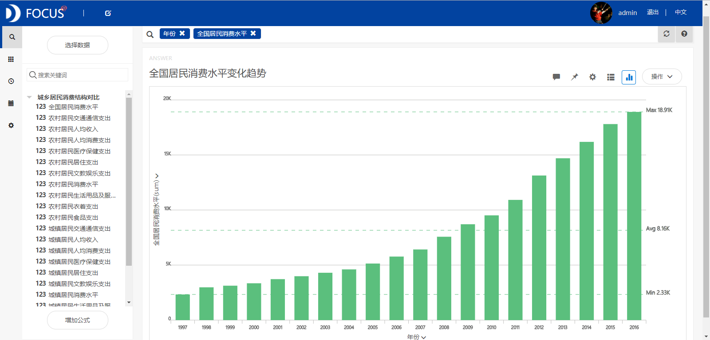
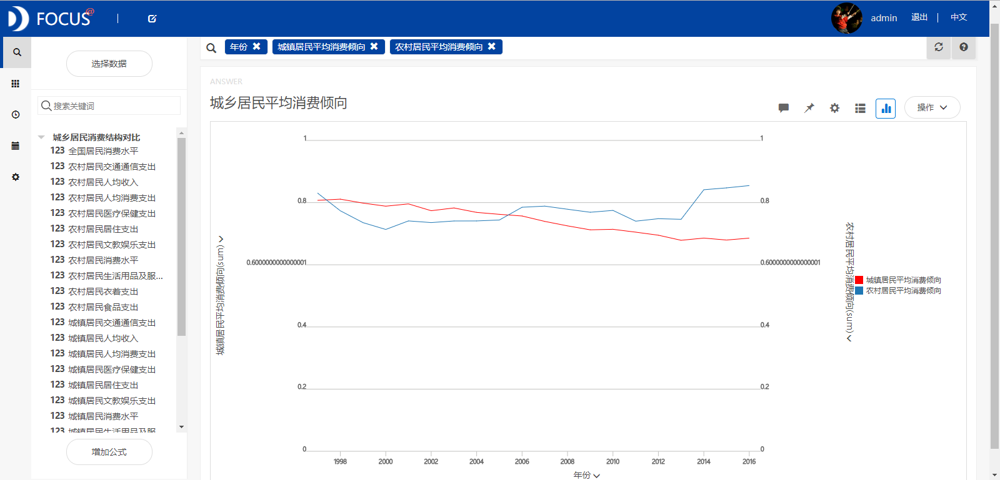
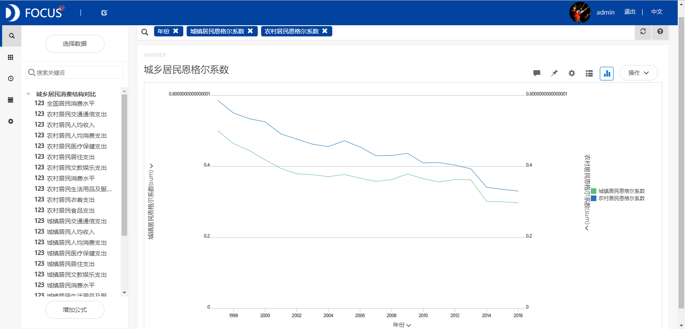
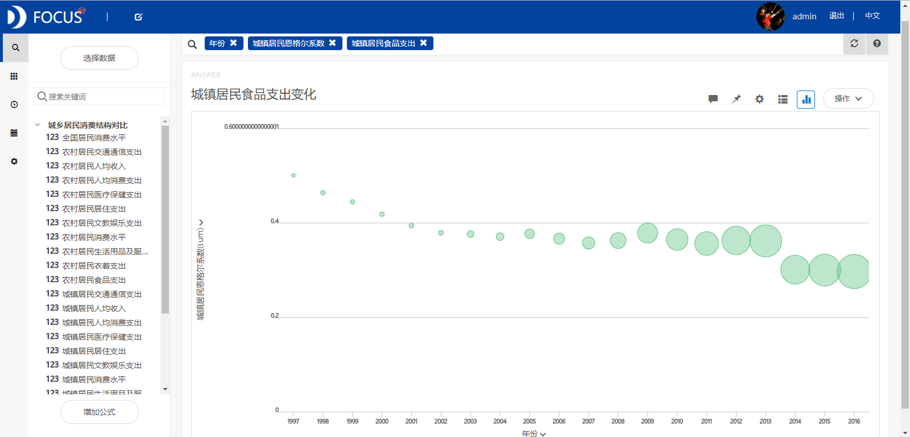
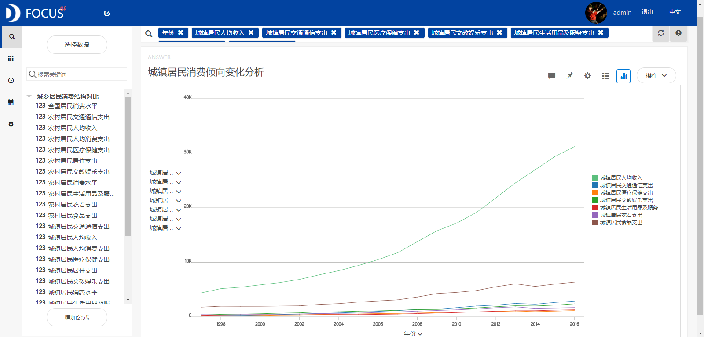
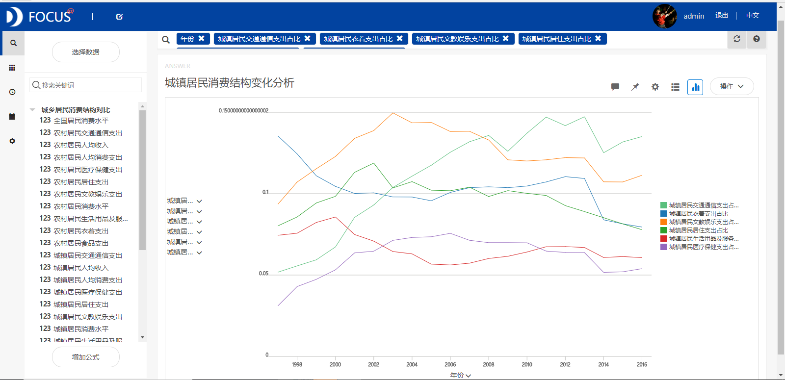
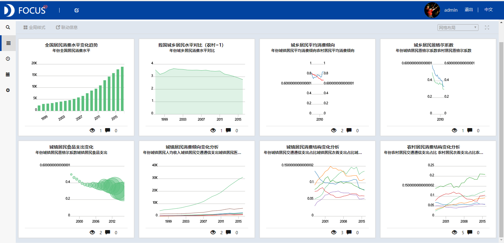

目的：利用1997—2016年间的统计年鉴数据，对我国城乡居民消费水平和消费结构的变动过程进行对比分析。

摘要 ：通过对我国城镇和农村居民的消费对比分析，得出了以下结论：1997—2016年间我国总体的居民消费水平呈现逐年增长的趋势；城乡居民消费水平之间的差距一直处于下降的趋势，但是目前差距还是很大；城镇居民在文教娱乐、居住和生活用品及服务的消费支出占比变化不大，在交通通信方面的消费占比在缓慢增加，而在衣着方面的支出占比在逐渐减小；农村居民在居住、交通通信和医疗保健几个方面的消费占比在显著地增加，而在衣着、文教娱乐和生活用品及服务方面的支出占比变化不大。

关键词：Datafocus；平均消费倾向；消费结构

一、案例背景

经济的发展是为了满足人类不断扩大的经济需求，而国家经济发展又是以提高国民的整体福利水平为目的的，主要就是提高国民当前乃至未来的消费水平。消费结构是否合理是前提，同时消费结构的优化则是提高国民经济不可缺少的经济手段。为了指导政府部门采取有效的措施来优化我国的居民消费结构，需要研究我国城镇和农村居民的消费情况。

二、案例问题

本文利用1997—2016年间的中国统计年鉴数据，对我国城镇居民消费水平结构的变化进行了对比分析。为了方便后面的分析，这里对居民消费水平和人均消费支出作一区分。居民消费水平是指居民在物质产品和劳务的消费过程中，对满足人们生存、发展和享受需要方面所达到的程度。它主要通过消费的物质产品和劳务的数量和质量反映出来。人均消费支出指居民用于满足家庭日常生活消费的全部支出，包括购买实物支出和服务性消费支出。

三、案例分析

将分析的"城乡居民消费结构对比"CSV文件导入到Focus系统中。

（一）城乡居民消费变化趋势分析

1.全国居民消费水平

从图1中的统计数据来看，我国总体的居民消费水平呈现逐年增长的趋势，由1997年的2330元逐年增长到了2016年的18912元。

图1 全国居民消费水平变化趋势

2.城乡消费水平对比（农村=1）

为了比较城镇与农村居民的消费水平差异，构造城乡消费水平对比这一指标。这一指标是指将农村居民的消费水平看作单位1，来研究城镇与农村居民的消费差距。从图2中可以看出从1997到1998年我国城乡居民消费差距下降。但是1998年以后消费差距又不断增大，增大的趋势持续到2001年。2003以后，我国城乡居民消费水平之间的差距一直处于下降的趋势，但是目前两者之间的差距还是很大。 

图2 城乡居民消费水平对比（农村=1）

3.城乡居民平均消费倾向

利用公式分别计算出城镇和农村居民的平均消费倾向，得到如图3所示的折线图。从该图形中可以看出城镇居民平均消费倾向呈下降趋势，而农村居民的平均消费倾向大致呈现水平波动的趋势。 

图3 城乡居民平均消费倾向

（二）城乡居民消费结构分析

1.居民恩格尔系数

恩格尔系数是指食物支出与总消费支出的比例，是衡量生活水平和消费水平高低的重要指标。国际上根据恩格尔系数的大小划分各国贫富的标准为：0.6以上为贫困，0.5—0.6为温饱，0.4—0.5为小康，0.3—0.4为富裕，小于0.3为最富裕。从图4中我们可以看出1997—2000间我国城镇居民恩格尔系数在0.4到0.5之间，这一时期我国城镇居民的生活水平已经实现了小康，2000年以后我国城镇居民恩格尔系数小于0.4，表明城镇居民的生活水平进入富裕阶段。2012年以后农村居民恩格尔系数小于0.4，表明农村居民生活消费进入富裕阶段。 

图4 城乡居民恩格尔系数

2.居民食品支出

尽管城镇居民恩格尔系数一直在较小，但是城镇居民的食品支出一直在增加（见图5），这是因为城镇居民的消费总支出增长要快于食品支出的增长，城镇居民在其他方面的消费支出占比增加。

图5 居民食品支出变化

3.居民其他消费支出

从图6中可以发现随着城镇居民人均收入的快速增长，居民衣着、居住、交通通信、医疗保健和生活用品的支出均呈现缓慢增长的趋势。但是这些消费支出的增长幅度远小于人均收入的增长幅度，所以导致城镇居民的平均消费倾向一直处于下降的状态。

图6 城镇居民其他消费支出

3.城镇居民消费结构

计算城镇居民其他消费支出占总支出的比重，分析城镇居民的消费结构变化情况。从绘制的折线图（图7）中看出1997—2016年间城镇居民在文教娱乐、居住和生活用品及服务的消费支出占比变化不大，在交通通信方面的消费占比在缓慢增加，而在衣着方面的支出占比在逐渐减小。

图7 城镇居民消费结构变化分析

4.农村居民消费结构

为了分析农村居民的消费结构变化情况，计算农村居民其他消费支出占总支出的比重。从图8中看出1997—2016年间农村居民在居住、交通通信和医疗保健几个方面的消费占比在增加，而在衣着、文教娱乐和生活用品及服务方面的支出占比变化不大。 

图8 农村居民消费结构变化分析

（二）数据看板

最后将这8个结果图导入"城乡居民消费结构对比"数据看板中，操作结果如下： 

图9 数据看板

四、结论

1997—2016年间我国总体的居民消费水平呈现逐年增长的趋势。从1997到1998年间城镇居民消费对比呈现下降的趋势。1998年以后我国城乡居民消费水平的差距又不断增大。2003年以后，城乡居民消费水平之间的差距一直处于下降的趋势，但是目前城乡消费水平之间的差距还是很大。1997—2016年间城镇居民在文教娱乐、居住和生活用品及服务的消费支出占比变化不大，在交通通信方面的消费占比在缓慢增加，而在衣着方面的支出占比在逐渐减小。农村居民在居住、交通通信和医疗保健几个方面的消费占比在显著地增加，而在衣着、文教娱乐和生活用品及服务方面的支出占比变化不大。

五、对策建议

首先需要采取一定的政策提高城镇和农村居民的平均消费倾向。由于城镇居民在生活用品、医疗保健和居住方面的消费支出占比较小，因此政府应该重点解决这些方面的问题，以刺激城镇居民消费。例如，将房价控制在合理的范围内，提高医疗、保险机构的服务质量等。而农村居民在文教娱乐、生活用品及服务方面的支出占比较小且变化不大，因此相关部门可以通过生产机械化的农业用具、提供高质量的教育服务和多元化的娱乐设施等来增加农村居民消费。其次要努力减小城镇居民与农村居民之间的消费差距。
