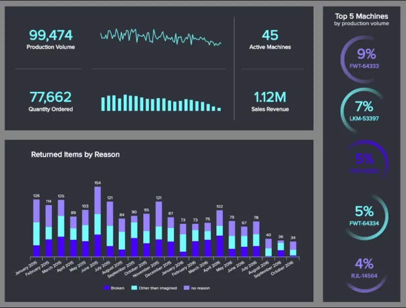
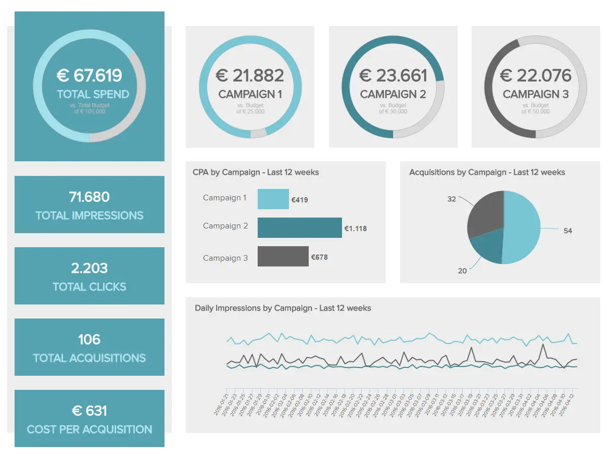
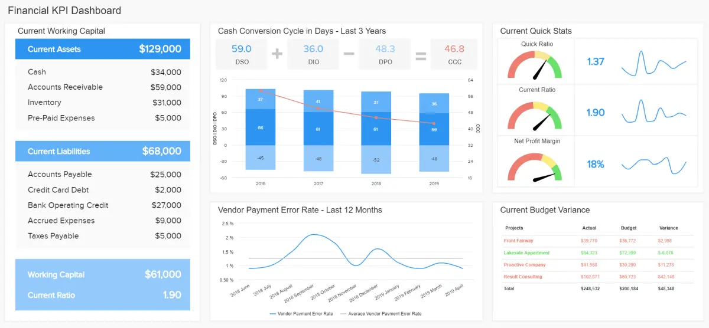

在信息时代，公司可以通过以高效和价值驱动的方式利用其组织数据来加速其成功。

为了从数据中榨取每一滴价值，无论是在运营还是战略意义上，利用正确的[在线报告工具](https://www.datafocus.ai/infos/online-reporting)非常重要。在报告（每天、每周和每月）方面，您为优化组织而制定的计划和方法将引导您的长期成功。

 

为了指导您的组织在分析中取得成功，我们将探索运营和战略报告。我们将通过定义、示例和最佳实践来了解如何成功。

让我们开始吧！

## 什么是运营报告？

运营报告是一种有效的、以结果为导向的方法，用于跟踪、衡量和分析企业的定期可交付成果和指标，通常每天、每周，有时是每月一次，借助现代和专业的[BI 报告工具](https://www.datafocus.ai/infos/bi-reporting)。

月度或每日运营报告通常在较短的时间内提供低级运营数据，为与组织活动相关的各种后勤方面提供了宝贵的见解。通过访问高度可视化的交互式见解，您可以做出更好的决策来促进运营。

这些分析工具的价值在于它们提供了一种交互式数据方法，可以当场回答关键问题并与每个相关利益相关者分享您的见解。为协作数据驱动型环境奠定基础。让我们在下面更详细地看一下这些好处。

## 为什么运营报告很重要？

如前所述，操作报告模板包含有关组织中不同操作任务的进度和发展的宝贵信息。使用这种现代数据方法具有许多隐藏的好处，可以提高企业的成功和盈利能力。其中包括：

- 通常实时做出快速、明智的决策：传统的报告生成方式是静态的，需要 IT 部门的干预才能生成，这通常需要数天或数周的时间。现代操作报告是使用实时数据构建的，允许用户在现场提取有价值的信息。掌握宝贵的见解可以帮助企业在问题变得更大之前发现任何问题，以及提高绩效的改进机会。
- 节省时间和金钱：通过提高许多关键运营领域（部门和行业）的效率，企业可以节省大量金钱和时间。你可能会怎么问？通过做出明智的数据烘焙决策，组织在制定战略时可以避免在黑暗中射击。使用预测分析等技术来发现趋势并预测未来可能发生的事情，为明智的资源分配奠定了基础，避免在错误的行动方针上浪费金钱和时间。
- 促进内部协作：现代运营报告示例是在线工具，可以从任何具有互联网连接的设备轻松共享和访问。这种级别的可访问性改善了部门之间的沟通和协作，并能够创建数据驱动的内部基础架构以确保稳定增长。

## 何时使用操作报告？

现在，您已经掌握了运营分析报告的基本概念，我们将考虑何时使用它们。

在[数据分析](https://www.datafocus.ai/infos/data-analysis-methods-and-techniques)方面，您应该使用它们来跟踪、基准测试和改进正在进行的运营领域的流程和绩效。这些领域包括仓储和履行、制造效率以及实时（或短期）营销或销售活动趋势或结果等功能。

使用操作报表时，请务必根据要实现的结果和目标考虑为什么要使用它。通过这样做，您将能够准确了解运营报告何时将为您的业务提供最大价值。

通过使用包含实时或每日见解以及每周和每月数据的有凝聚力组合的专业[业务仪表板](https://www.datafocus.ai/infos/dashboard-examples-and-templates)，您将全面简化绩效，同时显着改善内部沟通。从这个意义上说，您可能应该问自己一个问题，“我什么时候不应该使用运营报告工具？

a） 实时运营报告

实时分析提供当前的运营数据。通过访问可在发生时提供见解的可视化组合，各部门的经理或操作员可以在趋势展开时做出响应。通过这样做，可以就问题管理、部门绩效和短期运营策略做出明智的决策。最终，实时分析使企业具有响应能力、适应性和沟通能力，从而提高组织产出和盈利能力。

b） 月度运营报告

在商业智能报告中，分析您的每月活动至关重要。通过查看针对中期的指标，可以在整个业务中创造流畅性和凝聚力。如果您是代理机构，还可以创建[客户仪表板](https://www.datafocus.ai/infos/client-dashboard-report-examples)，并将其作为每月的报告发送，以更新利益相关者的相关数据。作为任何全面的组织报告战略的组成部分，月度报告提供了基于趋势的宝贵数据组合，有助于短期决策和长期倡议制定。月度运营报告数据信息丰富、详细且平衡，因此这些类型的分析工具对于任何组织的持续成功都至关重要。

您的机会：[想要创建强大的战略和运营报告吗？](https://www.datafocus.ai/console/)免费试用我们的软件 14 天，立即享受现代报告！

## 运营报告模板和示例

我们知道运营报告的用途和何时使用它，所以现在，我们将查看 5 种明确类型的运营报告示例。通过探索这些模板的基本组件，我们将正确看待它们的强大功能。

### 操作报表示例：仓库 KPI 仪表板

\*\*点击放大\*\*

主要关键绩效指标：

- 准时发货
- 订单准确性
- 仓储成本
- 出货数量

您的仓库对于任何处理实物产品、商品或库存的公司的成功运营都是不可或缺的。如果您无法有效地管理仓库运营，您可能会造成组织障碍，从而给您的资源带来不必要的压力。

作为实时监控的一个主要例子，我们的[仓库 KPI 仪表板](https://www.datafocus.ai/infos/dashboard-examples-and-templates-logistics)提供了所有核心计划的即时概览，使管理人员能够一目了然地解决问题并制定响应策略。

使用物流[KPI](https://www.datafocus.ai/infos/kpi-examples-and-templates-logistics)，例如运输时间、运输频率、仓储成本和订单准确性，在这里，您会发现一场完美的信息风暴——这种信息将在可持续的基础上使您的每个仓库运营无缝衔接。

### 运营报告模板：生产仪表板

\*\*点击放大\*\*

主要关键绩效指标：

- 产量
- 生产停机时间
- 生产成本

这份动态运营绩效报告可让您深入了解您的企业生产其资产或产品的能力。有了完美的视觉信息风暴，您可以在一个逻辑位置深入了解产品数量、停机时间和总体成本。

该[制造仪表板](https://www.datafocus.ai/infos/dashboard-examples-and-templates-manufacturing)的主要功能之一是它能够分解单个设备或机械的开发和输出。通过按产量准确了解性能最佳的机器，您可以准确地确定维护和升级工作的优先级，从而提高生产率并避免过程中不必要的支出。

该操作报告示例不仅提供了有价值的实时生产信息，而且还是一种出色的性能比较工具，使规模化制造商能够优化其生产流程的各个方面，以实现最大产量和财务效率。

### 运营报表示例：营销KPI仪表板

\*\*点击放大\*\*

主要关键绩效指标：

- 点击率 （点击率）
- 每次点击费用
- 每次转化费用

我们的动态运营报告示例列表中的下一个是使用[营销仪表板工具](https://www.datafocus.ai/infos/marketing-dashboard-software-tools)创建的，它侧重于广告系列的所有重要方面。

我们的营销模板是任何希望提高品牌知名度、提高参与度和加速增长的现代企业的基本运营报告样本，它提供了特定广告活动支出的详细细分（以特定广告活动预算为基准），同时提供了有关展示次数、点击次数和获取成本的见解。

通过使用此高度可视化的运营管理报告，您可以对营销活动和跨渠道沟通进行持续的战略调整。这将帮助您减少广告支出，提高参与度，并最终为您赢得始终如一的健康营销投资回报 （ROMI）。

营销是一个包罗万象的业务领域，因此，在保留预算的同时产生最大的影响将使您走上持续增长、成功和盈利的道路。这是一份可以帮助您做到这一点的报告。

### 运营报告示例：财务 KPI 仪表板

接下来，我们将讨论财务运营报告。基于财务的工具深入到组织预算和支出的每个重要领域。因此，随着时间的推移，不仅可以维持而且可以改善基于运营的财务状况，正如我们将在下面的示例中看到的那样。

\*\*点击放大\*\*

主要关键绩效指标：

- 营运资金
- 速溶比率/酸性测试
- 现金转换周期
- 供应商付款错误率
- 预算差异

当涉及到这种报告时，涵盖所有财政基础至关重要。使用平衡的财务 KPI 组合，此动态模板允许您向下钻取到重要领域，包括预算差异、营运资本、供应商错误率、快速比率和现金转换周期。这种全面的数据组合将使您能够经常改善组织的财务状况，从而推动您在此过程中取得成功。通过向下钻取显示的每个指标的点点滴滴，您甚至可以监控您的日常进度，同时清楚地查看更大的财务状况并比较一段时间内的结果。

提示：在这里，我们还可以说明此示例可用于战略报告，因为可以在更长的时间段内查看指标。

### 运营报告示例：IT 网络安全仪表板

对于最后一个示例，我们将介绍网络安全的 IT 月度运营报告。鉴于企业每天处理的敏感数据量，实施严格的安全监视和控制变得至关重要。事实上，Kaseya 最新的年度 IT 运营报告显示，[52% 的 IT 专业人员](https://www.kaseya.com/press-release/kaseyas-annual-it-operations-report-reveals/)将提高安全性作为他们的首要任务。相比之下，49%的受访者表示网络安全和数据保护是当今组织面临的最大挑战之一。考虑到所有这些因素，使用这样的工具可以证明是无价的。让我们更详细地看一下。

\*\*点击放大\*\*

主要关键绩效指标：

- 网络安全评级
- 入侵次数
- 平均检测时间
- 备份频率
- 网络钓鱼测试成功率

这种现代[IT 仪表板](https://www.datafocus.ai/infos/dashboard-examples-and-templates-it)的价值在于它提供了实时和历史数据的混合，以提取强大的见解并全面提高网络安全。借助相关指标（例如最常见的尝试类型及其频率、检测和解决的平均时间以及整体网络安全评级），IT 部门可以轻松识别痛点并在攻击损害整个组织之前修复它们。与所有这些指标配对，您还可以获得按周计算的管道测试成功率。通过此图表，您可以了解员工遭受网络钓鱼攻击的情况。如果比率过高，则需要实施培训措施。

现在我们已经了解了主要运营报告示例，是时候探讨战略报告的重要性了。让我们首先考虑战略报告的基本概念和含义。

## 什么是战略报告？

战略报告是高级管理层通常用来根据公司总体目标跟踪高级指标的分析工具。战略报告是长期理解、实现和超越组织目标的一种非常有效的方式。

通过使用动态 KPI 和交互式可视化指标，可以获得丰富的见解，使您能够创建宝贵的[数据报告](https://www.datafocus.ai/infos/data-report-examples)并全面进行重要的长期改进。通过这样做，您将获得在竞争中最重要的优势。

但是，是什么让这些报告对现代组织的成功如此有价值呢？我们在下面告诉你！

## 为什么战略报告很重要？

战略报告提供历史、现在和预测数据，使用户能够制定战略计划，最终促进组织的成功。能够根据不简单的直觉数据做出重要决策是战略报告的最大好处之一，其他一些好处包括：

- 提高员工敬业度或积极性：现代战略报告的第一个好处是它们将提高员工敬业度和生产力。通过能够评估他们的努力是否成功，员工将自动被激励去改进和实现他们的战略目标。
- 改善内部沟通、凝聚力和协作：为了达到成功所需的战略效率水平，有必要让所有部门和相关利益相关者了解情况并相互联系。现代战略报告是在线工具，可以轻松共享并用于支持相关讨论。访问整个组织的相关见解为改善内部沟通和协作奠定了基础。
- 节省时间和不必要的投资：C 级决策标记使用它们来做出有关组织未来的明智决策。如果不使用正确的工具来做出这些决策，管理者可能会陷入错误的投资，从而损害组织的财务健康。现代战略报告工具具有必要的功能，可帮助公司领导者通过[智能洞察力](https://kajabi.com/blog/what-is-benchmarking-how-to-do-an-effective-competitive-analysis)和基准测试做出最佳决策。
- 优化所有整体业务部门：这些现代工具提供的洞察力水平使管理人员能够随时了解有关不同部门的所有新发展。像这样，可以在整个组织内优化战略，并确保在可持续的基础上取得成功和增长。

## 何时使用策略报告？

那么，您什么时候应该利用战略报告来发挥自己的优势呢？这些强大的[商业智能解决方案](https://www.datafocus.ai/infos/business-intelligence-bi-solutions)通常由高级决策者或高管每周、每月或有时每季度使用，而不是每小时或每天与战略报告进行交互。

在分析方面，战略风格的报告提供了专为长期趋势识别和绩效比较而设计的 KPI 和指标。您可以宽泛地查看部门或营销活动级别的指标，也可以检查向下钻取到特定战略领域或职能的指标（过去、现在和预测）。

例如，如果您是一家医疗机构，则可以使用战略性[患者仪表板](https://www.datafocus.ai/infos/dashboard-examples-and-templates-healthcare)来比较两个不同年份的患者入院率。这样做将使您能够发现入院率的任何新高峰和低谷，找到原因的根源，并制定计划以确保您拥有资源和员工来提供有效的患者护理。此外，战略报告经常被用作定期部门或董事会会议以及围绕新业务活动、流程和计划的计划的权威见解来源。

虽然战略报告模板的使用频率可能不如运营报告模板，但它对您的业务成功同样重要。通过每周和每月在高层会议（外部和内部）以及制定新的活动或想法时使用基于策略的会议，您将受益于丰富的业务提升见解。

对于基于策略的报告，一致性是关键，这意味着在关键时刻持续利用它们至关重要。

您的机会：[想要创建强大的战略和运营报告吗？](https://www.datafocus.ai/console/)免费试用我们的软件 14 天，立即享受现代报告！

## 战略报告示例和模板

显然，战略报告有很多好处。为了帮助您在实际环境中了解他们的业务促进能力，以下是我们三个最强大的战略报告示例供您参考：

### 战略分析报告模板：销售KPI仪表板

\*\*点击放大\*\*

主要关键绩效指标：

- 每个销售代表的收入
- 客户流失率
- 追加销售和交叉销售率
- 每个销售代表的利润率
- 按活动划分的增量销售额

在许多方面，销售是组织的命脉。如果您无法鼓励稳定的销售流并从战略上管理它们，您的组织可能会陷入混乱，从而阻碍您的商业进展。

我们最实用的战略报告示例之一，即我们的[销售仪表板](https://www.datafocus.ai/infos/dashboard-examples-and-templates-sales)，允许您通过从基于消费者的转化和互动中榨取每一滴价值来保护和提高您的底线。

使用KPI，包括客户流失率，每个销售代表的收入和增量销售，这个宝贵的示例提供了一个全景视图，使您能够创建强大的利润提升计划，同时改善个人和集体销售发展。几乎可以想象到的每个部门或行业的强大工具。

### 策略报表示例：管理 KPI 仪表板

\*\*点击放大\*\*

主要关键绩效指标：

- 客户获取成本
- 客户终身价值
- 销售目标

当涉及到聪明、快速和自信的高级决策时，掌握这些工具至关重要。这份以专业[管理仪表板](https://www.datafocus.ai/infos/dashboard-examples-and-templates-management)形式发布的战略报告肯定会提供。

借助提供业务绩效的准确高级快照的 KPI，您可以深入了解客户获取成本、客户生命周期价值和特定销售目标。

这个最强大的报告策略示例平衡且直观易懂，使高级决策者能够牢牢掌握特定时期产生的实际收入，同时更好地了解他们的交叉销售和追加销售策略。该报告还提供了有关您在获得新客户上花费了多少以及您是否正在努力留住他们的宝贵信息。这是一场完美的信息风暴，使您能够在正确的时间对最重要的策略进行正确的调整、更新和更改。

### 战略报告示例：首席财务官仪表板

\*\*点击放大\*\*

主要关键绩效指标：

- 薪资员工人数比率
- 经济增加值
- 浆果比例
- 员工满意度

此财务报告仪表板是一个战略报告示例，它提供了可视化和指标的有效组合，旨在帮助[财务](https://www.datafocus.ai/infos/dashboard-examples-and-templates-finance)增长、健康和效率。

我们以首席财务官为中心的战略报告示例深入到四个主要财务领域，提供了有关成本、销售目标、毛利润以及客户和员工满意度的丰富见解。这个宝贵的信息大熔炉提供了一种有效的方法来监控和衡量季度财务业绩，同时分解特定成本并了解员工+客户满意度水平与公司财务状况之间的联系。

经常使用这份高端报告将帮助您正面应对任何负面的财务趋势，同时制定战略，最大限度地提高业务每个关键领域的财务效率。

### 策略报告示例：CMO 仪表板

继续我们的战略报告示例列表，我们有一个长期关注的 CMO 仪表板。对于需要就营销工作和资源分配做出重要战略决策的副总裁和 C 级高管来说，这种强大的分析概述是完美的工具。

\*\*点击放大\*\*

主要关键绩效指标：

- 销售目标和增长
- 网站流量与潜在客户比率
- 每条线索的成本
- 潜在客户与 MQL 比率
- MQL 与 SQL 比率

该模板提供了对相关指标的见解，例如用户、潜在客户、MQLs、SQL 和客户的数量，每个指标都与上个月的结果和要达到的目标进行比较。这是有价值的信息，因为通过查看目标信息，您可以一目了然地了解指标是否按预期执行。与此相结合，我们可以深入了解这些指标的成本。高级管理人员需要获得有关成本的数据，因为他们需要确保公司充分利用可用的人力和金钱资源。

### 策略报告示例：首席技术官仪表板

作为首席技术官或首席技术官，您需要查看高级指标，这些指标将全面了解部门的绩效。下面的模板包括实时数据以及关键指标的长期视图，它侧重于任何 CTO 都应该监控的三个关键领域：财务、学习和内部观点。让我们在下面分解一下。

\*\*点击放大\*\*

主要关键绩效指标

- 严重错误数
- 重新打开的门票
- 估算的准确性
- 新开发的功能
- 团队流失率

正如在这篇文章中提到的，任何有价值的战略报告都应该提供必要的数据来为关键决策提供信息。我们上面的[IT 分析](https://www.datafocus.ai/infos/business-intelligence-it)仪表板通过提供当前性能与上个月性能之间的比较来做到这一点。通过这种方式，经理可以通过简单地查看每个指标上的红点或绿点来轻松了解某些事情是否按预期进行。例如，财务部分显示支持和一般IT费用增加，这绝对需要研究以避免更大的问题。

我们已经研究了从运营管理报告示例到生产 KPI 等所有内容。现在，您已经了解了商业智能中这两个分析过程的关键动态及其优势，现在是时候了解如何以有效的方式创建它们了。

## 战略和运营报告最佳实践

很明显，运营报告软件非常强大——但前提是你用得好。为了帮助您在坚实的基础上建立报告策略，本文介绍了如何以正确的方式进行分析——从您的核心业务目标、目的和目标开始。

1\. 了解你的目的和目标

在开始分析之旅之前，您必须[清楚地了解](https://www.dummies.com/article/business-careers-money/business/strategic-planning/set-goals-and-objectives-in-your-business-plan-158846/)您的核心目的或目标。您想在提高产量的同时降低仓储成本吗？您想改善客户销售生命周期吗？你明白了。坐在协作环境中，建立您的核心目标。这样做将为您的报告工作指明方向。

2\. 使用正确的 KPI

一旦你确定了你的关键目的和目标，重要的是你与工作的最佳 KPI 一起工作。通过使用动态 KPI 的相关组合，您将确保访问相关数据，同时获得可用于基准测试、决策制定和故障排除的重要指标的概览可视化。虽然有许多[KPI 示例](https://www.datafocus.ai/infos/kpi-examples-and-templates)可供选择，但您需要专注于那些可以帮助您从数据中讲述正确故事的示例。

3\. 使用可定制的数字工具和仪表板

为了确保您的报告分析计划适合您，您必须使用可自定义的工具。通过根据您的特定需求定制设计，您将改进您的分析活动，同时强调[数据故事讲述](https://www.datafocus.ai/infos/data-storytelling-examples-with-data-visualization)，这将使您的指标更加强大。为了帮助您进行自定义工作，这里有一个[仪表板创意](https://www.datafocus.ai/infos/great-dashboard-design-examples-for-inspiration)指南，供您阅读。

4\. 考虑交互性和设计

为了充分利用您的报告工作，牢记交互性和设计至关重要。如上所述，现代工具为您提供了多种功能，例如交互式仪表板筛选器，以导航[仪表板](https://www.datafocus.ai/infos/interactive-dashboard-features/)并从可用数据中提取更深入的见解。虽然这是一种非常宝贵的做法，但这并不是唯一要考虑的问题。一些设计最佳实践对于保持受众参与并使报表尽可能更易于导航和理解也是必要的。例如，您可以将 KPI 标记为绿色或红色，以指示开发是正数还是负数。这将有助于用户一目了然地轻松了解需要改进的地方。也就是说，请注意不要用一堆颜色填写您的报告，因为这会分散注意力和混乱。保持您的设计简单，不超过 3 种颜色。

5\. 自动生成报告

在构建交互式运营和战略报告时，一个关键的最佳实践是依靠自动化。每天、每周或每月生成报告是一项繁琐的任务，需要大量的时间和精力，这些时间和精力可以专门用于其他相关任务。现代在线报告工具使您能够使用实时数据自动执行报告生成过程。您需要做的就是设置时间和所需的数据源，该工具将自动生成报告并将其发送给指定的收件人。像这样，您将在需要时获得相关的见解，而无需手动生成它们的繁琐任务。

6\. 受益于预测分析和人工智能

长期以来，预测分析和人工智能技术一直在彻底改变企业处理数据的方式。一方面，预测分析工具分析历史和当前数据，以生成有关未来绩效的准确预测。将这些预测包含在您的报告中可以帮助您做出明智的决定，并为可能出现的任何问题做好准备。另一方面，智能[数据警报](https://www.datafocus.ai/infos/business-intelligence-data-alerts)等人工智能技术使用机器学习算法来分析您的数据，并在检测到异常或达到预定义目标时立即通知您。这样，您就不必每小时手动检查一次报告。

7\. 让合适的人参与进来

当涉及到运营报告最佳实践或基于战略的报告方法时，这一点经常被忽视：当您推出新的软件、工具或自定义报告时，让合适的人参与进来，同时为组织中的每个人提供适当的权限级别，这一点始终很重要。通过提供培训和用户研讨会，您将确保从这些报告中受益的每个人得到更大的支持，同时收集有价值的反馈，使您能够改进您的工作。

8\. 从嵌入报告中受益

嵌入分析是确保整个组织的报告流程成功的另一种好方法。从本质上讲，这项技术允许您将整个报告软件及其所有特性和功能嵌入到您自己的系统中。通过这种方式，您可以从一个中心位置为员工和客户提供交互式[嵌入式仪表板](https://www.datafocus.ai/infos/embedded-dashboards)。这些仪表板带有白色标签，这意味着您可以根据公司的颜色和徽标自定义它们，并且可以通过实时 URL、电子邮件、PDF 甚至打印格式轻松共享。全面提供灵活性和可访问性。

9\. NSI：永不停止改进

这也经常被业务决策者所忽视，但这一点很重要：要在数据分析方面取得成功，您需要采用 NSI 思维方式。今天相关的内容可能不是明天，因此您应该经常研究[您的性能仪表板](https://www.datafocus.ai/infos/performance-dashboard-examples)，并在必要时进行调整和改进。通过这样做并更新您的队友您所做的更改，您将确保您的运营和战略活动得到优化，以便在今天、明天和未来很长一段时间内取得成功。

您的机会：[想要创建强大的战略和运营报告吗？](https://www.datafocus.ai/console/)免费试用我们的软件 14 天，立即享受现代报告！

## 关于运营和战略报告的关键要点

我们研究了运营和基于战略的报告的每个关键领域，概述了关键概念和优势，同时探索了大量动态报告示例，有一点是明确的：通过采用这些创新工具、技术和方法，您将在竞争中获得优势。

运营和战略报告工具完美协调，为可以想象的每个业务部门、流程和功能提供深入、实用的见解。使用正确的报告软件、报告类型和方法将使您的业务更加强大、适应性强、高效、创新和盈利——这是持续商业成功的关键属性。

现在，就交给你了。如果您已准备好开始创建自己的报告并将您的业务提升到一个新的水平，我们强大的软件将确保您的企业最大限度地发挥其全部潜力，同时享受持续增长。免费试用[DataFocus 的 14 天试用](https://www.datafocus.ai/console/)版，立即启动您的业务。
