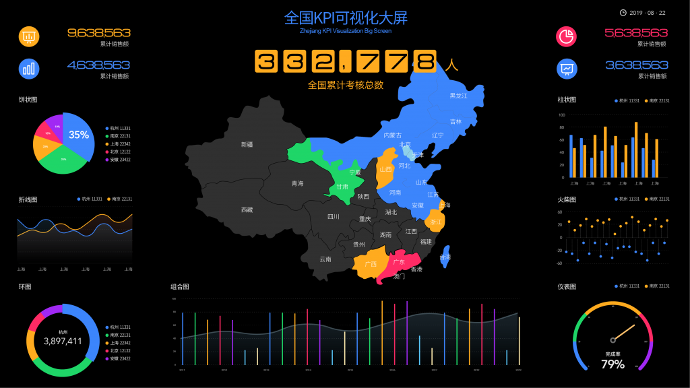

在新零售行业，随着数字化交易的大量进展，越来越多的客户被数据化，并且导入到了企业的客户数据库。而我们都知道，以阿里为首的新零售平台每年都有各类狂欢节日，甚至店铺也有自己的会员日等节日。很多企业都会在活动前后进行数据分析预测，活动实时分析，以及活动后数据复盘，包括转化率分析、好评率分析等，有的企业有专门的数据分析团队，也有的企业使用DataFocus等BI工具进行分析。

而对于大促比如双十一来说，大促倒计时提醒是非常重要的，意味着吸引客户有限的关注度和提点客户有限的记忆力，间接的为店铺大促营销冲刺提供帮助。本文就从数据分析的维度，分享人群筛选思路。

人群维度当是倒计时提醒的时候商家最关心的一点。我们可以结合推送节奏，以及历史和实时的数据分析，有针对性地拆分人群，大促选取人群，一般从这几个维度来进行数据分析。

- 第一个维度叫做大促敏感人群数据维度。比如2017+2018年双11客户、18年双11新客、往年双11的0-3点购物客户等。另外要注意的是，在大促期间优惠活动敏感客户也属于大促敏感人群，如聚划算敏感客户、清仓活动人群、秒杀人群。
- 第二个是商品数据维度。一般会考虑尝新客户、爆款客户、购买相似商品的客户、关联商品、还有下单未付款客户等等。
- 第三个是按生命周期数据划分的客户维度。比如我们介绍过的快消品0-180天内的客户、1年内客户等。并且还可以结合会员等级进行交叉数据筛选。

当然，这些是常用的数据分析思路，还可以有其他维度，比如，平时有跟客户做互动活动的商家，也可以从互动行为这个数据维度去筛选人群。
