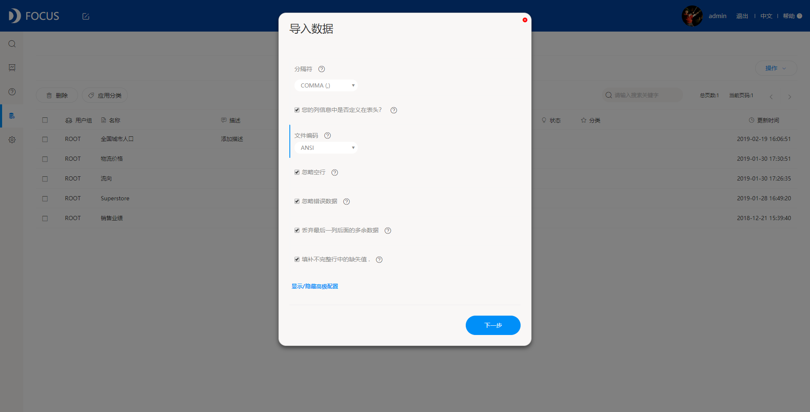
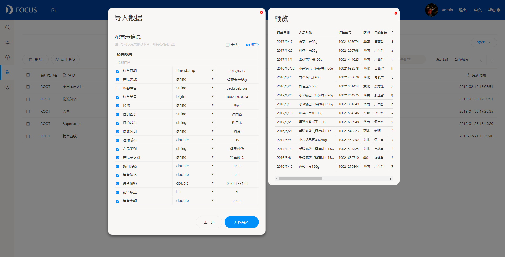
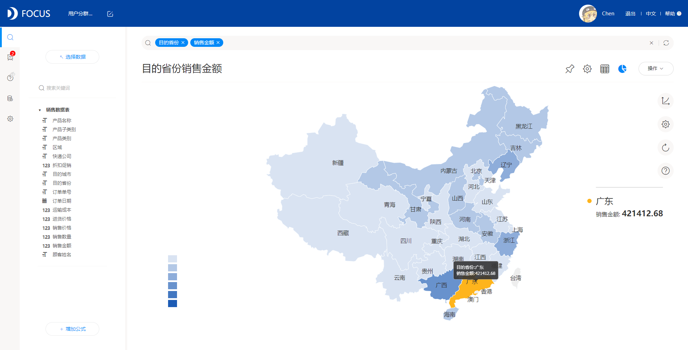
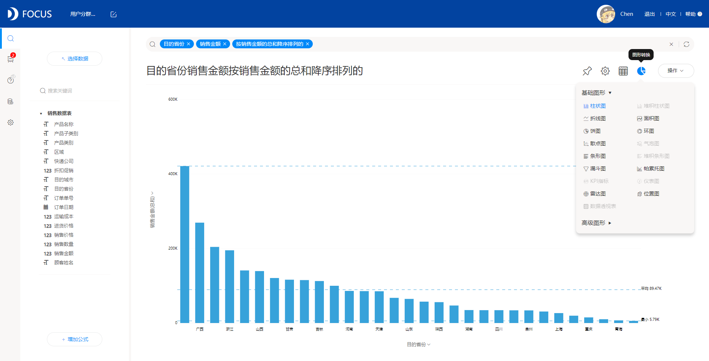

DataFocus是一款便捷高效的BI软件，拥有强大的数据分析能力和简介美观的数据可视化效果。简单学习就可以独立操作完成一篇优秀的可视化作品。

下面我们来一起制作一下。

以建立一个简单的销售分析为目标，来制作可视化结果。

**第一步，数据准备**

在DataFocus系统中的数据管理-工作表页面，点击操作-导入，选择需要导入的销售数据进行导入配置，将鼠标悬停在每一个配置项后的问号图标都可以看到该配置项的功能解释。

 然后进行表配置，我们可以选择需要导入的列，以及更改列类型和名称，还可以对即将导入的数据进行预览。确认后开始导入数据表，导入完毕的表会在数据管理工作表列表中出现。

**第二步，搜索分析**

进入搜索界面，点击右上角的选择数据，选择分析所需的数据表。

在搜索框输入“目的省份”“销售金额”，系统自动选择了地图来显示不同省份的全部产品销售金额总和。

我们还可以切换为柱状图，并按照销售金额的总和进行降序排序。

这样一张简单的可视化问答就完成了，然后将这张可视化问答保存下来。

**第三步，制作看板**

我们还可以多做几张相关的可视化问答，然后保存到同一个数据看板中，调整各个可视化问答组件的大小和位置，做出一个简洁明了的销售情况看板，还可以加入一些组件使看板信息更丰富。

过程就是这么简单，软件的安装也十分方便，大家一起来尝试一下吧。
