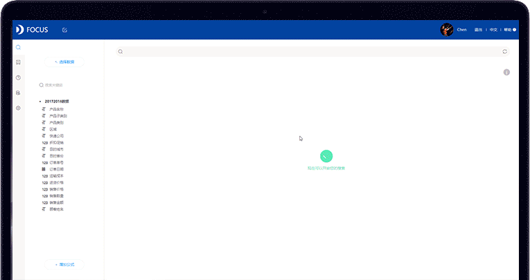
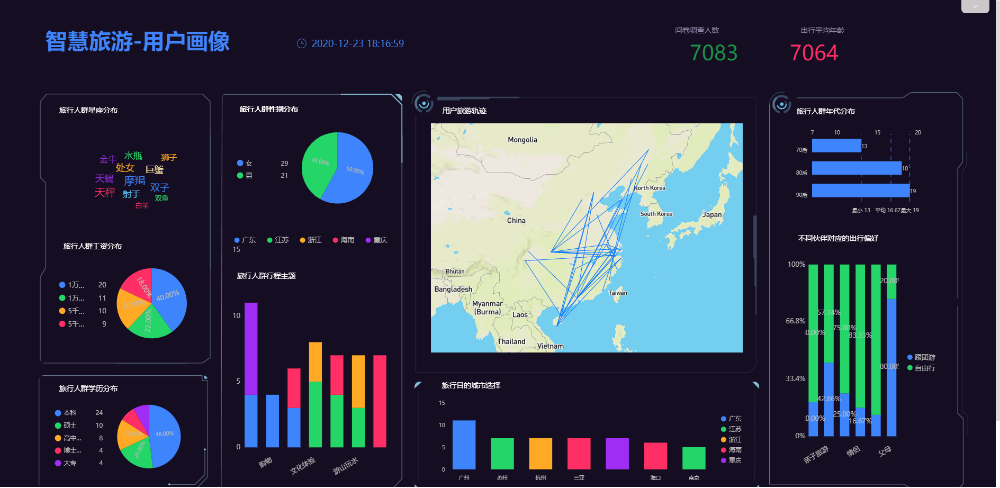

还有不到10天，2020年就要结束了，相信很多打工人都在为年终报告发愁中。报告年年都要写，怎么才能写出亮点呢？不仅要展示出一年的打工成果，还可能决定是否升职加薪。

不少进入职场的新人，还可能陷入一种心理不平衡：明明自己加班多、做事多，领导没提拔自己却将同事提升为主管了。心里觉得委屈，却只能叹气，“会做事的不如会写报告的”。

你可曾想过同事呈现给老板的报告可能是这样的：

还有这样的：

不仅对业务数据做出了分析，还通过可视化图表呈现，清晰明了，让老板一看就眼前一亮。同样的工作内容和数据结果，以高度可视化的形式呈现，带来的好感度提升几倍。

不要再觉得委屈了！趁着今年最后的机会，学习制作一份打动老板的可视化工作报告，有数据、有图表、有洞察、有观点，涨薪机会跑不了！

可是，就这短短几天的时间，Excel制作太麻烦，SQL和Python代码又不会，该怎么办呢？所以，**DaTaFocus Cloud就是为了解决这个痛点，让业务人员无需学习代码编程，轻松搞定可视化数据分析。**

最好的学习方式，就是边实践边学习。年底冲刺，推荐你**试用DataFocus Cloud！**

**【零代码操作】**不需要掌握任何SQL、Python编程知识，零代码操作，特别适合业务人员。

**【搜索式分析】**颠覆式的搜索式分析体验，只需要像使用搜索引擎一样输入问题，AI帮你智能分析，实时得到可视化的图表。 

**【免下载安装】**省去复杂的下载安装过程，只需要连接网络完成注册登录，即可使用。告别系统崩溃、软件卡顿等问题。

**制作步骤**

**数据导入：系统智能判断数据格式**

DataFocus Cloud 支持导入本地数据文件，数据文件支持txt、csv、xls、xlsx、json格式。还可以直接连接数据库。

**搜索式分析：革新数据分析流程**

DataFocus Cloud是一款为业务人员准备、零代码实现数据分析、快速上手的数据可视化分析平台。

DataFocus Cloud和一般的数据分析工具不同，它最大的特点是可以用类自然语言来交互，**只需像使用搜索引擎一样输入问题，DataFocus就能自动进行数据分析和可视化呈现**。

导入需要分析的数据表之后，在搜索框中输入信息，系统能够实时展示搜索结果，达到秒级相应的水平。并且还可以根据需要任意更改图表的类型。

_DataFocus Cloud：像使用搜索引擎一样简单_

**一键美化：可视化界的美图神器**

数据可视化过程中颜色的运用，其重要性不言而喻。可以说，配色是改变图表颜值最快捷有效的方式。DataFocus Cloud提供了多种主题配色一键切换，还可以 根据个人需要自定义图例颜色。

_DataFocus Cloud：一键修改主题配色_

**个性化组合：充分发挥可视化创意**

DataFocus Cloud 支持40多种可视化图表类型，包括基础图形，如柱状图、饼图、折线图等，也有高级图形，如桑基图、时序图、弦图等。

DataFocus Cloud支持将图表自由布局组合成可视化数据看板，还可以添加看板组件，如文字标题、图片、边框、时间器等，打造成个性化的可视化看板。

_DataFocus Cloud：自定义组合数据看板_

点击某个筛选项，数据看板中会及时筛选出对应的数据。非常方便快捷。

_DataFocus Cloud：一键筛选数据_

**怎么样？快来试试这样的报告，让老板眼前一亮~**

**注：文末福利来了！DataFocus Cloud正在公测中，邀请产品体验官免费试用！**

**如果您是新用户，直接访问官网datafocus.ai的试用界面。微信扫码注册或填写注册信息后联系客服可获取您的专属代金券。**

**已经注册过的小伙伴，您可以在公众号菜单栏“关于我们”中点击“申请试用”，我们将会给您推送客服二维码，联系客服后我们也将送出您的专属代金券！**
