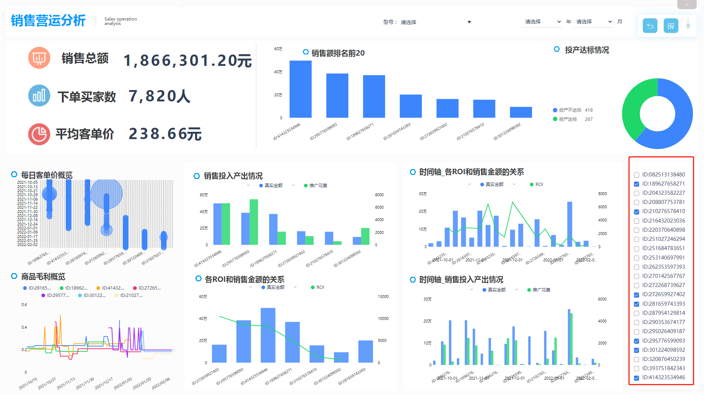
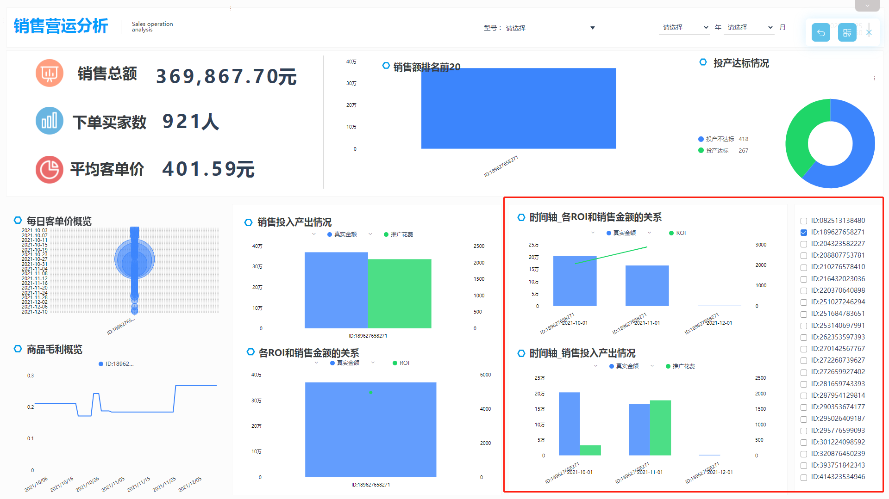
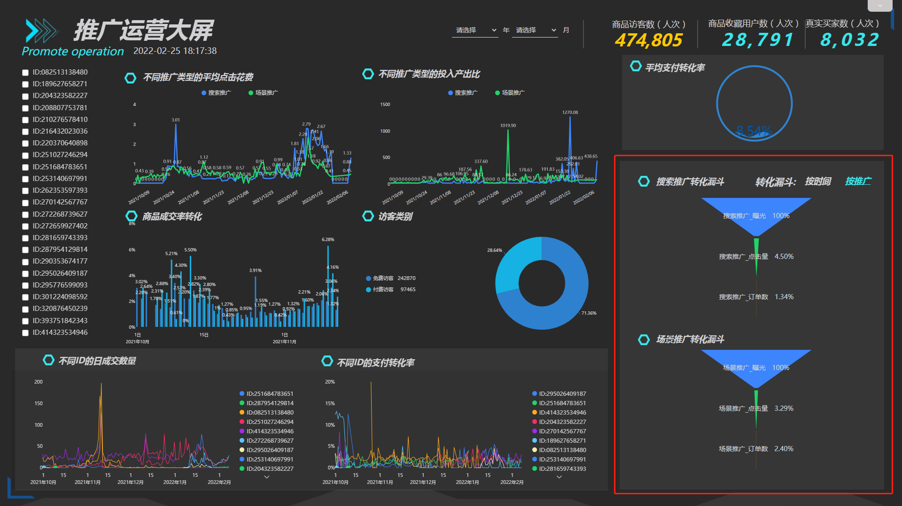
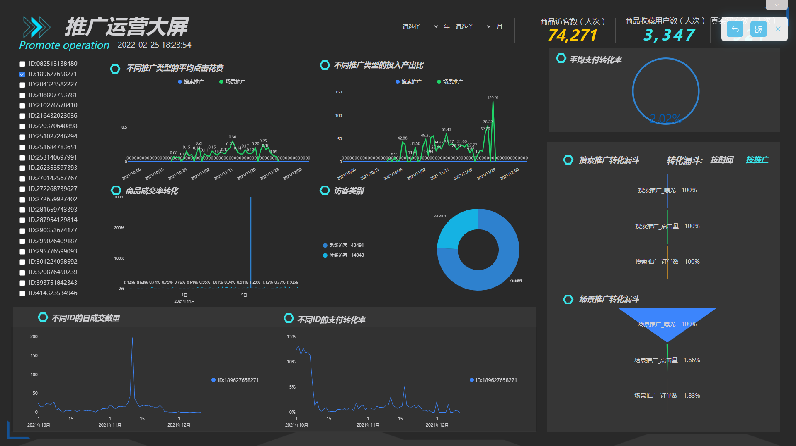
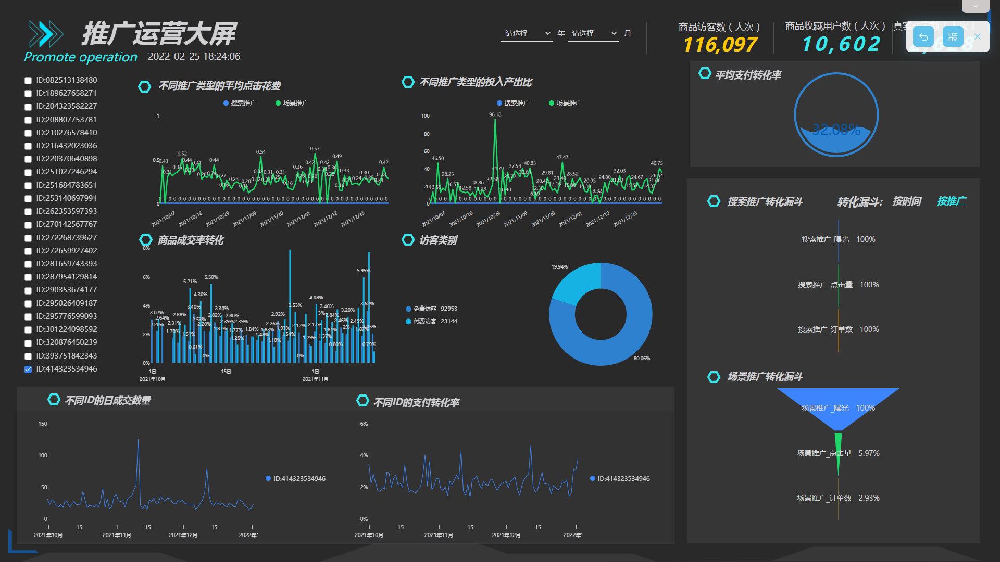
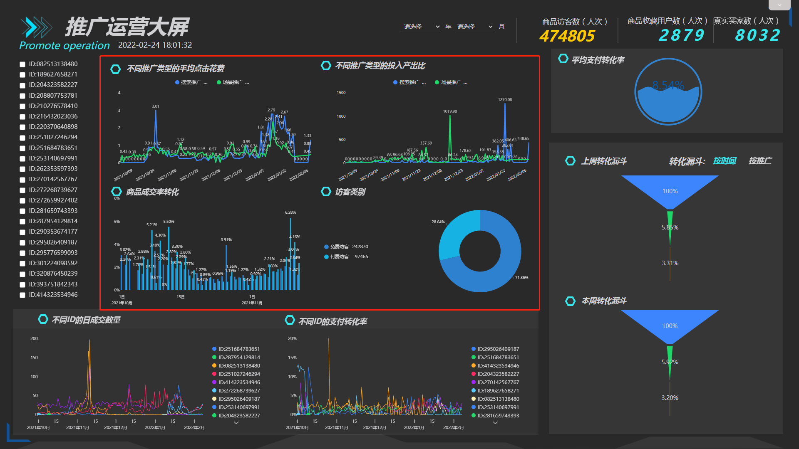

互联网时代，打造“爆款”的方式可谓是五花八门，如何找到属于你的“爆款”呢？

爆款不是想爆就能爆的，不是说你有一个性价比很高的产品就能做出爆款，产品质量好只是基础，想要真正做出一款“爆款”，必须先了解平台规则，其次合理规划，然后学会引流推广，最后理解数据分析，这就要求卖家需要对自己的店铺运营能力有一定的要求。

但在运营初期，卖家们都容易遇到各类问题：

- 不是每个人都天生就懂运营，小店主们无法长期雇佣专业的人员进行运营和数据分析的工作；
- 拼多多卖家在生意参谋上看到的收益和实际盈利存在差异，其中包含诸如快递费，刷单，人员，房租等费用；
- 将文件从系统导出Excel文档进行计算，费时费力，不够灵活，不能实时观察到数据变化；
- 做电商的一般都存在多家店铺，可能在淘宝京东拼多多上都有店铺，多平台数据无法在一个系统内体现进行分析；

拼多多平台主打的是薄利多销，但无论实体店还是电商，开店最主要的目的是为了盈利，所以借助DataFocus数据分析工具打造了如下图的销售运营分析大屏。

从上图的大屏中可以看到，大屏最左侧是对基础指标的展示，用简洁的KPI指标直观的展示卖家的商品销售总额、下单买家数以及平均客单价，同时大屏设置了型号、商品ID以及年月的筛选，可以通过筛选项，进行具体筛选。投产达标的结果代表实际ROI和预设的目标ROI之间的差距，如果实际ROI高于目标ROI，则代表投产达标。

在对基础数据有了初步印象后，接下来将从ID的角度来看商品带来的实际收益。真正的ROI要包含成本计算才是有价值的，比如刷单费用，广告投放费用，管理成本，人员工资等等，如果没有计算到分析中，结果可能是看上去挣钱但其实是亏本的。首先按照销售额进行排序，筛选前7名的商品，对比其实际销售金额、推广花费和ROI之间的关系，获取真正给我们带来收益的商品。当然，各单品之间可以做一些的匹配从而获取更高的利益。从图上我们可以看到，编号尾号为9093的商品虽然拥有较高的真实销售额，但其花费的推广费用也是最高的，投入和回报不成正比；编号尾号为8592的商品花费了很大力气做推广，但收益却没有达到预期，并不适合打造为“爆款”商品。

从上一步中可以初步选定多个合适的商品，这里我们可以选择编号尾号为4946、8271的商品进行对比，在大屏中选择一个或多个商品ID就可以看出一段时间内该商品ID随时间变化的ROI趋势及投入产出比。因为商品一般都有较为明显的生命周期，容易受季节性因素、流行因素或市场偏好的影响，一旦生命周期结束，投入产出比就会明显变坏，因此需要在上一步的基础上按照时间轴维度进行进一步分析，从中选出最优爆款潜质的商品。从图上我们可以看出，编号尾号为4946的商品的推广花费和销售金额呈明显的正相关，一旦推广花费下降，实际销售金额也明显下跌；但只要推广到位，销售额是非常可观的。

拼多多平台的设置的每个活动都是仔细考虑过的，不是拍脑袋决定的，存在即代表平台会给店铺和产品带来权重与流量。但是关键点在于，你适不适合这个活动，你在报名的活动中获取多少流量，能不能在活动中达到自己的预定目标。

拼多多平台的推广类型，可以分为场景推广和搜索推广。场景推广是按千人千面展示的，展示的位置是类目页，因此引来的流量都是泛流量，不太精准，同时类目的热度对场景推广的流量有较大影响；而搜索推广相当于关键词推广，主要是通过买家搜索关键词展现的，相对来说，引入的流量更加精准。以两种不同的推广维度为切入点，制作如下图的推广运营大屏。

首先也是关注基础KPI指标，商品访客数、商品收藏用户数、正式买家数以及平均支付转化率。

无论做什么产品，根本目的都是为了变现，只要是变现，就涉及到了转化。而转化其实就是一个漏斗模型。图上的漏斗模型代表了曝光到点击再到最后成单的转化率，从漏斗模型中可以看出，各环节的人员都是递减的，我们需要尽最大努力，提升各环节的转化率；同时通过转化漏斗对比，可以按照时间节点或推广维度进行对比，从而反映出不同id或者是不同推广方式的受欢迎程度，从而选择转化率高的产品做流量投入偏向，很有可能就打造出一个爆款来了。从图上可以看到，本周的转化漏斗的点击率（曝光转化为点击量）有所上升，但点击转化率（点击量转化为订单）却反而下降了，可能是商品的差评变多了，导致点击后的用户没有完成付费等；同样的，从搜索推广来的流量转化为点击的比率较高，但点击后的订单成交却不如场景推广，这些都是可以进行优化的。

接下来通过对产品id做细分追踪，累计每天的成交数量，支付转化率，通过关注成交数量和支付转化率的上升下降趋势，可以看出爆款的形态。“爆款”的正确形态应该是转化率不断上升并且成交率缓慢趋于稳定。代入第一个大屏得到的两个商品ID，观察其形态，编号尾号为4946的商品具有明显的季节波动；比编号尾号为8271的商品更适合打造为爆款。

确定爆款商品后，可以对推广投放的形式进行设计。因为拼多多场景推广的曝光和点击相对来说都会比较高，所以一般店铺的爆款、受众人群比较广或是应季性的商品开场景推广比较好，否则会导致商品转化比较低。结合大屏分析，可以从不同的推广维度看，哪一种推广类型可以带来用更少的平均点击花费带来更高的投入产出比。将爆款选择一种推广类型进行精准投放。当然在某种程度上来说，场景推广和搜索推广两种方式结合使用会更好。

最后提几点建议，场景推广点击率点低的话，很大原因是因为商品的主图不够吸引，首要优化主图；搜索推广则要优化标题关键词。最主要还是多关注市场行情走势，研究同类优秀产品的主图、价格等数据去优化，还有出价的时候不要浮动太大，效果才更好。

互联网推广渠道有很多，只有选择适合自己的渠道才是关键。通过上面两个大屏，我们已经可以初步认识到如何寻找有潜质的“爆款”商品以及通过何种渠道进行推广可以获取更大的收益。

除了上述介绍的内容，关注行业态势，了解平台活动也是拼多多买家十分关注的问题，下一节的内容将介绍如何进行平台活动复盘。
