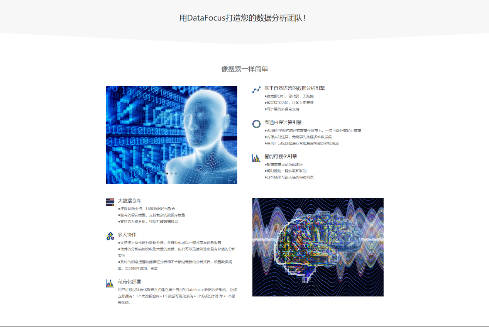

自助服务分析最近成为热门话题。随着组织希望变得更加以数据为导向，自助服务的承诺无疑是诱人的：所有用户，无论其角色或技能如何，都能够分析数据并做出更明智的决策。尽管自助式分析工具已变得越来越方便用户并且需要更少的IT参与，但许多这些工具并未引起广泛采用。

事实上，我们自己的市场研究发现，即使用户可以访问这些工具，自助BI工具的采用率仍为22％。自助服务的承诺与现实之间存在着明显的差距。

那我们怎么去那儿？我们已经看到成功企业实施的一些关键实践，以找到自助服务的必杀技。

**了解您的用户角色**

自助服务工具尚未在组织内广泛采用的主要原因之一是，当今市场上的大多数自助服务工具都针对一类人，通常是IT技术专家或复杂的数据分析师。但是，这种“一刀切”的方法无法满足同时希望利用自助服务分析的业务用户的独特需求和技能。

为了推动自助服务的采用，组织需要停止关注工具并开始关注分析体验。换句话说，停止让人们使用工具并让工具为人们工作。

然后，第一步是了解最终用户如何使用数据以及他们的决策环境是什么样的。例如，某些用户希望查看静态报告，而其他用户可能希望使用自己的指标和度量来补充现有仪表板和报告，或者可能需要真正的自我指导体验。

这就像买车一样 - 根据您的需求和您想要实现的目标，有数百种选择：小型货车，摩托车，跑车，轿车，SUV等等。在这些组中，你有更多的选择：混合动力，手动，娱乐系统，远程启动等。你选择的汽车是基于你需要的，而不是你的邻居需要它。

通过在组织内定义角色，您将能够将正确的功能映射到用户的需求和能力，为每个人创建正确的分析体验。

只有在你确定了人物角色之后，才应该考虑使用工具。在寻找工具时，您应该在优化产品组合和优化最终用户需求之间取得平衡。例如，一些用户希望以仪表板和报告的形式部署高度可扩展的明确定义的指标分布。其他人则需要引导数据，安全分发以及选择数据和格式化可视化以进行共享的能力。除了访问公司数据之外，有些人还希望能够选择自己的数据源。他们希望通过合作发现最佳见解，并根据需要将结果推回到标准化链。

即使对你的人物角色和正确的工具组合有了良好的定义，如果没有一些例外，你永远不会达到100％。标准不是要消除例外，而是要仔细管理它们。您应该拥有适合80％用例的标准工具，然后在非常严格的有限部署中部署专业工具，以满足异常使用案例的需求。

**将分析置于上下文中**

分析师经常说，BI采用的上限是30％。但是，如前所述，我们的调查发现，只有22％的企业用户拥有并使用自助式分析工具。这8％的差距是更多最终用户做出数据驱动决策的机会。谁知道，也许通过向合适的用户提供正确类型的自助服务工具，您可能会远远超出采用的“上限”。

你怎么去那里？关键是将分析放在人们每天使用的应用程序的上下文中。基于广泛的BI基本上说这里是您现在和将来可能需要知道的任何内容。但它需要关注用户在做出决策时所需的信息。

人们喜欢他们的智能手机应用程序，因为它们是专门为做一件事而构建的。他们在想要做出决定的那一刻向用户提供他们所需的信息，并将其与任务相关联。想想RedFin或Zillow应用程序，它使用您所在的位置为您提供有关您附近的房屋的信息，价格范围是今天开放的房子。

用户不想进入Zillow应用程序，谷歌地图和GreatSchools.org以及抵押贷款计算器，只是为了获得他们需要的见解。他们需要在主应用程序中做出决策所需的所有必要数据。

例如，销售经理很少离开Salesforce。如果他们的所有数据都嵌入在该应用程序中，那将会更容易：各种Salesforce数据，营销自动化数据，各种Excel电子表格 - 所有这些都结合在他们的Salesforce视图中。

在数据模型之外思考也很重要。用户界面（UI）和用户体验（UX）对于推动广泛采用非常重要。并非所有用户都符合“数据透视表”。您需要专注于目标用户，他们的需求和功能，并在适合最终用户的UI中提供分析。

**采用敏捷实践**

一旦您拥有了正确的工具集并设置了用户，您就需要调整流程以采用关键的敏捷实践，以使您的组织在BI的各个方面更有效。

敏捷专注于高级别的业务用户参与以及需求的迭代通信。您应该将数据仓库团队的重点放在提供组织在所有用户中所需的数据集上。处于业务需求前沿的主要分析师可以帮助制定该路线图。而且，仓库团队可以帮助分析师了解可用的数据以及任何特定数据集中涉及的细微差别。

您还应该使用这些相同的分析师来测试新的数据集。而不是试图立即将数据导入仓库，而是将其推入数据发现应用程序并首先将其部署到分析人员。他们将快速迭代几个潜在的KPI，仪表板演示和其他分析。随着这些要求的稳定，技术团队可以开始自动化和管理该数据集的工作。如果分析师发现需求需要改变，这种方法可以避免在数据方面进行代价高昂的返工。

找到自助服务的成功肯定不会在一夜之间发生。这是一种文化变革，需要时间。但是，如果您花时间了解用户，在他们每天使用的应用程序中提供分析，然后使用敏捷实践优化流程，您肯定会更快地实现目标。

希望了解敏捷型自助数据分析或者BI解决方案，请移步DataFocus官网，我们诚挚的欢迎您的咨询来访。

