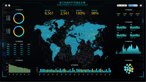

在这个大数据时代，越来越多的企业开始使用数据分析辅助决策，比如新零售行业，更是在此核心之上衍生出了多种理论或方法，如CRM、CEM、SCRM等。当然，并不是所有企业都能真正的挖掘数据分析的价值，更有很多企业只是为了做数据分析而做数据分析。以前我们提到过，DataFocus鼓励企业将数据分析项目化而非矩阵化管理，能够统筹数据分析所关联的所有人员组成项目小组，以最大化数据分析的价值。

为什么说要把数据分析当成项目来做，首先我们来说说数据分析在企业尤其是很多新兴企业的现状。我们在推行产品和服务的时候遇到过很多商家，遇到过数据分析的不同定位，有数据分析辅助企业运营、数据分析协同企业运营以及它甚至是在战略高度，做资源统筹，是企业资源分配策略的制定方。

相应的，数据分析也有不同的职能。尤其是TOC企业比较明显。参与度从低到高有1、配合决策部门做好客户维护，提高客户粘性，重视客户的购物体验环节，优化服务流程。2、建立全面的客户数据维护计划并执行落地，协同其他部门业务同事有节奏的配合店铺营销活动，后续进行实时监控，反馈目前存在的不足及解决方案。3、数据分析智能化，流程化，解放更多人力协同销售、服务、营销。而最后一种数据分析职能是效率最高的，首先它可以解决人员培养成本高、人员知识体系复制延展性不足、数据分析思维能力局限性明显的问题，比如用DataFocus、Tableau、数云等工具替代，节约薪资、留存资料还能智能化延展。

因此，对于数据分析项目化，我们应有这样的共识。数据分析项目化是为了充分掌握消费者画像、提升数据分析人员&决策团队独立运营能力，以及将客户资源管理标准化，流程化。
