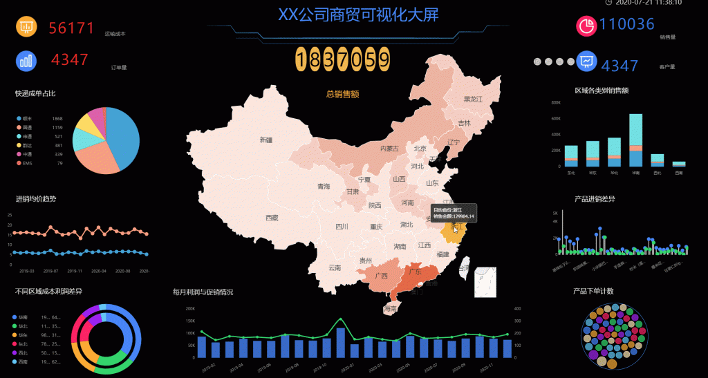

不差钱的，推荐一些已经比较成熟完善的可视化工具，比如帆软、Tableau等。这一类的BI产品相对占据市场较大的份额，产品功能本身已经做到相对完善，也有非常成熟、专业的技术团队作为后盾，是比较占有优势的。当然了，也得承受得起这个价格，毕竟这些成熟的工具可不便宜。

其次，如果需要进行非常专业性的研究的，比如说在校的学生、老师等，比较推荐使用SPSS、SAS等，如果有代码基础的，还可以考虑R和Python。这一类分析软件的特点就是专业性很强，可以进行专业化的数据分析以及数据挖掘。不过也因此，在平时的日常生活中，使用难度较大且适用范围较小，如果只是进行日常的数据研究、报表分析的话，就可以pass这些软件了。

最后一类，是我最推荐的可视化工具，比如Excel、PowerBI、DataFocus等。这些软件有点是完全免费使用的，有的是性价比非常高的分析工具，非常适合我们在日常的数据分析工作中进行使用。

Excel，相信大家都知道，是一款最基础，应用最广的分析软件。随着Excel版本的不断升级，其数据分析能力也在不断提升，虽然仍无法达到市面上的BI工具的平均水平，但是作为日常的开源软件使用，已经绰绰有余。

PowerBI，这里可以将PowerBI算作Excel的升级版，如果对Excel的分析能力不满足的用户，又不想为数据分析花费任何金钱，可以尝试使用一下PowerBI。PowerBI作为一款由微软研发的可视化工具，在和Excel等数据源的对接上确实做到了极致，是非常强大的，但是PowerBI的缺陷也较为明显，操作上手没有Excel和DataFocus这么简单，PowerBI本身因为DAX函数的存在，就有不小的学习难度，同时网络上的学习资源也较少，没有能够引导进行PowerBI数据分析的学习视频，加大了我们学习的难度。

DataFocus开创了国内首款中文搜索式的分析方式，这种搜索式的形式对比传统的拖拉式，具有非常明显的优势，操作更加简单，数据分析的思路更加符合人类的思考方式，可以帮助更多的人参与到数据分析的行列之中。我还研究了DataFocus的官网，非常慷慨的给出了各个行业的简单案例供大家参考，还可以免费提供数据和试用的机会。虽然试用结束后需要收费，但是收取的费用对比第一类可视化产品而言，便宜了很多，性价比是实实在在的高了。
